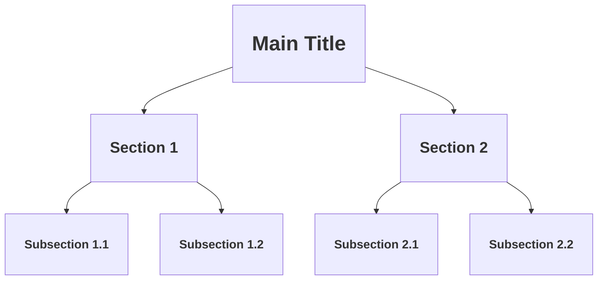

## 6.4 Including Headings and Paragraphs

In this section, we will explore how to include headings and paragraphs in your HTML page. These elements are fundamental for structuring text content, enhancing readability, and improving SEO (Search Engine Optimization). By the end of this section, you will be able to effectively use headings and paragraphs to create well-organized and accessible web pages.

### Understanding Headings in HTML

Headings in HTML are used to define the structure and hierarchy of your content. They range from `<h1>` to `<h6>`, with `<h1>` being the highest level of importance and `<h6>` the lowest. Think of headings as the titles and subtitles of your content, guiding readers through the information in a logical order.

#### The `<h1>` to `<h6>` Tags

- **`<h1>`**: This is the main heading of your page, typically used for the title or primary topic. Each page should ideally have only one `<h1>` to maintain a clear hierarchy.
- **`<h2>`**: Used for major sections within your content. If `<h1>` is the title of a book, `<h2>` could be the chapters.
- **`<h3>`**: Subsections within `<h2>` sections. Continuing the book analogy, these could be the sections within a chapter.
- **`<h4>` to `<h6>`**: Used for further subdivisions, providing additional levels of detail.

#### Example of Headings

```html
<!DOCTYPE html>
<html lang="en">
<head>
    <meta charset="UTF-8">
    <meta name="viewport" content="width=device-width, initial-scale=1.0">
    <title>Sample Page with Headings</title>
</head>
<body>

    <h1>Welcome to My Web Page</h1> <!-- Main title of the page -->

    <h2>About Me</h2> <!-- Major section -->
    <p>This section contains information about me.</p>

    <h3>Education</h3> <!-- Subsection -->
    <p>I have a degree in Computer Science.</p>

    <h3>Experience</h3> <!-- Subsection -->
    <p>I have worked in web development for over 5 years.</p>

    <h2>Projects</h2> <!-- Another major section -->
    <p>Here are some of the projects I have worked on.</p>

    <h3>Project A</h3> <!-- Subsection -->
    <p>Details about Project A.</p>

    <h4>Features</h4> <!-- Further subdivision -->
    <ul>
        <li>Feature 1</li>
        <li>Feature 2</li>
    </ul>

    <h3>Project B</h3> <!-- Subsection -->
    <p>Details about Project B.</p>

</body>
</html>
```

### Importance of Hierarchical Structure

Using a hierarchical structure with headings is crucial for several reasons:

1. **Readability**: Headings break up text into manageable sections, making it easier for readers to scan and find the information they need.
2. **SEO**: Search engines use headings to understand the structure and content of your page. Properly using headings can improve your page's visibility in search results.
3. **Accessibility**: Screen readers rely on headings to navigate content. A logical heading structure helps users with disabilities understand and interact with your page more effectively.

### The `<p>` Tag for Paragraphs

The `<p>` tag is used to define paragraphs in HTML. It is a block-level element, meaning it starts on a new line and takes up the full width available. Paragraphs are essential for presenting text content in a clear and organized manner.

#### Example of Paragraphs

```html
<!DOCTYPE html>
<html lang="en">
<head>
    <meta charset="UTF-8">
    <meta name="viewport" content="width=device-width, initial-scale=1.0">
    <title>Sample Page with Paragraphs</title>
</head>
<body>

    <h1>Introduction to Web Development</h1>

    <p>Web development is a field that involves building and maintaining websites. It encompasses several aspects, including web design, web content development, client-side/server-side scripting, and network security configuration.</p>

    <p>Learning web development can be a rewarding experience, as it allows you to create interactive and dynamic websites that can be accessed by users worldwide.</p>

</body>
</html>
```

### Combining Headings and Paragraphs

To create a well-structured web page, combine headings and paragraphs effectively. Use headings to introduce new sections and paragraphs to provide detailed information within those sections.

#### Example of a Structured Page

```html
<!DOCTYPE html>
<html lang="en">
<head>
    <meta charset="UTF-8">
    <meta name="viewport" content="width=device-width, initial-scale=1.0">
    <title>My Personal Blog</title>
</head>
<body>

    <h1>My Personal Blog</h1>

    <h2>Introduction</h2>
    <p>Welcome to my blog where I share my thoughts on various topics, including technology, travel, and lifestyle.</p>

    <h2>Technology</h2>
    <p>In this section, I discuss the latest trends in technology and share my insights on software development.</p>

    <h3>Web Development</h3>
    <p>Web development is a rapidly evolving field. Staying updated with the latest technologies is crucial for success.</p>

    <h3>Mobile Apps</h3>
    <p>Mobile applications have become an integral part of our lives. I explore the latest trends and tools in mobile app development.</p>

    <h2>Travel</h2>
    <p>Traveling is one of my passions. Here, I share my travel experiences and tips for exploring new destinations.</p>

    <h3>Europe</h3>
    <p>Europe offers a diverse range of cultures and landscapes. I recount my adventures across various European countries.</p>

    <h3>Asia</h3>
    <p>Asia is a continent full of wonders. From bustling cities to serene landscapes, there is much to explore.</p>

    <h2>Lifestyle</h2>
    <p>In this section, I discuss lifestyle topics such as health, wellness, and personal development.</p>

    <h3>Fitness</h3>
    <p>Maintaining a healthy lifestyle is important. I share my fitness journey and tips for staying active.</p>

    <h3>Mindfulness</h3>
    <p>Mindfulness practices can greatly enhance your well-being. I explore different techniques and their benefits.</p>

</body>
</html>
```

### Best Practices for Using Headings and Paragraphs

- **Use One `<h1>` Per Page**: The `<h1>` tag should be used for the main title of the page. Avoid using multiple `<h1>` tags to maintain a clear hierarchy.
- **Follow a Logical Order**: Ensure that headings follow a logical order (e.g., `<h1>` followed by `<h2>`, `<h3>`, etc.). Avoid skipping heading levels.
- **Keep Paragraphs Concise**: Write clear and concise paragraphs. Break up long blocks of text to improve readability.
- **Use Headings for Structure, Not Style**: Headings should be used to structure content, not for styling purposes. Use CSS to style headings if needed.
- **Enhance SEO**: Use relevant keywords in your headings to improve SEO. This helps search engines understand the content of your page.

### Try It Yourself

Now that you understand the basics of headings and paragraphs, try creating a simple web page with your own content. Experiment with different heading levels and paragraph structures. Here are some ideas to get you started:

- Create a page about your favorite hobby, using headings to organize different aspects of it.
- Write a short biography, using headings for different sections like "Early Life," "Career," and "Achievements."
- Design a simple FAQ page, using headings for each question and paragraphs for the answers.

### Visualizing the Structure with a Diagram

To further illustrate the concept of hierarchical structure with headings, let's visualize it using a Mermaid.js diagram:



**Description**: This diagram represents a simple hierarchical structure using headings. The `<h1>` is the main title, followed by `<h2>` sections, and `<h3>` subsections within each section.

### Summary

In this section, we have explored the use of headings and paragraphs in HTML. We learned how to use `<h1>` to `<h6>` tags to create a hierarchical structure and the `<p>` tag to define paragraphs. By following best practices and using these elements effectively, you can create well-structured, readable, and SEO-friendly web pages.

### Further Reading

For more information on HTML headings and paragraphs, you can explore the following resources:

- [MDN Web Docs: HTML Headings](https://developer.mozilla.org/en-US/docs/Web/HTML/Element/Heading_Elements)
- [MDN Web Docs: HTML Paragraphs](https://developer.mozilla.org/en-US/docs/Web/HTML/Element/p)
- [W3Schools: HTML Headings](https://www.w3schools.com/html/html_headings.asp)
- [W3Schools: HTML Paragraphs](https://www.w3schools.com/html/html_paragraphs.asp)

## Quiz Time!



### What is the purpose of the `<h1>` tag in HTML?

- [x] It is used for the main heading of a page.
- [ ] It is used for creating paragraphs.
- [ ] It is used to style text.
- [ ] It is used for creating links.

> **Explanation:** The `<h1>` tag is used for the main heading of a page, indicating the most important title or topic.

### How many `<h1>` tags should you ideally have on a single HTML page?

- [x] One
- [ ] Two
- [ ] Three
- [ ] As many as needed

> **Explanation:** Ideally, there should be only one `<h1>` tag per page to maintain a clear and logical hierarchy.

### Which tag is used to define paragraphs in HTML?

- [x] `<p>`
- [ ] `<div>`
- [ ] `<span>`
- [ ] `<h1>`

> **Explanation:** The `<p>` tag is used to define paragraphs in HTML.

### Why is it important to use headings in a logical order?

- [x] To improve readability and SEO
- [ ] To make the page load faster
- [ ] To change the background color
- [ ] To add images

> **Explanation:** Using headings in a logical order improves readability and helps search engines understand the structure of the content, enhancing SEO.

### What should you use to style headings in HTML?

- [ ] Use the `<h1>` to `<h6>` tags directly for styling.
- [x] Use CSS to style headings.
- [ ] Use the `<p>` tag for styling.
- [ ] Use JavaScript for styling.

> **Explanation:** Headings should be structured using `<h1>` to `<h6>` tags, but styled using CSS for visual presentation.

### What is the main benefit of using paragraphs in HTML?

- [x] To present text content in a clear and organized manner
- [ ] To create links
- [ ] To add images
- [ ] To change the font size

> **Explanation:** Paragraphs are used to present text content in a clear and organized manner, making it easier to read.

### Which heading tag represents the lowest level of importance?

- [ ] `<h1>`
- [ ] `<h2>`
- [ ] `<h3>`
- [x] `<h6>`

> **Explanation:** The `<h6>` tag represents the lowest level of importance in the heading hierarchy.

### How can headings improve accessibility?

- [x] By helping screen readers navigate content
- [ ] By changing the font color
- [ ] By adding images
- [ ] By increasing page load speed

> **Explanation:** Headings help screen readers navigate content, improving accessibility for users with disabilities.

### What is a common mistake to avoid when using headings?

- [x] Skipping heading levels
- [ ] Using CSS for styling
- [ ] Using paragraphs for text
- [ ] Adding images

> **Explanation:** Skipping heading levels can disrupt the logical flow of content, making it harder for users and search engines to understand the structure.

### True or False: It is acceptable to use multiple `<h1>` tags on a single page for styling purposes.

- [ ] True
- [x] False

> **Explanation:** It is not recommended to use multiple `<h1>` tags on a single page, as it can confuse the logical structure and hierarchy of the content.




