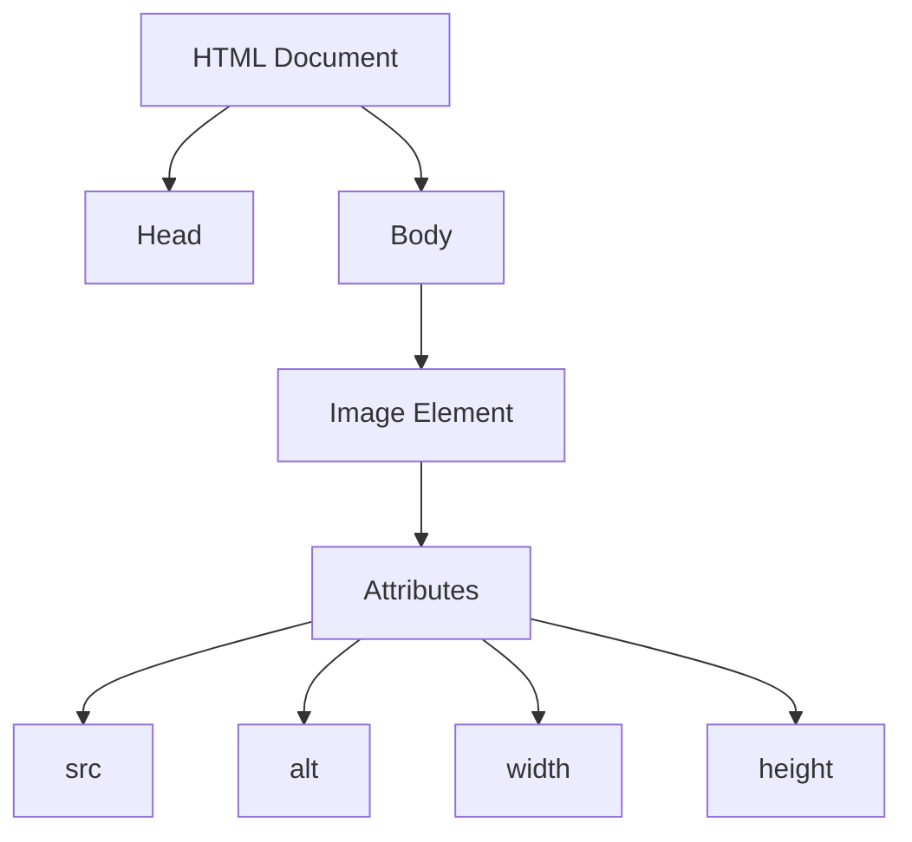

## 6.5 Embedding Images and Media

Incorporating images and media into your web pages is a fundamental skill in web development. Visual elements not only enhance the aesthetic appeal of a page but also improve user engagement and convey information more effectively. In this section, we'll explore how to embed images and media files using HTML, discuss best practices for optimizing these elements, and touch upon accessibility considerations.

### Understanding the `` Tag

The `` tag in HTML is used to embed images into a web page. It is a self-closing tag, meaning it doesn't require a closing tag. Let's break down the essential attributes of the `` tag:

- **`src` (source):** Specifies the path to the image file. This can be a relative path (e.g., `images/example.jpg`) or an absolute URL (e.g., `https://example.com/image.jpg`).
- **`alt` (alternative text):** Provides a textual description of the image, which is crucial for accessibility. Screen readers use this text to describe the image to visually impaired users.
- **`width` and `height`:** Define the dimensions of the image. These attributes help control the display size of the image on the web page.

Here's a basic example of an `` tag:

```html

```

#### Importance of the `alt` Attribute

The `alt` attribute is not just a fallback for when images fail to load; it plays a vital role in making web content accessible to all users. Here's why it's important:

- **Accessibility:** Screen readers rely on the `alt` text to convey the content of images to users with visual impairments.
- **SEO:** Search engines use the `alt` attribute to understand the content of images, which can improve your page's search engine ranking.
- **Fallback Content:** If an image fails to load, the `alt` text provides context to the user about what the image represents.

### Adding Images to Your Web Page

Let's explore how to add images to your web page using practical examples.

#### Example 1: Basic Image Embedding

```html
<!DOCTYPE html>
<html lang="en">
<head>
    <meta charset="UTF-8">
    <meta name="viewport" content="width=device-width, initial-scale=1.0">
    <title>Embedding Images Example</title>
</head>
<body>
    <h1>Welcome to My Web Page</h1>
    
    <p>This image shows a stunning sunrise over the mountains, captured during my last vacation.</p>
</body>
</html>
```

In this example, we have embedded an image of a sunrise with a descriptive `alt` text. The `width` and `height` attributes ensure the image is displayed at the desired size.

#### Example 2: Responsive Images

To make images responsive, you can use CSS to control their size. Here's how you can achieve that:

```html
<!DOCTYPE html>
<html lang="en">
<head>
    <meta charset="UTF-8">
    <meta name="viewport" content="width=device-width, initial-scale=1.0">
    <title>Responsive Image Example</title>
    <style>
        img {
            max-width: 100%;
            height: auto;
        }
    </style>
</head>
<body>
    <h1>Responsive Image</h1>
    
</body>
</html>
```

In this example, the CSS ensures that the image scales proportionally to fit the width of its container, making it responsive to different screen sizes.

### Best Practices for Image Formats

Choosing the right image format is crucial for optimizing web performance. Here are some common image formats and their best use cases:

- **JPEG:** Ideal for photographs and images with many colors. JPEGs are compressed, which reduces file size but can also reduce quality.
- **PNG:** Best for images with transparency or when you need high-quality graphics. PNGs are lossless, meaning they retain quality but can have larger file sizes.
- **SVG:** Perfect for vector graphics, such as logos and icons. SVGs are scalable without losing quality and are often smaller in file size compared to raster images.

#### Image Optimization Tips

- **Compress Images:** Use tools like TinyPNG or ImageOptim to reduce file size without significant loss of quality.
- **Choose the Right Resolution:** Use images with a resolution appropriate for their display size. High-resolution images can slow down page load times.
- **Use Lazy Loading:** Implement lazy loading to defer the loading of images until they are needed, improving initial page load speed.

### Embedding Other Media Types

Beyond images, you can also embed audio and video files using HTML. Let's explore how to use the `<audio>` and `<video>` tags.

#### The `<audio>` Tag

The `<audio>` tag is used to embed sound content. It supports multiple audio formats, such as MP3, WAV, and OGG. Here's a basic example:

```html
<!DOCTYPE html>
<html lang="en">
<head>
    <meta charset="UTF-8">
    <meta name="viewport" content="width=device-width, initial-scale=1.0">
    <title>Audio Example</title>
</head>
<body>
    <h1>Listen to the Audio</h1>
    <audio controls>
        <source src="audio/example.mp3" type="audio/mpeg">
        <source src="audio/example.ogg" type="audio/ogg">
        Your browser does not support the audio element.
    </audio>
</body>
</html>
```

In this example, the `<audio>` tag includes multiple `<source>` elements to provide different audio formats, ensuring compatibility across browsers. The `controls` attribute adds play, pause, and volume controls.

#### The `<video>` Tag

The `<video>` tag is used to embed video content. It supports formats like MP4, WebM, and OGG. Here's how you can use it:

```html
<!DOCTYPE html>
<html lang="en">
<head>
    <meta charset="UTF-8">
    <meta name="viewport" content="width=device-width, initial-scale=1.0">
    <title>Video Example</title>
</head>
<body>
    <h1>Watch the Video</h1>
    <video width="640" height="360" controls>
        <source src="video/example.mp4" type="video/mp4">
        <source src="video/example.webm" type="video/webm">
        Your browser does not support the video tag.
    </video>
</body>
</html>
```

Similar to the `<audio>` tag, the `<video>` tag can include multiple `<source>` elements for different formats. The `controls` attribute provides user interface controls for playing the video.

### Try It Yourself

Now that we've covered the basics, try embedding your own images and media files. Experiment with different formats and attributes to see how they affect the display and performance of your web page. Here are a few challenges to get you started:

1. **Add an Image Gallery:** Create a simple image gallery using multiple `` tags. Use CSS to style the gallery and make it responsive.

2. **Embed a Background Music Track:** Use the `<audio>` tag to add background music to your page. Ensure it plays automatically and loops.

3. **Create a Video Playlist:** Embed multiple videos using the `<video>` tag. Provide a playlist interface using HTML and CSS.

### Visual Aids

To better understand how images and media are embedded in a web page, let's visualize the Document Object Model (DOM) structure when an image is added.



**Diagram Description:** This diagram represents the DOM structure of an HTML document with an embedded image. The image element is part of the body and contains attributes such as `src`, `alt`, `width`, and `height`.

### References and Links

For further reading and resources, check out the following links:

- [MDN Web Docs: `` element](https://developer.mozilla.org/en-US/docs/Web/HTML/Element/img)
- [W3Schools: HTML Images](https://www.w3schools.com/html/html_images.asp)
- [WebAIM: Alternative Text](https://webaim.org/techniques/alttext/)

### Engagement and Reinforcement

To reinforce your learning, consider these questions:

- Why is the `alt` attribute important for accessibility?
- What are the advantages of using SVG images over JPEG or PNG?
- How can you optimize images for faster web performance?

### Summary

In this section, we've explored how to embed images and media into your web pages using HTML. We've covered the ``, `<audio>`, and `<video>` tags, discussed best practices for image formats and optimization, and highlighted the importance of accessibility. By understanding these concepts, you're well on your way to creating visually engaging and accessible web pages.

## Quiz Time!



### What is the purpose of the `alt` attribute in the `` tag?

- [x] To provide a textual description of the image for accessibility
- [ ] To specify the image's file format
- [ ] To define the image's dimensions
- [ ] To link the image to another page

> **Explanation:** The `alt` attribute provides a textual description of the image, which is crucial for accessibility and SEO.

### Which image format is best for photographs with many colors?

- [x] JPEG
- [ ] PNG
- [ ] SVG
- [ ] GIF

> **Explanation:** JPEG is ideal for photographs and images with many colors due to its compression capabilities.

### What does the `controls` attribute do in the `<audio>` and `<video>` tags?

- [x] Adds play, pause, and volume controls
- [ ] Specifies the media file's format
- [ ] Sets the media file's dimensions
- [ ] Links the media to another page

> **Explanation:** The `controls` attribute adds user interface controls like play, pause, and volume to audio and video elements.

### How can you make images responsive using CSS?

- [x] Use `max-width: 100%` and `height: auto`
- [ ] Set fixed `width` and `height` attributes
- [ ] Use the `alt` attribute
- [ ] Embed images using the `<video>` tag

> **Explanation:** Using `max-width: 100%` and `height: auto` in CSS makes images scale proportionally to fit their container.

### Which of the following is a vector image format?

- [ ] JPEG
- [ ] PNG
- [x] SVG
- [ ] BMP

> **Explanation:** SVG is a vector image format, which means it can be scaled without losing quality.

### What is the benefit of lazy loading images?

- [x] Improves initial page load speed
- [ ] Increases image resolution
- [ ] Changes the image format
- [ ] Embeds audio into the image

> **Explanation:** Lazy loading defers the loading of images until they are needed, improving initial page load speed.

### Which attribute is used to specify the path to an image file in the `` tag?

- [x] `src`
- [ ] `alt`
- [ ] `width`
- [ ] `height`

> **Explanation:** The `src` attribute specifies the path to the image file in the `` tag.

### What is the primary use of the `<audio>` tag?

- [x] To embed sound content
- [ ] To embed video content
- [ ] To display images
- [ ] To create hyperlinks

> **Explanation:** The `<audio>` tag is used to embed sound content into a web page.

### Which attribute in the `` tag helps with SEO?

- [x] `alt`
- [ ] `src`
- [ ] `width`
- [ ] `height`

> **Explanation:** The `alt` attribute helps with SEO by providing a textual description of the image that search engines can read.

### True or False: The `<video>` tag can include multiple `<source>` elements for different formats.

- [x] True
- [ ] False

> **Explanation:** The `<video>` tag can include multiple `<source>` elements to provide different formats, ensuring compatibility across browsers.


