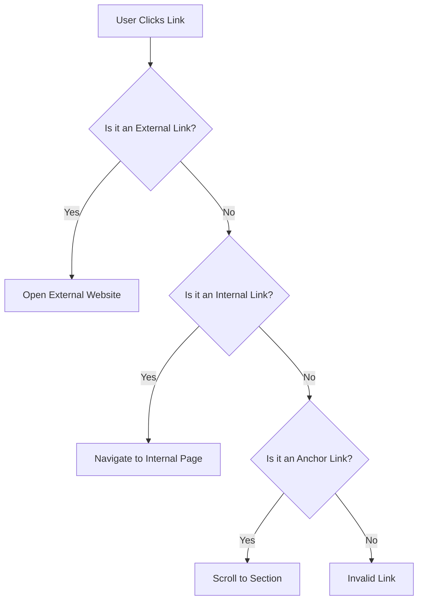

## 6.6 Creating Hyperlinks

Hyperlinks are the backbone of the web, allowing users to navigate between pages and access resources seamlessly. In this section, we'll explore how to create hyperlinks using the `<a>` tag, understand the importance of the `href` attribute, and learn how to link to external websites, internal pages, and specific sections within a page. We'll also discuss how to open links in new tabs using the `target` attribute and emphasize the crucial role hyperlinks play in web navigation.

### Understanding the `<a>` Tag and `href` Attribute

The `<a>` tag, also known as the anchor tag, is used to create hyperlinks in HTML. It is one of the most fundamental elements in web development, enabling users to click on text or images to navigate to different web pages or resources.

#### The `<a>` Tag

The basic syntax of the `<a>` tag is as follows:

```html
<a href="URL">Link Text</a>
```

- **`<a>`**: This is the opening tag that defines the start of the hyperlink.
- **`href`**: Short for "hypertext reference," this attribute specifies the URL of the page or resource the link points to.
- **`Link Text`**: This is the clickable text or content that users see on the web page.

#### The `href` Attribute

The `href` attribute is essential for defining the destination of the hyperlink. Without it, the `<a>` tag does not function as a link. The value of the `href` attribute can be:

- **Absolute URL**: A complete web address, including the protocol (e.g., `https://www.example.com`).
- **Relative URL**: A path relative to the current page, often used for internal links within the same website (e.g., `about.html`).
- **Anchor Link**: A link to a specific section within the same page, identified by an ID (e.g., `#section1`).

### Creating Links to External Websites

Linking to external websites is a common use case for hyperlinks. This allows users to access additional information or resources hosted on other domains.

#### Example: External Link

```html
<a href="https://www.example.com">Visit Example.com</a>
```

In this example, clicking the link text "Visit Example.com" will take the user to the specified external website.

### Creating Internal Links

Internal links connect different pages within the same website. They are crucial for website navigation, helping users move seamlessly between related content.

#### Example: Internal Link

```html
<a href="about.html">About Us</a>
```

Here, the link text "About Us" directs users to the `about.html` page within the same site. This is a relative URL, meaning it is relative to the current page's location.

### Creating Anchor Links

Anchor links, also known as jump links, allow users to navigate to specific sections within the same page. This is particularly useful for long pages with multiple sections.

#### Example: Anchor Link

First, assign an ID to the target section:

```html
<h2 id="section1">Section 1</h2>
<p>This is the content of Section 1.</p>
```

Then, create a link to that section:

```html
<a href="#section1">Go to Section 1</a>
```

When users click "Go to Section 1," the page will scroll to the section with the ID `section1`.

### Using the `target` Attribute

The `target` attribute specifies where to open the linked document. By default, links open in the same tab. To open a link in a new tab, use the `target="_blank"` attribute.

#### Example: Opening a Link in a New Tab

```html
<a href="https://www.example.com" target="_blank">Visit Example.com</a>
```

This link will open "Visit Example.com" in a new browser tab, allowing users to keep the current page open.

### The Role of Hyperlinks in Web Navigation

Hyperlinks are essential for web navigation, providing a way for users to explore content and resources across the web. They enhance user experience by:

- **Connecting Related Content**: Hyperlinks link related pages and resources, creating a cohesive user journey.
- **Facilitating Information Access**: Users can quickly access additional information or resources with a single click.
- **Improving SEO**: Well-structured hyperlinks contribute to search engine optimization by helping search engines understand the relationship between pages.

### Code Examples

Let's explore some practical examples to reinforce our understanding of hyperlinks.

#### Example 1: Basic Hyperlink

```html
<!DOCTYPE html>
<html lang="en">
<head>
    <meta charset="UTF-8">
    <meta name="viewport" content="width=device-width, initial-scale=1.0">
    <title>Hyperlink Example</title>
</head>
<body>
    <h1>Welcome to My Website</h1>
    <p>Check out this amazing resource:</p>
    <a href="https://www.example.com">Visit Example.com</a>
</body>
</html>
```

This basic HTML page includes a hyperlink to an external website.

#### Example 2: Internal Link

```html
<!DOCTYPE html>
<html lang="en">
<head>
    <meta charset="UTF-8">
    <meta name="viewport" content="width=device-width, initial-scale=1.0">
    <title>Internal Link Example</title>
</head>
<body>
    <h1>Welcome to My Website</h1>
    <p>Learn more about us:</p>
    <a href="about.html">About Us</a>
</body>
</html>
```

This example demonstrates an internal link to the `about.html` page.

#### Example 3: Anchor Link

```html
<!DOCTYPE html>
<html lang="en">
<head>
    <meta charset="UTF-8">
    <meta name="viewport" content="width=device-width, initial-scale=1.0">
    <title>Anchor Link Example</title>
</head>
<body>
    <h1>Welcome to My Website</h1>
    <p>Jump to a specific section:</p>
    <a href="#section1">Go to Section 1</a>

    <h2 id="section1">Section 1</h2>
    <p>This is the content of Section 1.</p>
</body>
</html>
```

This page includes an anchor link that navigates to a specific section within the same page.

#### Example 4: Opening a Link in a New Tab

```html
<!DOCTYPE html>
<html lang="en">
<head>
    <meta charset="UTF-8">
    <meta name="viewport" content="width=device-width, initial-scale=1.0">
    <title>New Tab Link Example</title>
</head>
<body>
    <h1>Welcome to My Website</h1>
    <p>Explore this resource in a new tab:</p>
    <a href="https://www.example.com" target="_blank">Visit Example.com</a>
</body>
</html>
```

This example shows how to open a link in a new tab using the `target="_blank"` attribute.

### Try It Yourself

Now that we've covered the basics, try creating your own hyperlinks. Experiment with different types of links:

- **Create a link to an external website**: Use an absolute URL to link to your favorite website.
- **Link to another page on your site**: Use a relative URL to connect two pages within your project.
- **Add an anchor link**: Create a long page with multiple sections and link to a specific section using an anchor link.
- **Open a link in a new tab**: Use the `target="_blank"` attribute to open a link in a new tab.

### Visual Aids

To better understand how hyperlinks work, let's visualize the concept using a flowchart.



**Description**: This flowchart illustrates the decision-making process when a user clicks a hyperlink. Depending on the type of link, the user is directed to an external website, an internal page, or a specific section within the same page.

### References and Links

For further reading and deeper understanding, check out these resources:

- [MDN Web Docs: `<a>`: The Anchor element](https://developer.mozilla.org/en-US/docs/Web/HTML/Element/a)
- [W3Schools: HTML Links](https://www.w3schools.com/html/html_links.asp)

### Engagement and Reinforcement

Let's engage with some questions to reinforce your understanding:

- **What is the purpose of the `<a>` tag in HTML?**
- **How does the `href` attribute affect the functionality of a hyperlink?**
- **What is the difference between an absolute URL and a relative URL?**
- **When would you use the `target="_blank"` attribute?**

### Exercises

1. **Create a Web Page with Multiple Links**: Design a simple webpage with at least three different types of links: an external link, an internal link, and an anchor link.

2. **Experiment with the `target` Attribute**: Modify your links to open in new tabs and observe the behavior.

3. **Build a Table of Contents**: Create a long HTML page with multiple sections and a table of contents at the top. Use anchor links to navigate to each section.

### Key Takeaways

- The `<a>` tag is essential for creating hyperlinks, enabling users to navigate between web pages and resources.
- The `href` attribute specifies the destination of the hyperlink, which can be an external URL, an internal page, or an anchor link.
- The `target` attribute allows you to control where the linked document opens, such as in a new tab.
- Hyperlinks play a crucial role in web navigation, enhancing user experience and contributing to SEO.

By mastering hyperlinks, you've taken a significant step toward creating interactive and user-friendly web pages. Keep practicing and experimenting with different types of links to build your confidence and skills.

## Quiz Time!



### What is the primary purpose of the `<a>` tag in HTML?

- [x] To create hyperlinks
- [ ] To style text
- [ ] To insert images
- [ ] To define sections

> **Explanation:** The `<a>` tag is used to create hyperlinks, allowing users to navigate between web pages and resources.

### Which attribute is essential for defining the destination of a hyperlink?

- [x] `href`
- [ ] `src`
- [ ] `alt`
- [ ] `class`

> **Explanation:** The `href` attribute specifies the URL of the page or resource the link points to, making it essential for hyperlink functionality.

### What does a relative URL refer to?

- [x] A path relative to the current page
- [ ] A complete web address
- [ ] An email address
- [ ] A file path on the server

> **Explanation:** A relative URL is a path relative to the current page's location, often used for internal links within the same website.

### How can you open a link in a new tab?

- [x] Use the `target="_blank"` attribute
- [ ] Use the `href="_newtab"` attribute
- [ ] Use the `rel="newtab"` attribute
- [ ] Use the `class="newtab"` attribute

> **Explanation:** The `target="_blank"` attribute is used to open a link in a new browser tab.

### What is an anchor link used for?

- [x] Navigating to a specific section within the same page
- [ ] Linking to an external website
- [ ] Embedding an image
- [ ] Styling a paragraph

> **Explanation:** An anchor link allows users to navigate to a specific section within the same page, identified by an ID.

### Which of the following is an example of an absolute URL?

- [x] `https://www.example.com`
- [ ] `about.html`
- [ ] `#section1`
- [ ] `../images/pic.jpg`

> **Explanation:** An absolute URL is a complete web address, including the protocol, domain, and path.

### What role do hyperlinks play in web navigation?

- [x] They connect related content and facilitate information access
- [ ] They only style text
- [ ] They are used for embedding videos
- [ ] They are not important for navigation

> **Explanation:** Hyperlinks connect related content, facilitate information access, and enhance user experience, making them crucial for web navigation.

### Which attribute is used to specify the URL of a hyperlink?

- [x] `href`
- [ ] `src`
- [ ] `alt`
- [ ] `title`

> **Explanation:** The `href` attribute specifies the URL of the page or resource the link points to.

### What is the default behavior of a hyperlink when clicked?

- [x] Opens in the same tab
- [ ] Opens in a new tab
- [ ] Downloads the file
- [ ] Displays an alert

> **Explanation:** By default, hyperlinks open in the same tab unless specified otherwise with the `target` attribute.

### True or False: The `target="_blank"` attribute is used to open a link in the same tab.

- [ ] True
- [x] False

> **Explanation:** The `target="_blank"` attribute is used to open a link in a new tab, not the same tab.


