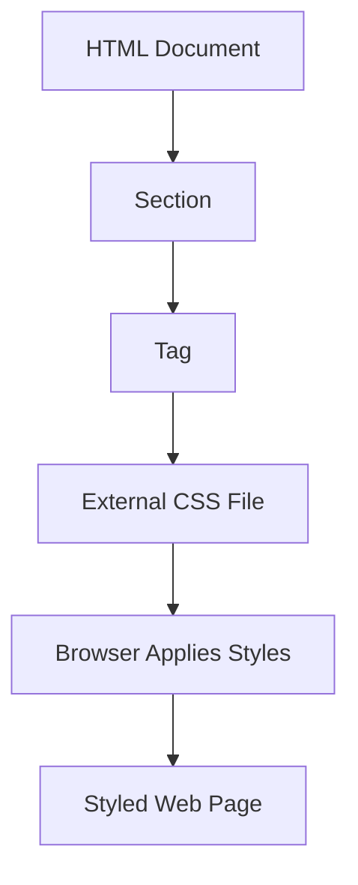

## 7.1 Linking an External Stylesheet

Creating visually appealing web pages is a fundamental aspect of web development. While HTML provides the structure and content of a web page, CSS (Cascading Style Sheets) is used to control its appearance. In this section, we'll explore how to link an external stylesheet to your HTML document, enabling you to separate content from design and maintain a clean, organized codebase.

### Why Use an External Stylesheet?

Before diving into the technical details, let's discuss the benefits of using an external stylesheet:

1. **Separation of Concerns**: By keeping your HTML and CSS separate, you maintain a clear distinction between the structure of your web page and its styling. This separation makes your code easier to read, maintain, and update.

2. **Reusability**: An external stylesheet can be linked to multiple HTML documents, allowing you to apply consistent styling across different pages of a website. This reusability saves time and effort when making design changes.

3. **Scalability**: As your website grows, managing styles within a single HTML file becomes cumbersome. An external stylesheet provides a centralized location for all your CSS rules, making it easier to scale your design.

4. **Improved Performance**: Browsers cache external stylesheets, reducing the need to download them multiple times. This caching improves page load times and enhances the user experience.

### Linking an External Stylesheet

To link an external stylesheet to your HTML document, you'll use the `<link>` tag within the `<head>` section. Let's walk through the steps:

#### Step 1: Create a CSS File

First, create a new file named `styles.css` in your project directory. This file will contain all the CSS rules that define the appearance of your web page.

#### Step 2: Add the `<link>` Tag

Next, open your HTML document and locate the `<head>` section. Add the following `<link>` tag to connect your CSS file:

```html
<!DOCTYPE html>
<html lang="en">
<head>
    <meta charset="UTF-8">
    <meta name="viewport" content="width=device-width, initial-scale=1.0">
    <title>My First Web Page</title>
    <link rel="stylesheet" href="styles.css">
</head>
<body>
    <!-- Your HTML content goes here -->
</body>
</html>
```

- **`rel="stylesheet"`**: This attribute specifies the relationship between the current document and the linked file. In this case, it indicates that the linked file is a stylesheet.
- **`href="styles.css"`**: The `href` attribute provides the path to the CSS file. Ensure that the path is correct relative to the HTML file.

#### Step 3: Add Styles to `styles.css`

Now that your CSS file is linked, it's time to add some styles. Open `styles.css` and include a simple style rule to test the connection:

```css
/* styles.css */

body {
    background-color: lightblue;
}

h1 {
    color: darkblue;
    text-align: center;
}
```

- **`body`**: This rule sets the background color of the entire web page to light blue.
- **`h1`**: This rule changes the color of all `<h1>` headings to dark blue and centers the text.

#### Step 4: Test Your Styles

Save both your HTML and CSS files, then open the HTML file in a web browser. You should see the background color change to light blue and any `<h1>` headings styled according to your CSS rules. If the styles are not applied, double-check the file paths and ensure that the `<link>` tag is correctly placed within the `<head>` section.

### Keeping HTML and CSS Separate

Maintaining a separation between HTML and CSS is crucial for several reasons:

- **Readability**: Separate files make it easier to read and understand your code. HTML files focus on content, while CSS files focus on styling.
- **Maintainability**: When styles are separated, you can update the design without altering the HTML structure. This separation reduces the risk of introducing errors.
- **Collaboration**: In a team setting, developers can work on HTML and CSS independently, streamlining the development process.

### Try It Yourself

Experiment with the following modifications to your CSS file:

- Change the background color to another shade.
- Add a new rule to style paragraph text (`<p>`).
- Use a different font family for headings.

These exercises will help you become more comfortable with CSS and understand how changes in the stylesheet affect the appearance of your web page.

### Visualizing the Process

To better understand how the browser processes your HTML and CSS files, let's visualize the workflow using a Mermaid.js flowchart:



**Diagram Description**: This flowchart illustrates the process of linking an external stylesheet. The HTML document contains a `<head>` section with a `<link>` tag that points to the external CSS file. The browser then applies the styles from the CSS file to render a styled web page.

### Further Reading

For more information on CSS and external stylesheets, consider exploring the following resources:

- [MDN Web Docs: CSS](https://developer.mozilla.org/en-US/docs/Web/CSS)
- [W3Schools: CSS Tutorial](https://www.w3schools.com/css/)

These resources provide comprehensive guides and examples to deepen your understanding of CSS.

### Key Takeaways

- An external stylesheet allows you to separate content from design, improving code organization and maintainability.
- Use the `<link>` tag within the `<head>` section to connect a CSS file to your HTML document.
- Experiment with different styles in your CSS file to see how they affect your web page's appearance.
- Keep HTML and CSS separate to enhance readability, maintainability, and collaboration.

By mastering the use of external stylesheets, you lay the foundation for creating visually appealing and well-organized web pages. As you continue your journey in web development, you'll discover more advanced CSS techniques to further enhance your designs.

## Quiz Time!



### What is the primary benefit of using an external stylesheet?

- [x] Separation of content and design
- [ ] Faster loading times
- [ ] Easier HTML coding
- [ ] More complex designs

> **Explanation:** Using an external stylesheet separates the content (HTML) from the design (CSS), making the code easier to manage and update.

### Where should the `<link>` tag be placed in an HTML document?

- [x] In the `<head>` section
- [ ] In the `<body>` section
- [ ] At the end of the document
- [ ] Anywhere in the document

> **Explanation:** The `<link>` tag should be placed in the `<head>` section to ensure the CSS is applied before the page content is rendered.

### Which attribute specifies the path to the CSS file in the `<link>` tag?

- [x] `href`
- [ ] `src`
- [ ] `rel`
- [ ] `type`

> **Explanation:** The `href` attribute specifies the path to the CSS file in the `<link>` tag.

### What does the `rel` attribute in the `<link>` tag define?

- [x] The relationship between the HTML document and the linked file
- [ ] The file type of the linked file
- [ ] The size of the linked file
- [ ] The location of the linked file

> **Explanation:** The `rel` attribute defines the relationship between the HTML document and the linked file, indicating that it is a stylesheet.

### How can you test if your CSS file is linked correctly?

- [x] Add a simple style rule and check if it applies
- [ ] Check the console for errors
- [ ] Look for a confirmation message
- [ ] Refresh the browser multiple times

> **Explanation:** Adding a simple style rule and observing its effect on the web page is a straightforward way to test if the CSS file is linked correctly.

### What is one advantage of keeping HTML and CSS separate?

- [x] Improved readability and maintainability
- [ ] Faster HTML processing
- [ ] Easier JavaScript integration
- [ ] Reduced file size

> **Explanation:** Keeping HTML and CSS separate improves readability and maintainability by allowing developers to focus on content and design independently.

### Which of the following is a valid CSS rule to change the background color?

- [x] `body { background-color: lightblue; }`
- [ ] `background-color: lightblue;`
- [ ] `body { color: lightblue; }`
- [ ] `background: lightblue;`

> **Explanation:** The correct syntax for changing the background color is `body { background-color: lightblue; }`.

### What happens if the path in the `href` attribute is incorrect?

- [x] The styles will not be applied
- [ ] The HTML document will not load
- [ ] The browser will crash
- [ ] The page will display an error message

> **Explanation:** If the path in the `href` attribute is incorrect, the styles will not be applied as the browser cannot locate the CSS file.

### Can an external stylesheet be reused across multiple HTML documents?

- [x] Yes
- [ ] No

> **Explanation:** An external stylesheet can be linked to multiple HTML documents, allowing for consistent styling across different pages.

### True or False: Inline styles are preferred over external stylesheets for large projects.

- [ ] True
- [x] False

> **Explanation:** External stylesheets are preferred for large projects as they promote separation of concerns and reusability, unlike inline styles.


