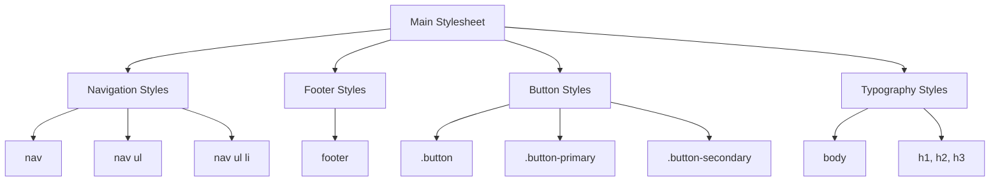

## 7.10 Organizing Your CSS Code

As we dive deeper into web development, one of the key skills you'll need to master is organizing your CSS code. Well-structured CSS not only makes your stylesheets easier to read and maintain but also improves the efficiency of your development process. In this section, we'll explore various strategies for organizing your CSS code, including grouping related styles, using comments for clarity, employing CSS preprocessors, and maintaining consistent formatting. Let's get started!

### Why Organize Your CSS Code?

Before we delve into the how-tos, let's understand why organizing your CSS code is crucial:

- **Readability**: Clear and structured CSS is easier to read and understand, especially when working in teams or revisiting your code after some time.
- **Maintainability**: Organized code is easier to update and debug, reducing the likelihood of errors.
- **Efficiency**: A well-structured stylesheet can improve the performance of your web pages by minimizing redundancy and ensuring faster loading times.

### Grouping Related Styles Together

One of the simplest yet most effective ways to organize your CSS is by grouping related styles together. This means placing styles that apply to similar elements or sections of your webpage in close proximity within your stylesheet. For example, you might group all styles related to your navigation bar together.

#### Example: Grouping Styles

```css
/* Navigation Styles */
nav {
  background-color: #333;
  color: white;
  padding: 10px;
}

nav ul {
  list-style-type: none;
  padding: 0;
}

nav ul li {
  display: inline;
  margin-right: 20px;
}

/* Footer Styles */
footer {
  background-color: #222;
  color: #ccc;
  text-align: center;
  padding: 20px;
}
```

In this example, we've grouped the styles for the navigation and footer sections separately. This makes it easy to locate and update styles related to a specific part of the webpage.

### Commenting Sections for Clarity

Comments are an invaluable tool for adding clarity to your CSS code. They allow you to annotate sections of your stylesheet, making it easier for you and others to understand the purpose of each block of code.

#### Example: Using Comments

```css
/* Navigation Styles */
nav {
  /* Set background color and text color */
  background-color: #333;
  color: white;
  padding: 10px;
}

/* Footer Styles */
footer {
  /* Set background color and text alignment */
  background-color: #222;
  color: #ccc;
  text-align: center;
  padding: 20px;
}
```

By using comments, you can provide context and explanations for your styles, which is particularly helpful in larger projects or when collaborating with others.

### Using CSS Preprocessors for Larger Projects

For larger projects, CSS preprocessors like Sass and LESS can be incredibly helpful. These tools allow you to write more modular and maintainable CSS by providing features such as variables, nesting, and mixins.

#### Introduction to Sass

Sass (Syntactically Awesome Style Sheets) is a popular CSS preprocessor that extends CSS with powerful features. Here's a basic example of how Sass can help organize your CSS:

```scss
// Variables
$primary-color: #333;
$secondary-color: #222;

// Mixin for common styles
@mixin flex-center {
  display: flex;
  justify-content: center;
  align-items: center;
}

// Navigation Styles
nav {
  background-color: $primary-color;
  color: white;
  padding: 10px;

  ul {
    list-style-type: none;
    padding: 0;

    li {
      display: inline;
      margin-right: 20px;
    }
  }
}

// Footer Styles
footer {
  background-color: $secondary-color;
  color: #ccc;
  @include flex-center;
  padding: 20px;
}
```

In this example, we're using variables to define colors and a mixin to apply common styles. This makes it easy to update styles globally and reuse code across different parts of your stylesheet.

#### Introduction to LESS

LESS is another CSS preprocessor that offers similar features to Sass. Here's a simple example:

```less
// Variables
@primary-color: #333;
@secondary-color: #222;

// Mixin for common styles
.flex-center() {
  display: flex;
  justify-content: center;
  align-items: center;
}

// Navigation Styles
nav {
  background-color: @primary-color;
  color: white;
  padding: 10px;

  ul {
    list-style-type: none;
    padding: 0;

    li {
      display: inline;
      margin-right: 20px;
    }
  }
}

// Footer Styles
footer {
  background-color: @secondary-color;
  color: #ccc;
  .flex-center();
  padding: 20px;
}
```

LESS uses a similar syntax to Sass, with variables and mixins to help organize and streamline your CSS code.

### Emphasizing Consistent Indentation and Formatting

Consistent indentation and formatting are essential for maintaining clean and readable CSS code. Here are some best practices to follow:

- **Indentation**: Use consistent indentation (e.g., two spaces or a tab) to clearly define nested styles.
- **Line Breaks**: Use line breaks to separate different sections or blocks of styles.
- **Consistent Naming**: Use consistent naming conventions for classes and IDs to make your code more intuitive.

#### Example: Consistent Formatting

```css
/* Navigation Styles */
nav {
  background-color: #333;
  color: white;
  padding: 10px;
}

nav ul {
  list-style-type: none;
  padding: 0;
}

nav ul li {
  display: inline;
  margin-right: 20px;
}
```

In this example, we've used consistent indentation and line breaks to make the code easy to read and understand.

### Developing Your Own Organizational Method

While there are many best practices for organizing CSS, it's important to develop your own method that works for you. Here are some tips to help you get started:

- **Modular Approach**: Break your CSS into smaller, reusable modules or components. This makes it easier to manage and update styles.
- **Naming Conventions**: Use clear and descriptive names for classes and IDs. Consider using a naming convention like BEM (Block Element Modifier) to improve consistency.
- **File Structure**: Organize your CSS files into logical folders and subfolders. For example, you might have separate folders for components, layouts, and utilities.

#### Example: Modular Approach

```css
/* Button Styles */
.button {
  background-color: #007bff;
  color: white;
  padding: 10px 20px;
  border: none;
  border-radius: 5px;
  cursor: pointer;
}

.button-primary {
  background-color: #0056b3;
}

.button-secondary {
  background-color: #6c757d;
}
```

In this example, we've created a base button style and extended it with specific styles for primary and secondary buttons. This modular approach makes it easy to update and reuse styles across your project.

### Try It Yourself

Now that you've learned some best practices for organizing your CSS code, try applying them to your own projects. Here are some suggestions to get you started:

- **Create a New Stylesheet**: Start a new project and create a stylesheet with organized sections and comments.
- **Use a CSS Preprocessor**: Experiment with Sass or LESS to see how they can help streamline your CSS code.
- **Develop a Naming Convention**: Choose a naming convention that works for you and apply it consistently across your stylesheets.

### Visual Aids

To help visualize the concepts we've discussed, let's use a Mermaid.js diagram to illustrate a modular CSS file structure.



**Diagram Description**: This diagram represents a modular CSS file structure, with a main stylesheet containing sections for navigation, footer, button, and typography styles. Each section is further broken down into specific styles for different elements.

### References and Links

For further reading and deeper dives into CSS organization, check out these resources:

- [MDN Web Docs: CSS](https://developer.mozilla.org/en-US/docs/Web/CSS)
- [W3Schools: CSS](https://www.w3schools.com/css/)
- [Sass Official Website](https://sass-lang.com/)
- [LESS Official Website](http://lesscss.org/)

### Engagement and Reinforcement

To reinforce your learning, try answering these questions:

- How can grouping related styles improve the readability of your CSS?
- What are the benefits of using comments in your stylesheets?
- How can CSS preprocessors like Sass and LESS help organize your code?

### Summary

In this section, we've explored various strategies for organizing your CSS code, including grouping related styles, using comments, employing CSS preprocessors, and maintaining consistent formatting. By following these best practices, you can create clean, efficient, and manageable stylesheets for your web projects. Remember, the key to successful CSS organization is finding a method that works for you and applying it consistently.

## Quiz Time!



### What is one benefit of organizing your CSS code?

- [x] Improved readability
- [ ] Increased file size
- [ ] Slower loading times
- [ ] More complex code

> **Explanation:** Organizing your CSS code improves readability, making it easier to understand and maintain.

### How can comments be used in CSS?

- [x] To annotate sections of code for clarity
- [ ] To increase file size
- [ ] To change the color of text
- [ ] To add animations

> **Explanation:** Comments are used to annotate sections of code, providing context and explanations for styles.

### What is a CSS preprocessor?

- [x] A tool that extends CSS with additional features
- [ ] A type of web server
- [ ] A database management system
- [ ] A JavaScript library

> **Explanation:** A CSS preprocessor is a tool that extends CSS with features like variables and mixins, making it easier to write and manage styles.

### Which of the following is a CSS preprocessor?

- [x] Sass
- [ ] JavaScript
- [ ] HTML
- [ ] PHP

> **Explanation:** Sass is a popular CSS preprocessor that provides additional features for writing CSS.

### What is the purpose of using consistent indentation in CSS?

- [x] To improve readability and structure
- [ ] To increase file size
- [ ] To add animations
- [ ] To change text color

> **Explanation:** Consistent indentation improves readability and helps define the structure of nested styles.

### What is the BEM naming convention?

- [x] A method for naming classes in CSS
- [ ] A type of database
- [ ] A JavaScript framework
- [ ] A web server

> **Explanation:** BEM (Block Element Modifier) is a naming convention for classes in CSS that improves consistency and readability.

### How can CSS preprocessors help with code organization?

- [x] By providing features like variables and mixins
- [ ] By increasing file size
- [ ] By adding animations
- [ ] By changing text color

> **Explanation:** CSS preprocessors provide features like variables and mixins, which help organize and streamline CSS code.

### What is a modular approach to CSS?

- [x] Breaking CSS into smaller, reusable components
- [ ] Writing all styles in one line
- [ ] Using only inline styles
- [ ] Avoiding comments

> **Explanation:** A modular approach involves breaking CSS into smaller, reusable components, making it easier to manage and update styles.

### Why is it important to develop your own organizational method for CSS?

- [x] To find a method that works best for you
- [ ] To increase file size
- [ ] To add animations
- [ ] To change text color

> **Explanation:** Developing your own organizational method allows you to find a system that works best for you, improving efficiency and readability.

### True or False: Using comments in CSS can help improve code readability.

- [x] True
- [ ] False

> **Explanation:** True. Comments provide context and explanations for styles, improving code readability.


