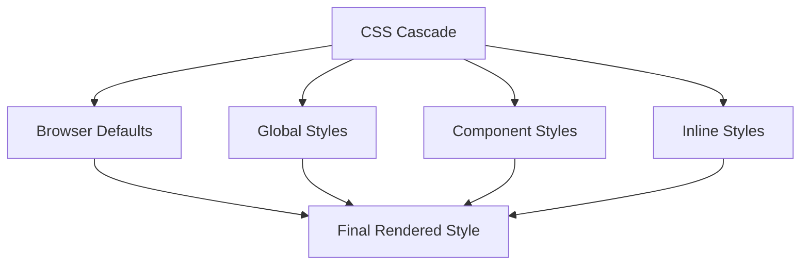

## 7.2 Setting Global Styles

Creating a visually appealing and consistent web page involves more than just adding colors and fonts. It starts with setting a solid foundation through global styles. In this section, we'll explore how to define default styles that apply to the entire web page, ensuring a cohesive look and feel. We'll discuss the importance of setting base styles for the `body` element, the concept of CSS resets or normalization, and how these practices contribute to the overall design consistency of your site.

### Understanding Global Styles

Global styles are CSS rules that apply universally across your web page. They provide a consistent starting point for styling by setting default properties such as fonts, colors, and spacing. By defining these styles, you ensure that all elements on your page adhere to a unified design language, reducing the need for repetitive styling and minimizing inconsistencies.

### Setting Base Styles for the `body` Element

The `body` element is the root of your web page's content. Setting base styles for the `body` ensures that all text and elements inherit these properties unless otherwise specified. Let's start by defining some fundamental styles for the `body` element:

```css
body {
    margin: 0;
    padding: 0;
    font-family: Arial, sans-serif;
    background-color: #f5f5f5;
    color: #333;
}
```

- **Margin and Padding**: By setting `margin: 0;` and `padding: 0;`, we eliminate any default spacing that browsers might apply, giving us a clean slate to work with.
- **Font Family**: Choosing a default font, like `Arial`, ensures text consistency across the page. The `sans-serif` fallback provides a similar font if `Arial` is unavailable.
- **Background Color**: A light gray background (`#f5f5f5`) offers a neutral canvas that enhances readability and aesthetics.
- **Text Color**: A dark gray text color (`#333`) ensures good contrast against the background, improving legibility.

### The Importance of CSS Resets and Normalization

Different browsers have varying default styles for HTML elements, which can lead to inconsistencies in how your web page appears. CSS resets and normalization techniques help address these discrepancies.

#### CSS Resets

A CSS reset removes all default styling applied by browsers, providing a blank canvas for your custom styles. One popular reset is Eric Meyer's reset:

```css
/* CSS Reset by Eric Meyer */
html, body, div, span, applet, object, iframe,
h1, h2, h3, h4, h5, h6, p, blockquote, pre,
a, abbr, acronym, address, big, cite, code,
del, dfn, em, img, ins, kbd, q, s, samp,
small, strike, strong, sub, sup, tt, var,
b, u, i, center,
dl, dt, dd, ol, ul, li,
fieldset, form, label, legend,
table, caption, tbody, tfoot, thead, tr, th, td,
article, aside, canvas, details, embed,
figure, figcaption, footer, header, hgroup,
menu, nav, output, ruby, section, summary,
time, mark, audio, video {
    margin: 0;
    padding: 0;
    border: 0;
    font-size: 100%;
    font: inherit;
    vertical-align: baseline;
}
/* HTML5 display-role reset for older browsers */
article, aside, details, figcaption, figure,
footer, header, hgroup, menu, nav, section {
    display: block;
}
body {
    line-height: 1;
}
ol, ul {
    list-style: none;
}
blockquote, q {
    quotes: none;
}
blockquote:before, blockquote:after,
q:before, q:after {
    content: '';
    content: none;
}
table {
    border-collapse: collapse;
    border-spacing: 0;
}
```

#### CSS Normalization

Normalization, on the other hand, aims to make built-in browser styles consistent across different browsers. It preserves useful default styles rather than removing them entirely. Normalize.css is a widely used library for this purpose.

```css
/*! normalize.css v8.0.1 | MIT License | github.com/necolas/normalize.css */

/* Document
   ========================================================================== */

/**
 * 1. Correct the line height in all browsers.
 * 2. Prevent adjustments of font size after orientation changes in iOS.
 */

html {
    line-height: 1.15; /* 1 */
    -webkit-text-size-adjust: 100%; /* 2 */
}

/* Sections
   ========================================================================== */

/**
 * Remove the margin in all browsers.
 */

body {
    margin: 0;
}

/* Grouping content
   ========================================================================== */

/**
 * 1. Add the correct box sizing in Firefox.
 * 2. Show the overflow in Edge and IE.
 */

hr {
    box-sizing: content-box; /* 1 */
    height: 0; /* 1 */
    overflow: visible; /* 2 */
}

/* Text-level semantics
   ========================================================================== */

/**
 * Remove the gray background on active links in IE 10.
 */

a {
    background-color: transparent;
}

/* Embedded content
   ========================================================================== */

/**
 * 1. Remove the border on images inside links in IE 10.
 * 2. Remove the border on images inside links in Edge 12-.
 */

img {
    border-style: none; /* 1 */
}
```

### Benefits of Global Styles

Global styles offer several advantages that enhance the overall quality of your web page:

- **Consistency**: By setting default styles, you ensure that all elements adhere to a unified design language, reducing visual discrepancies.
- **Efficiency**: Global styles minimize the need for repetitive styling, allowing you to focus on specific customizations.
- **Maintainability**: A well-organized stylesheet with global styles is easier to manage and update, especially as your project grows.

### Choosing Default Styles That Match Your Design Preferences

When setting global styles, consider the overall aesthetic and functionality of your web page. Here are some tips to guide your choices:

- **Typography**: Select fonts that complement your brand and enhance readability. Consider using web-safe fonts or integrating Google Fonts for more options.
- **Color Scheme**: Choose colors that align with your brand identity and provide sufficient contrast for readability.
- **Spacing**: Establish consistent spacing rules for margins and padding to create a balanced layout.
- **Accessibility**: Ensure your styles support accessibility by providing sufficient color contrast and using readable font sizes.

### Try It Yourself

Let's put these concepts into practice. Create a simple HTML file and apply the following global styles. Experiment with different fonts, colors, and spacing to see how they affect the overall appearance of your page.

```html
<!DOCTYPE html>
<html lang="en">
<head>
    <meta charset="UTF-8">
    <meta name="viewport" content="width=device-width, initial-scale=1.0">
    <title>Global Styles Example</title>
    <style>
        /* Global Styles */
        body {
            margin: 0;
            padding: 0;
            font-family: 'Roboto', sans-serif;
            background-color: #e0f7fa;
            color: #004d40;
        }

        h1, h2, h3, h4, h5, h6 {
            font-weight: normal;
            color: #00796b;
        }

        p {
            line-height: 1.6;
            margin-bottom: 1em;
        }

        a {
            color: #00796b;
            text-decoration: none;
        }

        a:hover {
            text-decoration: underline;
        }
    </style>
</head>
<body>
    <h1>Welcome to My Web Page</h1>
    <p>This is a simple example of setting global styles using CSS. Feel free to modify the styles and see the changes in real-time.</p>
    <a href="#">Learn more</a>
</body>
</html>
```

### Visual Aids: Understanding the CSS Cascade

To better understand how global styles fit into the larger picture of CSS, let's visualize the CSS cascade using a Mermaid.js diagram:



**Diagram Explanation**: The CSS cascade determines which styles are applied to an element. Browser defaults are overridden by global styles, which can be further customized by component-specific styles and inline styles. The final rendered style is a combination of these layers.

### References and Links

For further reading on CSS resets and normalization, consider exploring the following resources:

- [MDN Web Docs: CSS Basics](https://developer.mozilla.org/en-US/docs/Learn/Getting_started_with_the_web/CSS_basics)
- [Eric Meyer's CSS Reset](https://meyerweb.com/eric/tools/css/reset/)
- [Normalize.css GitHub Repository](https://github.com/necolas/normalize.css/)

### Engagement and Reinforcement

To reinforce your understanding of global styles, try the following exercises:

1. **Experiment with Different Fonts**: Modify the `font-family` property in the example above to see how different fonts impact the page's appearance.
2. **Adjust the Color Scheme**: Change the `background-color` and `color` properties to create a new color scheme. Consider using a color palette generator for inspiration.
3. **Add More Global Styles**: Extend the example by adding global styles for other elements, such as lists, tables, and forms.

### Summary of Key Takeaways

- Global styles provide a consistent foundation for your web page by setting default properties for elements.
- CSS resets and normalization techniques help achieve visual consistency across different browsers.
- Choosing default styles that align with your design preferences enhances the overall aesthetic and functionality of your site.
- Experimenting with fonts, colors, and spacing allows you to customize the look and feel of your page.

By mastering global styles, you're well on your way to creating visually consistent and professional-looking web pages. Keep experimenting and refining your styles to achieve the desired results.

## Quiz Time!



### What are global styles in CSS?

- [x] Styles that apply universally across a web page
- [ ] Styles that apply only to specific elements
- [ ] Styles that are used for animations
- [ ] Styles that are used for media queries

> **Explanation:** Global styles are CSS rules that apply universally across your web page, providing a consistent starting point for styling.

### Why is it important to set base styles for the `body` element?

- [x] To ensure all text and elements inherit consistent properties
- [ ] To make the page load faster
- [ ] To add animations to the page
- [ ] To create a responsive layout

> **Explanation:** Setting base styles for the `body` element ensures that all text and elements inherit consistent properties, reducing visual discrepancies.

### What is the purpose of a CSS reset?

- [x] To remove all default styling applied by browsers
- [ ] To add animations to the page
- [ ] To create a responsive layout
- [ ] To make the page load faster

> **Explanation:** A CSS reset removes all default styling applied by browsers, providing a blank canvas for your custom styles.

### What is CSS normalization?

- [x] Making built-in browser styles consistent across different browsers
- [ ] Adding animations to the page
- [ ] Creating a responsive layout
- [ ] Making the page load faster

> **Explanation:** CSS normalization aims to make built-in browser styles consistent across different browsers, preserving useful default styles.

### Which of the following is a benefit of global styles?

- [x] Consistency
- [x] Efficiency
- [ ] Slower page load times
- [ ] Increased complexity

> **Explanation:** Global styles offer consistency and efficiency by ensuring all elements adhere to a unified design language and minimizing repetitive styling.

### What should you consider when choosing default styles?

- [x] Typography and color scheme
- [x] Accessibility and spacing
- [ ] Adding as many styles as possible
- [ ] Ignoring browser compatibility

> **Explanation:** When choosing default styles, consider typography, color scheme, accessibility, and spacing to enhance the overall aesthetic and functionality of your site.

### What is the CSS cascade?

- [x] The order in which styles are applied to an element
- [ ] A method for creating animations
- [ ] A technique for making pages responsive
- [ ] A way to speed up page loading

> **Explanation:** The CSS cascade determines the order in which styles are applied to an element, with browser defaults overridden by global styles, component-specific styles, and inline styles.

### How can you experiment with global styles?

- [x] By modifying fonts, colors, and spacing
- [ ] By adding as many styles as possible
- [ ] By ignoring browser compatibility
- [ ] By using only inline styles

> **Explanation:** Experimenting with fonts, colors, and spacing allows you to customize the look and feel of your page, enhancing its visual appeal.

### What is the role of the `font-family` property in global styles?

- [x] To ensure text consistency across the page
- [ ] To add animations to the page
- [ ] To create a responsive layout
- [ ] To make the page load faster

> **Explanation:** The `font-family` property ensures text consistency across the page by setting a default font that all text elements inherit.

### True or False: CSS resets and normalization are the same thing.

- [ ] True
- [x] False

> **Explanation:** CSS resets remove all default styling applied by browsers, while normalization aims to make built-in browser styles consistent across different browsers.


