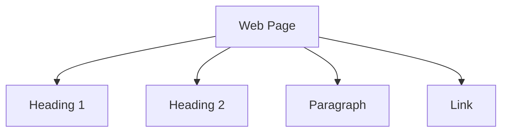

## 7.3 Styling Text Elements

In this section, we delve into the art of styling text elements using CSS. Text is a fundamental component of any web page, and how it is presented can significantly impact user experience. We'll explore how to style headings, paragraphs, and links to make your web pages not only visually appealing but also accessible and easy to read.

### Understanding the Basics of Text Styling

Before we dive into specific examples, let's briefly discuss the importance of text styling. Text styling involves altering the appearance of text elements to enhance readability, convey hierarchy, and improve accessibility. By using CSS, we can change properties such as color, font size, line height, and alignment, among others.

#### Key Concepts in Text Styling

- **Readability**: Ensuring that text is easy to read by choosing appropriate font sizes, line heights, and color contrasts.
- **Accessibility**: Making sure that text is accessible to all users, including those with visual impairments, by adhering to web accessibility guidelines.
- **Hierarchy**: Using different styles to indicate the importance of text elements, such as headings and subheadings.

### Styling Headings

Headings are crucial for structuring content and guiding users through a web page. They range from `<h1>` to `<h6>`, with `<h1>` being the most important. Let's see how we can style headings using CSS.

#### Example: Styling an `<h1>` Element

```css
h1 {
    color: #333; /* Dark gray color for better contrast */
    font-size: 2em; /* Double the default size */
    text-align: center; /* Center the text */
    margin-bottom: 0.5em; /* Space below the heading */
}
```

In this example, we set the color to a dark gray (`#333`) for good contrast against a light background. The font size is set to `2em`, which means twice the size of the default font size. Centering the text with `text-align: center;` creates a balanced look, and adding a margin at the bottom ensures space between the heading and subsequent content.

#### Experimenting with Different Styles

Try changing the font size or color to see how it affects the appearance. For instance, using a bold color like `#FF5733` can make the heading stand out:

```css
h1 {
    color: #FF5733;
    font-size: 2.5em;
    text-align: left;
}
```

### Styling Paragraphs

Paragraphs are the main body of text on a web page. Proper styling can enhance readability and make the content more engaging.

#### Example: Styling a `<p>` Element

```css
p {
    line-height: 1.6; /* Space between lines */
    color: #666; /* Medium gray for a softer look */
    font-family: 'Arial', sans-serif; /* Use a clean, sans-serif font */
    margin: 1em 0; /* Space above and below the paragraph */
}
```

Here, `line-height: 1.6;` improves readability by providing ample space between lines. The color `#666` is a medium gray that is easy on the eyes, and the font family is set to Arial, a common sans-serif font known for its clarity.

#### Importance of Readability

Readability is crucial for user engagement. Ensure that the text color contrasts well with the background. Avoid using colors that are too similar, as they can strain the eyes. Additionally, choose a line height that prevents lines from appearing cramped.

### Styling Links

Links are interactive elements that guide users to other pages or sections. Styling links can enhance their visibility and provide feedback on interaction.

#### Example: Styling an `<a>` Element

```css
a {
    color: #007BFF; /* Blue color for links */
    text-decoration: none; /* Remove underline */
}

a:hover {
    color: #0056b3; /* Darker blue on hover */
    text-decoration: underline; /* Add underline on hover */
}
```

In this example, the link color is set to a standard blue (`#007BFF`), which users commonly associate with hyperlinks. Removing the underline with `text-decoration: none;` gives a cleaner look, while adding it back on hover provides visual feedback.

#### Experimenting with Hover Effects

Try changing the hover color to see how it affects user interaction. For instance, using a contrasting color like `#FF5733` can make the hover effect more noticeable:

```css
a:hover {
    color: #FF5733;
    text-decoration: underline;
}
```

### Importance of Readability and Accessibility

When styling text elements, always consider readability and accessibility. Use sufficient contrast between text and background colors to ensure text is legible. Additionally, use semantic HTML elements, such as `<h1>` for main headings, to improve accessibility for screen readers.

#### Accessibility Tips

- **Use Rem Units**: Use `rem` units for font sizes to ensure scalability across different devices.
- **Color Contrast**: Ensure a contrast ratio of at least 4.5:1 between text and background colors.
- **Semantic HTML**: Use appropriate HTML tags for content to enhance accessibility.

### Try It Yourself

Encourage experimentation by trying different font sizes, colors, and hover effects. Here's a simple exercise to get started:

1. Create a new HTML page with a few headings, paragraphs, and links.
2. Apply the CSS styles discussed above.
3. Experiment with different colors and font sizes.
4. Observe how changes affect the overall appearance and readability.

### Visual Aids

To help visualize the concepts, let's use a Mermaid.js diagram to illustrate the hierarchy of text elements on a web page:



This diagram shows the basic structure of a web page with different text elements. Headings (`B` and `C`) represent different levels of importance, while paragraphs (`D`) and links (`E`) provide content and navigation.

### References and Links

For further reading and resources on CSS text styling, consider visiting the following links:

- [MDN Web Docs on CSS Text](https://developer.mozilla.org/en-US/docs/Web/CSS/text)
- [W3Schools CSS Text](https://www.w3schools.com/css/css_text.asp)

### Engagement and Reinforcement

To reinforce your learning, try styling text elements on a sample web page. Experiment with different styles and observe how they affect readability and user experience. Consider the following questions:

- How does changing the font size affect readability?
- What impact does color contrast have on accessibility?
- How do hover effects enhance user interaction?

### Key Takeaways

- Text styling is essential for readability, accessibility, and user engagement.
- Use CSS to customize text elements like headings, paragraphs, and links.
- Ensure sufficient contrast and use semantic HTML for accessibility.
- Experiment with different styles to find what works best for your web page.

### Conclusion

Styling text elements is a fundamental skill in web development. By mastering these techniques, you can create web pages that are not only visually appealing but also accessible and easy to read. Remember to experiment and iterate on your designs to achieve the best results.

## Quiz Time!



### What is the primary purpose of styling text elements with CSS?

- [x] To enhance readability and user engagement
- [ ] To make the page load faster
- [ ] To improve server performance
- [ ] To reduce bandwidth usage

> **Explanation:** Styling text elements with CSS enhances readability and user engagement by improving the visual presentation of text on a web page.

### Which CSS property is used to change the color of text?

- [x] color
- [ ] background-color
- [ ] font-size
- [ ] text-align

> **Explanation:** The `color` property in CSS is used to change the color of text elements.

### How can you remove the underline from a link using CSS?

- [x] text-decoration: none;
- [ ] text-align: center;
- [ ] font-weight: bold;
- [ ] display: block;

> **Explanation:** The `text-decoration: none;` property removes the underline from a link.

### What is the recommended line height for improving readability in paragraphs?

- [x] 1.6
- [ ] 1.0
- [ ] 0.8
- [ ] 2.0

> **Explanation:** A line height of 1.6 is recommended for improving readability in paragraphs as it provides adequate space between lines.

### Which CSS property is used to center-align text?

- [x] text-align: center;
- [ ] margin: auto;
- [ ] padding: center;
- [ ] display: flex;

> **Explanation:** The `text-align: center;` property is used to center-align text within its container.

### What is the purpose of using hover effects on links?

- [x] To provide visual feedback on interaction
- [ ] To increase page loading speed
- [ ] To reduce server load
- [ ] To enhance SEO

> **Explanation:** Hover effects provide visual feedback on interaction, indicating to users that a link is clickable.

### Why is it important to use semantic HTML elements?

- [x] To improve accessibility for screen readers
- [ ] To reduce the number of CSS styles needed
- [ ] To increase server performance
- [ ] To enhance SEO

> **Explanation:** Using semantic HTML elements improves accessibility for screen readers by providing meaningful structure to the content.

### What unit is recommended for scalable font sizes?

- [x] rem
- [ ] px
- [ ] em
- [ ] %

> **Explanation:** The `rem` unit is recommended for scalable font sizes as it is relative to the root element and ensures consistency across devices.

### Which of the following is a key consideration for text readability?

- [x] Contrast between text and background
- [ ] Number of images on the page
- [ ] Length of the URL
- [ ] Number of CSS files

> **Explanation:** Contrast between text and background is a key consideration for text readability, ensuring that text is legible.

### True or False: Using a very small font size improves accessibility.

- [ ] True
- [x] False

> **Explanation:** Using a very small font size does not improve accessibility; it can make text difficult to read, especially for users with visual impairments.


