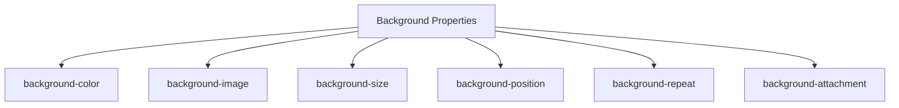

## 7.4 Working with Colors and Backgrounds

In this section, we will explore how to use CSS to apply colors and backgrounds to your web pages. Colors and backgrounds are essential elements of web design that can significantly impact the user experience. They can convey emotions, highlight important information, and make your website visually appealing. Let's dive into the world of colors and backgrounds in CSS!

### Understanding Color Values in CSS

CSS provides several ways to define colors. Understanding these options will give you the flexibility to choose the best method for your design needs.

#### Color Names

CSS supports a set of predefined color names. These are easy to use and remember, making them a great choice for beginners. Here are a few examples:

- **Red**
- **Blue**
- **Green**
- **Yellow**
- **Black**
- **White**

You can use these color names directly in your CSS code. For example:

```css
h1 {
    color: blue;
}
```

#### HEX Codes

HEX codes are a popular way to define colors in CSS. They consist of a `#` symbol followed by six hexadecimal digits, representing the red, green, and blue components of the color. For example, `#ff0000` represents red.

Here's how you can use HEX codes in your CSS:

```css
p {
    color: #ff5733;
}
```

#### RGB and RGBA

RGB stands for Red, Green, and Blue. You can specify colors using the `rgb()` function, which takes three arguments: the red, green, and blue values, each ranging from 0 to 255.

For example:

```css
div {
    color: rgb(255, 99, 71); /* Tomato color */
}
```

RGBA is an extension of RGB that includes an alpha channel for opacity. The alpha value ranges from 0 (completely transparent) to 1 (completely opaque).

Example:

```css
h1 {
    color: rgba(0, 123, 255, 0.8); /* Semi-transparent blue */
}
```

### Setting Text and Background Colors

Now that you know how to define colors, let's see how to apply them to text and backgrounds.

#### Text Color

To change the color of text, use the `color` property. Here's an example:

```css
h1 {
    color: #4a90e2; /* A shade of blue */
}
```

#### Background Color

To set a background color, use the `background-color` property. This property can be applied to any HTML element.

Example:

```css
body {
    background-color: #f8f9fa; /* Light gray */
}
```

### Applying Background Images

Background images can add depth and interest to your web page. CSS provides several properties to control background images.

Here's a basic example of how to apply a background image:

```css
.hero {
    background-image: url('images/hero.jpg');
    background-size: cover;
    background-position: center;
}
```

- **`background-image`**: Specifies the image to use as the background.
- **`background-size`**: Determines how the background image is scaled. The `cover` value ensures the image covers the entire element.
- **`background-position`**: Sets the starting position of the background image. The `center` value centers the image within the element.

#### Background Repeat

By default, background images repeat to fill the element. You can control this behavior with the `background-repeat` property.

Example:

```css
.container {
    background-image: url('images/pattern.png');
    background-repeat: no-repeat;
}
```

### Using Gradients for Backgrounds

Gradients are a powerful tool for creating smooth transitions between colors. CSS supports linear and radial gradients.

#### Linear Gradients

A linear gradient transitions between colors along a straight line. Here's an example:

```css
header {
    background: linear-gradient(to right, #ff7e5f, #feb47b);
}
```

- **`to right`**: Specifies the direction of the gradient.
- **`#ff7e5f, #feb47b`**: The colors to transition between.

#### Radial Gradients

Radial gradients transition from a central point outward. Here's how to create one:

```css
footer {
    background: radial-gradient(circle, #ff7e5f, #feb47b);
}
```

- **`circle`**: Defines the shape of the gradient.

### Choosing Color Schemes

Choosing the right color scheme is crucial for enhancing user experience. Here are some tips:

- **Contrast**: Ensure sufficient contrast between text and background colors for readability.
- **Consistency**: Use a consistent color palette throughout your site.
- **Emotion**: Consider the emotions and associations of colors. For example, blue is calming, while red is energizing.

### Try It Yourself

Experiment with the following code to see how different color values and background properties affect the appearance of your web page:

```css
body {
    background-color: #f0f0f0;
}

h1 {
    color: rgb(34, 34, 34);
}

.hero {
    background-image: url('images/hero.jpg');
    background-size: cover;
    background-position: center;
    background-repeat: no-repeat;
}

footer {
    background: linear-gradient(to bottom, #333, #111);
}
```

Try changing the color values, image paths, and gradient directions to see the effects.

### Visualizing CSS Background Properties

To better understand how background properties work together, let's visualize them using a Mermaid.js diagram.



This diagram shows the relationship between different CSS background properties. Each property plays a role in defining the overall appearance of the background.

### Key Takeaways

- CSS offers multiple ways to define colors, including color names, HEX codes, RGB, and RGBA.
- Use the `color` property to set text color and the `background-color` property for background color.
- Background images can be controlled with properties like `background-size`, `background-position`, and `background-repeat`.
- Gradients provide smooth transitions between colors and can be linear or radial.
- Choose color schemes that enhance readability, consistency, and emotional impact.

### Further Reading

For more information on CSS colors and backgrounds, check out these resources:

- [MDN Web Docs: CSS Colors](https://developer.mozilla.org/en-US/docs/Web/CSS/color_value)
- [W3Schools: CSS Backgrounds](https://www.w3schools.com/css/css_background.asp)

## Quiz Time!



### What is the correct way to set a background color in CSS?

- [x] `background-color: #f8f9fa;`
- [ ] `color: #f8f9fa;`
- [ ] `bg-color: #f8f9fa;`
- [ ] `back-color: #f8f9fa;`

> **Explanation:** The `background-color` property is used to set the background color of an element in CSS.

### Which CSS function is used to define colors with opacity?

- [ ] `rgb()`
- [x] `rgba()`
- [ ] `hex()`
- [ ] `color()`

> **Explanation:** The `rgba()` function allows you to define colors with an alpha channel for opacity.

### How do you apply a background image in CSS?

- [ ] `background: image('path/to/image.jpg');`
- [x] `background-image: url('path/to/image.jpg');`
- [ ] `image-background: url('path/to/image.jpg');`
- [ ] `background-img: url('path/to/image.jpg');`

> **Explanation:** The `background-image` property is used to apply a background image in CSS.

### What does the `background-size: cover;` property do?

- [x] Ensures the background image covers the entire element.
- [ ] Repeats the background image.
- [ ] Centers the background image.
- [ ] Stretches the background image to fit.

> **Explanation:** The `background-size: cover;` property scales the background image to cover the entire element.

### Which of the following is a valid linear gradient in CSS?

- [x] `linear-gradient(to right, #ff7e5f, #feb47b)`
- [ ] `gradient-linear(to right, #ff7e5f, #feb47b)`
- [ ] `linear-gradient(right, #ff7e5f, #feb47b)`
- [ ] `gradient(linear, to right, #ff7e5f, #feb47b)`

> **Explanation:** The `linear-gradient(to right, #ff7e5f, #feb47b)` is the correct syntax for a linear gradient in CSS.

### What is the purpose of the `background-repeat` property?

- [x] Controls whether a background image repeats.
- [ ] Sets the background color.
- [ ] Defines the size of the background image.
- [ ] Specifies the position of the background image.

> **Explanation:** The `background-repeat` property controls the repetition of a background image.

### How can you create a radial gradient in CSS?

- [ ] `gradient-radial(circle, #ff7e5f, #feb47b)`
- [x] `radial-gradient(circle, #ff7e5f, #feb47b)`
- [ ] `gradient(circle, radial, #ff7e5f, #feb47b)`
- [ ] `radial-gradient(#ff7e5f, #feb47b)`

> **Explanation:** The `radial-gradient(circle, #ff7e5f, #feb47b)` is the correct syntax for a radial gradient in CSS.

### What does the `background-position: center;` property do?

- [x] Centers the background image within the element.
- [ ] Repeats the background image.
- [ ] Scales the background image to fit.
- [ ] Stretches the background image.

> **Explanation:** The `background-position: center;` property centers the background image within the element.

### Which property is used to set the text color in CSS?

- [ ] `background-color`
- [x] `color`
- [ ] `text-color`
- [ ] `font-color`

> **Explanation:** The `color` property is used to set the text color in CSS.

### True or False: HEX codes are a way to define colors in CSS.

- [x] True
- [ ] False

> **Explanation:** HEX codes are indeed a way to define colors in CSS, using a combination of hexadecimal digits.


