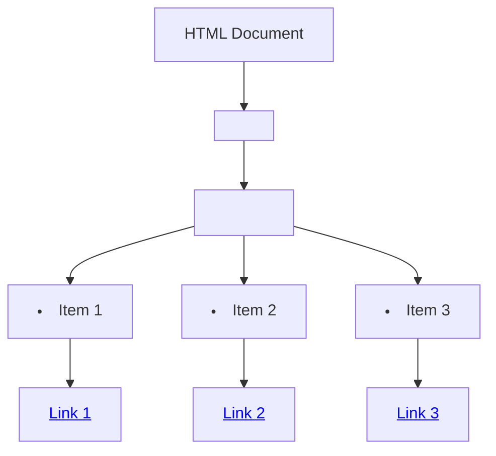

## 7.5 Formatting the Navigation Menu

A well-styled navigation menu is an essential component of any web page. It not only enhances the visual appeal of your site but also improves usability, making it easier for users to find what they need. In this section, we'll explore how to style a navigation menu using CSS, focusing on aesthetics, usability, and responsiveness.

### Introduction to Navigation Menus

Before diving into the styling, let's briefly discuss what a navigation menu is. A navigation menu is a collection of links that guide users to different sections of a website. These links are typically organized in a list format and are often placed at the top of a web page.

### Removing Default List Styling

When creating a navigation menu using HTML, we often use unordered lists (`<ul>`) to structure the menu items. By default, browsers apply a list style to these elements, which includes bullets and padding. To create a clean slate for styling, we need to remove these default styles.

Here's how you can remove the default list styling using CSS:

```css
nav ul {
    list-style-type: none; /* Removes bullet points */
    padding: 0; /* Removes default padding */
    margin: 0; /* Removes default margin */
}
```

**Explanation:**  
- `list-style-type: none;` removes the default bullet points from the list.
- `padding: 0;` and `margin: 0;` ensure that there is no extra space around the list, allowing for precise control over the layout.

### Displaying List Items Horizontally

By default, list items (`<li>`) are displayed vertically. However, for a navigation menu, we typically want the items to be displayed horizontally. This can be achieved using the `display` property.

Here's how you can display list items horizontally:

```css
nav li {
    display: inline-block; /* Aligns items horizontally */
    margin-right: 15px; /* Adds space between items */
}
```

**Explanation:**  
- `display: inline-block;` changes the display of list items from block (vertical) to inline (horizontal).
- `margin-right: 15px;` adds space between the items, improving readability and aesthetics.

### Styling the Navigation Links

The links within your navigation menu are the most critical elements, as they are the interactive components users will click on. Styling these links involves setting their color, removing underlines, and adding hover effects to enhance interactivity.

Here's a basic style for navigation links:

```css
nav a {
    text-decoration: none; /* Removes underline from links */
    color: #333; /* Sets the text color */
    font-weight: bold; /* Makes the text bold */
}

nav a:hover {
    color: #007BFF; /* Changes color on hover for interactivity */
}
```

**Explanation:**  
- `text-decoration: none;` removes the default underline from links.
- `color: #333;` sets the text color to a dark gray, which is easy to read.
- `font-weight: bold;` makes the text bold, emphasizing the links.
- `nav a:hover { color: #007BFF; }` changes the link color on hover, providing visual feedback to users.

### Responsive Considerations

In today's world, users access websites from a variety of devices, including desktops, tablets, and smartphones. Therefore, it's crucial to ensure that your navigation menu is responsive and adapts to different screen sizes.

#### Using Media Queries for Responsiveness

Media queries allow you to apply different styles based on the screen size. For example, you might want to stack the navigation items vertically on smaller screens to make them easier to tap.

Here's an example of how you can use media queries to make your navigation menu responsive:

```css
@media (max-width: 768px) {
    nav ul {
        display: flex;
        flex-direction: column; /* Stacks items vertically */
        align-items: center; /* Centers items */
    }

    nav li {
        margin-right: 0; /* Removes right margin */
        margin-bottom: 10px; /* Adds space between stacked items */
    }
}
```

**Explanation:**  
- `@media (max-width: 768px) { ... }` targets devices with a screen width of 768 pixels or less.
- `flex-direction: column;` changes the layout to vertical stacking.
- `align-items: center;` centers the items horizontally.
- `margin-bottom: 10px;` adds space between the vertically stacked items.

### Encouraging Customization

While the examples provided offer a solid foundation for styling a navigation menu, it's important to customize the styles to match your site's theme and branding. Here are some ideas for customization:

- **Colors:** Experiment with different color schemes to match your site's color palette.
- **Fonts:** Use custom fonts to align with your site's typography.
- **Spacing:** Adjust margins and padding to achieve the desired layout.
- **Hover Effects:** Add transitions or animations for a smoother hover effect.

### Try It Yourself

Now that we've covered the basics, it's time for you to experiment. Try modifying the code examples to create a navigation menu that suits your style. Consider changing the colors, fonts, and hover effects. Here's a challenge: Can you add a background color to the navigation menu and change it on hover?

### Visual Aids

To better understand how the navigation menu fits into the overall structure of a web page, let's visualize it using a DOM tree diagram.



**Diagram Description:**  
This diagram represents a simple navigation menu structure within an HTML document. The `<nav>` element contains an unordered list (`<ul>`), which in turn contains list items (`<li>`) with anchor tags (`<a>`) for links.

### Summary

In this section, we've explored how to style a navigation menu using CSS. We've covered removing default list styling, displaying list items horizontally, styling navigation links, and making the menu responsive. Remember, the key to a great navigation menu is not only in its functionality but also in its aesthetics and usability. By customizing the styles, you can create a navigation menu that enhances your site's overall design.

### Further Reading

For more information on CSS styling and responsive design, check out these resources:
- [MDN Web Docs: CSS](https://developer.mozilla.org/en-US/docs/Web/CSS)
- [W3Schools: CSS Navigation Bar](https://www.w3schools.com/css/css_navbar.asp)

## Quiz Time!



### What is the purpose of removing default list styling in a navigation menu?

- [x] To create a clean slate for custom styling
- [ ] To make the list items invisible
- [ ] To add more padding to the list
- [ ] To change the color of the list items

> **Explanation:** Removing default list styling helps create a clean slate for custom styling by eliminating default bullet points and spacing.

### Which CSS property is used to display list items horizontally?

- [x] display: inline-block;
- [ ] display: block;
- [ ] display: flex;
- [ ] display: grid;

> **Explanation:** The `display: inline-block;` property is used to display list items horizontally.

### How can you remove the underline from navigation links?

- [x] text-decoration: none;
- [ ] text-decoration: underline;
- [ ] text-decoration: bold;
- [ ] text-decoration: italic;

> **Explanation:** The `text-decoration: none;` property removes the underline from navigation links.

### What CSS property can be used to change the color of a link on hover?

- [x] color
- [ ] background-color
- [ ] border-color
- [ ] text-shadow

> **Explanation:** The `color` property can be used to change the text color of a link on hover.

### How can you make a navigation menu responsive for smaller screens?

- [x] Use media queries to adjust styles
- [ ] Increase the font size
- [ ] Add more list items
- [ ] Use larger images

> **Explanation:** Media queries allow you to apply different styles based on screen size, making the navigation menu responsive.

### What does the `margin-right: 15px;` property do for list items?

- [x] Adds space between horizontally aligned items
- [ ] Removes space between items
- [ ] Changes the color of the items
- [ ] Aligns items vertically

> **Explanation:** The `margin-right: 15px;` property adds space between horizontally aligned list items.

### Which CSS property is used to make text bold?

- [x] font-weight: bold;
- [ ] text-decoration: bold;
- [ ] font-style: italic;
- [ ] font-size: large;

> **Explanation:** The `font-weight: bold;` property is used to make text bold.

### What is the purpose of the `@media` rule in CSS?

- [x] To apply styles based on screen size or device type
- [ ] To change the color of text
- [ ] To add animations
- [ ] To remove elements from the page

> **Explanation:** The `@media` rule is used to apply styles based on screen size or device type, making designs responsive.

### Which HTML element is typically used to structure a navigation menu?

- [x] <ul>
- [ ] <div>
- [ ] <span>
- [ ] <p>

> **Explanation:** The `<ul>` (unordered list) element is typically used to structure a navigation menu.

### True or False: Customizing the styles of a navigation menu can enhance a site's overall design.

- [x] True
- [ ] False

> **Explanation:** True. Customizing the styles of a navigation menu can enhance a site's overall design by aligning it with the site's theme and branding.


