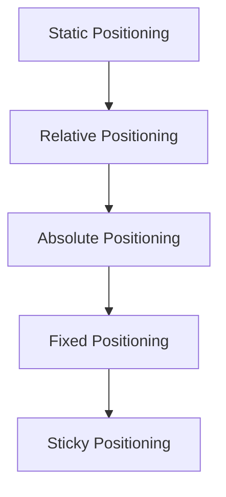

## 7.6 Positioning and Layout

Creating a visually appealing and functional web page involves more than just adding content and styling it with colors and fonts. The way elements are arranged on the page is crucial to user experience and accessibility. In this section, we'll explore how to use CSS to position elements precisely where you want them, using a variety of positioning techniques. We'll also delve into the use of margins, padding, and the `z-index` property to create effective layouts.

### Understanding CSS Positioning

CSS positioning allows us to control the placement of elements on a web page. There are five main types of positioning in CSS:

1. **Static Positioning**
2. **Relative Positioning**
3. **Absolute Positioning**
4. **Fixed Positioning**
5. **Sticky Positioning**

Each of these positioning types serves a different purpose and can be used to achieve various layout effects.

#### Static Positioning

By default, HTML elements are positioned statically. This means they appear in the order they are written in the HTML document, and their position is determined by the normal flow of the document. Static positioning does not allow for any adjustments using the `top`, `right`, `bottom`, or `left` properties.

```html
<p>This is a statically positioned paragraph.</p>
```

```css
p {
    position: static; /* This is the default value */
}
```

**Key Point:** Static positioning is the default behavior and does not allow for any manual positioning adjustments.

#### Relative Positioning

Relative positioning allows an element to be positioned relative to its normal position in the document flow. This means you can move an element from its default position using the `top`, `right`, `bottom`, and `left` properties.

```html
<div class="relative-box">This box is relatively positioned.</div>
```

```css
.relative-box {
    position: relative;
    top: 20px; /* Moves the element 20px down from its original position */
    left: 10px; /* Moves the element 10px to the right from its original position */
}
```

**Key Point:** Relative positioning shifts an element from its original position without affecting the layout of surrounding elements.

#### Absolute Positioning

Absolute positioning places an element relative to its closest positioned ancestor (an ancestor that has a position other than static). If no such ancestor exists, it will be positioned relative to the initial containing block (usually the `<html>` element).

```html
<div class="container">
    <div class="absolute-box">This box is absolutely positioned.</div>
</div>
```

```css
.container {
    position: relative; /* Establishes a positioned ancestor */
}

.absolute-box {
    position: absolute;
    top: 50px; /* 50px from the top of the positioned ancestor */
    left: 30px; /* 30px from the left of the positioned ancestor */
}
```

**Key Point:** Absolute positioning removes an element from the normal document flow, allowing it to overlap other elements.

#### Fixed Positioning

Fixed positioning is similar to absolute positioning, but the element is positioned relative to the viewport, meaning it stays in the same place even when the page is scrolled.

```html
<div class="fixed-header">This header is fixed.</div>
```

```css
.fixed-header {
    position: fixed;
    top: 0;
    width: 100%;
    background-color: #333;
    color: white;
}
```

**Key Point:** Fixed positioning is useful for elements that need to remain visible at all times, such as navigation bars or headers.

#### Sticky Positioning

Sticky positioning is a hybrid of relative and fixed positioning. An element with `position: sticky` behaves like a relatively positioned element until it crosses a specified threshold (e.g., `top: 0`), at which point it becomes fixed.

```html
<div class="sticky-note">This note is sticky.</div>
```

```css
.sticky-note {
    position: sticky;
    top: 0;
    background-color: yellow;
}
```

**Key Point:** Sticky positioning is great for keeping elements visible within their parent container as you scroll.

### Using the `z-index` Property

The `z-index` property determines the stack order of elements. Elements with a higher `z-index` value will appear on top of elements with a lower value. This property only works on positioned elements (i.e., elements with a position other than static).

```html
<div class="box1">Box 1</div>
<div class="box2">Box 2</div>
```

```css
.box1 {
    position: absolute;
    top: 50px;
    left: 50px;
    width: 100px;
    height: 100px;
    background-color: red;
    z-index: 1; /* Lower stack order */
}

.box2 {
    position: absolute;
    top: 70px;
    left: 70px;
    width: 100px;
    height: 100px;
    background-color: blue;
    z-index: 2; /* Higher stack order, appears on top */
}
```

**Key Point:** Use `z-index` to control the layering of elements, ensuring important content is visible.

### Spacing with Margins and Padding

Margins and padding are crucial for creating space around and within elements, respectively.

- **Margin**: The space outside the element's border.
- **Padding**: The space between the element's content and its border.

```html
<div class="spaced-box">This box has margin and padding.</div>
```

```css
.spaced-box {
    margin: 20px; /* Adds space outside the element */
    padding: 15px; /* Adds space inside the element */
    border: 1px solid black;
}
```

**Key Point:** Use margins to separate elements from each other and padding to create space within an element.

### Try It Yourself

Experiment with the following code to see how different positioning properties affect the layout:

```html
<!DOCTYPE html>
<html lang="en">
<head>
    <meta charset="UTF-8">
    <meta name="viewport" content="width=device-width, initial-scale=1.0">
    <title>Positioning Example</title>
    <style>
        .container {
            position: relative;
            width: 300px;
            height: 300px;
            border: 1px solid black;
        }
        .static-box {
            position: static;
            background-color: lightgray;
        }
        .relative-box {
            position: relative;
            top: 20px;
            left: 20px;
            background-color: lightblue;
        }
        .absolute-box {
            position: absolute;
            top: 50px;
            left: 50px;
            background-color: lightgreen;
        }
        .fixed-box {
            position: fixed;
            top: 10px;
            right: 10px;
            background-color: lightcoral;
        }
        .sticky-box {
            position: sticky;
            top: 0;
            background-color: lightgoldenrodyellow;
        }
    </style>
</head>
<body>
    <div class="container">
        <div class="static-box">Static</div>
        <div class="relative-box">Relative</div>
        <div class="absolute-box">Absolute</div>
    </div>
    <div class="fixed-box">Fixed</div>
    <div class="sticky-box">Sticky</div>
</body>
</html>
```

**Challenge:** Modify the `z-index` values and observe how the layering of elements changes. Try adjusting the margins and padding to see how they affect the spacing.

### Visualizing Positioning with Diagrams

To better understand how positioning works, let's visualize it with a diagram.



**Diagram Explanation:** This flowchart illustrates the progression from static to sticky positioning, highlighting how each type builds upon the previous one.

### Key Takeaways

- **Static positioning** is the default and does not allow for manual adjustments.
- **Relative positioning** moves an element relative to its original position.
- **Absolute positioning** places an element relative to its closest positioned ancestor.
- **Fixed positioning** attaches an element to the viewport, unaffected by scrolling.
- **Sticky positioning** combines relative and fixed behaviors, sticking within a parent container.
- **`z-index`** controls the stack order of positioned elements.
- **Margins and padding** are essential for creating space around and within elements.

### Further Reading

For more in-depth information on CSS positioning and layout, consider exploring the following resources:

- [MDN Web Docs on CSS Positioning](https://developer.mozilla.org/en-US/docs/Web/CSS/position)
- [W3Schools CSS Layout](https://www.w3schools.com/css/css_positioning.asp)

By mastering these positioning techniques, you'll be well-equipped to create complex and visually appealing layouts for your web pages. Remember, practice is key, so keep experimenting with different positioning and layout strategies to see what works best for your designs.

## Quiz Time!



### What is the default positioning for HTML elements?

- [x] Static
- [ ] Relative
- [ ] Absolute
- [ ] Fixed

> **Explanation:** Static positioning is the default behavior for HTML elements, meaning they appear in the order they are written in the document.

### Which positioning type allows an element to move relative to its original position?

- [ ] Static
- [x] Relative
- [ ] Absolute
- [ ] Fixed

> **Explanation:** Relative positioning allows an element to be moved from its original position using the `top`, `right`, `bottom`, and `left` properties.

### How does absolute positioning affect an element's placement?

- [ ] Positions it relative to the viewport
- [x] Positions it relative to the nearest positioned ancestor
- [ ] Positions it at the top of the page
- [ ] Positions it in the center of the page

> **Explanation:** Absolute positioning places an element relative to its closest positioned ancestor, or the initial containing block if no such ancestor exists.

### What is the key characteristic of fixed positioning?

- [ ] It moves with the page scroll
- [x] It stays in the same place even when the page is scrolled
- [ ] It is relative to the parent element
- [ ] It is the default positioning

> **Explanation:** Fixed positioning attaches an element to the viewport, so it remains visible even when the page is scrolled.

### Which property is used to control the stack order of elements?

- [ ] Padding
- [ ] Margin
- [x] z-index
- [ ] Display

> **Explanation:** The `z-index` property determines the stack order of positioned elements, with higher values appearing on top.

### What does the `z-index` property require to function?

- [ ] The element must have a background color
- [ ] The element must be visible
- [x] The element must be positioned (not static)
- [ ] The element must have a border

> **Explanation:** The `z-index` property only works on elements that have a position other than static.

### How does sticky positioning behave?

- [ ] Like static positioning
- [ ] Like absolute positioning
- [x] Like a combination of relative and fixed positioning
- [ ] Like fixed positioning only

> **Explanation:** Sticky positioning behaves like a relatively positioned element until it crosses a specified threshold, at which point it becomes fixed.

### What is the purpose of margins in CSS?

- [ ] To add space inside an element
- [x] To add space outside an element
- [ ] To change the element's color
- [ ] To change the element's size

> **Explanation:** Margins create space outside an element's border, separating it from other elements.

### What is the purpose of padding in CSS?

- [x] To add space inside an element
- [ ] To add space outside an element
- [ ] To change the element's color
- [ ] To change the element's size

> **Explanation:** Padding creates space inside an element, between the content and the border.

### True or False: Static positioning allows for manual adjustments using the `top`, `right`, `bottom`, and `left` properties.

- [ ] True
- [x] False

> **Explanation:** Static positioning does not allow for manual adjustments using the `top`, `right`, `bottom`, and `left` properties, as it follows the normal document flow.


