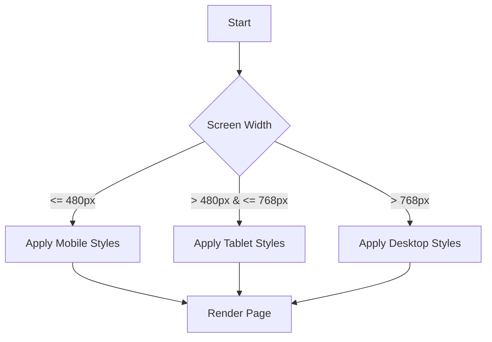

## 7.7 Adding Responsive Design

In today's digital landscape, users access websites from a myriad of devices, ranging from large desktop monitors to small smartphone screens. As a web developer, ensuring that your web pages look great and function well on all these devices is crucial. This is where responsive design comes into play. In this section, we'll explore how to make your web pages adaptable to various screen sizes using CSS media queries and other responsive design techniques.

### Understanding Responsive Design

Responsive design is a web development approach aimed at crafting sites to provide an optimal viewing experience across a wide range of devices. This means easy reading and navigation with minimal resizing, panning, and scrolling. Responsive design is achieved through flexible layouts, images, and the use of CSS media queries.

#### Key Concepts of Responsive Design

1. **Fluid Grids**: Use relative units like percentages instead of fixed units like pixels to define the width of elements.
2. **Flexible Images**: Ensure images scale with the containing element using CSS properties like `max-width: 100%`.
3. **Media Queries**: Apply different styles based on the characteristics of the device, such as its width, height, or orientation.

### Introducing Media Queries

Media queries are a fundamental part of responsive design. They allow you to apply CSS styles conditionally, based on the result of one or more media queries. This means you can change the layout of your web page depending on the screen size, resolution, or orientation of the device.

#### Syntax of Media Queries

The basic syntax of a media query is as follows:

```css
@media (condition) {
    /* CSS rules */
}
```

Here’s an example of a media query that changes the background color of the body element when the screen width is 600 pixels or less:

```css
@media (max-width: 600px) {
    body {
        background-color: lightblue;
    }
}
```

In this example, the `max-width` condition checks if the viewport width is 600 pixels or less. If true, the specified styles are applied.

#### Common Media Query Conditions

- **`max-width`**: Applies styles when the viewport is at most the specified width.
- **`min-width`**: Applies styles when the viewport is at least the specified width.
- **`max-height`**: Applies styles when the viewport is at most the specified height.
- **`min-height`**: Applies styles when the viewport is at least the specified height.
- **`orientation`**: Applies styles based on the device orientation (`landscape` or `portrait`).

### Adjusting Styles Based on Screen Width

Let's dive into how you can use media queries to adjust styles based on screen width. This technique is essential for creating responsive layouts that adapt to different devices.

#### Example: Responsive Typography

Typography is a crucial aspect of web design. You can use media queries to adjust font sizes for different screen sizes:

```css
body {
    font-size: 16px;
}

@media (max-width: 768px) {
    body {
        font-size: 14px;
    }
}

@media (max-width: 480px) {
    body {
        font-size: 12px;
    }
}
```

In this example, the base font size is set to 16 pixels. For screens 768 pixels wide or less, the font size reduces to 14 pixels, and for screens 480 pixels wide or less, it further reduces to 12 pixels.

#### Example: Responsive Layouts

You can also use media queries to change the layout of your page. Consider a two-column layout that switches to a single column on smaller screens:

```css
.container {
    display: flex;
    flex-wrap: wrap;
}

.column {
    flex: 1;
    padding: 10px;
}

@media (max-width: 600px) {
    .column {
        flex: 100%;
    }
}
```

In this example, the `.column` class is set to take up the full width of the container when the screen width is 600 pixels or less.

### Responsive Navigation

Navigation menus are a critical component of any website. They need to be accessible and functional on all devices. Let's look at how you can create a responsive navigation menu.

#### Example: Responsive Navigation Menu

Here's a simple example of a responsive navigation menu that collapses into a hamburger icon on smaller screens:

```html
<nav class="navbar">
    <ul class="nav-list">
        <li><a href="#">Home</a></li>
        <li><a href="#">About</a></li>
        <li><a href="#">Services</a></li>
        <li><a href="#">Contact</a></li>
    </ul>
    <div class="hamburger">
        <span></span>
        <span></span>
        <span></span>
    </div>
</nav>
```

```css
.navbar {
    display: flex;
    justify-content: space-between;
    align-items: center;
    background-color: #333;
}

.nav-list {
    display: flex;
    list-style: none;
}

.nav-list li {
    margin: 0 15px;
}

.nav-list a {
    color: white;
    text-decoration: none;
}

.hamburger {
    display: none;
    flex-direction: column;
    cursor: pointer;
}

.hamburger span {
    width: 25px;
    height: 3px;
    background-color: white;
    margin: 4px 0;
}

@media (max-width: 768px) {
    .nav-list {
        display: none;
    }

    .hamburger {
        display: flex;
    }
}
```

In this example, the navigation links are hidden on screens 768 pixels wide or less, and a hamburger icon is displayed instead. You can use JavaScript to toggle the visibility of the navigation links when the hamburger icon is clicked.

### Responsive Grids

Grids are a powerful tool for creating responsive layouts. CSS Grid and Flexbox are two modern layout techniques that make it easy to build responsive grids.

#### Example: Responsive Grid with CSS Grid

Here's an example of a responsive grid layout using CSS Grid:

```html
<div class="grid-container">
    <div class="grid-item">1</div>
    <div class="grid-item">2</div>
    <div class="grid-item">3</div>
    <div class="grid-item">4</div>
</div>
```

```css
.grid-container {
    display: grid;
    grid-template-columns: repeat(4, 1fr);
    gap: 10px;
}

.grid-item {
    background-color: #f2f2f2;
    padding: 20px;
    text-align: center;
}

@media (max-width: 768px) {
    .grid-container {
        grid-template-columns: repeat(2, 1fr);
    }
}

@media (max-width: 480px) {
    .grid-container {
        grid-template-columns: 1fr;
    }
}
```

In this example, the grid layout changes from four columns to two columns on screens 768 pixels wide or less, and to a single column on screens 480 pixels wide or less.

### Testing on Different Devices

Testing your responsive design on different devices is crucial to ensure a consistent user experience. Here are some tips for testing:

1. **Use Browser Developer Tools**: Most modern browsers have built-in developer tools that allow you to simulate different screen sizes and resolutions.
2. **Test on Real Devices**: Whenever possible, test your web page on actual devices to see how it performs.
3. **Use Online Tools**: There are several online tools and services that provide device emulation and testing.

### Mobile-First Design Approach

A mobile-first design approach involves designing your web page for mobile devices first and then scaling up for larger screens. This approach ensures that your web page is optimized for the most constrained environment first.

#### Benefits of Mobile-First Design

- **Improved Performance**: Mobile-first design often leads to faster load times and better performance on mobile devices.
- **Better User Experience**: By focusing on the needs of mobile users first, you can create a more user-friendly experience.
- **Easier Maintenance**: A mobile-first approach can lead to simpler, more maintainable code.

#### Implementing Mobile-First Design

To implement a mobile-first design, start by writing your base styles for mobile devices and then use media queries to add styles for larger screens:

```css
/* Base styles for mobile devices */
body {
    font-size: 14px;
    padding: 10px;
}

/* Styles for tablets and larger screens */
@media (min-width: 768px) {
    body {
        font-size: 16px;
        padding: 20px;
    }
}

/* Styles for desktops and larger screens */
@media (min-width: 1024px) {
    body {
        font-size: 18px;
        padding: 30px;
    }
}
```

### Try It Yourself: Experiment with Responsive Design

Now that we've covered the basics of responsive design, it's time to put your knowledge into practice. Try modifying the examples provided to see how they respond to different screen sizes. Here are some ideas to get you started:

- **Change the Breakpoints**: Adjust the media query breakpoints to see how the layout changes.
- **Add More Styles**: Experiment with adding more styles to the media queries, such as changing colors or fonts.
- **Create a Responsive Gallery**: Use CSS Grid or Flexbox to create a responsive image gallery.

### Visualizing Responsive Design

To help you better understand how responsive design works, let's visualize the process using a flowchart.



This flowchart illustrates how different styles are applied based on the screen width.

### Key Takeaways

- **Responsive design** is essential for creating web pages that look great on all devices.
- **Media queries** allow you to apply styles conditionally based on device characteristics.
- **Testing** your responsive design on different devices ensures a consistent user experience.
- **Mobile-first design** focuses on designing for mobile devices first and scaling up for larger screens.

### Further Reading

For more information on responsive design and media queries, check out these resources:

- [MDN Web Docs: Media Queries](https://developer.mozilla.org/en-US/docs/Web/CSS/Media_Queries/Using_media_queries)
- [W3Schools: Responsive Web Design](https://www.w3schools.com/css/css_rwd_intro.asp)

## Quiz Time!



### What is the primary purpose of responsive design?

- [x] To ensure web pages look good on all devices
- [ ] To improve website security
- [ ] To increase website speed
- [ ] To enhance website animations

> **Explanation:** Responsive design ensures that web pages look good and function well on all devices, regardless of screen size.

### Which CSS property is commonly used to make images responsive?

- [ ] width: 100%;
- [x] max-width: 100%;
- [ ] height: auto;
- [ ] display: block;

> **Explanation:** The `max-width: 100%;` property ensures that images scale with the containing element, making them responsive.

### What does the following media query do? `@media (max-width: 600px) { body { background-color: lightblue; } }`

- [x] Changes the background color to light blue for screens 600px wide or less
- [ ] Changes the background color to light blue for screens wider than 600px
- [ ] Changes the text color to light blue for screens 600px wide or less
- [ ] Changes the background color to light blue for all screens

> **Explanation:** The media query applies styles when the screen width is 600 pixels or less, changing the background color to light blue.

### What is a key advantage of a mobile-first design approach?

- [ ] It reduces the need for CSS
- [x] It improves performance on mobile devices
- [ ] It eliminates the need for media queries
- [ ] It makes websites look better on desktops

> **Explanation:** A mobile-first design approach improves performance on mobile devices by optimizing the design for the most constrained environment first.

### Which of the following is a common breakpoint for tablets?

- [ ] 320px
- [x] 768px
- [ ] 1024px
- [ ] 1440px

> **Explanation:** 768px is a common breakpoint for tablets, allowing styles to be adjusted for larger screens than mobile devices.

### What is the purpose of the `flex-wrap` property in a flexbox layout?

- [ ] To align items vertically
- [ ] To center items horizontally
- [x] To allow items to wrap onto multiple lines
- [ ] To set the space between items

> **Explanation:** The `flex-wrap` property allows flex items to wrap onto multiple lines, making the layout more flexible and responsive.

### How can you test your responsive design on different devices?

- [x] Use browser developer tools
- [x] Test on real devices
- [ ] Only use a desktop computer
- [ ] Ignore testing and hope for the best

> **Explanation:** Testing can be done using browser developer tools and real devices to ensure the design works well on various screen sizes.

### What does the `orientation` media query condition check?

- [ ] Screen width
- [ ] Screen height
- [x] Device orientation (landscape or portrait)
- [ ] Device resolution

> **Explanation:** The `orientation` media query condition checks the device's orientation, allowing styles to be applied based on whether the device is in landscape or portrait mode.

### Which CSS layout technique is commonly used for creating responsive grids?

- [ ] CSS Tables
- [ ] CSS Floats
- [x] CSS Grid
- [ ] CSS Transitions

> **Explanation:** CSS Grid is a modern layout technique that is commonly used for creating responsive grids, allowing for flexible and complex layouts.

### True or False: Media queries can only be used to adjust styles based on screen width.

- [ ] True
- [x] False

> **Explanation:** False. Media queries can be used to adjust styles based on various conditions, including screen width, height, orientation, and more.




