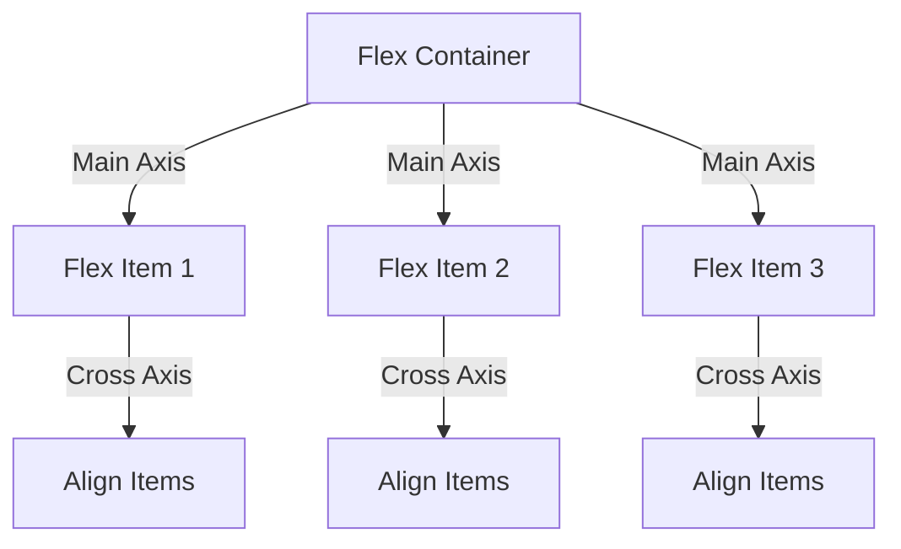

## 7.8 Utilizing Flexbox for Layout

Creating visually appealing and responsive web pages is a crucial skill for any web developer. The CSS Flexbox Layout, or simply Flexbox, is a powerful tool that allows you to design flexible and efficient layouts without the complexity of floats or positioning. In this section, we'll explore the Flexbox model, its key properties, and how you can use it to create dynamic layouts.

### Introduction to Flexbox

Flexbox is a one-dimensional layout model that provides an efficient way to align and distribute space among items in a container. It is particularly useful for creating complex layouts with minimal code. Unlike traditional layout methods, Flexbox is designed to accommodate different screen sizes and orientations, making it ideal for responsive design.

#### Benefits of Using Flexbox

- **Flexibility**: Easily adapt layouts to different screen sizes and orientations.
- **Simplicity**: Reduce the need for complex calculations and CSS hacks.
- **Alignment**: Simplify the process of aligning items both vertically and horizontally.
- **Order**: Change the order of items without altering the HTML structure.

### Key Flexbox Properties

To harness the power of Flexbox, it's essential to understand its key properties. Let's dive into the most important ones:

#### `display: flex;`

The `display: flex;` property is the foundation of Flexbox. It transforms a container into a flex container, enabling its child elements to become flex items. This property is applied to the parent container, allowing you to control the layout of its children.

```css
.container {
    display: flex;
}
```

#### `flex-direction`

The `flex-direction` property defines the direction in which the flex items are placed in the flex container. It can take the following values:

- `row` (default): Items are placed horizontally from left to right.
- `row-reverse`: Items are placed horizontally from right to left.
- `column`: Items are placed vertically from top to bottom.
- `column-reverse`: Items are placed vertically from bottom to top.

```css
.container {
    display: flex;
    flex-direction: row;
}
```

#### `justify-content`

The `justify-content` property aligns the flex items along the main axis (horizontal by default). It helps in distributing the space between and around items. The possible values are:

- `flex-start` (default): Items are packed toward the start of the flex container.
- `flex-end`: Items are packed toward the end of the flex container.
- `center`: Items are centered along the main axis.
- `space-between`: Items are evenly distributed; the first item is at the start, and the last item is at the end.
- `space-around`: Items are evenly distributed with equal space around them.
- `space-evenly`: Items are distributed with equal space between them.

```css
.container {
    display: flex;
    justify-content: space-between;
}
```

#### `align-items`

The `align-items` property aligns the flex items along the cross axis (vertical by default). It determines how the items are aligned within the flex container. The values include:

- `stretch` (default): Items stretch to fill the container.
- `flex-start`: Items are aligned at the start of the container.
- `flex-end`: Items are aligned at the end of the container.
- `center`: Items are centered along the cross axis.
- `baseline`: Items are aligned along their baseline.

```css
.container {
    display: flex;
    align-items: center;
}
```

### Practical Examples

Let's put these properties into practice with some examples to illustrate how Flexbox can be used to create responsive layouts.

#### Example 1: Horizontal Navigation Bar

A common use case for Flexbox is creating a horizontal navigation bar. Here's how you can achieve this:

```html
<div class="navbar">
    <div class="nav-item">Home</div>
    <div class="nav-item">About</div>
    <div class="nav-item">Services</div>
    <div class="nav-item">Contact</div>
</div>
```

```css
.navbar {
    display: flex;
    justify-content: space-around;
    align-items: center;
    background-color: #333;
    padding: 10px;
}

.nav-item {
    color: white;
    text-decoration: none;
    padding: 10px 20px;
}
```

In this example, the `navbar` is a flex container with items distributed evenly using `justify-content: space-around;`. The items are centered vertically with `align-items: center;`.

#### Example 2: Responsive Card Layout

Flexbox is excellent for creating responsive card layouts. Let's see how it works:

```html
<div class="card-container">
    <div class="card">Card 1</div>
    <div class="card">Card 2</div>
    <div class="card">Card 3</div>
</div>
```

```css
.card-container {
    display: flex;
    flex-direction: row;
    justify-content: space-between;
    align-items: stretch;
    gap: 20px;
}

.card {
    background-color: #f4f4f4;
    padding: 20px;
    flex: 1;
    text-align: center;
}
```

Here, the `card-container` uses `flex-direction: row;` to arrange the cards horizontally. The `gap` property adds space between the cards, and `flex: 1;` ensures that each card takes up equal space.

### Simplifying Alignment and Spacing with Flexbox

One of the most significant advantages of Flexbox is its ability to simplify alignment and spacing. With just a few properties, you can achieve complex layouts that would otherwise require intricate calculations and CSS hacks.

#### Aligning Items

Flexbox makes it easy to align items both vertically and horizontally. By using `justify-content` and `align-items`, you can center items, distribute them evenly, or align them to the start or end of the container.

#### Spacing Items

The `space-between`, `space-around`, and `space-evenly` values of `justify-content` provide flexible options for spacing items. This eliminates the need for margin calculations and ensures consistent spacing across different screen sizes.

### Try It Yourself

To truly grasp the power of Flexbox, it's essential to practice building layouts. Here are some exercises to get you started:

1. **Create a Flexbox Grid**: Design a grid layout using Flexbox. Experiment with different `flex-direction` and `justify-content` values to see how they affect the layout.

2. **Responsive Gallery**: Build a responsive image gallery. Use Flexbox to ensure that the images adjust their size and position based on the screen width.

3. **Vertical Centering**: Create a layout where items are centered both vertically and horizontally. Use `align-items` and `justify-content` to achieve this.

### Visual Aids

To help visualize how Flexbox works, let's look at a diagram that illustrates the relationship between the main axis, cross axis, and flex items.



**Diagram Description**: This diagram shows a flex container with three flex items aligned along the main axis (horizontal) and cross axis (vertical).

### References and Links

- [MDN Web Docs: CSS Flexible Box Layout](https://developer.mozilla.org/en-US/docs/Web/CSS/CSS_Flexible_Box_Layout)
- [W3Schools: CSS Flexbox](https://www.w3schools.com/css/css3_flexbox.asp)

### Engagement and Reinforcement

To reinforce your understanding of Flexbox, try answering these questions:

- What is the default value of `flex-direction`?
- How does `justify-content: space-between;` affect item spacing?
- Can you use Flexbox to create a vertical layout?

### Summary

Flexbox is a powerful tool for creating flexible and responsive layouts. By understanding its key properties, such as `display: flex;`, `flex-direction`, `justify-content`, and `align-items`, you can design layouts that adapt to different screen sizes and orientations. Practice building layouts with Flexbox to enhance your web design skills and create visually appealing web pages.

## Quiz Time!



### What property do you use to make a container a flex container?

- [x] display: flex;
- [ ] flex-direction
- [ ] justify-content
- [ ] align-items

> **Explanation:** The `display: flex;` property is used to define a flex container, enabling its child elements to become flex items.

### Which property controls the direction of the flex items?

- [ ] display: flex;
- [x] flex-direction
- [ ] justify-content
- [ ] align-items

> **Explanation:** The `flex-direction` property specifies the direction in which the flex items are placed in the flex container.

### What does `justify-content: space-between;` do?

- [ ] Aligns items to the start
- [ ] Aligns items to the end
- [x] Distributes items with space between them
- [ ] Centers items

> **Explanation:** The `justify-content: space-between;` property distributes flex items with equal space between them, with the first item at the start and the last item at the end.

### How do you vertically center items in a flex container?

- [ ] justify-content: center;
- [x] align-items: center;
- [ ] flex-direction: column;
- [ ] display: block;

> **Explanation:** The `align-items: center;` property centers flex items vertically within the flex container.

### Which property is used to align items along the cross axis?

- [ ] display: flex;
- [ ] flex-direction
- [ ] justify-content
- [x] align-items

> **Explanation:** The `align-items` property is used to align flex items along the cross axis (vertical by default).

### What is the default value of `flex-direction`?

- [x] row
- [ ] column
- [ ] row-reverse
- [ ] column-reverse

> **Explanation:** The default value of `flex-direction` is `row`, which places items horizontally from left to right.

### Which property would you use to change the order of flex items?

- [ ] display: flex;
- [ ] flex-direction
- [ ] justify-content
- [x] order

> **Explanation:** The `order` property is used to change the order of flex items within a flex container.

### Can Flexbox be used to create a grid layout?

- [x] True
- [ ] False

> **Explanation:** While Flexbox is primarily a one-dimensional layout model, it can be used to create grid-like layouts by combining multiple flex containers.

### What does `align-items: stretch;` do?

- [ ] Centers items vertically
- [ ] Aligns items to the start
- [ ] Aligns items to the end
- [x] Stretches items to fill the container

> **Explanation:** The `align-items: stretch;` property stretches flex items to fill the container along the cross axis.

### Is Flexbox suitable for responsive design?

- [x] True
- [ ] False

> **Explanation:** Flexbox is highly suitable for responsive design as it allows layouts to adapt to different screen sizes and orientations.



By practicing and experimenting with Flexbox, you'll gain confidence in creating responsive and flexible layouts, enhancing your web development skills.
