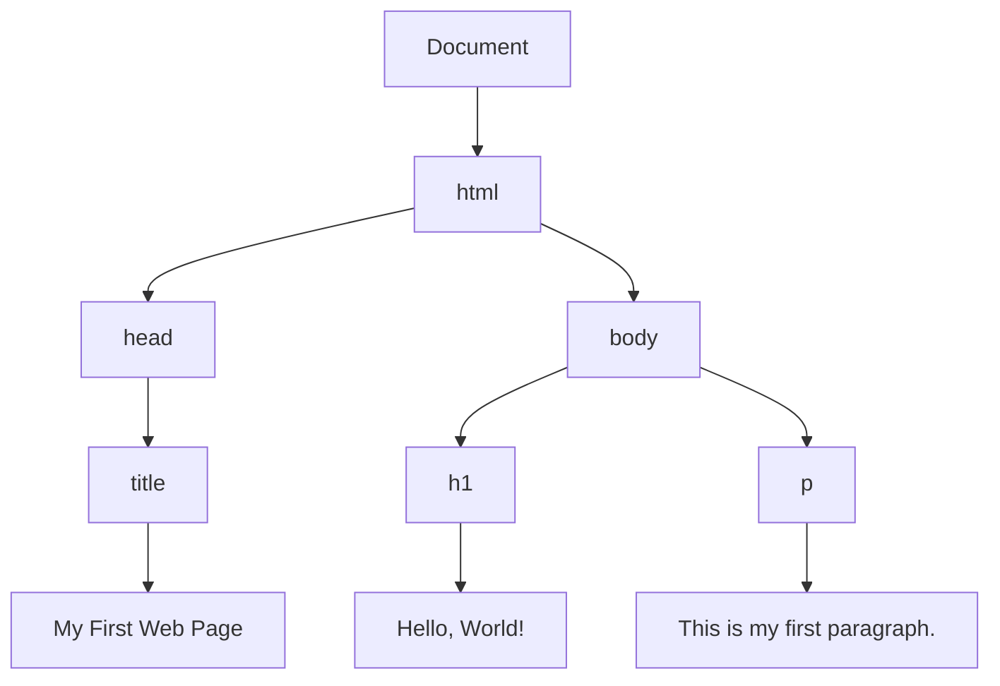
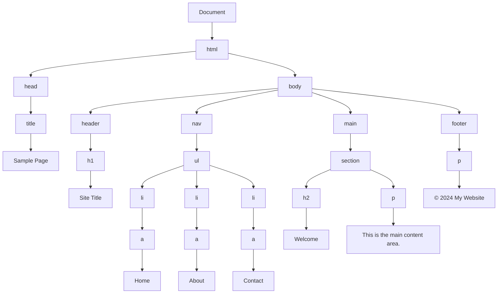

## 8.1 Understanding the DOM Tree

Welcome to the fascinating world of the Document Object Model, or DOM. If you've ever wondered how your web browser takes the HTML code you write and turns it into a beautiful, interactive webpage, the DOM is the answer. In this section, we'll explore what the DOM is, how it works, and why it's a crucial part of web development with JavaScript.

### What is the Document Object Model (DOM)?

The Document Object Model is a programming interface for web documents. It represents the page so that programs can change the document structure, style, and content. The DOM represents the document as a tree of objects. 

#### The Role of the DOM

The DOM is essential because it allows JavaScript to interact with HTML and CSS. When a web page is loaded, the browser creates a DOM of the page. JavaScript can read and manipulate the DOM to change the document structure, style, and content.

### How the Browser Parses HTML into a DOM Tree

When you load a webpage, the browser doesn't just display the HTML code directly. Instead, it parses the HTML and creates a DOM tree, which is a hierarchical representation of the document.

#### Parsing Process

1. **Reading HTML**: The browser reads the HTML file line by line.
2. **Tokenization**: The HTML is broken down into tokens, which are the smallest units of the document.
3. **Tree Construction**: The tokens are used to build a tree structure, where each node represents a part of the document.

Let's visualize this process with a simple HTML example.

```html
<!DOCTYPE html>
<html>
  <head>
    <title>My First Web Page</title>
  </head>
  <body>
    <h1>Hello, World!</h1>
    <p>This is my first paragraph.</p>
  </body>
</html>
```

#### DOM Tree Representation

The above HTML is represented as a DOM tree, which looks something like this:



### Understanding Nodes, Elements, and Text

In the DOM, everything is a node. Nodes are the building blocks of the DOM tree. Let's break down the different types of nodes you'll encounter:

1. **Element Nodes**: These represent HTML elements. For example, `<h1>`, `<p>`, and `<body>` are element nodes.

2. **Text Nodes**: These contain the text content inside an element. For example, "Hello, World!" is a text node inside the `<h1>` element.

3. **Attribute Nodes**: These represent the attributes of HTML elements. For example, `class="header"` would be an attribute node.

4. **Document Node**: This is the topmost node in the DOM tree, representing the entire document.

#### Example: Element and Text Nodes

Consider the following HTML snippet:

```html
<h1 class="header">Welcome to My Site</h1>
```

- The `<h1>` tag is an **element node**.
- The text "Welcome to My Site" is a **text node**.
- The `class="header"` is an **attribute node**.

### The Hierarchical Structure of the DOM

The DOM tree is hierarchical, meaning it has a parent-child relationship. This structure allows you to traverse the DOM and manipulate elements easily.

#### Parent and Child Nodes

- **Parent Node**: An element that contains other elements. For example, `<body>` is the parent of `<h1>` and `<p>`.
- **Child Node**: An element contained within another element. For example, `<h1>` is a child of `<body>`.

#### Sibling Nodes

Nodes that share the same parent are called siblings. For example, `<h1>` and `<p>` are siblings because they are both children of `<body>`.

### Importance of the DOM in Manipulating Web Pages with JavaScript

The DOM is crucial for web development because it allows JavaScript to interact with the webpage. With the DOM, you can:

- **Access Elements**: Use JavaScript to select elements and read their properties.
- **Modify Content**: Change the text or HTML content of an element.
- **Change Styles**: Update the CSS styles of elements dynamically.
- **Respond to Events**: Attach event listeners to elements to respond to user actions like clicks and keypresses.

#### Example: Manipulating the DOM with JavaScript

Let's see a simple example of how JavaScript can manipulate the DOM:

```html
<!DOCTYPE html>
<html>
  <head>
    <title>DOM Manipulation Example</title>
  </head>
  <body>
    <h1 id="greeting">Hello!</h1>
    <button onclick="changeGreeting()">Click Me</button>

    <script>
      function changeGreeting() {
        // Access the h1 element by its ID
        var greetingElement = document.getElementById('greeting');
        
        // Change the text content of the h1 element
        greetingElement.textContent = 'Hello, World!';
      }
    </script>
  </body>
</html>
```

In this example, when you click the button, the text inside the `<h1>` element changes from "Hello!" to "Hello, World!".

### Try It Yourself

Experiment with the above example by changing the text content or adding new elements. Try adding a new paragraph and changing its text when the button is clicked.

### Visualizing the DOM Tree

To better understand the DOM tree, let's visualize a more complex HTML document:

```html
<!DOCTYPE html>
<html>
  <head>
    <title>Sample Page</title>
  </head>
  <body>
    <header>
      <h1>Site Title</h1>
    </header>
    <nav>
      <ul>
        <li><a href="#home">Home</a></li>
        <li><a href="#about">About</a></li>
        <li><a href="#contact">Contact</a></li>
      </ul>
    </nav>
    <main>
      <section>
        <h2>Welcome</h2>
        <p>This is the main content area.</p>
      </section>
    </main>
    <footer>
      <p>&copy; 2024 My Website</p>
    </footer>
  </body>
</html>
```

#### DOM Tree Diagram



### Key Takeaways

- **The DOM is a tree-like structure**: It represents the hierarchical organization of a web page.
- **Nodes are the building blocks**: Everything in the DOM is a node, including elements, text, and attributes.
- **JavaScript interacts with the DOM**: You can use JavaScript to access, modify, and manipulate the DOM to create dynamic web pages.

### Further Reading

For more information on the DOM, consider exploring these resources:

- [MDN Web Docs: Introduction to the DOM](https://developer.mozilla.org/en-US/docs/Web/API/Document_Object_Model/Introduction)
- [W3Schools: The HTML DOM](https://www.w3schools.com/js/js_htmldom.asp)

### Practice Exercise

Try creating your own HTML page and visualize its DOM tree. Use JavaScript to manipulate elements and see how changes reflect in the DOM.

## Quiz Time!



### What is the DOM?

- [x] A programming interface for web documents
- [ ] A type of database for storing web data
- [ ] A CSS framework for styling web pages
- [ ] A JavaScript library for animations

> **Explanation:** The DOM is a programming interface that allows programs to interact with web documents.

### How does the browser parse HTML into a DOM tree?

- [x] By reading HTML, tokenizing it, and constructing a tree
- [ ] By converting HTML directly into CSS
- [ ] By executing JavaScript first
- [ ] By downloading images and scripts

> **Explanation:** The browser reads HTML, breaks it into tokens, and constructs a DOM tree from those tokens.

### What is an element node in the DOM?

- [x] A node representing an HTML element
- [ ] A node containing only text
- [ ] A node representing a CSS style
- [ ] A node that stores JavaScript functions

> **Explanation:** Element nodes represent HTML elements in the DOM tree.

### Which of the following is a text node?

- [x] The text content inside an HTML element
- [ ] An empty HTML element
- [ ] An attribute of an HTML element
- [ ] A JavaScript variable

> **Explanation:** Text nodes contain the text content inside HTML elements.

### What is the parent node of the `<h1>` element in the following HTML?
```html
<body>
  <h1>Title</h1>
</body>
```

- [x] `<body>`
- [ ] `<html>`
- [ ] `<head>`
- [ ] `<title>`

> **Explanation:** The `<body>` element is the parent of the `<h1>` element.

### What is the purpose of the DOM in web development?

- [x] To allow JavaScript to interact with HTML and CSS
- [ ] To store images and videos
- [ ] To compile JavaScript code
- [ ] To design web page layouts

> **Explanation:** The DOM enables JavaScript to interact with and manipulate HTML and CSS.

### How can JavaScript change the text of an element?

- [x] By modifying the `textContent` property
- [ ] By changing the `src` attribute
- [ ] By updating the `href` attribute
- [ ] By altering the `class` attribute

> **Explanation:** JavaScript can change an element's text by modifying its `textContent` property.

### What is a sibling node?

- [x] A node that shares the same parent with another node
- [ ] A node that is a parent of another node
- [ ] A node that contains text
- [ ] A node that is an attribute

> **Explanation:** Sibling nodes share the same parent node in the DOM tree.

### What does the `getElementById()` method do?

- [x] Selects an element by its ID
- [ ] Selects all elements with a specific class
- [ ] Selects elements by their tag name
- [ ] Selects elements by their attribute

> **Explanation:** The `getElementById()` method selects an element with a specific ID.

### True or False: The DOM is only used for JavaScript.

- [ ] True
- [x] False

> **Explanation:** The DOM is used by various programming languages and tools, not just JavaScript, to interact with web documents.


