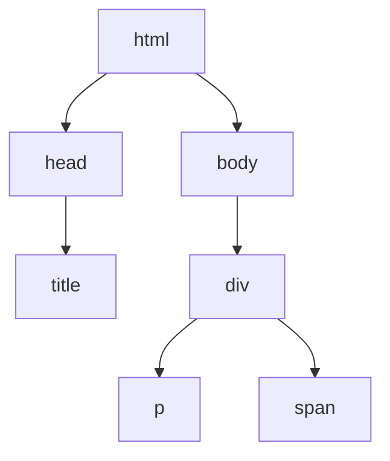

## 8.2 Nodes and Elements

In this section, we will delve into the fascinating world of the Document Object Model (DOM), focusing on nodes and elements. Understanding these concepts is crucial for anyone looking to manipulate web pages dynamically using JavaScript. By the end of this section, you'll have a solid grasp of the different types of nodes, how they relate to each other, and how to interact with them programmatically.

### What is a Node?

In the DOM, everything is a node. A node is the basic building block of the DOM tree, which represents the structure of an HTML document. Nodes can be of various types, each serving a specific purpose in the document's hierarchy.

#### Types of Nodes

1. **Element Nodes**: These are the most common type of nodes and represent HTML elements. For example, `<div>`, `<p>`, and `<a>` are all element nodes.

2. **Text Nodes**: These nodes contain the text content within an element. For example, the text "Hello, World!" inside a `<p>` tag is a text node.

3. **Comment Nodes**: These nodes represent comments in the HTML code, which are not displayed on the web page but can be useful for developers.

Let's explore each type of node in more detail.

### Element Nodes

Element nodes are the fundamental components of an HTML document. They represent the tags you use in your HTML code, such as `<div>`, `<span>`, ``, etc. Each element node can have attributes, child nodes, and text content.

#### Example of an Element Node

Consider the following HTML snippet:

```html
<div id="example" class="container">
    <p>Hello, World!</p>
</div>
```

In this example, the `<div>` and `<p>` tags are element nodes. The `<div>` element node has attributes `id` and `class`.

#### Properties and Methods of Element Nodes

Element nodes come with a variety of properties and methods that allow you to interact with them:

- **`element.id`**: Gets or sets the `id` attribute of the element.
- **`element.className`**: Gets or sets the `class` attribute of the element.
- **`element.innerHTML`**: Gets or sets the HTML content inside the element.
- **`element.appendChild()`**: Adds a new child node to the element.
- **`element.removeChild()`**: Removes a child node from the element.

### Text Nodes

Text nodes contain the actual text content of an element. They are always children of element nodes and do not have any child nodes themselves.

#### Example of a Text Node

Using the previous HTML snippet:

```html
<p>Hello, World!</p>
```

The text "Hello, World!" is a text node within the `<p>` element node.

#### Properties and Methods of Text Nodes

Text nodes have fewer properties and methods compared to element nodes:

- **`nodeValue`**: Gets or sets the text content of the node.
- **`textContent`**: Similar to `nodeValue`, but applies to the element node and all its descendants.

### Comment Nodes

Comment nodes represent comments in the HTML code. They are not visible on the web page but can be useful for adding notes or explanations in the code.

#### Example of a Comment Node

```html
<!-- This is a comment -->
```

The text "This is a comment" is a comment node.

#### Properties and Methods of Comment Nodes

Comment nodes have similar properties to text nodes:

- **`nodeValue`**: Gets or sets the comment text.

### Relationships Between Nodes

Nodes in the DOM are organized in a hierarchical structure, forming a tree. Understanding the relationships between nodes is crucial for navigating and manipulating the DOM.

#### Parent, Child, and Sibling Relationships

- **Parent Node**: A node that contains other nodes is called a parent node. For example, in the HTML snippet `<div><p>Hello</p></div>`, the `<div>` is the parent node of the `<p>`.

- **Child Node**: A node contained within another node is called a child node. In the same example, `<p>` is a child node of `<div>`.

- **Sibling Nodes**: Nodes that share the same parent are called sibling nodes. For example, in `<div><p>Hello</p><span>World</span></div>`, `<p>` and `<span>` are sibling nodes.

#### Visualizing the DOM Tree

To better understand the relationships between nodes, let's visualize the DOM tree for the following HTML:

```html
<!DOCTYPE html>
<html>
<head>
    <title>Sample Page</title>
</head>
<body>
    <div>
        <p>Hello, World!</p>
        <span>Welcome to the DOM</span>
    </div>
</body>
</html>
```



In this diagram, you can see how the nodes are related. The `<html>` node is the root, with `<head>` and `<body>` as its children. The `<div>` is a child of `<body>`, and `<p>` and `<span>` are children of `<div>`, making them siblings.

### Properties and Methods of Nodes

Nodes in the DOM have several properties and methods that allow you to interact with them:

- **`nodeName`**: Returns the name of the node (e.g., "DIV" for a `<div>` element).
- **`nodeType`**: Returns the type of the node (e.g., 1 for element nodes, 3 for text nodes).
- **`parentNode`**: Returns the parent node of the current node.
- **`childNodes`**: Returns a collection of child nodes of the current node.
- **`firstChild`**: Returns the first child node of the current node.
- **`lastChild`**: Returns the last child node of the current node.
- **`nextSibling`**: Returns the next sibling node of the current node.
- **`previousSibling`**: Returns the previous sibling node of the current node.

### Inspecting the DOM with Browser Developer Tools

To truly understand and manipulate the DOM, it's essential to get hands-on experience. Most modern browsers come with developer tools that allow you to inspect and interact with the DOM.

#### How to Inspect the DOM

1. **Open Developer Tools**: Right-click on any web page and select "Inspect" or press `Ctrl + Shift + I` (Windows) or `Cmd + Option + I` (Mac) to open the developer tools.

2. **Navigate to the Elements Tab**: This tab displays the DOM structure of the current page. You can expand and collapse nodes to see their children and attributes.

3. **Inspect Elements**: Hover over elements in the DOM tree to highlight them on the page. This helps you understand how the HTML structure corresponds to the visual layout.

4. **Edit HTML and CSS**: You can make temporary changes to the HTML and CSS directly in the developer tools to see how they affect the page.

### Try It Yourself

Now that you have a basic understanding of nodes and elements, let's try a simple exercise. Open your browser's developer tools and inspect the DOM of a web page. Try the following:

- Identify an element node and its attributes.
- Find a text node and modify its content.
- Locate a comment node and read its text.
- Use the `console` tab to run JavaScript commands that interact with the DOM, such as `document.getElementById('example').innerHTML = 'New Content';`.

### Practice Exercise

To reinforce your understanding, try creating a simple HTML page with the following structure:

```html
<!DOCTYPE html>
<html>
<head>
    <title>Practice Page</title>
</head>
<body>
    <h1>My First Web Page</h1>
    <p>This is a paragraph.</p>
    <!-- This is a comment -->
    <div>
        <span>Some text here.</span>
    </div>
</body>
</html>
```

- Use the developer tools to inspect the DOM tree.
- Identify the parent, child, and sibling relationships.
- Modify the text content of the `<p>` element using JavaScript.

### Summary

In this section, we've explored the different types of nodes in the DOM, including element nodes, text nodes, and comment nodes. We've learned how these nodes relate to each other in a hierarchical structure and how to interact with them using JavaScript. By practicing with browser developer tools, you can gain a deeper understanding of how the DOM works and how to manipulate it to create dynamic web pages.

### Further Reading

For more information on the DOM and its nodes, check out the following resources:

- [MDN Web Docs: Introduction to the DOM](https://developer.mozilla.org/en-US/docs/Web/API/Document_Object_Model/Introduction)
- [W3Schools: HTML DOM Nodes](https://www.w3schools.com/js/js_htmldom_nodes.asp)

## Quiz Time!



### What is a node in the DOM?

- [x] A basic building block of the DOM tree
- [ ] A type of CSS selector
- [ ] A JavaScript function
- [ ] An HTML attribute

> **Explanation:** A node is the basic building block of the DOM tree, representing elements, text, comments, etc.

### Which of the following is an example of an element node?

- [x] `<div>`
- [ ] "Hello, World!"
- [ ] <!-- This is a comment -->
- [ ] `document.getElementById()`

> **Explanation:** `<div>` is an HTML element and thus an element node.

### What property would you use to get the text content of a text node?

- [x] `nodeValue`
- [ ] `innerHTML`
- [ ] `className`
- [ ] `id`

> **Explanation:** `nodeValue` is used to get or set the text content of a text node.

### Which method would you use to add a new child node to an element?

- [x] `appendChild()`
- [ ] `removeChild()`
- [ ] `getElementById()`
- [ ] `querySelector()`

> **Explanation:** `appendChild()` is used to add a new child node to an element.

### What is the relationship between two nodes that share the same parent?

- [x] Sibling nodes
- [ ] Parent nodes
- [ ] Child nodes
- [ ] Ancestor nodes

> **Explanation:** Nodes that share the same parent are called sibling nodes.

### How can you inspect the DOM of a web page?

- [x] Use the browser's developer tools
- [ ] Use a text editor
- [ ] Use a CSS framework
- [ ] Use a JavaScript library

> **Explanation:** The browser's developer tools allow you to inspect and interact with the DOM.

### What is the `nodeType` value for an element node?

- [x] 1
- [ ] 2
- [ ] 3
- [ ] 4

> **Explanation:** The `nodeType` value for an element node is 1.

### What does the `childNodes` property return?

- [x] A collection of child nodes
- [ ] The parent node
- [ ] The next sibling node
- [ ] The previous sibling node

> **Explanation:** The `childNodes` property returns a collection of child nodes of the current node.

### Which of the following is NOT a type of node in the DOM?

- [ ] Element node
- [ ] Text node
- [ ] Comment node
- [x] Style node

> **Explanation:** There is no "style node" type in the DOM.

### True or False: Comment nodes are visible on the web page.

- [ ] True
- [x] False

> **Explanation:** Comment nodes are not visible on the web page; they are used for adding notes in the code.


