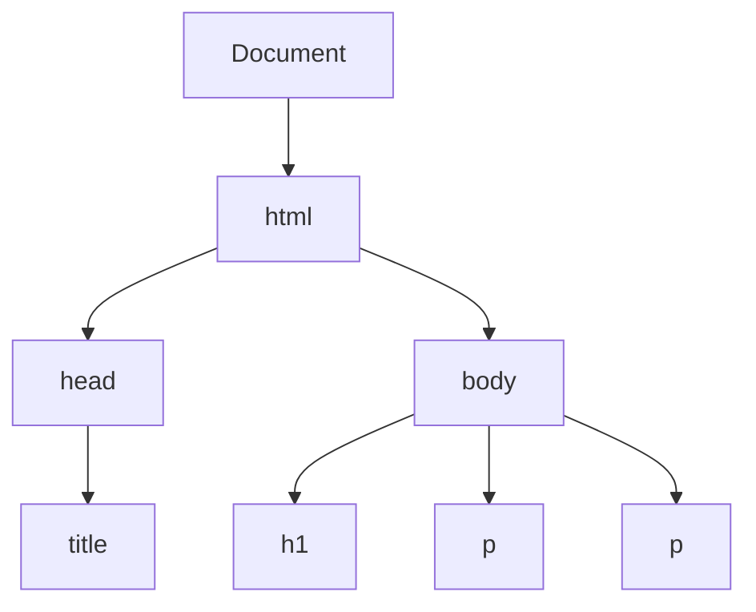

## 8.3 Accessing the DOM with JavaScript

In this section, we will explore how to access and manipulate the Document Object Model (DOM) using JavaScript. Understanding how to interact with the DOM is crucial for creating dynamic and interactive web pages. Let's dive into the world of DOM manipulation and learn how to select and modify elements on a web page using JavaScript.

### Introduction to the `document` Object

The `document` object is your gateway to the DOM. It represents the entire HTML document and provides various methods and properties to access and manipulate the elements within it. Think of the `document` object as the root of the DOM tree, from which you can traverse and interact with all the nodes (elements) on the page.

Here's a simple example of how you can use the `document` object to access the title of your web page:

```javascript
// Accessing the title of the document
console.log(document.title);
```

This code will log the title of the current HTML document to the console. The `document` object is a powerful tool that allows you to interact with every part of your web page.

### Selecting Elements with `getElementById()`

One of the most common methods for accessing DOM elements is `getElementById()`. This method allows you to select a single element by its unique `id` attribute. It's a straightforward and efficient way to target specific elements for manipulation.

#### Example: Selecting an Element by ID

Consider the following HTML snippet:

```html
<!DOCTYPE html>
<html lang="en">
<head>
    <meta charset="UTF-8">
    <title>My Web Page</title>
</head>
<body>
    <h1 id="main-heading">Welcome to My Web Page</h1>
    <p>This is a simple paragraph.</p>
</body>
</html>
```

To select the `<h1>` element with the `id` of `main-heading`, you can use the following JavaScript code:

```javascript
// Selecting the element with id 'main-heading'
var mainHeading = document.getElementById('main-heading');
console.log(mainHeading); // Logs the <h1> element to the console
```

#### Importance of Accurate Selection

Accurate selection of elements is crucial for effective DOM manipulation. If you attempt to select an element that doesn't exist or use an incorrect `id`, your JavaScript code will not work as expected. Always double-check your HTML to ensure that the `id` attributes match those used in your JavaScript code.

### Selecting Elements with `getElementsByClassName()`

The `getElementsByClassName()` method allows you to select multiple elements that share the same class name. This method returns a live HTMLCollection, which is an array-like object containing all elements with the specified class.

#### Example: Selecting Elements by Class Name

Consider the following HTML snippet:

```html
<!DOCTYPE html>
<html lang="en">
<head>
    <meta charset="UTF-8">
    <title>My Web Page</title>
</head>
<body>
    <p class="text">This is the first paragraph.</p>
    <p class="text">This is the second paragraph.</p>
    <p>This paragraph has no class.</p>
</body>
</html>
```

To select all `<p>` elements with the class `text`, use the following JavaScript code:

```javascript
// Selecting elements with class 'text'
var textElements = document.getElementsByClassName('text');
console.log(textElements); // Logs an HTMLCollection of <p> elements
```

#### Working with HTMLCollection

An HTMLCollection is similar to an array, but it is not an actual array. You can access elements using an index, but it lacks array methods like `forEach()`. To iterate over an HTMLCollection, you can use a `for` loop:

```javascript
// Iterating over the HTMLCollection
for (var i = 0; i < textElements.length; i++) {
    console.log(textElements[i]); // Logs each <p> element with class 'text'
}
```

### Selecting Elements with `getElementsByTagName()`

The `getElementsByTagName()` method allows you to select all elements with a specific tag name. This method also returns an HTMLCollection containing all elements with the specified tag.

#### Example: Selecting Elements by Tag Name

Consider the following HTML snippet:

```html
<!DOCTYPE html>
<html lang="en">
<head>
    <meta charset="UTF-8">
    <title>My Web Page</title>
</head>
<body>
    <h1>Welcome to My Web Page</h1>
    <p>This is the first paragraph.</p>
    <p>This is the second paragraph.</p>
</body>
</html>
```

To select all `<p>` elements, use the following JavaScript code:

```javascript
// Selecting all <p> elements
var paragraphs = document.getElementsByTagName('p');
console.log(paragraphs); // Logs an HTMLCollection of <p> elements
```

#### Iterating Over HTMLCollection

Just like with `getElementsByClassName()`, you can iterate over the HTMLCollection returned by `getElementsByTagName()` using a `for` loop:

```javascript
// Iterating over the HTMLCollection
for (var i = 0; i < paragraphs.length; i++) {
    console.log(paragraphs[i]); // Logs each <p> element
}
```

### Practical Example: Manipulating Selected Elements

Now that we've learned how to select elements using different methods, let's see how we can manipulate them. We'll change the text content of selected elements to demonstrate DOM manipulation.

#### Example: Changing Text Content

Consider the following HTML snippet:

```html
<!DOCTYPE html>
<html lang="en">
<head>
    <meta charset="UTF-8">
    <title>My Web Page</title>
</head>
<body>
    <h1 id="main-heading">Welcome to My Web Page</h1>
    <p class="text">This is the first paragraph.</p>
    <p class="text">This is the second paragraph.</p>
</body>
</html>
```

Let's change the text content of the `<h1>` element and all `<p>` elements with the class `text`:

```javascript
// Changing the text content of the <h1> element
var mainHeading = document.getElementById('main-heading');
mainHeading.textContent = 'Hello, World!';

// Changing the text content of all <p> elements with class 'text'
var textElements = document.getElementsByClassName('text');
for (var i = 0; i < textElements.length; i++) {
    textElements[i].textContent = 'This text has been changed!';
}
```

### Encouraging Practice

To become proficient in DOM manipulation, practice selecting and manipulating different elements on a web page. Try using different selection methods and experiment with changing element attributes, styles, and text content.

### Try It Yourself

Here's a simple exercise to reinforce what you've learned:

1. Create an HTML page with a few elements, including headings, paragraphs, and a list.
2. Use JavaScript to select these elements using different methods (`getElementById()`, `getElementsByClassName()`, `getElementsByTagName()`).
3. Change the text content, styles, or attributes of the selected elements.
4. Log the changes to the console to verify your code works as expected.

### Visualizing the DOM

To better understand how the DOM is structured, let's visualize it using a diagram. Below is a simple representation of a DOM tree for a basic HTML document:



**Diagram Description:** This diagram represents a simple DOM tree structure. The `Document` is the root node, with `html` as its child. The `html` node has two children: `head` and `body`. The `head` node contains the `title`, while the `body` node contains an `h1` element and two `p` elements.

### Summary

In this section, we've explored how to access the DOM using JavaScript. We introduced the `document` object as the entry point to the DOM and demonstrated how to select elements using methods like `getElementById()`, `getElementsByClassName()`, and `getElementsByTagName()`. We also emphasized the importance of accurate element selection and encouraged practicing with different methods.

By understanding how to access and manipulate the DOM, you can create dynamic and interactive web pages that respond to user actions. Keep practicing and experimenting with different DOM manipulation techniques to enhance your skills.

## Quiz Time!



### What is the `document` object in JavaScript?

- [x] It represents the entire HTML document and provides methods to access elements.
- [ ] It is a method to select elements by class name.
- [ ] It is used to create new HTML elements.
- [ ] It is a CSS property for styling elements.

> **Explanation:** The `document` object is the entry point to the DOM and represents the entire HTML document, allowing access to its elements.

### Which method is used to select an element by its unique ID?

- [x] `getElementById()`
- [ ] `getElementsByClassName()`
- [ ] `getElementsByTagName()`
- [ ] `querySelector()`

> **Explanation:** `getElementById()` is used to select a single element by its unique `id` attribute.

### What does `getElementsByClassName()` return?

- [x] An HTMLCollection of elements with the specified class.
- [ ] A single element with the specified class.
- [ ] A NodeList of elements with the specified class.
- [ ] A string containing the class name.

> **Explanation:** `getElementsByClassName()` returns an HTMLCollection, which is an array-like object containing all elements with the specified class.

### How can you iterate over an HTMLCollection?

- [x] Using a `for` loop.
- [ ] Using the `forEach()` method.
- [ ] Using the `map()` method.
- [ ] Using a `while` loop.

> **Explanation:** HTMLCollection is an array-like object, and you can iterate over it using a `for` loop.

### Which method is used to select all elements with a specific tag name?

- [x] `getElementsByTagName()`
- [ ] `getElementById()`
- [ ] `getElementsByClassName()`
- [ ] `querySelectorAll()`

> **Explanation:** `getElementsByTagName()` is used to select all elements with a specific tag name.

### What is the result of calling `getElementById()` with a non-existent ID?

- [x] `null`
- [ ] An empty string
- [ ] An empty array
- [ ] An error is thrown

> **Explanation:** If `getElementById()` is called with a non-existent ID, it returns `null`.

### Which method would you use to select multiple elements with the same class?

- [x] `getElementsByClassName()`
- [ ] `getElementById()`
- [ ] `getElementsByTagName()`
- [ ] `querySelector()`

> **Explanation:** `getElementsByClassName()` is used to select multiple elements that share the same class name.

### What does the `textContent` property do?

- [x] It sets or returns the text content of an element.
- [ ] It sets or returns the HTML content of an element.
- [ ] It sets or returns the CSS styles of an element.
- [ ] It sets or returns the ID of an element.

> **Explanation:** The `textContent` property is used to set or return the text content of an element.

### What is the purpose of the `document` object in JavaScript?

- [x] To provide access to the DOM and allow manipulation of HTML elements.
- [ ] To style elements using CSS.
- [ ] To create new HTML elements.
- [ ] To handle user events.

> **Explanation:** The `document` object provides access to the DOM and allows manipulation of HTML elements.

### True or False: `getElementsByTagName()` returns a single element.

- [ ] True
- [x] False

> **Explanation:** `getElementsByTagName()` returns an HTMLCollection of all elements with the specified tag name, not a single element.


