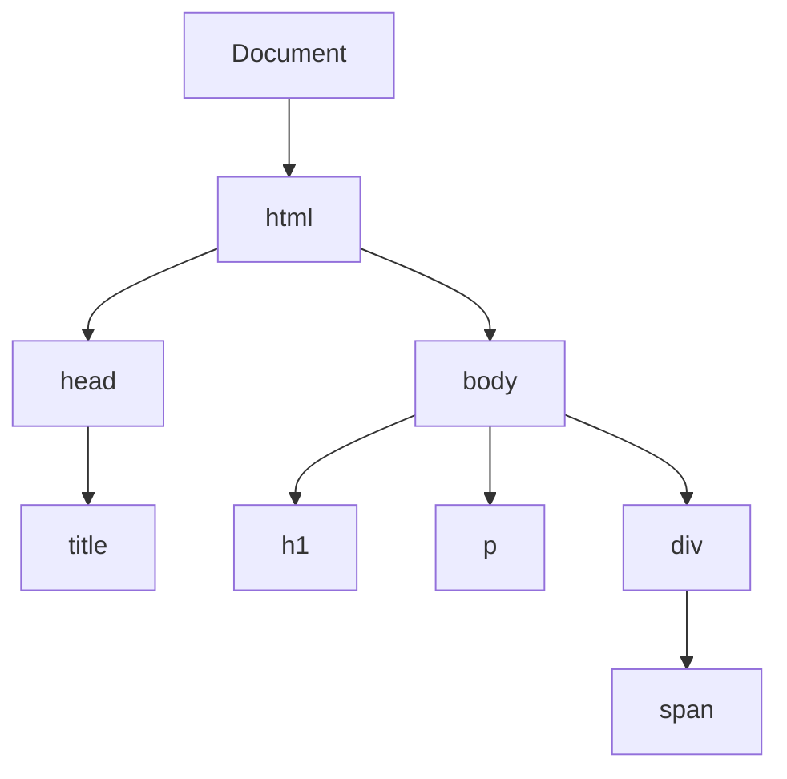

## 8.4 Traversing the DOM

Welcome to the fascinating world of DOM traversal! In this section, we will explore how to navigate the Document Object Model (DOM) using JavaScript. Understanding how to traverse the DOM is crucial for manipulating web pages dynamically and creating interactive user experiences. We will cover various properties and methods that allow you to move between nodes in the DOM hierarchy. By the end of this section, you'll be equipped with the knowledge to navigate and manipulate the DOM with confidence.

### Understanding the DOM Hierarchy

Before we dive into the specifics of DOM traversal, let's take a moment to understand the structure of the DOM. The DOM represents the structure of a web page as a tree of nodes. Each element in the HTML document corresponds to a node in the DOM tree. Here's a simple representation of a DOM tree:



In this diagram, the `<html>` element is the root node, and it has two children: `<head>` and `<body>`. The `<body>` element further contains `<h1>`, `<p>`, and `<div>`, with `<div>` having a child `<span>`. This hierarchical structure allows us to traverse between nodes using various properties and methods.

### Key Properties for DOM Traversal

To navigate the DOM, JavaScript provides several properties that allow you to move between nodes. Let's explore these properties in detail:

#### `parentNode`

The `parentNode` property allows you to access the parent node of a given element. This is useful when you need to move up the DOM tree.

```javascript
let element = document.querySelector('span');
let parent = element.parentNode;
console.log(parent); // Outputs: <div>...</div>
```

In this example, we select the `<span>` element and use `parentNode` to access its parent, which is the `<div>` element.

#### `childNodes`

The `childNodes` property returns a NodeList of all child nodes of a given element, including text nodes and comment nodes.

```javascript
let element = document.querySelector('div');
let children = element.childNodes;
children.forEach(child => console.log(child));
```

This code snippet selects the `<div>` element and logs all its child nodes. Note that `childNodes` includes all types of nodes, not just element nodes.

#### `firstChild` and `lastChild`

The `firstChild` and `lastChild` properties allow you to access the first and last child nodes of an element, respectively.

```javascript
let element = document.querySelector('div');
let first = element.firstChild;
let last = element.lastChild;
console.log(first); // Outputs: #text (if there's whitespace)
console.log(last);  // Outputs: <span>...</span>
```

These properties are useful for quickly accessing the first or last child node without iterating through all children.

#### `nextSibling` and `previousSibling`

The `nextSibling` and `previousSibling` properties let you navigate between sibling nodes.

```javascript
let element = document.querySelector('h1');
let next = element.nextSibling;
let previous = element.previousSibling;
console.log(next); // Outputs: #text (if there's whitespace)
console.log(previous); // Outputs: null (if <h1> is the first child)
```

These properties are handy for moving horizontally across nodes at the same level in the DOM tree.

### Moving Between Nodes: Practical Examples

Let's put these properties into practice with some examples that demonstrate moving between nodes in the DOM.

#### Example 1: Accessing Parent and Children

```javascript
let element = document.querySelector('span');
let parent = element.parentNode;
let children = parent.childNodes;

console.log('Parent:', parent); // Outputs: <div>...</div>
children.forEach(child => console.log('Child:', child));
```

In this example, we start with the `<span>` element, access its parent `<div>`, and then log all child nodes of the `<div>`.

#### Example 2: Navigating Siblings

```javascript
let element = document.querySelector('h1');
let next = element.nextSibling;
let previous = element.previousSibling;

console.log('Next Sibling:', next); // Outputs: #text or <p>...</p>
console.log('Previous Sibling:', previous); // Outputs: null or #text
```

Here, we navigate from the `<h1>` element to its next and previous siblings, demonstrating horizontal movement in the DOM.

### `childNodes` vs. `children`

It's important to understand the difference between `childNodes` and `children`. While both properties return a list of child nodes, they differ in what they include:

- **`childNodes`**: Returns a NodeList of all child nodes, including text nodes, comment nodes, and element nodes.
- **`children`**: Returns an HTMLCollection of only element nodes, excluding text and comment nodes.

Here's an example to illustrate the difference:

```javascript
let element = document.querySelector('div');
let childNodes = element.childNodes;
let children = element.children;

console.log('childNodes:', childNodes); // Includes text nodes
console.log('children:', children); // Only element nodes
```

In this example, `childNodes` will include all types of nodes, while `children` will only include the `<span>` element.

### Caution When Traversing Nodes

When traversing the DOM, it's important to be cautious to avoid errors. Here are some tips to keep in mind:

- **Check for null values**: When using properties like `parentNode`, `nextSibling`, or `previousSibling`, always check if the returned value is `null` to avoid runtime errors.
- **Be aware of whitespace**: Text nodes created by whitespace can affect traversal. Use `children` instead of `childNodes` if you want to exclude text nodes.
- **Use `querySelector` wisely**: When selecting elements, ensure your selectors are specific enough to target the intended nodes.

### Encouraging Exploration: Try It Yourself

To truly understand DOM traversal, it's important to experiment with the properties and methods we've discussed. Here are some suggestions for further exploration:

- **Modify the DOM**: Try adding, removing, or rearranging nodes using traversal properties.
- **Create a navigation script**: Write a script that logs the entire DOM tree structure by traversing from the root node.
- **Experiment with different selectors**: Use `querySelector` and `querySelectorAll` to select nodes and traverse them.

### Summary

In this section, we've explored the essential properties for traversing the DOM, including `parentNode`, `childNodes`, `firstChild`, `lastChild`, `nextSibling`, and `previousSibling`. We've also discussed the difference between `childNodes` and `children` and emphasized the importance of caution when traversing nodes. By understanding these concepts, you can effectively navigate and manipulate the DOM to create dynamic and interactive web pages.

### Further Reading

For more information on DOM traversal and manipulation, check out these resources:

- [MDN Web Docs: Traversing an HTML Table with JavaScript and DOM Interfaces](https://developer.mozilla.org/en-US/docs/Web/API/Document_Object_Model/Traversing_an_HTML_table_with_JavaScript_and_DOM_Interfaces)
- [W3Schools: JavaScript HTML DOM Navigation](https://www.w3schools.com/js/js_htmldom_navigation.asp)

## Quiz Time!



### Which property allows you to access the parent node of an element?

- [x] parentNode
- [ ] childNodes
- [ ] firstChild
- [ ] nextSibling

> **Explanation:** The `parentNode` property is used to access the parent node of a given element.

### What does the `childNodes` property return?

- [x] A NodeList of all child nodes, including text nodes
- [ ] An HTMLCollection of only element nodes
- [ ] A single child node
- [ ] The parent node

> **Explanation:** The `childNodes` property returns a NodeList of all child nodes, including text nodes, comment nodes, and element nodes.

### How can you access the first child node of an element?

- [x] Using the `firstChild` property
- [ ] Using the `lastChild` property
- [ ] Using the `parentNode` property
- [ ] Using the `nextSibling` property

> **Explanation:** The `firstChild` property is used to access the first child node of an element.

### What is the difference between `childNodes` and `children`?

- [x] `childNodes` includes all node types, `children` includes only element nodes
- [ ] `childNodes` includes only element nodes, `children` includes all node types
- [ ] `childNodes` and `children` are the same
- [ ] `childNodes` includes only text nodes, `children` includes only element nodes

> **Explanation:** `childNodes` includes all node types (element, text, comment), while `children` includes only element nodes.

### Which property is used to navigate to the next sibling node?

- [x] nextSibling
- [ ] previousSibling
- [ ] parentNode
- [ ] childNodes

> **Explanation:** The `nextSibling` property is used to navigate to the next sibling node of a given element.

### What should you be cautious of when using `nextSibling` and `previousSibling`?

- [x] They may return text nodes created by whitespace
- [ ] They only work with element nodes
- [ ] They always return null
- [ ] They are deprecated

> **Explanation:** `nextSibling` and `previousSibling` may return text nodes created by whitespace, so it's important to be aware of this when traversing nodes.

### How can you access the last child node of an element?

- [x] Using the `lastChild` property
- [ ] Using the `firstChild` property
- [ ] Using the `parentNode` property
- [ ] Using the `nextSibling` property

> **Explanation:** The `lastChild` property is used to access the last child node of an element.

### What does the `children` property return?

- [x] An HTMLCollection of only element nodes
- [ ] A NodeList of all child nodes, including text nodes
- [ ] A single child node
- [ ] The parent node

> **Explanation:** The `children` property returns an HTMLCollection of only element nodes, excluding text and comment nodes.

### Which property allows you to navigate to the previous sibling node?

- [x] previousSibling
- [ ] nextSibling
- [ ] parentNode
- [ ] childNodes

> **Explanation:** The `previousSibling` property is used to navigate to the previous sibling node of a given element.

### True or False: The `parentNode` property can return null.

- [x] True
- [ ] False

> **Explanation:** The `parentNode` property can return null if the element has no parent, such as the root node of the document.


