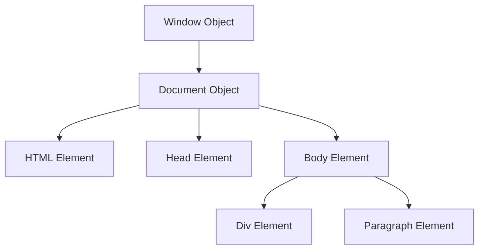

## 8.5 The Role of the Window and Document Objects

In the journey of building your first web page with JavaScript, understanding the `window` and `document` objects is crucial. These objects form the backbone of how JavaScript interacts with the web browser and the web page's content. Let's dive into these concepts and explore how they enable dynamic and interactive web experiences.

### Understanding the `window` Object

The `window` object is the global object in the browser environment. It represents the browser window or tab and serves as the top-level object for JavaScript execution. Every global variable or function is a property or method of the `window` object.

#### Key Properties and Methods of the `window` Object

The `window` object provides numerous properties and methods that allow you to interact with the browser environment. Here are some key ones:

- **`window.innerWidth` and `window.innerHeight`**: These properties return the width and height of the window's content area, respectively, in pixels. They are useful for responsive design.

  ```javascript
  console.log(window.innerWidth); // Outputs the width of the browser window
  console.log(window.innerHeight); // Outputs the height of the browser window
  ```

- **`window.alert()`**: This method displays an alert dialog with a specified message and an OK button.

  ```javascript
  window.alert("Hello, World!");
  ```

- **`window.confirm()`**: Displays a dialog with a specified message, along with OK and Cancel buttons. Returns `true` if OK is clicked, and `false` otherwise.

  ```javascript
  let userConfirmed = window.confirm("Do you want to proceed?");
  console.log(userConfirmed); // Outputs true or false
  ```

- **`window.prompt()`**: Displays a dialog with a text input field, allowing the user to enter a value.

  ```javascript
  let userName = window.prompt("Enter your name:");
  console.log(userName); // Outputs the entered name
  ```

- **`window.open()`**: Opens a new browser window or tab with a specified URL.

  ```javascript
  window.open("https://www.example.com", "_blank");
  ```

- **`window.setTimeout()` and `window.setInterval()`**: These methods allow you to execute code after a delay or at regular intervals, respectively.

  ```javascript
  window.setTimeout(() => {
    console.log("This message appears after 2 seconds");
  }, 2000);

  let intervalId = window.setInterval(() => {
    console.log("This message appears every 3 seconds");
  }, 3000);
  ```

- **`window.location`**: Provides information about the current URL and allows you to redirect the browser to a new URL.

  ```javascript
  console.log(window.location.href); // Outputs the current URL
  window.location.href = "https://www.example.com"; // Redirects to a new URL
  ```

#### The Global Scope and the `window` Object

In the browser environment, the `window` object is synonymous with the global scope. This means that any variable or function declared globally is actually a property or method of the `window` object. For example:

```javascript
var globalVariable = "I'm global!";
console.log(window.globalVariable); // Outputs: I'm global!
```

### Introducing the `document` Object

The `document` object is a property of the `window` object and represents the HTML document loaded in the window. It serves as the entry point for accessing and manipulating the content of the web page.

#### Key Properties and Methods of the `document` Object

The `document` object provides a wide range of properties and methods to interact with the DOM:

- **`document.title`**: Represents the title of the document, as specified in the `<title>` element.

  ```javascript
  console.log(document.title); // Outputs the title of the document
  ```

- **`document.body`**: Provides access to the `<body>` element of the document.

  ```javascript
  console.log(document.body); // Outputs the body element
  ```

- **`document.getElementById()`**: Returns the element with the specified ID.

  ```javascript
  let element = document.getElementById("myElement");
  console.log(element); // Outputs the element with ID 'myElement'
  ```

- **`document.getElementsByClassName()`**: Returns a collection of elements with the specified class name.

  ```javascript
  let elements = document.getElementsByClassName("myClass");
  console.log(elements); // Outputs a collection of elements with class 'myClass'
  ```

- **`document.getElementsByTagName()`**: Returns a collection of elements with the specified tag name.

  ```javascript
  let paragraphs = document.getElementsByTagName("p");
  console.log(paragraphs); // Outputs a collection of <p> elements
  ```

- **`document.querySelector()` and `document.querySelectorAll()`**: Allow you to select elements using CSS selectors.

  ```javascript
  let firstParagraph = document.querySelector("p");
  console.log(firstParagraph); // Outputs the first <p> element

  let allParagraphs = document.querySelectorAll("p");
  console.log(allParagraphs); // Outputs all <p> elements
  ```

- **`document.createElement()`**: Creates a new element of the specified type.

  ```javascript
  let newDiv = document.createElement("div");
  console.log(newDiv); // Outputs a new <div> element
  ```

- **`document.createTextNode()`**: Creates a new text node.

  ```javascript
  let textNode = document.createTextNode("Hello, World!");
  console.log(textNode); // Outputs a text node with the specified text
  ```

#### The Relationship Between `window`, `document`, and the DOM

The `window` and `document` objects are integral to the Document Object Model (DOM), which represents the structure of a web page as a tree of nodes. The `window` object provides a global context for JavaScript execution, while the `document` object allows you to access and manipulate the content of the page.

Below is a visual representation of the relationship between `window`, `document`, and the DOM:



In this diagram, the `window` object contains the `document` object, which in turn contains the various elements of the web page, such as `<html>`, `<head>`, `<body>`, and their child elements.

### Accessing and Manipulating the DOM

Let's explore some practical examples of how you can use the `window` and `document` objects to interact with the DOM and create dynamic web pages.

#### Example 1: Changing the Document Title

You can use the `document.title` property to change the title of the web page dynamically:

```javascript
document.title = "New Page Title";
console.log(document.title); // Outputs: New Page Title
```

#### Example 2: Creating and Appending Elements

You can create new elements and append them to the DOM using the `document.createElement()` and `appendChild()` methods:

```javascript
// Create a new paragraph element
let newParagraph = document.createElement("p");

// Create a text node with some content
let paragraphContent = document.createTextNode("This is a new paragraph.");

// Append the text node to the paragraph element
newParagraph.appendChild(paragraphContent);

// Append the paragraph element to the body
document.body.appendChild(newParagraph);
```

#### Example 3: Modifying Element Styles

You can change the styles of elements directly using the `style` property:

```javascript
let myElement = document.getElementById("myElement");
myElement.style.color = "blue"; // Changes the text color to blue
myElement.style.fontSize = "20px"; // Changes the font size to 20px
```

### Try It Yourself

Now that we've covered the basics, it's time for you to experiment. Try modifying the examples above to see how they work. Here are some suggestions:

- Change the document title to something unique.
- Create a new element and add it to a specific part of the page.
- Modify the styles of an element to match your personal preferences.

### Summary

In this section, we've explored the roles of the `window` and `document` objects in JavaScript. We've learned that the `window` object represents the global context of the browser, while the `document` object provides access to the content of the web page. Together, they allow us to interact with the DOM and create dynamic, interactive web pages.

### Further Reading

For more information on the `window` and `document` objects, check out these resources:

- [MDN Web Docs: Window](https://developer.mozilla.org/en-US/docs/Web/API/Window)
- [MDN Web Docs: Document](https://developer.mozilla.org/en-US/docs/Web/API/Document)
- [W3Schools: JavaScript Window](https://www.w3schools.com/js/js_window.asp)
- [W3Schools: JavaScript HTML DOM](https://www.w3schools.com/js/js_htmldom.asp)

## Quiz Time!



### What does the `window` object represent in the browser environment?

- [x] The global object representing the browser window or tab
- [ ] The HTML document loaded in the window
- [ ] A specific element within the DOM
- [ ] The CSS styles applied to elements

> **Explanation:** The `window` object is the global object in the browser environment, representing the browser window or tab.

### Which method of the `window` object displays an alert dialog with a message?

- [x] `window.alert()`
- [ ] `window.prompt()`
- [ ] `window.confirm()`
- [ ] `window.open()`

> **Explanation:** The `window.alert()` method displays an alert dialog with a specified message and an OK button.

### What does the `document` object represent?

- [x] The HTML document loaded in the window
- [ ] The global object representing the browser window or tab
- [ ] A specific element within the DOM
- [ ] The CSS styles applied to elements

> **Explanation:** The `document` object represents the HTML document loaded in the window and allows access to its content.

### How can you change the title of a document using JavaScript?

- [x] `document.title = "New Title";`
- [ ] `window.title = "New Title";`
- [ ] `document.setTitle("New Title");`
- [ ] `window.setTitle("New Title");`

> **Explanation:** You can change the title of a document by setting the `document.title` property to a new value.

### Which method allows you to create a new HTML element?

- [x] `document.createElement()`
- [ ] `document.getElementById()`
- [ ] `document.querySelector()`
- [ ] `document.appendChild()`

> **Explanation:** The `document.createElement()` method allows you to create a new HTML element.

### What is the relationship between the `window` and `document` objects?

- [x] The `document` object is a property of the `window` object
- [ ] The `window` object is a property of the `document` object
- [ ] They are unrelated objects
- [ ] They are the same object

> **Explanation:** The `document` object is a property of the `window` object, representing the HTML document loaded in the window.

### Which property of the `window` object provides information about the current URL?

- [x] `window.location`
- [ ] `window.href`
- [ ] `window.url`
- [ ] `window.currentUrl`

> **Explanation:** The `window.location` property provides information about the current URL and allows redirection.

### How can you select an element by its ID using JavaScript?

- [x] `document.getElementById("myId")`
- [ ] `document.getElementsByClassName("myId")`
- [ ] `document.querySelectorAll("#myId")`
- [ ] `document.getElementByTagName("myId")`

> **Explanation:** You can select an element by its ID using the `document.getElementById()` method.

### What does the `window.setInterval()` method do?

- [x] Executes code at regular intervals
- [ ] Executes code after a delay
- [ ] Displays an alert dialog
- [ ] Opens a new browser window

> **Explanation:** The `window.setInterval()` method executes code at regular intervals, specified in milliseconds.

### True or False: The `window` object is synonymous with the global scope in the browser environment.

- [x] True
- [ ] False

> **Explanation:** In the browser environment, the `window` object is synonymous with the global scope, meaning global variables and functions are properties and methods of the `window` object.


