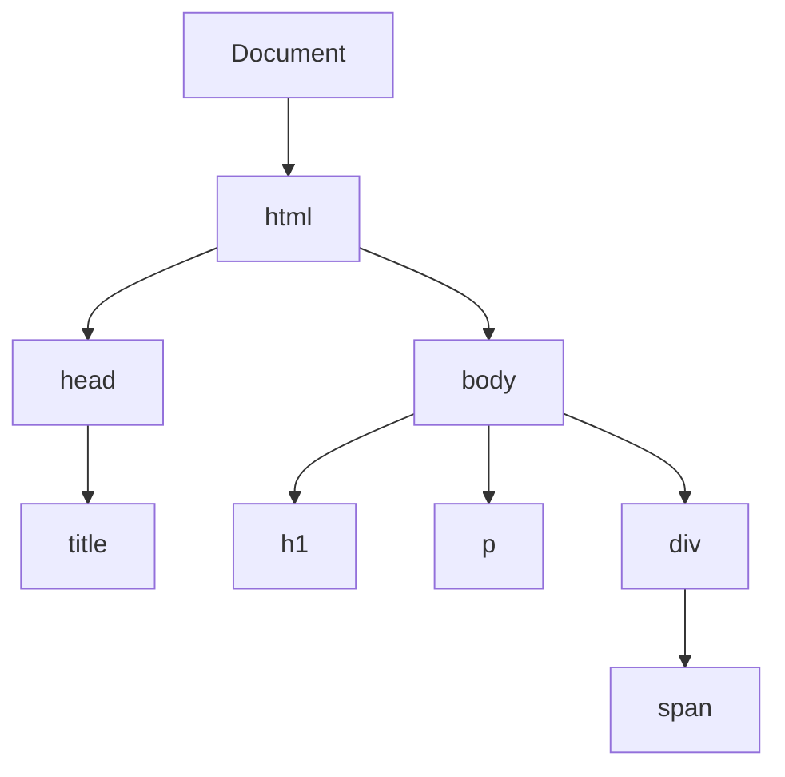

## 9.1 Selecting Elements by ID, Class, and Tag

In this section, we will explore how to access and manipulate elements on a web page using JavaScript. By selecting elements with IDs, classes, and tag names, you can dynamically change the content and style of your web pages. This is a crucial skill for creating interactive and engaging user experiences.

### Understanding the Document Object Model (DOM)

Before we dive into selecting elements, let's briefly revisit the Document Object Model (DOM). The DOM is a programming interface for web documents. It represents the page so that programs can change the document structure, style, and content. The DOM represents the document as a tree of nodes, where each node is an object representing a part of the document.

Here's a simple representation of a DOM tree for a basic HTML document:



In this diagram, each element in the HTML is a node in the tree. The `document` object is the root, and it branches out to `html`, `head`, `body`, and so on.

### Selecting Elements by ID

The most straightforward way to select an element is by its ID. Every HTML element can have an `id` attribute, which must be unique within the document. This uniqueness makes it easy to select a specific element.

#### Using `document.getElementById()`

The `document.getElementById()` method is used to select an element by its ID. It returns the element object representing the first element in the document with the specified ID.

**Example:**

Let's say we have the following HTML:

```html
<!DOCTYPE html>
<html lang="en">
<head>
    <meta charset="UTF-8">
    <meta name="viewport" content="width=device-width, initial-scale=1.0">
    <title>Example Page</title>
</head>
<body>
    <h1 id="main-heading">Welcome to My Website</h1>
    <p>This is a simple paragraph.</p>
</body>
</html>
```

To select the `<h1>` element with the ID `main-heading`, you would use:

```javascript
let heading = document.getElementById('main-heading');
console.log(heading); // Outputs: <h1 id="main-heading">Welcome to My Website</h1>
```

#### Manipulating the Selected Element

Once you have selected an element, you can manipulate it. For example, you can change its text content:

```javascript
heading.innerText = "Hello, World!";
```

This changes the text inside the `<h1>` element to "Hello, World!".

### Selecting Elements by Class

Sometimes, you want to select multiple elements that share the same class. Classes are used to group elements for styling and scripting purposes.

#### Using `document.getElementsByClassName()`

The `document.getElementsByClassName()` method returns a live HTMLCollection of elements with the specified class name. This means that if the document changes, the collection is automatically updated.

**Example:**

Consider the following HTML:

```html
<!DOCTYPE html>
<html lang="en">
<head>
    <meta charset="UTF-8">
    <meta name="viewport" content="width=device-width, initial-scale=1.0">
    <title>Example Page</title>
</head>
<body>
    <div class="content">Content Block 1</div>
    <div class="content">Content Block 2</div>
    <div class="content">Content Block 3</div>
</body>
</html>
```

To select all `<div>` elements with the class `content`, you would use:

```javascript
let contentBlocks = document.getElementsByClassName('content');
console.log(contentBlocks); // Outputs: HTMLCollection of <div> elements
```

#### Manipulating the Selected Elements

You can loop through the HTMLCollection to manipulate each element:

```javascript
for (let i = 0; i < contentBlocks.length; i++) {
    contentBlocks[i].style.color = 'blue';
}
```

This changes the text color of all elements with the class `content` to blue.

### Selecting Elements by Tag Name

Selecting elements by tag name is useful when you want to target all elements of a specific type, such as all paragraphs or all images.

#### Using `document.getElementsByTagName()`

The `document.getElementsByTagName()` method returns a live HTMLCollection of elements with the specified tag name.

**Example:**

Here's some HTML with multiple paragraph elements:

```html
<!DOCTYPE html>
<html lang="en">
<head>
    <meta charset="UTF-8">
    <meta name="viewport" content="width=device-width, initial-scale=1.0">
    <title>Example Page</title>
</head>
<body>
    <p>Paragraph 1</p>
    <p>Paragraph 2</p>
    <p>Paragraph 3</p>
</body>
</html>
```

To select all `<p>` elements, you would use:

```javascript
let paragraphs = document.getElementsByTagName('p');
console.log(paragraphs); // Outputs: HTMLCollection of <p> elements
```

#### Manipulating the Selected Elements

You can iterate over the HTMLCollection to change each paragraph:

```javascript
for (let i = 0; i < paragraphs.length; i++) {
    paragraphs[i].style.fontWeight = 'bold';
}
```

This makes the text in all paragraph elements bold.

### Understanding Return Types: Element vs. HTMLCollection

When selecting elements, it's important to understand the return types:

- **`document.getElementById()`** returns a single element object or `null` if no element with the specified ID exists.
- **`document.getElementsByClassName()`** and **`document.getElementsByTagName()`** return an HTMLCollection, which is a live collection of elements. This means it updates automatically if the document changes.

### Practical Example: Manipulating a Web Page

Let's put this all together in a practical example. We'll create a simple web page and use JavaScript to manipulate its elements.

**HTML:**

```html
<!DOCTYPE html>
<html lang="en">
<head>
    <meta charset="UTF-8">
    <meta name="viewport" content="width=device-width, initial-scale=1.0">
    <title>Interactive Page</title>
    <style>
        .highlight {
            background-color: yellow;
        }
    </style>
</head>
<body>
    <h1 id="page-title">My Interactive Page</h1>
    <div class="content">This is a content block.</div>
    <div class="content">Another content block.</div>
    <p>This is a paragraph.</p>
    <p>This is another paragraph.</p>
    <button id="change-title">Change Title</button>
    <button id="highlight-content">Highlight Content</button>
</body>
</html>
```

**JavaScript:**

```javascript
// Select the title by ID and change its text
let title = document.getElementById('page-title');
document.getElementById('change-title').addEventListener('click', function() {
    title.innerText = "Title Changed!";
});

// Select all content blocks by class and highlight them
let contentBlocks = document.getElementsByClassName('content');
document.getElementById('highlight-content').addEventListener('click', function() {
    for (let i = 0; i < contentBlocks.length; i++) {
        contentBlocks[i].classList.toggle('highlight');
    }
});

// Select all paragraphs by tag name and change their font style
let paragraphs = document.getElementsByTagName('p');
for (let i = 0; i < paragraphs.length; i++) {
    paragraphs[i].style.fontStyle = 'italic';
}
```

### Try It Yourself

Now it's your turn! Try modifying the code above to:

- Change the background color of the paragraphs when a button is clicked.
- Add a new button that changes the text color of all content blocks to red.
- Experiment with adding new elements to the HTML and selecting them with JavaScript.

### Summary

In this section, we've learned how to select elements by ID, class, and tag using JavaScript. These methods allow you to access and manipulate elements on your web page, making it possible to create dynamic and interactive experiences. Remember that `getElementById()` returns a single element, while `getElementsByClassName()` and `getElementsByTagName()` return live HTMLCollections.

### Further Reading

For more information on DOM manipulation, check out these resources:

- [MDN Web Docs: Document.getElementById()](https://developer.mozilla.org/en-US/docs/Web/API/Document/getElementById)
- [MDN Web Docs: Document.getElementsByClassName()](https://developer.mozilla.org/en-US/docs/Web/API/Document/getElementsByClassName)
- [MDN Web Docs: Document.getElementsByTagName()](https://developer.mozilla.org/en-US/docs/Web/API/Document/getElementsByTagName)

## Quiz Time!



### Which method is used to select an element by its unique ID?

- [x] `document.getElementById()`
- [ ] `document.getElementsByClassName()`
- [ ] `document.getElementsByTagName()`
- [ ] `document.querySelector()`

> **Explanation:** `document.getElementById()` is specifically used to select an element by its unique ID.

### What does `document.getElementsByClassName()` return?

- [ ] A single element
- [x] An HTMLCollection
- [ ] A NodeList
- [ ] A string

> **Explanation:** `document.getElementsByClassName()` returns an HTMLCollection, which is a live collection of elements.

### How can you change the text content of an element selected by ID?

- [ ] `element.innerHTML = "New Text";`
- [x] `element.innerText = "New Text";`
- [ ] `element.textContent = "New Text";`
- [ ] `element.value = "New Text";`

> **Explanation:** `element.innerText` is used to change the text content of an element.

### Which method would you use to select all `<p>` elements in a document?

- [ ] `document.getElementById('p')`
- [ ] `document.getElementsByClassName('p')`
- [x] `document.getElementsByTagName('p')`
- [ ] `document.querySelectorAll('p')`

> **Explanation:** `document.getElementsByTagName('p')` selects all `<p>` elements in the document.

### What is the return type of `document.getElementById()`?

- [x] An element object
- [ ] An HTMLCollection
- [ ] A NodeList
- [ ] A string

> **Explanation:** `document.getElementById()` returns a single element object.

### How do you add a class to an element using JavaScript?

- [ ] `element.className = 'new-class';`
- [x] `element.classList.add('new-class');`
- [ ] `element.addClass('new-class');`
- [ ] `element.setAttribute('class', 'new-class');`

> **Explanation:** `element.classList.add('new-class')` is the correct way to add a class to an element.

### Which method returns a live collection of elements?

- [x] `document.getElementsByClassName()`
- [ ] `document.querySelectorAll()`
- [ ] `document.getElementById()`
- [ ] `document.querySelector()`

> **Explanation:** `document.getElementsByClassName()` returns a live HTMLCollection.

### What is the purpose of `document.getElementsByTagName()`?

- [ ] To select elements by their ID
- [ ] To select elements by their class name
- [x] To select elements by their tag name
- [ ] To select elements by their attribute

> **Explanation:** `document.getElementsByTagName()` is used to select elements by their tag name.

### How can you toggle a class on an element?

- [ ] `element.className = 'toggle-class';`
- [ ] `element.toggleClass('toggle-class');`
- [x] `element.classList.toggle('toggle-class');`
- [ ] `element.setAttribute('class', 'toggle-class');`

> **Explanation:** `element.classList.toggle('toggle-class')` is used to toggle a class on an element.

### True or False: `document.getElementsByClassName()` returns a static collection of elements.

- [ ] True
- [x] False

> **Explanation:** `document.getElementsByClassName()` returns a live collection, meaning it updates automatically if the document changes.


