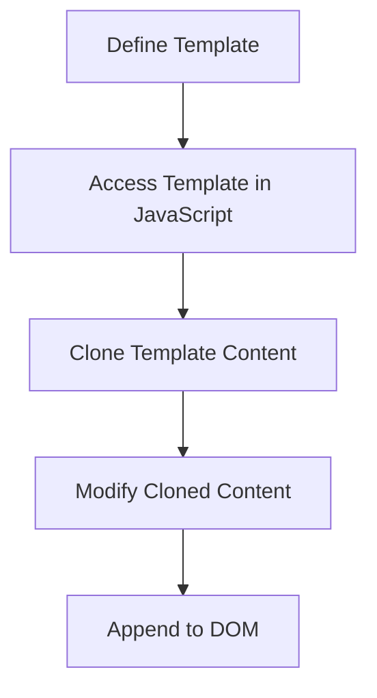

## 9.10 Working with Templates

In the world of web development, creating dynamic and interactive web pages is a crucial skill. One of the tools that can help you achieve this is the `<template>` element in HTML. This section will introduce you to the concept of templates, explain how they work, and guide you through using them to create reusable content blocks. By the end of this section, you'll understand how to leverage templates to maintain clean and efficient code.

### Introduction to the `<template>` Element

The `<template>` element is a powerful feature in HTML that allows you to define a block of HTML code that is not rendered immediately when the page loads. Instead, it serves as a blueprint for creating new content dynamically using JavaScript. This can be particularly useful when you need to generate multiple similar elements on a page, such as a list of items, cards, or any other repeating structure.

#### Key Characteristics of the `<template>` Element

- **Non-Rendered Content**: Content inside a `<template>` tag is not displayed on the page until it is explicitly instantiated using JavaScript.
- **Reusable**: The same template can be used multiple times to create identical or similar content blocks.
- **Separation of Structure and Logic**: By using templates, you can keep your HTML structure separate from the JavaScript logic that manipulates it.

### How the `<template>` Element Works

When a browser encounters a `<template>` element, it processes the content inside but does not render it. Instead, the content is stored in a special document fragment that can be cloned and inserted into the DOM as needed. This allows you to create new elements dynamically without having to write repetitive HTML code.

Let's take a closer look at how to use the `<template>` element with a practical example.

### Using Templates: A Step-by-Step Guide

#### Step 1: Define Your Template

First, you need to define the structure of the content you want to reuse. This is done using the `<template>` element in your HTML file. Here's a simple example:

```html
<template id="myTemplate">
    <div class="card">
        <h2></h2>
        <p></p>
    </div>
</template>
```

In this example, we define a template for a card with a title (`<h2>`) and a paragraph (`<p>`). The template is given an `id` attribute so that it can be easily accessed by JavaScript.

#### Step 2: Access the Template in JavaScript

Once your template is defined, you can access it in your JavaScript code using the `document.getElementById()` method. This allows you to manipulate the template's content and insert it into the DOM.

```javascript
let template = document.getElementById('myTemplate');
```

#### Step 3: Clone the Template Content

To use the template, you need to create a clone of its content. This is done using the `cloneNode(true)` method, which creates a deep copy of the template's content, including all its child elements.

```javascript
let clone = template.content.cloneNode(true);
```

#### Step 4: Modify the Cloned Content

Before appending the cloned content to the DOM, you can modify it as needed. For example, you can set the text content of the `<h2>` and `<p>` elements:

```javascript
clone.querySelector('h2').textContent = 'Title';
clone.querySelector('p').textContent = 'This is a description.';
```

#### Step 5: Append the Cloned Content to the DOM

Finally, you can append the cloned content to the DOM, making it visible on the page. This is done using the `appendChild()` method.

```javascript
document.body.appendChild(clone);
```

### Benefits of Using Templates

Using templates offers several advantages, especially when dealing with dynamic content generation:

1. **Code Reusability**: Templates allow you to define a structure once and reuse it multiple times, reducing code duplication and making your codebase more maintainable.

2. **Separation of Concerns**: By keeping the HTML structure in the template and the logic in JavaScript, you can separate the presentation layer from the application logic, making your code easier to understand and manage.

3. **Performance**: Since the template content is not rendered until it's needed, it can improve the initial load time of your web page. Additionally, cloning a template is generally faster than creating new elements from scratch.

4. **Flexibility**: Templates can be easily modified before being inserted into the DOM, allowing you to create dynamic and interactive content based on user input or other data.

### Practical Example: Creating a List of Cards

Let's put everything we've learned into practice by creating a list of cards using a template. Each card will have a title and a description, and we'll use JavaScript to populate the content dynamically.

#### HTML Structure

First, define the template in your HTML file:

```html
<template id="cardTemplate">
    <div class="card">
        <h2></h2>
        <p></p>
    </div>
</template>

<div id="cardContainer"></div>
```

#### JavaScript Logic

Next, use JavaScript to generate a list of cards:

```javascript
// Sample data
const data = [
    { title: 'Card 1', description: 'This is the first card.' },
    { title: 'Card 2', description: 'This is the second card.' },
    { title: 'Card 3', description: 'This is the third card.' }
];

// Access the template and container
let template = document.getElementById('cardTemplate');
let container = document.getElementById('cardContainer');

// Loop through the data and create cards
data.forEach(item => {
    // Clone the template content
    let clone = template.content.cloneNode(true);

    // Set the content of the cloned elements
    clone.querySelector('h2').textContent = item.title;
    clone.querySelector('p').textContent = item.description;

    // Append the cloned content to the container
    container.appendChild(clone);
});
```

In this example, we define an array of data objects, each containing a title and a description. We then loop through the data, clone the template for each item, set the content, and append it to the container.

### Encouraging Clean and Efficient Code

Using templates is a great way to keep your code clean and efficient. By defining reusable content blocks, you can avoid repetitive HTML code and make your JavaScript logic more straightforward. This not only improves the maintainability of your code but also makes it easier to update and extend in the future.

### Try It Yourself

To reinforce your understanding, try modifying the example above:

- Add an image to each card by including an `` element in the template and setting its `src` attribute in JavaScript.
- Create a button in each card that, when clicked, displays an alert with the card's title.
- Experiment with different styles for the cards using CSS.

### Visualizing the Template Process

To help you visualize how templates work, let's look at a diagram representing the process of using a template to create and insert content into the DOM.



**Diagram Description**: This flowchart illustrates the process of working with templates. It starts with defining the template, accessing it in JavaScript, cloning the content, modifying the clone, and finally appending it to the DOM.

### Further Reading and Resources

To deepen your understanding of templates and DOM manipulation, consider exploring the following resources:

- [MDN Web Docs: `<template>` Element](https://developer.mozilla.org/en-US/docs/Web/HTML/Element/template)
- [W3Schools: HTML Templates](https://www.w3schools.com/tags/tag_template.asp)
- [JavaScript.info: Document and Resource Loading](https://javascript.info/document)

### Summary

In this section, we've explored the `<template>` element and its role in creating reusable content blocks. We've learned how to define a template, clone its content, and insert it into the DOM using JavaScript. By leveraging templates, you can generate dynamic content efficiently, maintain clean code, and improve the performance of your web applications. Remember to experiment with the examples provided and explore additional resources to further enhance your skills.

---

## Quiz Time!



### What is the primary purpose of the `<template>` element in HTML?

- [x] To define reusable content blocks that are not rendered until instantiated.
- [ ] To style HTML elements with CSS.
- [ ] To create interactive forms.
- [ ] To store JavaScript functions.

> **Explanation:** The `<template>` element is used to define reusable content blocks that are not rendered until they are instantiated using JavaScript.

### How do you access a template in JavaScript?

- [x] Using `document.getElementById()`.
- [ ] Using `document.querySelector()`.
- [ ] Using `document.createElement()`.
- [ ] Using `document.getElementsByClassName()`.

> **Explanation:** You can access a template in JavaScript using `document.getElementById()` by referencing the template's `id` attribute.

### What method is used to create a clone of a template's content?

- [x] `cloneNode(true)`
- [ ] `createElement()`
- [ ] `appendChild()`
- [ ] `querySelector()`

> **Explanation:** The `cloneNode(true)` method is used to create a deep copy of a template's content, including all its child elements.

### What is the benefit of using templates for dynamic content generation?

- [x] They allow for code reusability and separation of structure and logic.
- [ ] They automatically style content with CSS.
- [ ] They make the page load faster by default.
- [ ] They eliminate the need for JavaScript.

> **Explanation:** Templates allow for code reusability and separation of structure and logic, making your code more maintainable and efficient.

### Which of the following is NOT a characteristic of the `<template>` element?

- [ ] Non-rendered content
- [ ] Reusable
- [ ] Separation of concerns
- [x] Automatically visible on page load

> **Explanation:** Content inside a `<template>` element is not automatically visible on page load; it must be instantiated using JavaScript.

### What is the first step in using a template?

- [x] Define the template in your HTML file.
- [ ] Clone the template content.
- [ ] Modify the cloned content.
- [ ] Append the cloned content to the DOM.

> **Explanation:** The first step in using a template is to define it in your HTML file with the desired structure.

### How can you modify the content of a cloned template?

- [x] By using JavaScript to set the text content or attributes of the cloned elements.
- [ ] By editing the original template directly.
- [ ] By using CSS to style the cloned elements.
- [ ] By using HTML to change the template's structure.

> **Explanation:** You can modify the content of a cloned template by using JavaScript to set the text content or attributes of the cloned elements.

### What method is used to append the cloned content to the DOM?

- [x] `appendChild()`
- [ ] `cloneNode()`
- [ ] `createElement()`
- [ ] `querySelector()`

> **Explanation:** The `appendChild()` method is used to append the cloned content to the DOM, making it visible on the page.

### What does the `cloneNode(true)` method do?

- [x] It creates a deep copy of the template's content, including all child elements.
- [ ] It creates a shallow copy of the template's content.
- [ ] It deletes the template's content.
- [ ] It appends the template's content to the DOM.

> **Explanation:** The `cloneNode(true)` method creates a deep copy of the template's content, including all child elements.

### True or False: The `<template>` element is rendered immediately when the page loads.

- [ ] True
- [x] False

> **Explanation:** False. The `<template>` element is not rendered immediately when the page loads; it must be instantiated using JavaScript.




