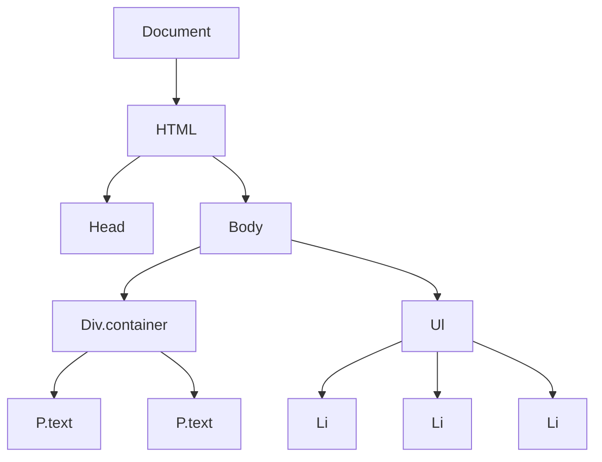

## 9.2 Using `querySelector()` and `querySelectorAll()`

In this section, we will explore two powerful JavaScript methods: `querySelector()` and `querySelectorAll()`. These methods allow us to access and manipulate elements in the Document Object Model (DOM) using CSS selectors. Understanding how to use these methods effectively is crucial for creating dynamic and interactive web pages.

### Introduction to `querySelector()`

The `querySelector()` method is a powerful tool that allows you to select the first element that matches a specified CSS selector. This method is part of the `document` object and can be used to access any element in the DOM.

#### Syntax and Basic Usage

The basic syntax of `querySelector()` is as follows:

```javascript
let element = document.querySelector(selector);
```

- **`selector`**: A string containing one or more CSS selectors separated by commas. The method returns the first element that matches the specified selector(s).

#### Example: Selecting an Element by Class Name

Let's start with a simple example. Suppose we have the following HTML:

```html
<div class="container">
  <p class="text">Hello, World!</p>
  <p class="text">Welcome to JavaScript!</p>
</div>
```

To select the first paragraph with the class `text`, we can use `querySelector()`:

```javascript
let firstParagraph = document.querySelector('.text');
console.log(firstParagraph.textContent); // Output: Hello, World!
```

In this example, `querySelector('.text')` selects the first `<p>` element with the class `text`.

#### Example: Selecting an Element by ID

If you want to select an element by its ID, you can use the `#` symbol followed by the ID name:

```html
<div id="main-content">
  <h1>Welcome to My Website</h1>
</div>
```

```javascript
let mainContent = document.querySelector('#main-content');
console.log(mainContent.innerHTML); // Output: <h1>Welcome to My Website</h1>
```

Here, `querySelector('#main-content')` selects the `<div>` element with the ID `main-content`.

#### Example: Selecting an Element by Tag Name

You can also select elements by their tag name:

```html
<ul>
  <li>Item 1</li>
  <li>Item 2</li>
  <li>Item 3</li>
</ul>
```

```javascript
let firstListItem = document.querySelector('li');
console.log(firstListItem.textContent); // Output: Item 1
```

In this case, `querySelector('li')` selects the first `<li>` element in the document.

### Introduction to `querySelectorAll()`

While `querySelector()` is great for selecting a single element, `querySelectorAll()` is used to select all elements that match a specified CSS selector. This method returns a static NodeList of all matching elements.

#### Syntax and Basic Usage

The basic syntax of `querySelectorAll()` is as follows:

```javascript
let elements = document.querySelectorAll(selector);
```

- **`selector`**: A string containing one or more CSS selectors separated by commas. The method returns a NodeList of all elements that match the specified selector(s).

#### Example: Selecting Multiple Elements by Class Name

Let's revisit our previous example with multiple paragraphs:

```html
<div class="container">
  <p class="text">Hello, World!</p>
  <p class="text">Welcome to JavaScript!</p>
</div>
```

To select all paragraphs with the class `text`, we can use `querySelectorAll()`:

```javascript
let paragraphs = document.querySelectorAll('.text');
paragraphs.forEach((paragraph) => {
  console.log(paragraph.textContent);
});
// Output: 
// Hello, World!
// Welcome to JavaScript!
```

In this example, `querySelectorAll('.text')` selects all `<p>` elements with the class `text`, and we use `forEach()` to iterate over the NodeList and log each paragraph's text content.

### Understanding the NodeList

A NodeList is a collection of nodes, which can be elements, text nodes, or other types of nodes. It is similar to an array but not exactly the same. Here are some key points about NodeLists:

- **Static vs. Live**: The NodeList returned by `querySelectorAll()` is static, meaning it does not automatically update when the document changes. This is different from a live NodeList, which updates automatically.
- **Iteration**: You can iterate over a NodeList using a `for` loop, `forEach()`, or other array-like methods.
- **Accessing Elements**: You can access elements in a NodeList using the `item()` method or by index, similar to arrays.

#### Example: Iterating Over a NodeList

Let's see how we can iterate over a NodeList using different methods:

```html
<ul>
  <li>Item 1</li>
  <li>Item 2</li>
  <li>Item 3</li>
</ul>
```

```javascript
let listItems = document.querySelectorAll('li');

// Using a for loop
for (let i = 0; i < listItems.length; i++) {
  console.log(listItems[i].textContent);
}

// Using forEach()
listItems.forEach((item) => {
  console.log(item.textContent);
});
```

Both methods will output:

```
Item 1
Item 2
Item 3
```

### Power and Flexibility of CSS Selectors

One of the greatest advantages of using `querySelector()` and `querySelectorAll()` is the ability to leverage the full power of CSS selectors. This allows for highly flexible and precise element selection.

#### Example: Using Attribute Selectors

You can select elements based on their attributes:

```html
<input type="text" name="username" value="JohnDoe">
<input type="password" name="password">
```

```javascript
let textInput = document.querySelector('input[type="text"]');
console.log(textInput.value); // Output: JohnDoe
```

In this example, `querySelector('input[type="text"]')` selects the `<input>` element with the `type` attribute set to `text`.

#### Example: Using Pseudo-classes

You can also use pseudo-classes to select elements based on their state:

```html
<ul>
  <li class="active">Active Item</li>
  <li>Inactive Item</li>
</ul>
```

```javascript
let activeItem = document.querySelector('li.active');
console.log(activeItem.textContent); // Output: Active Item
```

Here, `querySelector('li.active')` selects the `<li>` element with the class `active`.

### Try It Yourself

Now that we've covered the basics, it's time for you to experiment! Try modifying the examples above to select different elements or use different selectors. For instance, try selecting elements with multiple classes or using more complex CSS selectors.

### Visualizing the DOM and CSS Selectors

To better understand how `querySelector()` and `querySelectorAll()` work, let's visualize the DOM structure and how CSS selectors are applied.



In this diagram, we see a simplified DOM tree. The `querySelector('.text')` method would select the first `P.text` node, while `querySelectorAll('.text')` would select both `P.text` nodes.

### Further Reading and Resources

To deepen your understanding of `querySelector()` and `querySelectorAll()`, consider exploring the following resources:

- [MDN Web Docs: `querySelector()`](https://developer.mozilla.org/en-US/docs/Web/API/Document/querySelector)
- [MDN Web Docs: `querySelectorAll()`](https://developer.mozilla.org/en-US/docs/Web/API/Document/querySelectorAll)
- [W3Schools: JavaScript HTML DOM](https://www.w3schools.com/js/js_htmldom.asp)

### Summary

In this section, we've explored the `querySelector()` and `querySelectorAll()` methods, which allow us to select and manipulate DOM elements using CSS selectors. We've seen how to use these methods to select single and multiple elements, and we've discussed the power and flexibility of CSS selectors in JavaScript.

By mastering these methods, you'll be able to create more dynamic and interactive web pages, enhancing the user experience and making your web applications more engaging.

## Quiz Time!



### What does `querySelector()` return?

- [x] The first element that matches the specified CSS selector.
- [ ] All elements that match the specified CSS selector.
- [ ] A live NodeList of matching elements.
- [ ] An array of matching elements.

> **Explanation:** `querySelector()` returns the first element that matches the specified CSS selector.

### What type of object does `querySelectorAll()` return?

- [ ] An array of elements.
- [x] A static NodeList of elements.
- [ ] A live NodeList of elements.
- [ ] A single element.

> **Explanation:** `querySelectorAll()` returns a static NodeList of all elements that match the specified CSS selector.

### How can you select an element with the ID `main` using `querySelector()`?

- [ ] `document.querySelector('.main')`
- [x] `document.querySelector('#main')`
- [ ] `document.querySelector('main')`
- [ ] `document.querySelector('id=main')`

> **Explanation:** To select an element by ID, use the `#` symbol followed by the ID name.

### Which method would you use to select all elements with the class `button`?

- [ ] `document.querySelector('.button')`
- [x] `document.querySelectorAll('.button')`
- [ ] `document.querySelector('#button')`
- [ ] `document.querySelectorAll('#button')`

> **Explanation:** `querySelectorAll('.button')` selects all elements with the class `button`.

### How do you iterate over a NodeList returned by `querySelectorAll()`?

- [x] Using `forEach()`
- [ ] Using `map()`
- [x] Using a `for` loop
- [ ] Using `reduce()`

> **Explanation:** You can iterate over a NodeList using `forEach()` or a `for` loop.

### What is a NodeList?

- [x] A collection of nodes, similar to an array.
- [ ] An array of elements.
- [ ] A single DOM element.
- [ ] A live collection of elements.

> **Explanation:** A NodeList is a collection of nodes, which can be elements, text nodes, or other types of nodes.

### Which of the following is a valid CSS selector for `querySelector()`?

- [x] `.class-name`
- [ ] `class-name`
- [x] `#id-name`
- [ ] `id-name`

> **Explanation:** Valid CSS selectors include `.class-name` for classes and `#id-name` for IDs.

### What happens if no elements match the selector in `querySelector()`?

- [x] It returns `null`.
- [ ] It throws an error.
- [ ] It returns an empty array.
- [ ] It returns an empty NodeList.

> **Explanation:** If no elements match the selector, `querySelector()` returns `null`.

### Can `querySelectorAll()` be used with complex CSS selectors?

- [x] True
- [ ] False

> **Explanation:** `querySelectorAll()` can be used with complex CSS selectors, allowing for precise element selection.

### Does `querySelectorAll()` return a live NodeList?

- [ ] True
- [x] False

> **Explanation:** `querySelectorAll()` returns a static NodeList, which does not update automatically when the document changes.


