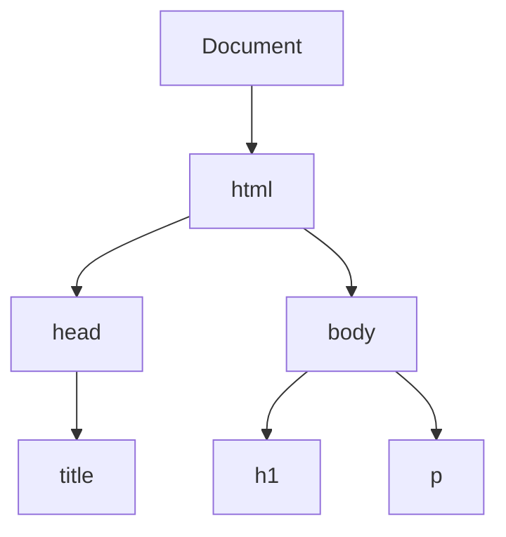
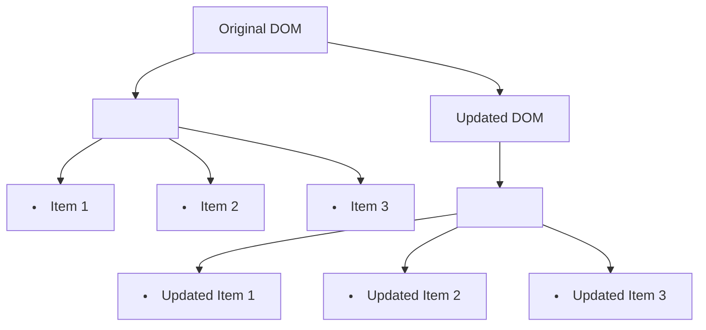

## 9.3 Changing Element Content

In the world of web development, creating dynamic and interactive web pages is key to engaging users. One of the fundamental skills in achieving this is the ability to change the content of elements on a web page using JavaScript. In this section, we will explore how to modify both text and HTML content of elements using JavaScript properties such as `innerText`, `textContent`, and `innerHTML`. We will also discuss the security implications of using these properties and how to safely insert dynamic content.

### Understanding the Basics

Before we dive into the specifics of changing element content, let's briefly revisit the Document Object Model (DOM). The DOM is a representation of the structure of a web page, where each element is a node in a tree-like structure. JavaScript allows us to interact with these nodes, enabling us to change their content, style, and attributes.

#### The DOM Tree

To visualize how elements are structured in the DOM, consider the following simple HTML:

```html
<!DOCTYPE html>
<html lang="en">
<head>
    <meta charset="UTF-8">
    <title>Sample Page</title>
</head>
<body>
    <h1 id="main-heading">Welcome to My Website</h1>
    <p class="intro">This is an introductory paragraph.</p>
</body>
</html>
```

In the DOM, this HTML is represented as a tree:



Each node in this tree corresponds to an element in the HTML. JavaScript provides us with the tools to access and modify these nodes.

### Changing Text Content with `innerText` and `textContent`

When it comes to modifying the text content of an element, `innerText` and `textContent` are two properties that you will frequently use. While they may seem similar, they have distinct differences that are important to understand.

#### The `innerText` Property

The `innerText` property represents the "rendered" text content of a node and its descendants. This means it takes into account the CSS styles applied to the element, such as `display: none`, and will not include text from hidden elements.

**Example: Changing Text with `innerText`**

Let's say we have the following HTML:

```html
<h1 id="main-heading">Welcome to My Website</h1>
```

We can change the text content of this heading using JavaScript:

```javascript
// Select the element by its ID
var heading = document.getElementById('main-heading');

// Change the text content
heading.innerText = 'Hello, World!';
```

After executing this code, the content of the `<h1>` element will change to "Hello, World!".

#### The `textContent` Property

The `textContent` property, on the other hand, returns the text content of a node and all its descendants. It includes text from elements that are not visible due to CSS styles, making it more efficient for retrieving or setting text content without considering the styling.

**Example: Changing Text with `textContent`**

Using the same HTML example, we can use `textContent` to change the text:

```javascript
// Select the element by its ID
var heading = document.getElementById('main-heading');

// Change the text content
heading.textContent = 'Hello, World!';
```

The result is the same as with `innerText`, but `textContent` is generally faster because it doesn't trigger a reflow of the page.

#### Key Differences Between `innerText` and `textContent`

- **Performance**: `textContent` is generally faster because it doesn't consider CSS styles.
- **Visibility**: `innerText` respects CSS styles like `display: none`, while `textContent` does not.
- **Whitespace Handling**: `innerText` normalizes whitespace, whereas `textContent` preserves it.

### Modifying HTML Content with `innerHTML`

While `innerText` and `textContent` are used for plain text, `innerHTML` is used to get or set the HTML content of an element. This allows you to insert HTML tags and create complex structures dynamically.

**Example: Changing HTML Content with `innerHTML`**

Consider the following HTML:

```html
<div id="content">
    <p>This is a paragraph.</p>
</div>
```

We can change the entire content of the `<div>` using `innerHTML`:

```javascript
// Select the element by its ID
var contentDiv = document.getElementById('content');

// Change the HTML content
contentDiv.innerHTML = '<h2>New Heading</h2><p>New paragraph content.</p>';
```

After executing this code, the `<div>` will contain a new heading and paragraph.

#### Security Considerations with `innerHTML`

While `innerHTML` is powerful, it comes with security risks, particularly Cross-Site Scripting (XSS) attacks. XSS occurs when an attacker injects malicious scripts into a web page, which can be executed by unsuspecting users.

**Example of Potential XSS Vulnerability**

```javascript
// Unsafe example
var userInput = '';
document.getElementById('content').innerHTML = userInput;
```

In this example, if `userInput` is not properly sanitized, it can lead to an XSS attack.

#### Safe Practices for Using `innerHTML`

- **Sanitize User Input**: Always sanitize and validate any user input before inserting it into the DOM.
- **Use Libraries**: Consider using libraries like DOMPurify to clean HTML content.
- **Avoid Direct User Input**: Where possible, avoid inserting user input directly into the DOM using `innerHTML`.

### Practical Examples and Exercises

Let's put these concepts into practice with some examples and exercises.

**Example: Updating a List of Items**

Suppose we have a list of items in HTML:

```html
<ul id="item-list">
    <li>Item 1</li>
    <li>Item 2</li>
    <li>Item 3</li>
</ul>
```

We can update the list using `innerHTML`:

```javascript
// Select the list element
var itemList = document.getElementById('item-list');

// Update the list items
itemList.innerHTML = '<li>Updated Item 1</li><li>Updated Item 2</li><li>Updated Item 3</li>';
```

**Exercise: Try It Yourself**

Modify the code to add a new item to the list without replacing the existing ones. Hint: You can use `innerHTML` to append new content.

### Visualizing Changes in the DOM

To better understand how changes affect the DOM, let's visualize the process using a diagram.



This diagram shows how the original list items are replaced with updated ones in the DOM.

### Encouraging Experimentation

To reinforce your understanding, try experimenting with different properties and methods. For example, explore what happens when you use `innerText` versus `textContent` on elements with hidden text or complex HTML structures.

### Summary and Key Takeaways

- **`innerText` and `textContent`**: Use these properties to change plain text content. Remember the differences in performance and visibility.
- **`innerHTML`**: Use this property to modify HTML content, but be cautious of security risks.
- **Security**: Always sanitize user input to prevent XSS attacks.
- **Practice**: Experiment with different scenarios to deepen your understanding.

By mastering these techniques, you'll be well-equipped to create dynamic and interactive web pages that engage users and provide a seamless experience.

## Quiz Time!



### Which property should you use to change the text content of an element while considering CSS styles?

- [x] innerText
- [ ] textContent
- [ ] innerHTML
- [ ] outerHTML

> **Explanation:** `innerText` considers CSS styles like `display: none`, while `textContent` does not.

### What is a key difference between `innerText` and `textContent`?

- [x] `innerText` respects CSS styles, `textContent` does not.
- [ ] `textContent` is slower than `innerText`.
- [ ] `innerText` includes hidden text, `textContent` does not.
- [ ] `textContent` normalizes whitespace, `innerText` does not.

> **Explanation:** `innerText` respects CSS styles, whereas `textContent` includes all text content regardless of styling.

### Which property is used to change the HTML content of an element?

- [ ] innerText
- [ ] textContent
- [x] innerHTML
- [ ] outerHTML

> **Explanation:** `innerHTML` is used to get or set the HTML content of an element.

### What is a potential security risk when using `innerHTML`?

- [ ] Memory leaks
- [x] Cross-Site Scripting (XSS) attacks
- [ ] Slow performance
- [ ] Data loss

> **Explanation:** `innerHTML` can lead to XSS attacks if user input is not properly sanitized.

### How can you safely insert dynamic content using `innerHTML`?

- [x] Sanitize user input
- [ ] Use `textContent` instead
- [ ] Avoid using JavaScript
- [ ] Use `innerText` instead

> **Explanation:** Sanitizing user input helps prevent XSS attacks when using `innerHTML`.

### Which property is generally faster for changing text content?

- [ ] innerText
- [x] textContent
- [ ] innerHTML
- [ ] outerHTML

> **Explanation:** `textContent` is generally faster because it doesn't consider CSS styles.

### What happens when you use `innerText` on an element with `display: none`?

- [x] It returns an empty string.
- [ ] It returns the text content.
- [ ] It throws an error.
- [ ] It returns `null`.

> **Explanation:** `innerText` returns an empty string for elements with `display: none`.

### Which property normalizes whitespace in the text content?

- [x] innerText
- [ ] textContent
- [ ] innerHTML
- [ ] outerHTML

> **Explanation:** `innerText` normalizes whitespace, whereas `textContent` preserves it.

### What is a recommended library for sanitizing HTML content?

- [ ] jQuery
- [ ] React
- [x] DOMPurify
- [ ] Bootstrap

> **Explanation:** DOMPurify is a library used to sanitize HTML content and prevent XSS attacks.

### True or False: `innerHTML` can be used to insert plain text content safely.

- [ ] True
- [x] False

> **Explanation:** `innerHTML` is designed for HTML content, and using it for plain text without sanitization can introduce security risks.


