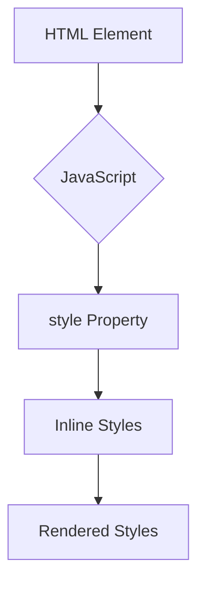

## 9.5 Modifying Styles Directly

In this section, we will explore how to modify the styles of HTML elements directly using JavaScript. This capability allows us to create dynamic and interactive web pages that respond to user actions. By the end of this section, you'll understand how to use JavaScript to change the appearance of elements on your web page, enhancing user experience and engagement.

### Introduction to the `style` Property

The `style` property in JavaScript provides a way to access and modify the inline styles of an HTML element. Inline styles are those defined directly on an element using the `style` attribute in HTML. When you use JavaScript to change styles, you're essentially altering these inline styles.

#### Example of Using the `style` Property

Let's start with a simple example. Suppose we have a paragraph element on our web page, and we want to change its text color to red using JavaScript.

```html
<!DOCTYPE html>
<html lang="en">
<head>
    <meta charset="UTF-8">
    <meta name="viewport" content="width=device-width, initial-scale=1.0">
    <title>Modify Styles with JavaScript</title>
</head>
<body>
    <p id="myParagraph">This is a paragraph.</p>
    <script>
        // Select the paragraph element
        const paragraph = document.getElementById('myParagraph');
        
        // Change the text color to red
        paragraph.style.color = 'red';
    </script>
</body>
</html>
```

In this example, we first select the paragraph element using `document.getElementById()`. Then, we use the `style` property to set the `color` property to `'red'`. This changes the text color of the paragraph to red.

### Understanding CamelCase Notation

When working with CSS properties in JavaScript, it's important to understand the camelCase notation. In CSS, properties are typically written in kebab-case (e.g., `background-color`). However, in JavaScript, these properties are written in camelCase (e.g., `backgroundColor`).

#### Examples of CamelCase Notation

Here are some common CSS properties and their JavaScript equivalents:

- `background-color` becomes `backgroundColor`
- `font-size` becomes `fontSize`
- `margin-top` becomes `marginTop`

Let's see how we can use camelCase notation to modify multiple styles of an element:

```javascript
// Select the element
const element = document.getElementById('myElement');

// Change multiple styles
element.style.backgroundColor = '#f0f0f0';
element.style.fontSize = '20px';
element.style.marginTop = '10px';
```

### Setting Styles Dynamically

One of the powerful features of JavaScript is the ability to change styles dynamically based on user interactions or other conditions. This allows you to create interactive and responsive web pages.

#### Example: Changing Styles on Click

Let's create a button that changes the background color of a div element when clicked.

```html
<!DOCTYPE html>
<html lang="en">
<head>
    <meta charset="UTF-8">
    <meta name="viewport" content="width=device-width, initial-scale=1.0">
    <title>Dynamic Style Change</title>
</head>
<body>
    <div id="colorBox" style="width: 100px; height: 100px; background-color: blue;"></div>
    <button id="changeColorButton">Change Color</button>

    <script>
        // Select the elements
        const colorBox = document.getElementById('colorBox');
        const button = document.getElementById('changeColorButton');

        // Add a click event listener to the button
        button.addEventListener('click', () => {
            // Change the background color of the div
            colorBox.style.backgroundColor = 'green';
        });
    </script>
</body>
</html>
```

In this example, we have a div element with an initial background color of blue. When the button is clicked, we change the background color to green using the `style` property.

### Limitations of Modifying Styles Directly

While modifying styles directly with JavaScript is powerful, it has some limitations:

1. **Inline Styles Only**: The `style` property only affects inline styles. It does not change styles defined in external or internal stylesheets.
2. **Specificity Issues**: Inline styles have higher specificity than styles defined in stylesheets, which can lead to unexpected results if not managed carefully.
3. **Maintainability**: Managing styles directly in JavaScript can make your code harder to maintain, especially if you have many style changes.

### When to Use Classes Instead

In many cases, it is more efficient to add or remove CSS classes rather than modifying styles directly. This approach allows you to define styles in a stylesheet and apply them by toggling classes.

#### Example: Toggling Classes

Let's modify the previous example to use classes instead of direct style changes.

```html
<!DOCTYPE html>
<html lang="en">
<head>
    <meta charset="UTF-8">
    <meta name="viewport" content="width=device-width, initial-scale=1.0">
    <title>Toggle Classes</title>
    <style>
        .blue {
            background-color: blue;
        }
        .green {
            background-color: green;
        }
    </style>
</head>
<body>
    <div id="colorBox" class="blue" style="width: 100px; height: 100px;"></div>
    <button id="changeColorButton">Change Color</button>

    <script>
        // Select the elements
        const colorBox = document.getElementById('colorBox');
        const button = document.getElementById('changeColorButton');

        // Add a click event listener to the button
        button.addEventListener('click', () => {
            // Toggle between blue and green classes
            if (colorBox.classList.contains('blue')) {
                colorBox.classList.remove('blue');
                colorBox.classList.add('green');
            } else {
                colorBox.classList.remove('green');
                colorBox.classList.add('blue');
            }
        });
    </script>
</body>
</html>
```

In this example, we define two classes, `.blue` and `.green`, in the stylesheet. We then toggle these classes on the div element when the button is clicked. This approach is more maintainable and leverages the power of CSS.

### Encouraging Experimentation

Now that you understand how to modify styles directly and use classes, let's encourage some experimentation. Try changing different styles, such as font size, border, or padding, and see how they affect the appearance of elements on your page.

#### Try It Yourself

1. **Change Font Size**: Modify the font size of a paragraph when a button is clicked.
2. **Toggle Visibility**: Use JavaScript to toggle the visibility of an element by changing its `display` property.
3. **Animate Colors**: Create a simple animation that changes the background color of an element over time.

### Visualizing the DOM and Style Changes

To better understand how style changes affect the DOM, let's visualize the process using a Mermaid.js diagram.



**Diagram Description**: This diagram illustrates how JavaScript interacts with the `style` property to modify inline styles, which are then rendered by the browser.

### References and Further Reading

To deepen your understanding of modifying styles with JavaScript, consider exploring the following resources:

- [MDN Web Docs: Using the style property](https://developer.mozilla.org/en-US/docs/Web/API/HTMLElement/style)
- [W3Schools: JavaScript HTML DOM Style](https://www.w3schools.com/js/js_htmldom_css.asp)

### Engagement and Reinforcement

To reinforce your learning, try answering the following questions:

1. What is the difference between modifying styles directly and using classes?
2. Why is camelCase notation used in JavaScript for CSS properties?
3. What are some limitations of using the `style` property?

### Key Takeaways

- The `style` property allows you to modify the inline styles of an element using JavaScript.
- CSS properties in JavaScript use camelCase notation.
- Directly modifying styles can lead to maintainability issues; consider using classes for complex styling.
- Experiment with dynamic styling to enhance interactivity on your web pages.

## Quiz Time!



### What does the `style` property in JavaScript allow you to do?

- [x] Modify the inline styles of an HTML element
- [ ] Change the external stylesheet of a webpage
- [ ] Add new HTML elements to the DOM
- [ ] Remove HTML elements from the DOM

> **Explanation:** The `style` property allows you to modify the inline styles of an HTML element using JavaScript.

### How are CSS properties written in JavaScript?

- [x] camelCase
- [ ] kebab-case
- [ ] snake_case
- [ ] PascalCase

> **Explanation:** In JavaScript, CSS properties are written in camelCase notation.

### Which of the following is a limitation of modifying styles directly with JavaScript?

- [x] It only affects inline styles
- [ ] It can change styles in external stylesheets
- [ ] It automatically updates all elements with the same class
- [ ] It makes the webpage load faster

> **Explanation:** Modifying styles directly with JavaScript only affects inline styles and does not change styles in external stylesheets.

### What is a more maintainable approach than modifying styles directly?

- [x] Adding or removing CSS classes
- [ ] Writing styles in JavaScript comments
- [ ] Using inline styles in HTML
- [ ] Creating multiple JavaScript functions for each style change

> **Explanation:** Adding or removing CSS classes is more maintainable than modifying styles directly, as it leverages the power of CSS and keeps JavaScript code cleaner.

### What happens when you use `element.style.backgroundColor = 'red';`?

- [x] The background color of the element changes to red
- [ ] The text color of the element changes to red
- [ ] The element is removed from the DOM
- [ ] The element's font size increases

> **Explanation:** The `element.style.backgroundColor = 'red';` changes the background color of the element to red.

### Which method is used to select an element by its ID in JavaScript?

- [x] document.getElementById()
- [ ] document.querySelector()
- [ ] document.getElementsByClassName()
- [ ] document.getElementsByTagName()

> **Explanation:** The `document.getElementById()` method is used to select an element by its ID in JavaScript.

### What is the JavaScript equivalent of the CSS property `font-size`?

- [x] fontSize
- [ ] font-size
- [ ] FontSize
- [ ] fontsize

> **Explanation:** In JavaScript, the CSS property `font-size` is written as `fontSize` using camelCase notation.

### What is the purpose of using `classList` in JavaScript?

- [x] To add, remove, or toggle CSS classes on an element
- [ ] To change the text content of an element
- [ ] To modify the inner HTML of an element
- [ ] To select an element by its tag name

> **Explanation:** The `classList` property in JavaScript is used to add, remove, or toggle CSS classes on an element.

### Which of the following is a benefit of using classes instead of direct style modifications?

- [x] Improved maintainability and separation of concerns
- [ ] Faster page load times
- [ ] Automatic style updates across all browsers
- [ ] Easier debugging of JavaScript code

> **Explanation:** Using classes instead of direct style modifications improves maintainability and keeps concerns separated between CSS and JavaScript.

### True or False: Inline styles have higher specificity than styles defined in stylesheets.

- [x] True
- [ ] False

> **Explanation:** Inline styles have higher specificity than styles defined in stylesheets, which can override other styles.


