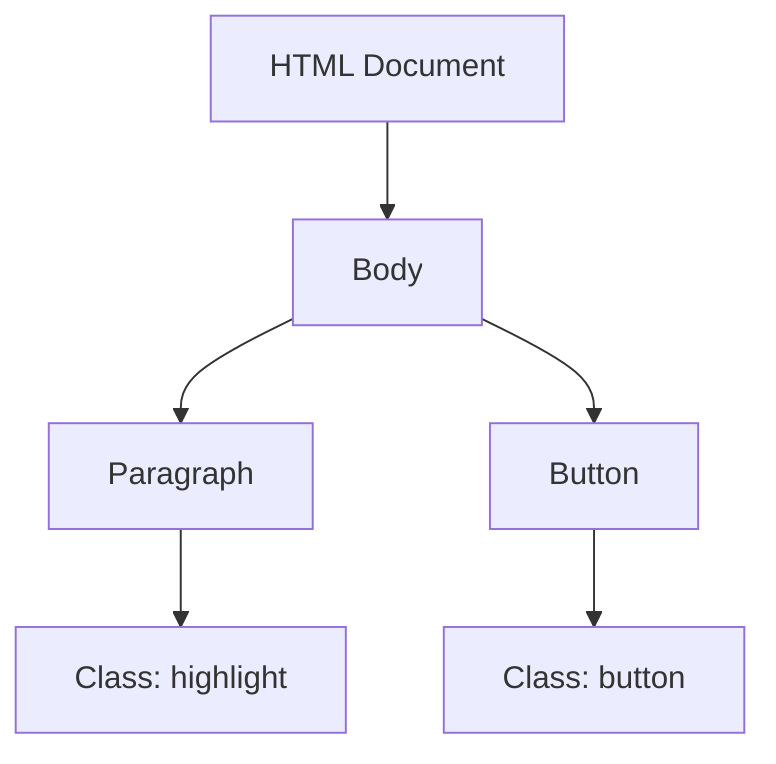

## 9.6 Adding and Removing Classes

In this section, we will explore how to dynamically manage the classes of HTML elements using JavaScript. By the end of this chapter, you'll understand how to effectively use the `classList` property to add, remove, and toggle classes, which is a powerful way to control the styling of your web pages.

### Understanding the `classList` Property

The `classList` property is a read-only property that returns a live `DOMTokenList` collection of the class attributes of the element. This property provides several useful methods to manipulate the classes of an element without having to manually handle the class attribute as a string.

#### Key Methods of `classList`

1. **`classList.add('class')`**: Adds the specified class to the element.
2. **`classList.remove('class')`**: Removes the specified class from the element.
3. **`classList.toggle('class')`**: Toggles the specified class; adds it if not present, removes it if present.

Let's dive into each of these methods with examples.

### Adding Classes with `classList.add()`

The `classList.add()` method is used to add one or more classes to an element. This is particularly useful when you want to apply new styles dynamically based on user interactions or other conditions.

#### Example: Adding a Class

```html
<!DOCTYPE html>
<html lang="en">
<head>
    <meta charset="UTF-8">
    <meta name="viewport" content="width=device-width, initial-scale=1.0">
    <title>Adding Classes Example</title>
    <style>
        .highlight {
            background-color: yellow;
        }
    </style>
</head>
<body>
    <p id="myParagraph">This is a paragraph.</p>
    <button onclick="addHighlight()">Highlight</button>

    <script>
        function addHighlight() {
            const paragraph = document.getElementById('myParagraph');
            paragraph.classList.add('highlight');
        }
    </script>
</body>
</html>
```

In this example, when the button is clicked, the `addHighlight` function is called. This function selects the paragraph element and adds the `highlight` class, which changes the background color to yellow.

### Removing Classes with `classList.remove()`

The `classList.remove()` method removes one or more classes from an element. This is useful for reverting styles or removing specific styling when certain conditions are no longer met.

#### Example: Removing a Class

```html
<!DOCTYPE html>
<html lang="en">
<head>
    <meta charset="UTF-8">
    <meta name="viewport" content="width=device-width, initial-scale=1.0">
    <title>Removing Classes Example</title>
    <style>
        .highlight {
            background-color: yellow;
        }
    </style>
</head>
<body>
    <p id="myParagraph" class="highlight">This is a highlighted paragraph.</p>
    <button onclick="removeHighlight()">Remove Highlight</button>

    <script>
        function removeHighlight() {
            const paragraph = document.getElementById('myParagraph');
            paragraph.classList.remove('highlight');
        }
    </script>
</body>
</html>
```

Here, the paragraph initially has the `highlight` class. Clicking the button calls the `removeHighlight` function, which removes the `highlight` class, reverting the paragraph to its default styling.

### Toggling Classes with `classList.toggle()`

The `classList.toggle()` method is a convenient way to add or remove a class based on its current presence. If the class is present, it removes it; if not, it adds it. This is particularly useful for creating toggle switches or interactive elements.

#### Example: Toggling a Class

```html
<!DOCTYPE html>
<html lang="en">
<head>
    <meta charset="UTF-8">
    <meta name="viewport" content="width=device-width, initial-scale=1.0">
    <title>Toggling Classes Example</title>
    <style>
        .hidden {
            display: none;
        }
    </style>
</head>
<body>
    <p id="myParagraph">This paragraph can be hidden.</p>
    <button onclick="toggleVisibility()">Toggle Visibility</button>

    <script>
        function toggleVisibility() {
            const paragraph = document.getElementById('myParagraph');
            paragraph.classList.toggle('hidden');
        }
    </script>
</body>
</html>
```

In this example, clicking the button toggles the visibility of the paragraph. The `hidden` class applies a `display: none;` style, effectively hiding the paragraph when the class is present.

### Why Use Classes for Style Changes?

Managing styles through classes is a best practice in web development for several reasons:

1. **Separation of Concerns**: By using classes, you keep your JavaScript logic separate from your CSS styling, making your code cleaner and easier to maintain.
2. **Reusability**: Classes can be reused across multiple elements, reducing redundancy and improving consistency.
3. **Efficiency**: Changing classes is generally more efficient than directly manipulating styles, as it leverages the browser's optimized rendering engine.

### Using Multiple Classes for Compound Styles

You can apply multiple classes to an element to create compound styles. This allows you to combine different styles and apply them conditionally.

#### Example: Applying Multiple Classes

```html
<!DOCTYPE html>
<html lang="en">
<head>
    <meta charset="UTF-8">
    <meta name="viewport" content="width=device-width, initial-scale=1.0">
    <title>Multiple Classes Example</title>
    <style>
        .bold {
            font-weight: bold;
        }
        .italic {
            font-style: italic;
        }
    </style>
</head>
<body>
    <p id="myParagraph">This is a paragraph.</p>
    <button onclick="applyStyles()">Apply Styles</button>

    <script>
        function applyStyles() {
            const paragraph = document.getElementById('myParagraph');
            paragraph.classList.add('bold', 'italic');
        }
    </script>
</body>
</html>
```

In this example, clicking the button applies both the `bold` and `italic` classes to the paragraph, making it bold and italicized.

### Encouraging Clean CSS and JavaScript Separation

By leveraging classes, you can maintain a clean separation between your CSS and JavaScript. This approach not only makes your code more readable but also easier to debug and extend.

- **CSS**: Define all your styles in a separate CSS file. Use meaningful class names that describe the purpose of the style.
- **JavaScript**: Use JavaScript to manipulate the classes based on user interactions or other conditions.

### Try It Yourself

Experiment with the examples provided by modifying the class names and styles. Try creating new classes and applying them to different elements. Here are a few ideas to get you started:

- Create a button that toggles between light and dark themes by adding and removing a `dark-theme` class.
- Implement a simple accordion where clicking a header toggles the visibility of the content below.
- Design a tabbed interface where clicking a tab shows its associated content and hides others.

### Visualizing the DOM and Class Manipulation

To better understand how classes affect the DOM, let's visualize the process using a simple DOM tree diagram.



In this diagram, we see the structure of a simple HTML document with a paragraph and a button. The paragraph has a `highlight` class applied, which can be manipulated using JavaScript.

### Summary

In this chapter, we've explored how to use the `classList` property to add, remove, and toggle classes on HTML elements. By managing classes, you can dynamically control the styling of your web pages, making them more interactive and engaging. Remember to keep your CSS and JavaScript separate for cleaner, more maintainable code.

### Quiz Time!



### What is the purpose of the `classList` property?

- [x] To manage the classes of an HTML element
- [ ] To create new HTML elements
- [ ] To style HTML elements directly
- [ ] To remove HTML elements from the DOM

> **Explanation:** The `classList` property is used to manage the classes of an HTML element, allowing you to add, remove, or toggle classes.

### Which method would you use to add a class to an element?

- [ ] `classList.remove()`
- [x] `classList.add()`
- [ ] `classList.toggle()`
- [ ] `classList.replace()`

> **Explanation:** The `classList.add()` method is used to add a class to an element.

### How does `classList.toggle()` work?

- [x] It adds the class if it's not present and removes it if it is.
- [ ] It only adds the class.
- [ ] It only removes the class.
- [ ] It replaces the class with another.

> **Explanation:** The `classList.toggle()` method adds the class if it's not present and removes it if it is, effectively toggling the class on and off.

### Why is managing styles through classes considered a best practice?

- [x] It separates styling from logic, making code cleaner and more maintainable.
- [ ] It allows for direct manipulation of styles in JavaScript.
- [ ] It makes the page load faster.
- [ ] It simplifies HTML structure.

> **Explanation:** Managing styles through classes separates styling from logic, making the code cleaner and more maintainable.

### What happens when you apply multiple classes to an element?

- [x] The element receives all the styles associated with those classes.
- [ ] Only the first class is applied.
- [ ] The classes cancel each other out.
- [ ] The element becomes unstyled.

> **Explanation:** When you apply multiple classes to an element, it receives all the styles associated with those classes.

### What is the advantage of using `classList.toggle()`?

- [x] It simplifies the process of adding and removing classes based on their current state.
- [ ] It only adds classes.
- [ ] It only removes classes.
- [ ] It changes the element's ID.

> **Explanation:** `classList.toggle()` simplifies the process of adding and removing classes based on their current state, making it ideal for toggle switches and interactive elements.

### How can you ensure clean separation of CSS and JavaScript?

- [x] By defining styles in CSS and using JavaScript to manipulate classes.
- [ ] By writing all styles directly in JavaScript.
- [ ] By using inline styles in HTML.
- [ ] By avoiding the use of classes altogether.

> **Explanation:** Ensuring clean separation of CSS and JavaScript involves defining styles in CSS and using JavaScript to manipulate classes.

### What does the `classList.remove()` method do?

- [x] It removes the specified class from an element.
- [ ] It adds a new class to an element.
- [ ] It toggles the class on an element.
- [ ] It creates a new element.

> **Explanation:** The `classList.remove()` method removes the specified class from an element.

### How can you apply compound styles to an element?

- [x] By applying multiple classes to the element.
- [ ] By using inline styles.
- [ ] By writing JavaScript functions.
- [ ] By changing the element's ID.

> **Explanation:** You can apply compound styles to an element by applying multiple classes, each contributing different styles.

### Is it true that `classList` can manage multiple classes at once?

- [x] True
- [ ] False

> **Explanation:** True. The `classList` property can manage multiple classes at once, allowing you to add, remove, or toggle several classes simultaneously.



By mastering the use of `classList`, you've taken a significant step towards creating dynamic and interactive web pages. Keep experimenting and applying what you've learned to enhance your web development skills!
