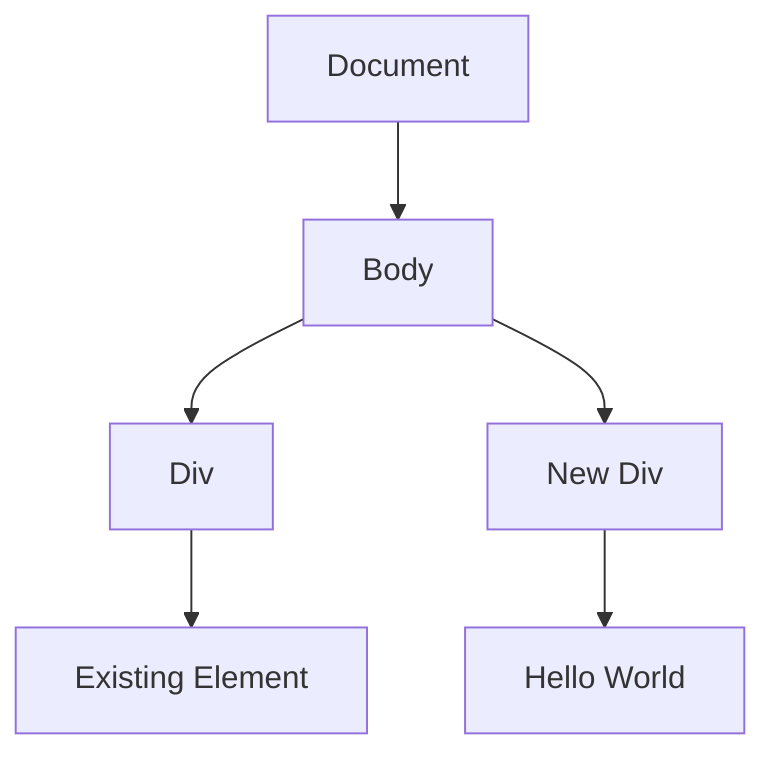

## 9.7 Creating and Appending New Elements

In this section, we will explore how to create and append new elements to the Document Object Model (DOM) using JavaScript. This is a fundamental skill for making your web pages dynamic and interactive. By the end of this section, you will be able to create new HTML elements, set their attributes and styles, and append them to your web page, enhancing the user experience.

### Understanding the Basics

Before diving into creating and appending elements, let's briefly revisit what the DOM is. The DOM is a programming interface for web documents. It represents the page so that programs can change the document structure, style, and content. The DOM represents the document as a tree of nodes, where each node is an object representing a part of the document.

### Creating Elements with `document.createElement()`

To create a new element in the DOM, we use the `document.createElement(tagName)` method. This method takes a single argument, `tagName`, which is a string representing the type of element you want to create, such as `'div'`, `'p'`, `'span'`, etc.

#### Example: Creating a New `div` Element

Let's create a new `div` element and add some text to it:

```javascript
// Create a new <div> element
let newDiv = document.createElement('div');

// Add text content to the new <div>
newDiv.textContent = 'Hello World';

// Log the new <div> to the console
console.log(newDiv);
```

In the example above, we created a new `div` element and set its text content to "Hello World". However, this element is not yet part of the document. To make it visible on the page, we need to append it to an existing element in the DOM.

### Appending Elements to the DOM

To add the newly created element to the DOM, we use the `appendChild()` method. This method appends a node as the last child of a specified parent node.

#### Example: Appending the New `div` to the Document

Let's append the `newDiv` element to an existing element on the page, such as the `body`:

```javascript
// Select the <body> element
let bodyElement = document.body;

// Append the new <div> to the <body>
bodyElement.appendChild(newDiv);
```

Now, the "Hello World" `div` should appear at the bottom of the page. You can append elements to any existing element, not just the `body`. For example, you might append a new element to a specific `div` or `section` within your page.

### Setting Attributes and Styles on New Elements

Once you've created a new element, you can set its attributes and styles just like any other element in the DOM.

#### Setting Attributes

To set an attribute on an element, use the `setAttribute()` method. This method takes two arguments: the name of the attribute and its value.

```javascript
// Set an ID attribute on the new <div>
newDiv.setAttribute('id', 'myNewDiv');

// Set a class attribute on the new <div>
newDiv.setAttribute('class', 'highlight');
```

#### Setting Styles

You can also set styles directly on the element using the `style` property.

```javascript
// Set the background color of the new <div>
newDiv.style.backgroundColor = 'lightblue';

// Set the padding of the new <div>
newDiv.style.padding = '10px';
```

### Inserting Elements at Specific Positions

Sometimes, you may want to insert a new element at a specific position within the parent element, rather than at the end. The `insertBefore()` method allows you to do this.

#### Example: Using `insertBefore()`

Let's say you have a list of items and you want to insert a new item at the second position:

```javascript
// Create a new <li> element
let newListItem = document.createElement('li');
newListItem.textContent = 'New Item';

// Select the parent <ul> element
let list = document.getElementById('myList');

// Select the second item in the list
let secondItem = list.children[1];

// Insert the new item before the second item
list.insertBefore(newListItem, secondItem);
```

In this example, we created a new list item and inserted it before the second item in the list. The `insertBefore()` method takes two arguments: the new node to insert and the reference node before which the new node will be inserted.

### Encouraging Practice with Dynamic DOM Manipulation

Now that you know how to create and append elements, it's time to practice. Try creating different types of elements, setting various attributes and styles, and appending them to different parts of the DOM. Experiment with `insertBefore()` to insert elements at specific positions.

#### Try It Yourself

Here are some ideas to get you started:

1. **Create a Button**: Create a new `button` element, set its text to "Click Me", and append it to the `body`. Add an event listener to the button that displays an alert when clicked.

2. **Build a Simple Form**: Create a form with an `input` field and a `submit` button. Append the form to a `div` on your page. Add a `submit` event listener that logs the input value to the console.

3. **Dynamic List**: Create a function that adds a new item to a list each time a button is clicked. Use `insertBefore()` to add the new item at the top of the list.

### Visualizing the DOM Tree

To better understand how elements are added to the DOM, let's visualize the DOM tree structure using a diagram.



In this diagram, the `New Div` is added as a child of the `Body`, and it contains the text "Hello World".

### References and Further Reading

For more information on DOM manipulation, check out these resources:

- [MDN Web Docs: Document.createElement()](https://developer.mozilla.org/en-US/docs/Web/API/Document/createElement)
- [MDN Web Docs: Node.appendChild()](https://developer.mozilla.org/en-US/docs/Web/API/Node/appendChild)
- [MDN Web Docs: Element.insertBefore()](https://developer.mozilla.org/en-US/docs/Web/API/Node/insertBefore)

### Summary

In this section, we've learned how to create new elements using `document.createElement()`, set their attributes and styles, and append them to the DOM using `appendChild()`. We also explored how to insert elements at specific positions with `insertBefore()`. These skills are essential for creating dynamic and interactive web pages.

### Key Takeaways

- Use `document.createElement(tagName)` to create new elements.
- Use `appendChild()` to add new elements to the DOM.
- Set attributes with `setAttribute()` and styles with the `style` property.
- Use `insertBefore()` to insert elements at specific positions.

By practicing these techniques, you'll become more comfortable with dynamic DOM manipulation and be able to create more engaging web experiences.

## Quiz Time!



### What method do you use to create a new DOM element?

- [x] `document.createElement()`
- [ ] `document.createNode()`
- [ ] `document.appendChild()`
- [ ] `document.insertBefore()`

> **Explanation:** The `document.createElement()` method is used to create a new DOM element.

### How do you append a newly created element to the DOM?

- [x] `appendChild()`
- [ ] `insertBefore()`
- [ ] `setAttribute()`
- [ ] `createElement()`

> **Explanation:** The `appendChild()` method is used to append a newly created element to the DOM.

### Which method allows you to insert an element at a specific position?

- [ ] `appendChild()`
- [x] `insertBefore()`
- [ ] `createElement()`
- [ ] `setAttribute()`

> **Explanation:** The `insertBefore()` method allows you to insert an element at a specific position in the DOM.

### How do you set an ID attribute on a new element?

- [x] `setAttribute('id', 'value')`
- [ ] `createElement('id', 'value')`
- [ ] `appendChild('id', 'value')`
- [ ] `insertBefore('id', 'value')`

> **Explanation:** The `setAttribute('id', 'value')` method is used to set an ID attribute on a new element.

### What property do you use to change the style of an element?

- [ ] `setAttribute()`
- [ ] `createElement()`
- [x] `style`
- [ ] `appendChild()`

> **Explanation:** The `style` property is used to change the style of an element.

### Which of the following is a correct way to create a new `div` element?

- [x] `document.createElement('div')`
- [ ] `document.createElement('div', 'Hello')`
- [ ] `document.appendChild('div')`
- [ ] `document.insertBefore('div')`

> **Explanation:** `document.createElement('div')` is the correct way to create a new `div` element.

### How do you add text to a newly created element?

- [x] `textContent`
- [ ] `innerHTML`
- [ ] `appendChild()`
- [ ] `setAttribute()`

> **Explanation:** The `textContent` property is used to add text to a newly created element.

### What is the purpose of `insertBefore()`?

- [ ] To append an element
- [x] To insert an element before another element
- [ ] To create a new element
- [ ] To set an attribute

> **Explanation:** The `insertBefore()` method is used to insert an element before another element in the DOM.

### Which method is used to set an attribute on an element?

- [x] `setAttribute()`
- [ ] `appendChild()`
- [ ] `insertBefore()`
- [ ] `createElement()`

> **Explanation:** The `setAttribute()` method is used to set an attribute on an element.

### True or False: `appendChild()` can be used to insert an element at the beginning of a parent node.

- [ ] True
- [x] False

> **Explanation:** `appendChild()` adds an element as the last child of a parent node, not at the beginning.


