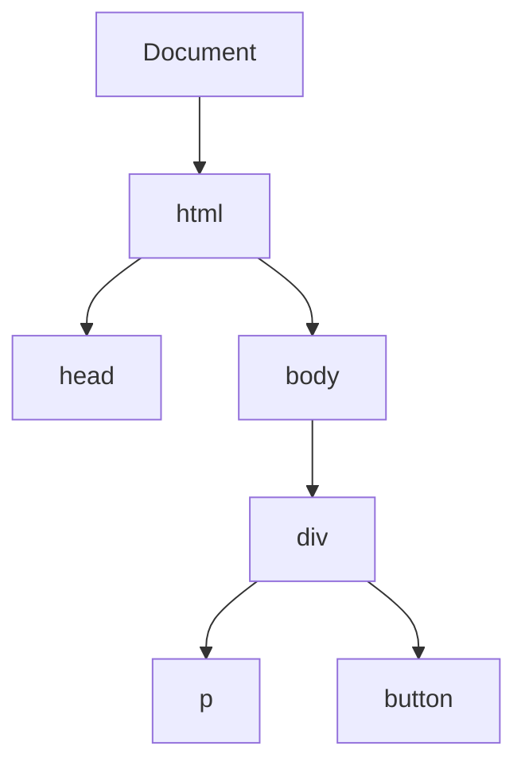

## 9.8 Removing Elements from the DOM

In this section, we will explore how to remove elements from the Document Object Model (DOM) using JavaScript. This is an essential skill for any web developer, as it allows you to dynamically alter the content of a web page in response to user interactions or other events. We will cover two primary methods for removing elements: `parentNode.removeChild(childNode)` and `element.remove()`. We will also discuss browser compatibility and best practices to ensure efficient memory management.

### Understanding the Basics

Before diving into the methods, let's briefly revisit what the DOM is. The DOM is a programming interface for web documents. It represents the page so that programs can change the document structure, style, and content. The DOM represents the document as a tree of nodes, where each node is an object representing a part of the document.

#### Visualizing the DOM Tree

To better understand how elements are structured, let's visualize a simple DOM tree:



In this diagram, the `div` element is a parent of the `p` and `button` elements. Understanding this hierarchy is crucial when removing elements, as it often involves navigating through parent-child relationships.

### Method 1: Using `parentNode.removeChild(childNode)`

The `removeChild()` method is a traditional way to remove an element from the DOM. It requires you to access the parent node of the element you wish to remove and then call `removeChild()` on it, passing the element as an argument.

#### Step-by-Step Instructions

1. **Select the Element to Remove**: First, you need to select the element you want to remove. You can do this using methods like `document.getElementById()`, `document.querySelector()`, or others.

2. **Access the Parent Node**: Once you have the element, access its parent node using the `parentNode` property.

3. **Remove the Element**: Call `removeChild()` on the parent node, passing the element as an argument.

#### Code Example

Let's look at an example where we remove a paragraph element from a `div`:

```html
<!DOCTYPE html>
<html lang="en">
<head>
    <meta charset="UTF-8">
    <meta name="viewport" content="width=device-width, initial-scale=1.0">
    <title>Remove Element Example</title>
</head>
<body>
    <div id="content">
        <p id="paragraph">This is a paragraph that will be removed.</p>
        <button onclick="removeParagraph()">Remove Paragraph</button>
    </div>

    <script>
        function removeParagraph() {
            // Select the paragraph element
            const paragraph = document.getElementById('paragraph');
            
            // Access the parent node
            const parent = paragraph.parentNode;
            
            // Remove the paragraph element
            parent.removeChild(paragraph);
        }
    </script>
</body>
</html>
```

In this example, when the button is clicked, the `removeParagraph()` function is executed. It selects the paragraph element, accesses its parent `div`, and removes the paragraph using `removeChild()`.

### Method 2: Using `element.remove()`

The `remove()` method is a more modern and straightforward way to remove an element from the DOM. It directly removes the element without needing to access its parent node.

#### Step-by-Step Instructions

1. **Select the Element to Remove**: Use a selector method like `document.querySelector()` to get the element.

2. **Remove the Element**: Call `remove()` on the element.

#### Code Example

Here's how you can achieve the same result as the previous example using `remove()`:

```html
<!DOCTYPE html>
<html lang="en">
<head>
    <meta charset="UTF-8">
    <meta name="viewport" content="width=device-width, initial-scale=1.0">
    <title>Remove Element Example</title>
</head>
<body>
    <div id="content">
        <p id="paragraph">This is a paragraph that will be removed.</p>
        <button onclick="removeParagraph()">Remove Paragraph</button>
    </div>

    <script>
        function removeParagraph() {
            // Select the paragraph element
            const paragraph = document.getElementById('paragraph');
            
            // Remove the paragraph element
            paragraph.remove();
        }
    </script>
</body>
</html>
```

This example achieves the same functionality with less code, thanks to the simplicity of the `remove()` method.

### Browser Compatibility Considerations

While `element.remove()` is convenient, it is important to consider browser compatibility. The `remove()` method is supported in modern browsers, but older versions of Internet Explorer do not support it. If you need to support such browsers, you may need to use `removeChild()` or include a polyfill for `remove()`.

#### Checking Compatibility

You can check browser compatibility for these methods on resources like [MDN Web Docs](https://developer.mozilla.org/en-US/docs/Web/API/ChildNode/remove) or [Can I use](https://caniuse.com/).

### Ensuring Efficient Memory Management

When removing elements from the DOM, it's crucial to ensure that you are not leaving behind any references that could lead to memory leaks. A memory leak occurs when memory that is no longer needed is not released, which can slow down your application over time.

#### Best Practices for Cleanup

- **Remove Event Listeners**: Before removing an element, ensure that any event listeners attached to it are also removed. This can be done using `removeEventListener()`.

- **Clear References**: If you have stored references to the element in variables or data structures, make sure to clear them after removal.

- **Use Weak References**: In some cases, using weak references can help prevent memory leaks by allowing the garbage collector to reclaim memory more effectively.

### Try It Yourself

Now that we've covered the basics, try experimenting with the code examples. Here are some suggestions:

- Modify the examples to remove different types of elements, such as images or buttons.
- Add multiple elements and create a function to remove them all at once.
- Experiment with adding and removing elements dynamically in response to different events.

### Summary

In this section, we learned how to remove elements from the DOM using two primary methods: `parentNode.removeChild(childNode)` and `element.remove()`. We discussed the importance of considering browser compatibility and ensuring efficient memory management to prevent memory leaks. By mastering these techniques, you can create more dynamic and responsive web pages.

## Quiz Time!



### Which method requires accessing the parent node to remove an element?

- [x] `parentNode.removeChild(childNode)`
- [ ] `element.remove()`
- [ ] `document.removeElement()`
- [ ] `node.removeChild()`

> **Explanation:** The `parentNode.removeChild(childNode)` method requires accessing the parent node to remove the child element.

### What is the primary advantage of using `element.remove()` over `parentNode.removeChild(childNode)`?

- [x] Simplicity and less code
- [ ] Better performance
- [ ] More browser compatibility
- [ ] It can remove multiple elements at once

> **Explanation:** `element.remove()` is simpler and requires less code because it doesn't require accessing the parent node.

### Which browsers do not support the `element.remove()` method?

- [x] Older versions of Internet Explorer
- [ ] Latest versions of Chrome
- [ ] Latest versions of Firefox
- [ ] Latest versions of Safari

> **Explanation:** Older versions of Internet Explorer do not support the `element.remove()` method.

### What should you do before removing an element to prevent memory leaks?

- [x] Remove event listeners
- [ ] Add more event listeners
- [ ] Increase memory allocation
- [ ] Change the element's ID

> **Explanation:** Removing event listeners helps prevent memory leaks by ensuring no lingering references to the element.

### Which method is more modern and straightforward for removing elements?

- [x] `element.remove()`
- [ ] `parentNode.removeChild(childNode)`
- [ ] `document.deleteElement()`
- [ ] `node.removeChild()`

> **Explanation:** `element.remove()` is a more modern and straightforward method for removing elements.

### How can you check browser compatibility for JavaScript methods?

- [x] Use resources like MDN Web Docs or Can I use
- [ ] Test on every browser manually
- [ ] Use trial and error
- [ ] Guess based on browser popularity

> **Explanation:** Resources like MDN Web Docs and Can I use provide detailed browser compatibility information.

### What is a memory leak?

- [x] Memory that is no longer needed but not released
- [ ] Memory that is used efficiently
- [ ] Memory that is allocated dynamically
- [ ] Memory that is shared between processes

> **Explanation:** A memory leak occurs when memory that is no longer needed is not released, leading to inefficiency.

### What is the purpose of the `removeChild()` method?

- [x] To remove a child node from its parent
- [ ] To add a child node to its parent
- [ ] To clone a child node
- [ ] To move a child node to another parent

> **Explanation:** The `removeChild()` method removes a child node from its parent.

### What is the DOM?

- [x] A programming interface for web documents
- [ ] A database management system
- [ ] A styling language
- [ ] A markup language

> **Explanation:** The DOM is a programming interface for web documents, allowing manipulation of the document structure.

### True or False: `element.remove()` is supported in all modern browsers.

- [x] True
- [ ] False

> **Explanation:** `element.remove()` is supported in all modern browsers, but not in older versions of Internet Explorer.


