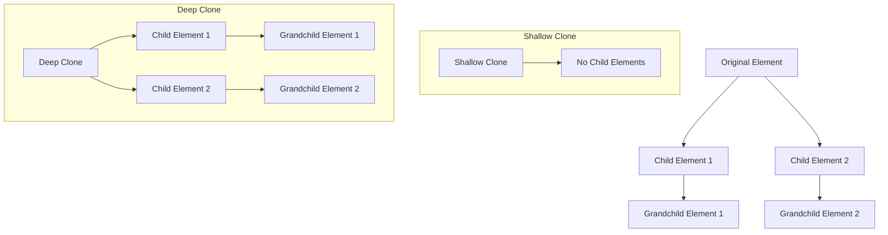

## 9.9 Cloning Nodes

In web development, there are times when you need to duplicate elements on a web page. Whether you're creating dynamic content, building templates, or managing complex UI components, cloning nodes can be a powerful tool in your JavaScript toolkit. In this section, we'll explore how to use the `cloneNode(deep)` method to create copies of existing DOM elements, understand the differences between shallow and deep cloning, and discuss practical use cases for cloning nodes.

### Understanding the `cloneNode(deep)` Method

The `cloneNode(deep)` method is a built-in JavaScript function that allows you to create a copy of a DOM node. This method can be applied to any element in the DOM and is particularly useful when you need to replicate elements without manually recreating them. The `cloneNode` method takes a single boolean parameter, `deep`, which determines whether the cloning process should be shallow or deep.

#### Shallow Cloning

Shallow cloning creates a copy of the specified node without duplicating its child nodes. This means that only the element itself is cloned, and any nested elements are not included in the copy.

**Example of Shallow Cloning:**

```javascript
// Select the element to be cloned
let originalElement = document.getElementById('myElement');

// Create a shallow clone of the element
let shallowClone = originalElement.cloneNode(false);

// Log the shallow clone to the console
console.log(shallowClone);
```

In this example, `shallowClone` is a copy of `originalElement`, but it does not include any child elements that `originalElement` may have.

#### Deep Cloning

Deep cloning, on the other hand, creates a copy of the specified node along with all of its descendants. This means that the entire subtree of the element is duplicated, including all child nodes and their attributes.

**Example of Deep Cloning:**

```javascript
// Select the element to be cloned
let originalElement = document.getElementById('myElement');

// Create a deep clone of the element
let deepClone = originalElement.cloneNode(true);

// Log the deep clone to the console
console.log(deepClone);
```

In this example, `deepClone` is a complete copy of `originalElement`, including all of its child elements and their attributes.

### Use Cases for Cloning Nodes

Cloning nodes can be useful in a variety of scenarios in web development. Here are some common use cases:

1. **Creating Dynamic Content:**
   - When building dynamic web applications, you may need to duplicate elements to display multiple instances of a component. For example, creating a list of items where each item has the same structure but different content.

2. **Building Templates:**
   - Cloning nodes can simplify the process of creating templates for repeated elements. By cloning a template node, you can easily generate new instances without manually constructing each one.

3. **Managing Complex UI Components:**
   - In complex user interfaces, you might need to duplicate UI components to maintain consistency across different parts of the application. Cloning nodes allows you to replicate components with ease.

4. **Performance Optimization:**
   - Cloning nodes can be more efficient than creating new elements from scratch, especially when dealing with complex structures. This can lead to performance improvements in your application.

### Adding Cloned Nodes to the DOM

It's important to note that cloned nodes are not automatically added to the DOM. After cloning a node, you must explicitly append it to the desired location in the DOM tree. This can be done using methods like `appendChild()` or `insertBefore()`.

**Example of Adding a Cloned Node to the DOM:**

```javascript
// Select the parent element where the clone will be added
let parentElement = document.getElementById('parentContainer');

// Append the deep clone to the parent element
parentElement.appendChild(deepClone);
```

In this example, `deepClone` is added as a child of `parentElement`, making it part of the DOM and visible on the web page.

### Caution with Cloning Elements Containing Event Listeners

When cloning nodes, it's important to be aware that event listeners attached to the original node are not automatically copied to the cloned node. This means that if the original element has event listeners, you will need to reattach them to the cloned element manually.

**Example of Reattaching Event Listeners:**

```javascript
// Function to handle the click event
function handleClick() {
    alert('Element clicked!');
}

// Attach the event listener to the original element
originalElement.addEventListener('click', handleClick);

// Clone the element
let clonedElement = originalElement.cloneNode(true);

// Reattach the event listener to the cloned element
clonedElement.addEventListener('click', handleClick);

// Append the cloned element to the DOM
parentElement.appendChild(clonedElement);
```

In this example, the `handleClick` event listener is manually reattached to the `clonedElement` after cloning.

### Try It Yourself

To reinforce your understanding of cloning nodes, try modifying the examples provided:

- Change the `deep` parameter in the `cloneNode` method to see the difference between shallow and deep cloning.
- Experiment with different elements and attributes to observe how they are copied.
- Add event listeners to the original element and practice reattaching them to the cloned element.

### Visualizing the Cloning Process

To better understand the cloning process, let's visualize how shallow and deep cloning affect the DOM tree.



**Description:** The diagram illustrates the difference between shallow and deep cloning. In shallow cloning, only the original element is copied without its children. In deep cloning, the entire subtree, including child and grandchild elements, is duplicated.

### References and Further Reading

For more information on cloning nodes and DOM manipulation, consider exploring the following resources:

- [MDN Web Docs: Node.cloneNode()](https://developer.mozilla.org/en-US/docs/Web/API/Node/cloneNode)
- [W3Schools: HTML DOM cloneNode() Method](https://www.w3schools.com/jsref/met_node_clonenode.asp)

### Engagement and Reinforcement

To further solidify your understanding of cloning nodes, consider the following questions and challenges:

- What are some potential pitfalls of cloning nodes with event listeners?
- How might you use cloning nodes to improve the performance of a web application?
- Try creating a function that clones a node and automatically reattaches all event listeners.

### Summary

In this section, we've explored the `cloneNode(deep)` method for duplicating DOM elements. We've learned about the differences between shallow and deep cloning, discussed practical use cases, and emphasized the importance of manually adding cloned nodes to the DOM. Additionally, we've highlighted the need to reattach event listeners to cloned elements. By mastering these concepts, you can enhance your ability to create dynamic and efficient web applications.

## Quiz Time!



### What does the `cloneNode(deep)` method do?

- [x] Creates a copy of a DOM node
- [ ] Deletes a DOM node
- [ ] Moves a DOM node
- [ ] Renames a DOM node

> **Explanation:** The `cloneNode(deep)` method is used to create a copy of a DOM node.

### What is the difference between shallow and deep cloning?

- [x] Shallow cloning copies only the node, while deep cloning copies the node and all its descendants.
- [ ] Shallow cloning copies the node and its descendants, while deep cloning copies only the node.
- [ ] Shallow cloning deletes the node, while deep cloning moves the node.
- [ ] Shallow cloning renames the node, while deep cloning deletes the node.

> **Explanation:** Shallow cloning copies only the node itself, while deep cloning copies the node and all its descendants.

### How do you add a cloned node to the DOM?

- [x] Use `appendChild()` or `insertBefore()`
- [ ] Use `removeChild()`
- [ ] Use `replaceChild()`
- [ ] Use `deleteNode()`

> **Explanation:** Cloned nodes can be added to the DOM using methods like `appendChild()` or `insertBefore()`.

### What happens to event listeners when a node is cloned?

- [x] They are not automatically copied to the cloned node.
- [ ] They are automatically copied to the cloned node.
- [ ] They are deleted from the original node.
- [ ] They are renamed in the cloned node.

> **Explanation:** Event listeners are not automatically copied to the cloned node and must be reattached manually.

### Which method would you use to clone a node along with its child elements?

- [x] `cloneNode(true)`
- [ ] `cloneNode(false)`
- [ ] `cloneNode()`
- [ ] `cloneNode(deep)`

> **Explanation:** `cloneNode(true)` performs a deep cloning, copying the node along with its child elements.

### What is a potential use case for cloning nodes?

- [x] Creating dynamic content
- [ ] Deleting content
- [ ] Renaming content
- [ ] Moving content

> **Explanation:** Cloning nodes can be used to create dynamic content by duplicating existing elements.

### How can you reattach event listeners to a cloned node?

- [x] Manually add the event listeners to the cloned node
- [ ] Use `cloneNode()` to automatically copy event listeners
- [ ] Use `removeChild()` to reattach event listeners
- [ ] Use `deleteNode()` to reattach event listeners

> **Explanation:** Event listeners must be manually reattached to the cloned node after cloning.

### What is the purpose of the `deep` parameter in `cloneNode(deep)`?

- [x] It determines whether the cloning process is shallow or deep.
- [ ] It renames the cloned node.
- [ ] It deletes the original node.
- [ ] It moves the cloned node.

> **Explanation:** The `deep` parameter specifies whether the cloning should include the node's descendants (deep cloning) or not (shallow cloning).

### Can `cloneNode()` be used on any DOM element?

- [x] True
- [ ] False

> **Explanation:** `cloneNode()` can be used on any DOM element to create a copy of it.

### What should you do after cloning a node to make it visible on the page?

- [x] Append it to the DOM
- [ ] Delete the original node
- [ ] Rename the cloned node
- [ ] Move the cloned node

> **Explanation:** After cloning a node, you must append it to the DOM to make it visible on the page.


