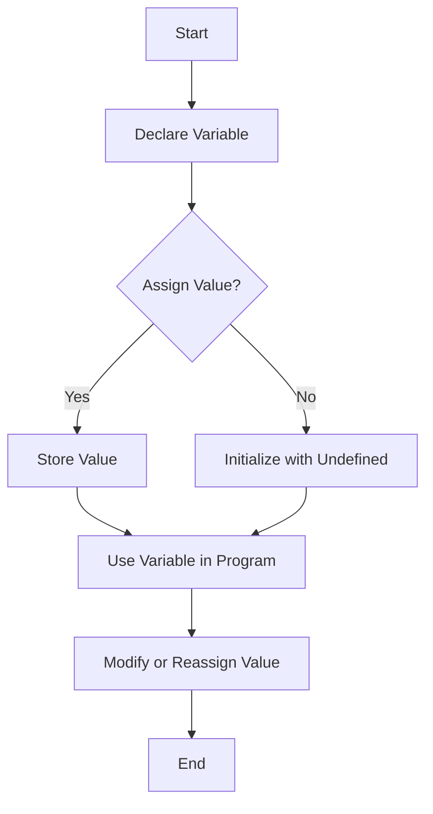

## 1.1. The Importance of Variables in Programming

In the world of programming, variables are akin to the building blocks of a skyscraper. They are essential components that hold the structure together, enabling developers to store, manipulate, and retrieve data efficiently. Understanding variables is crucial for anyone embarking on a journey to learn programming, especially in JavaScript. In this section, we will delve into what variables are, why they are indispensable in coding, and how they enable dynamic data handling in programs.

### What is a Variable?

At its core, a variable in programming is a symbolic name associated with a value and whose associated value may change. Think of a variable as a container or a storage box where you can keep your data. This data can be anything from numbers, text, or even more complex data structures like arrays and objects.

#### Real-Life Analogy

Imagine you have a jar labeled "Cookies." The jar itself represents the variable, and the cookies inside represent the data. You can add more cookies, eat some, or replace them with another snack entirely. Similarly, in programming, a variable can hold different values at different times during the execution of a program.

### Why Are Variables Essential in Coding?

Variables play a pivotal role in programming for several reasons:

1. **Data Storage**: Variables allow programs to store data temporarily. Without them, it would be impossible to perform calculations, store user inputs, or manage any form of data.

2. **Data Manipulation**: Variables enable the manipulation of data. You can perform operations like addition, subtraction, concatenation, and more, using the data stored in variables.

3. **Dynamic Data Handling**: Programs often need to handle data that changes over time. Variables provide a way to manage this dynamic data, allowing programs to respond to user inputs, process data, and produce outputs.

4. **Code Reusability and Maintainability**: By using variables, you can write more reusable and maintainable code. Instead of hardcoding values, you can use variables to make your code adaptable to different scenarios.

5. **Abstraction**: Variables provide a level of abstraction, allowing programmers to work with data without worrying about the underlying memory management.

### Variables in JavaScript

JavaScript, being a dynamically typed language, handles variables in a unique way. This means that you don't have to specify the type of data a variable will hold when you declare it. The type is determined at runtime based on the value assigned to the variable.

#### Example of Variable Declaration in JavaScript

```javascript
// Declaring a variable using var
var name = "Alice"; // name is a variable that holds the string "Alice"

// Declaring a variable using let
let age = 25; // age is a variable that holds the number 25

// Declaring a constant using const
const birthYear = 1998; // birthYear is a constant that holds the number 1998
```

In the example above, we see three different ways to declare variables in JavaScript: `var`, `let`, and `const`. Each has its own scope and usage, which we will explore in detail in later sections.

### How Variables Enable Dynamic Data Handling

One of the most powerful features of variables is their ability to handle dynamic data. This means that the data stored in a variable can change as the program runs, allowing for more flexible and interactive applications.

#### Example: Dynamic Data Handling

Consider a simple program that calculates the sum of two numbers provided by the user:

```javascript
let num1 = prompt("Enter the first number:"); // Get the first number from the user
let num2 = prompt("Enter the second number:"); // Get the second number from the user

let sum = Number(num1) + Number(num2); // Calculate the sum

alert("The sum is: " + sum); // Display the sum to the user
```

In this example, the variables `num1` and `num2` store the numbers entered by the user. The `sum` variable then holds the result of adding these two numbers. This dynamic handling of data allows the program to work with any numbers the user provides.

### Visualizing Variables in JavaScript

To better understand how variables work in JavaScript, let's visualize the process using a flowchart. This flowchart represents the lifecycle of a variable from declaration to usage.



**Figure 1**: This flowchart illustrates the lifecycle of a variable in JavaScript, from declaration to modification.

### Best Practices for Using Variables

To make the most out of variables in your programming endeavors, consider the following best practices:

- **Use Descriptive Names**: Choose variable names that clearly describe the data they hold. This makes your code more readable and easier to understand.

- **Avoid Global Variables**: Whenever possible, limit the use of global variables. They can lead to conflicts and make debugging more challenging.

- **Initialize Variables**: Always initialize variables when you declare them. This helps prevent errors and makes your code more predictable.

- **Use `let` and `const`**: Prefer `let` and `const` over `var` for variable declarations. They provide block scope, which reduces the risk of errors.

### Try It Yourself

To reinforce your understanding of variables, try modifying the code examples provided. Experiment with different values and observe how the program behaves. For instance, change the data type of a variable or try using `let` instead of `var` and see how it affects the program.

### Knowledge Check

Before we wrap up, let's pose a few questions to test your understanding of variables:

- What is a variable in programming?
- Why are variables important in coding?
- How do variables enable dynamic data handling in programs?
- What are the differences between `var`, `let`, and `const` in JavaScript?

### Embrace the Journey

Remember, mastering variables is just the beginning of your programming journey. As you progress, you'll encounter more complex concepts and build more interactive applications. Keep experimenting, stay curious, and enjoy the learning process!

For further reading on variables and their role in programming, check out the [MDN Web Docs](https://developer.mozilla.org/en-US/docs/Web/JavaScript/Guide/Grammar_and_types#Declarations) and [W3Schools](https://www.w3schools.com/js/js_variables.asp).

## Quiz Time!



### What is a variable in programming?

- [x] A symbolic name associated with a value that can change
- [ ] A fixed value that cannot be altered
- [ ] A function that performs calculations
- [ ] A constant value used in calculations

> **Explanation:** A variable is a symbolic name for a value that can change during the execution of a program.

### Why are variables essential in coding?

- [x] They allow for data storage and manipulation
- [ ] They make code execution faster
- [ ] They are used only for debugging
- [ ] They are optional in programming

> **Explanation:** Variables are crucial for storing and manipulating data, making them essential in coding.

### What is the primary purpose of a variable?

- [x] To store data that can be used and modified
- [ ] To execute code faster
- [ ] To debug programs
- [ ] To create functions

> **Explanation:** The primary purpose of a variable is to store data that can be used and modified during program execution.

### How do variables enable dynamic data handling?

- [x] By allowing data to change during program execution
- [ ] By making code execution faster
- [ ] By providing fixed values
- [ ] By debugging programs

> **Explanation:** Variables enable dynamic data handling by allowing data to change during program execution.

### Which keyword is used to declare a constant in JavaScript?

- [x] const
- [ ] var
- [ ] let
- [ ] static

> **Explanation:** The `const` keyword is used to declare a constant in JavaScript.

### What is the difference between `let` and `var`?

- [x] `let` provides block scope, while `var` provides function scope
- [ ] `let` is used for constants, while `var` is not
- [ ] `let` is faster than `var`
- [ ] `let` is used for debugging

> **Explanation:** `let` provides block scope, while `var` provides function scope, making `let` more suitable for modern JavaScript.

### What happens if you declare a variable without initializing it?

- [x] It is initialized with `undefined`
- [ ] It causes a syntax error
- [ ] It is initialized with `null`
- [ ] It is initialized with `0`

> **Explanation:** If a variable is declared without initialization, it is automatically initialized with `undefined`.

### What is a good practice when naming variables?

- [x] Use descriptive names
- [ ] Use single-letter names
- [ ] Use numbers only
- [ ] Use special characters

> **Explanation:** Using descriptive names for variables makes code more readable and understandable.

### What is the recommended way to declare variables in modern JavaScript?

- [x] Using `let` and `const`
- [ ] Using `var` only
- [ ] Using `static`
- [ ] Using `define`

> **Explanation:** It is recommended to use `let` and `const` for variable declarations in modern JavaScript due to their block scope.

### True or False: Variables can only store numbers and strings.

- [ ] True
- [x] False

> **Explanation:** Variables can store various data types, including numbers, strings, objects, arrays, and more.


