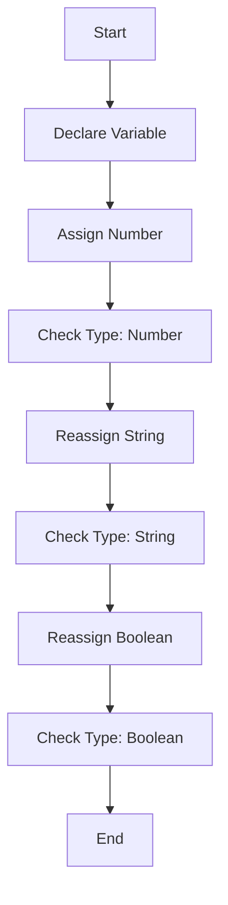

## 1.2. JavaScript's Dynamic Typing Explained

In the world of programming, understanding how a language handles data types is crucial. JavaScript, a versatile and widely-used language, employs a concept known as "dynamic typing." This feature allows developers to write flexible and adaptable code, but it also requires a solid understanding to avoid potential pitfalls. In this section, we will explore what dynamic typing means, how it differs from static typing, and its implications for developers.

### What is Dynamic Typing?

Dynamic typing is a characteristic of programming languages where the type of a variable is determined at runtime, rather than at compile time. This means that a variable in JavaScript can hold any type of data, and its type can change as the program executes.

#### Static Typing vs. Dynamic Typing

To better understand dynamic typing, let's compare it with static typing, which is used in languages like Java and C++.

- **Static Typing**: In statically typed languages, the type of a variable is known at compile time. This means you must declare the type of a variable before using it, and it cannot change. For example, in Java, you might declare a variable as an integer:

  ```java
  int number = 5;
  ```

  Here, `number` is explicitly declared as an integer and cannot hold any other type of data.

- **Dynamic Typing**: In dynamically typed languages like JavaScript, you don't need to declare the type of a variable. Instead, the type is inferred at runtime based on the value assigned to it. For example, in JavaScript:

  ```javascript
  let number = 5; // number is a Number
  number = "five"; // now number is a String
  ```

  As you can see, the variable `number` initially holds a number, but later it is reassigned a string. This flexibility is a hallmark of dynamic typing.

### How Variables Can Change Types During Execution

One of the most powerful aspects of dynamic typing is that variables can change types during execution. This allows for greater flexibility in how you write and manage your code. Let's explore this concept with a few examples.

#### Example 1: Changing Types

Consider the following JavaScript code:

```javascript
let data = 42; // data is a Number
console.log(typeof data); // Output: "number"

data = "Hello, World!"; // data is now a String
console.log(typeof data); // Output: "string"

data = true; // data is now a Boolean
console.log(typeof data); // Output: "boolean"
```

In this example, the variable `data` starts as a number, then changes to a string, and finally becomes a boolean. The `typeof` operator is used to check the type of the variable at each step.

#### Example 2: Using Dynamic Typing in Functions

Dynamic typing can also be leveraged in functions to create more generic and reusable code. Consider a function that can accept any type of input and process it accordingly:

```javascript
function processData(input) {
  if (typeof input === "number") {
    console.log("Processing number:", input * 2);
  } else if (typeof input === "string") {
    console.log("Processing string:", input.toUpperCase());
  } else {
    console.log("Unknown type:", input);
  }
}

processData(10); // Output: "Processing number: 20"
processData("hello"); // Output: "Processing string: HELLO"
processData(true); // Output: "Unknown type: true"
```

Here, the `processData` function uses dynamic typing to handle different types of input. It checks the type of the input at runtime and processes it accordingly.

### Implications of Dynamic Typing for Developers

While dynamic typing offers flexibility, it also comes with certain challenges and implications for developers. Let's discuss some of these.

#### Flexibility and Ease of Use

Dynamic typing allows developers to write code quickly without worrying about type declarations. This can be particularly useful in rapid prototyping and scripting tasks. The ability to change variable types on the fly can lead to more concise and readable code.

#### Potential for Errors

The flexibility of dynamic typing can also lead to errors that are difficult to detect. Since types are determined at runtime, type-related errors may not surface until the code is executed. This can lead to runtime errors that are harder to debug compared to compile-time errors in statically typed languages.

#### Best Practices for Managing Dynamic Typing

To mitigate the potential downsides of dynamic typing, developers can adopt certain best practices:

1. **Use Descriptive Variable Names**: Choose variable names that clearly indicate their purpose and expected type. This can help reduce confusion when reading and maintaining code.

2. **Consistent Type Usage**: Try to maintain consistent types for variables within a given scope. If a variable is intended to hold a number, avoid reassigning it a string unless necessary.

3. **Type Checking**: Use type-checking mechanisms like `typeof` and `instanceof` to verify the type of a variable before performing operations on it.

4. **Leverage TypeScript**: Consider using TypeScript, a superset of JavaScript that adds static typing. TypeScript can help catch type-related errors at compile time while still allowing you to write JavaScript code.

### Visualizing Dynamic Typing

To further illustrate how dynamic typing works in JavaScript, let's visualize the process of assigning different types to a variable:



**Figure 1: Visualizing Variable Type Changes in JavaScript**

This flowchart demonstrates the process of declaring a variable, assigning it different types, and checking its type at each step. It highlights the dynamic nature of variable typing in JavaScript.

### Try It Yourself

To get hands-on experience with dynamic typing, try modifying the following code example:

```javascript
let myVariable = 100; // Start with a Number
console.log(typeof myVariable); // Output: "number"

myVariable = "JavaScript is fun!"; // Change to a String
console.log(typeof myVariable); // Output: "string"

myVariable = { language: "JavaScript" }; // Change to an Object
console.log(typeof myVariable); // Output: "object"
```

**Challenge**: Modify `myVariable` to hold an array and a function, and use `typeof` to check its type at each step.

### Knowledge Check

Before we wrap up, let's review some key points about dynamic typing in JavaScript:

- Dynamic typing allows variables to change types during execution.
- JavaScript determines the type of a variable at runtime based on its value.
- While dynamic typing offers flexibility, it can lead to runtime errors if not managed carefully.
- Best practices such as using descriptive variable names and consistent type usage can help mitigate potential issues.

### Embrace the Journey

Remember, understanding dynamic typing is just one step in your journey to mastering JavaScript. As you continue to explore this language, you'll discover more powerful features and techniques. Keep experimenting, stay curious, and enjoy the process of learning and growing as a developer!

### References and Links

For further reading on dynamic typing and JavaScript, consider exploring the following resources:

- [MDN Web Docs: JavaScript Data Types and Data Structures](https://developer.mozilla.org/en-US/docs/Web/JavaScript/Data_structures)
- [W3Schools: JavaScript Data Types](https://www.w3schools.com/js/js_datatypes.asp)
- [TypeScript Documentation](https://www.typescriptlang.org/docs/)

## Quiz Time!



### What is dynamic typing?

- [x] A feature where variable types are determined at runtime
- [ ] A feature where variable types are determined at compile time
- [ ] A feature where variables cannot change types
- [ ] A feature where variables must be declared with a type

> **Explanation:** Dynamic typing means that the type of a variable is determined at runtime, allowing it to change types during execution.

### How does dynamic typing differ from static typing?

- [x] Dynamic typing determines types at runtime, while static typing determines types at compile time
- [ ] Dynamic typing requires type declarations, while static typing does not
- [ ] Dynamic typing is used in Java, while static typing is used in JavaScript
- [ ] Dynamic typing prevents type changes, while static typing allows them

> **Explanation:** Dynamic typing determines variable types at runtime, whereas static typing requires type declarations at compile time.

### What is the output of `typeof` when checking a number in JavaScript?

- [x] "number"
- [ ] "string"
- [ ] "boolean"
- [ ] "object"

> **Explanation:** The `typeof` operator returns "number" when checking a number in JavaScript.

### Which of the following is a potential downside of dynamic typing?

- [x] Runtime errors due to unexpected type changes
- [ ] Compile-time errors due to type mismatches
- [ ] Inability to change variable types
- [ ] Requirement for explicit type declarations

> **Explanation:** Dynamic typing can lead to runtime errors if variable types change unexpectedly.

### How can developers mitigate issues with dynamic typing?

- [x] Use descriptive variable names
- [x] Maintain consistent types within a scope
- [ ] Avoid using variables altogether
- [ ] Only use numbers and strings

> **Explanation:** Descriptive variable names and consistent type usage can help manage dynamic typing effectively.

### What does the `typeof` operator do?

- [x] Checks the type of a variable
- [ ] Changes the type of a variable
- [ ] Declares a variable type
- [ ] Converts a variable to a string

> **Explanation:** The `typeof` operator checks the type of a variable in JavaScript.

### Which language feature can help catch type-related errors at compile time?

- [x] TypeScript
- [ ] JavaScript
- [ ] HTML
- [ ] CSS

> **Explanation:** TypeScript adds static typing to JavaScript, helping catch type-related errors at compile time.

### What is the result of `typeof` when checking an object in JavaScript?

- [x] "object"
- [ ] "array"
- [ ] "function"
- [ ] "null"

> **Explanation:** The `typeof` operator returns "object" when checking an object in JavaScript.

### Can a variable in JavaScript hold different types of data during execution?

- [x] True
- [ ] False

> **Explanation:** In JavaScript, a variable can hold different types of data during execution due to dynamic typing.

### What is a best practice for managing dynamic typing?

- [x] Use type-checking mechanisms like `typeof`
- [ ] Avoid using functions
- [ ] Declare all variables as strings
- [ ] Use only global variables

> **Explanation:** Using type-checking mechanisms like `typeof` helps manage dynamic typing effectively.




