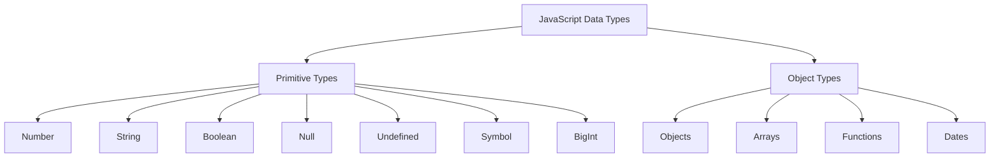

## 1.3. Overview of JavaScript Data Types

Welcome to the fascinating world of JavaScript data types! As we embark on this journey, we'll explore the various data types available in JavaScript, including both primitive and object types. Understanding these data types is crucial for writing effective and efficient JavaScript code. Let's dive in!

### Introduction to JavaScript Data Types

JavaScript is a versatile and dynamic programming language, and its data types are at the core of its functionality. Data types define the kind of data a variable can hold, and understanding them is essential for manipulating data effectively. In JavaScript, data types are categorized into two main groups: **primitive types** and **object types**.

### Primitive Data Types

Primitive data types are the most basic data types in JavaScript. They are immutable, meaning their values cannot be changed once created. Let's explore each primitive data type in detail:

#### 1. Number

The `Number` data type in JavaScript is used to represent both integer and floating-point numbers. JavaScript does not differentiate between different kinds of numbers, treating them all as `Number`.

```javascript
let integer = 42; // An integer
let float = 3.14; // A floating-point number
```

JavaScript also supports special numeric values like `Infinity`, `-Infinity`, and `NaN` (Not-a-Number).

```javascript
let infinite = Infinity; // Represents infinity
let notANumber = NaN; // Represents a computational error
```

#### 2. String

The `String` data type is used to represent textual data. Strings are sequences of characters enclosed in single quotes (`'`), double quotes (`"`), or backticks (`` ` ``).

```javascript
let singleQuoteString = 'Hello, World!';
let doubleQuoteString = "JavaScript is fun!";
let templateString = `The result is ${integer + float}`;
```

Strings can be concatenated using the `+` operator, and template literals (enclosed in backticks) allow for embedding expressions.

#### 3. Boolean

The `Boolean` data type represents logical values and can be either `true` or `false`. Booleans are often used in conditional statements to control the flow of a program.

```javascript
let isJavaScriptFun = true;
let isRaining = false;
```

#### 4. Null

The `Null` data type represents the intentional absence of any object value. It is a special keyword in JavaScript.

```javascript
let emptyValue = null; // Represents an empty or non-existent value
```

#### 5. Undefined

The `Undefined` data type indicates that a variable has been declared but has not yet been assigned a value.

```javascript
let uninitialized;
console.log(uninitialized); // Output: undefined
```

#### 6. Symbol (ES6)

Introduced in ECMAScript 6 (ES6), `Symbol` is a unique and immutable primitive value used to create unique identifiers for object properties.

```javascript
let uniqueId = Symbol('id');
let anotherUniqueId = Symbol('id');
console.log(uniqueId === anotherUniqueId); // Output: false
```

#### 7. BigInt (ES2020)

The `BigInt` data type, introduced in ECMAScript 2020, is used to represent integers with arbitrary precision, allowing for the representation of very large numbers.

```javascript
let bigNumber = 1234567890123456789012345678901234567890n;
console.log(bigNumber + 1n); // Output: 1234567890123456789012345678901234567891n
```

### Object Data Type

The `Object` data type is a complex data type that allows for the storage of collections of data and more complex entities. Objects can be created using curly braces `{}` and can contain properties and methods.

```javascript
let person = {
  name: 'Alice',
  age: 30,
  greet: function() {
    console.log('Hello, ' + this.name);
  }
};

person.greet(); // Output: Hello, Alice
```

Objects can also be arrays, functions, dates, and more, making them incredibly versatile.

### Differentiating Between Primitive Types and Objects

Understanding the difference between primitive types and objects is crucial in JavaScript. Here are some key distinctions:

- **Immutability**: Primitive values are immutable, meaning they cannot be changed. Objects, on the other hand, are mutable and can have their properties modified.
- **Copying**: When you assign a primitive value to a new variable, a copy of the value is created. For objects, only a reference to the original object is copied.
- **Methods and Properties**: Primitives do not have methods or properties, while objects can have both.

### The Significance of Understanding Data Types

Understanding data types in JavaScript is essential for several reasons:

- **Data Manipulation**: Knowing the data type helps in choosing the right operations and methods for manipulating data.
- **Error Prevention**: Understanding data types can prevent errors and bugs in your code, such as type mismatches.
- **Performance Optimization**: Efficient use of data types can lead to better performance and resource management in your applications.

### Visualizing JavaScript Data Types

Let's visualize the relationship between primitive and object data types in JavaScript using a simple diagram:



**Diagram Description**: This diagram illustrates the two main categories of JavaScript data types: Primitive Types and Object Types. Under Primitive Types, we have Number, String, Boolean, Null, Undefined, Symbol, and BigInt. Object Types include Objects, Arrays, Functions, and Dates.

### Try It Yourself

Now that we've covered the basics of JavaScript data types, it's time to experiment! Try modifying the following code examples to see how different data types behave:

```javascript
// Experiment with numbers
let num1 = 10;
let num2 = 3.5;
console.log(num1 + num2); // Try changing the values

// Experiment with strings
let greeting = 'Hello';
let name = 'World';
console.log(greeting + ', ' + name + '!'); // Try using template literals

// Experiment with booleans
let isSunny = true;
let isWeekend = false;
console.log(isSunny && isWeekend); // Try changing the values

// Experiment with objects
let car = {
  brand: 'Toyota',
  model: 'Corolla',
  year: 2020
};
console.log(car.brand); // Try adding a new property
```

### Knowledge Check

Before we wrap up, let's reinforce what we've learned with a few questions:

- What are the two main categories of data types in JavaScript?
- How do you create a `Symbol` in JavaScript?
- What is the difference between `null` and `undefined`?
- How does JavaScript handle large integers with the `BigInt` data type?

### Embrace the Journey

Remember, this is just the beginning of your JavaScript journey. As you progress, you'll build more complex and interactive web pages. Keep experimenting, stay curious, and enjoy the journey!

### References and Links

For further reading and exploration, check out these resources:

- [MDN Web Docs: Data types](https://developer.mozilla.org/en-US/docs/Web/JavaScript/Data_structures)
- [W3Schools: JavaScript Data Types](https://www.w3schools.com/js/js_datatypes.asp)

## Quiz Time!



### What are the two main categories of data types in JavaScript?

- [x] Primitive Types and Object Types
- [ ] Number Types and String Types
- [ ] Boolean Types and Symbol Types
- [ ] Null Types and Undefined Types

> **Explanation:** JavaScript data types are categorized into Primitive Types and Object Types.

### Which of the following is a primitive data type in JavaScript?

- [x] Number
- [ ] Array
- [ ] Object
- [ ] Function

> **Explanation:** Number is a primitive data type. Arrays, Objects, and Functions are object types.

### How do you declare a BigInt in JavaScript?

- [x] By appending 'n' to the end of an integer
- [ ] By using the `BigInt()` function
- [ ] By using the `bigInt` keyword
- [ ] By using the `Number()` function

> **Explanation:** BigInt is declared by appending 'n' to the end of an integer, e.g., `123n`.

### What is the output of `typeof null` in JavaScript?

- [ ] "null"
- [ ] "undefined"
- [x] "object"
- [ ] "null object"

> **Explanation:** Due to a historical bug, `typeof null` returns "object".

### Which data type is used for unique identifiers in JavaScript?

- [ ] Number
- [ ] String
- [x] Symbol
- [ ] Boolean

> **Explanation:** Symbols are used to create unique identifiers in JavaScript.

### What does `undefined` signify in JavaScript?

- [x] A variable declared but not assigned a value
- [ ] A variable assigned a null value
- [ ] A variable with a false value
- [ ] A variable with a zero value

> **Explanation:** `undefined` signifies a variable that has been declared but not assigned a value.

### Can `null` be considered a primitive data type in JavaScript?

- [x] Yes
- [ ] No

> **Explanation:** `null` is a primitive data type representing the intentional absence of any object value.

### What is the purpose of the `Symbol` data type?

- [x] To create unique identifiers for object properties
- [ ] To store large integers
- [ ] To represent textual data
- [ ] To perform mathematical operations

> **Explanation:** Symbols are used to create unique identifiers for object properties.

### Which data type allows for the representation of very large numbers?

- [ ] Number
- [x] BigInt
- [ ] String
- [ ] Boolean

> **Explanation:** BigInt allows for the representation of very large numbers with arbitrary precision.

### Is `NaN` a valid number in JavaScript?

- [x] True
- [ ] False

> **Explanation:** `NaN` stands for Not-a-Number and is a special numeric value representing a computational error.



By understanding JavaScript data types, you are well on your way to mastering the language. Keep practicing and exploring, and soon you'll be creating dynamic and powerful web applications!
