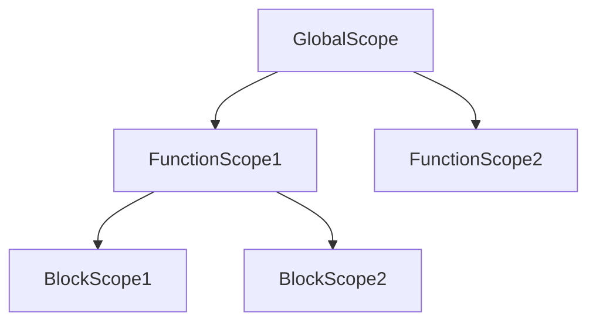

## 1.4. Understanding Scope and Hoisting

In this section, we will delve into two fundamental concepts in JavaScript: **scope** and **hoisting**. These concepts are crucial for understanding how variables are accessed and manipulated within your code. By the end of this chapter, you will have a solid grasp of how scope and hoisting work, enabling you to write more efficient and error-free JavaScript code.

### What is Scope?

In programming, **scope** refers to the context in which variables and functions are accessible. In JavaScript, scope determines the visibility of variables, meaning where they can be accessed or modified. Understanding scope is essential for managing variables effectively and avoiding common errors.

#### Types of Scope

JavaScript has three main types of scope:

1. **Global Scope**
2. **Function Scope**
3. **Block Scope**

Let's explore each of these in detail.

#### Global Scope

Variables declared in the global scope are accessible from anywhere in your JavaScript code. They are defined outside of any function or block. Global variables can be useful, but they can also lead to problems if overused, as they can be modified from anywhere in the code, potentially causing unexpected behavior.

```javascript
// Global variable
var globalVariable = "I am a global variable";

function accessGlobalVariable() {
    console.log(globalVariable); // Accessible here
}

accessGlobalVariable(); // Output: I am a global variable
console.log(globalVariable); // Output: I am a global variable
```

#### Function Scope

Variables declared within a function are only accessible within that function. This is known as **function scope**. Function-scoped variables are created using the `var` keyword.

```javascript
function myFunction() {
    var functionScopedVariable = "I am a function-scoped variable";
    console.log(functionScopedVariable); // Accessible here
}

myFunction(); // Output: I am a function-scoped variable
console.log(functionScopedVariable); // Error: functionScopedVariable is not defined
```

#### Block Scope

Block scope is a newer addition to JavaScript, introduced with ES6. Variables declared with `let` and `const` are block-scoped, meaning they are only accessible within the block (denoted by `{}`) in which they are defined.

```javascript
if (true) {
    let blockScopedVariable = "I am a block-scoped variable";
    console.log(blockScopedVariable); // Accessible here
}

console.log(blockScopedVariable); // Error: blockScopedVariable is not defined
```

### What is Hoisting?

**Hoisting** is a JavaScript mechanism where variables and function declarations are moved to the top of their containing scope during the compile phase. This means you can use variables and functions before they are declared in the code.

#### Hoisting of Variables

In JavaScript, variable declarations are hoisted to the top of their scope. However, only the declarations are hoisted, not the initializations. This can lead to unexpected behavior if not properly understood.

```javascript
console.log(hoistedVariable); // Output: undefined
var hoistedVariable = "I am hoisted";
console.log(hoistedVariable); // Output: I am hoisted
```

In the above example, the declaration `var hoistedVariable;` is hoisted to the top, but the initialization `hoistedVariable = "I am hoisted";` is not.

#### Hoisting of Functions

Function declarations are also hoisted, allowing you to call a function before it is defined in the code.

```javascript
hoistedFunction(); // Output: I am a hoisted function

function hoistedFunction() {
    console.log("I am a hoisted function");
}
```

### Common Pitfalls and How to Avoid Them

Understanding scope and hoisting can help you avoid common pitfalls in JavaScript programming. Here are some tips:

- **Avoid Global Variables**: Minimize the use of global variables to reduce the risk of variable name collisions and unexpected behavior.
- **Use `let` and `const`**: Prefer `let` and `const` over `var` to take advantage of block scope and avoid hoisting issues.
- **Declare Variables at the Top**: Declare all variables at the top of their scope to make the code more readable and avoid hoisting confusion.
- **Be Mindful of Function Scope**: Remember that variables declared with `var` are function-scoped, which can lead to unexpected behavior if not handled carefully.

### Visualizing Scope and Hoisting

To better understand how scope and hoisting work, let's visualize these concepts using diagrams.

#### Scope Chain Diagram

The **scope chain** is a series of references to parent scopes, allowing JavaScript to resolve variable names. Here's a simple diagram illustrating the scope chain:



In this diagram, `GlobalScope` is the outermost scope, containing `FunctionScope1` and `FunctionScope2`. `FunctionScope1` contains `BlockScope1` and `BlockScope2`.

#### Hoisting Diagram

The following diagram illustrates how hoisting works for variable declarations:

```mermaid
sequenceDiagram
    participant Code
    participant Compiler
    Code->>Compiler: var x = 5;
    Compiler-->>Code: var x; // Declaration hoisted
    Code->>Compiler: x = 5; // Initialization remains
```

### Try It Yourself

Now that we've covered the basics of scope and hoisting, it's time to experiment with these concepts. Try modifying the code examples provided to see how changes affect variable accessibility and behavior. For instance, try using `let` and `const` instead of `var` and observe the differences.

### References and Links

For further reading on scope and hoisting, check out these resources:

- [MDN Web Docs: JavaScript Scope](https://developer.mozilla.org/en-US/docs/Web/JavaScript/Guide/Grammar_and_types#scope)
- [MDN Web Docs: Hoisting](https://developer.mozilla.org/en-US/docs/Glossary/Hoisting)
- [W3Schools: JavaScript Scope](https://www.w3schools.com/js/js_scope.asp)

### Knowledge Check

Before we move on, let's summarize the key takeaways:

- **Scope** determines where variables are accessible in your code.
- **Global Scope** allows variables to be accessed from anywhere.
- **Function Scope** restricts variable access to within a function.
- **Block Scope** limits variable access to within a block, using `let` and `const`.
- **Hoisting** moves variable and function declarations to the top of their scope.
- Use `let` and `const` to avoid hoisting issues and take advantage of block scope.

### Embrace the Journey

Remember, mastering scope and hoisting is a crucial step in your JavaScript journey. As you continue to learn and experiment, you'll become more comfortable with these concepts and be able to write more efficient and error-free code. Keep practicing, stay curious, and enjoy the learning process!

## Quiz Time!



### What is the scope of a variable declared outside of any function or block?

- [x] Global Scope
- [ ] Function Scope
- [ ] Block Scope
- [ ] Local Scope

> **Explanation:** Variables declared outside of any function or block are in the global scope and can be accessed from anywhere in the code.

### Which keyword should you use to declare a block-scoped variable?

- [ ] var
- [x] let
- [x] const
- [ ] function

> **Explanation:** `let` and `const` are used to declare block-scoped variables, whereas `var` is function-scoped.

### What does hoisting do to variable declarations?

- [x] Moves them to the top of their scope
- [ ] Initializes them with a value
- [ ] Deletes them
- [ ] Changes their type

> **Explanation:** Hoisting moves variable declarations to the top of their scope, but not the initializations.

### Which of the following is a common pitfall when using global variables?

- [x] Variable name collisions
- [ ] Improved performance
- [ ] Easier debugging
- [ ] Increased security

> **Explanation:** Global variables can lead to variable name collisions and unexpected behavior due to their accessibility from anywhere in the code.

### What will be the output of the following code?

```javascript
console.log(a);
var a = 10;
```

- [x] undefined
- [ ] 10
- [ ] ReferenceError
- [ ] TypeError

> **Explanation:** Due to hoisting, the declaration `var a;` is moved to the top, but the initialization `a = 10;` is not, resulting in `undefined`.

### Which of the following is true about function scope?

- [x] Variables declared with `var` are function-scoped
- [ ] Variables declared with `let` are function-scoped
- [ ] Variables declared with `const` are function-scoped
- [ ] Function scope is the same as block scope

> **Explanation:** Variables declared with `var` are function-scoped, meaning they are only accessible within the function they are declared in.

### How can you avoid hoisting issues in JavaScript?

- [x] Use `let` and `const` instead of `var`
- [ ] Declare variables at the end of their scope
- [ ] Avoid using functions
- [ ] Use global variables

> **Explanation:** Using `let` and `const` helps avoid hoisting issues because they are block-scoped and not hoisted in the same way as `var`.

### What is the scope chain?

- [x] A series of references to parent scopes
- [ ] A function that hoists variables
- [ ] A block of code that defines a scope
- [ ] A method to declare variables

> **Explanation:** The scope chain is a series of references to parent scopes, allowing JavaScript to resolve variable names.

### What is the main advantage of using block scope?

- [x] It limits variable access to within a block
- [ ] It makes variables global
- [ ] It increases memory usage
- [ ] It allows variable hoisting

> **Explanation:** Block scope limits variable access to within a block, reducing the risk of variable name collisions and unexpected behavior.

### True or False: Function declarations are hoisted in JavaScript.

- [x] True
- [ ] False

> **Explanation:** Function declarations are hoisted, allowing them to be called before they are defined in the code.


