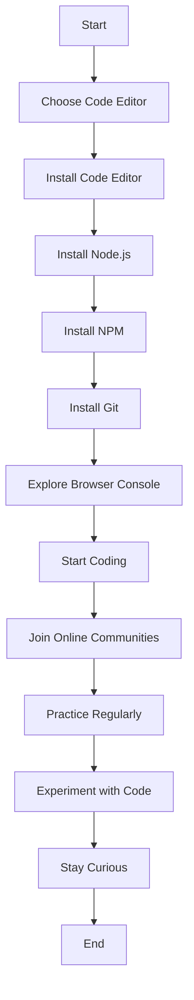

## 1.5. Prerequisites and Setup

Welcome to the exciting world of JavaScript! Before we dive into understanding variables and data types, it's essential to set up a conducive environment for learning and practicing JavaScript. This section will guide you through the necessary prerequisites and setup, ensuring you have all the tools you need to follow along with the examples in this guide.

### Why Setup Matters

Setting up your development environment is like preparing your workspace before starting a project. A well-organized environment can significantly enhance your learning experience, making it easier to write, test, and debug your code. Let's get started!

### Recommended Code Editors

A code editor is a tool where you'll write your JavaScript code. Choosing the right one can make coding more enjoyable and efficient. Here are some popular options:

1. **Visual Studio Code (VSCode)**

   - **Features**: VSCode is a free, open-source editor developed by Microsoft. It offers an extensive range of features, including syntax highlighting, IntelliSense (code completion), debugging support, and a vast library of extensions.
   - **Installation**: Visit the [VSCode website](https://code.visualstudio.com/) and download the installer for your operating system. Follow the installation instructions, and you'll be ready to go.

2. **Atom**

   - **Features**: Atom is another free, open-source editor created by GitHub. It's highly customizable, with a wide range of themes and packages available to enhance functionality.
   - **Installation**: Download Atom from the [Atom website](https://atom.io/). The installation process is straightforward and similar across different operating systems.

3. **Sublime Text**

   - **Features**: Sublime Text is known for its speed and simplicity. It offers a distraction-free coding experience with powerful features like multiple selections and split editing.
   - **Installation**: You can download Sublime Text from the [Sublime Text website](https://www.sublimetext.com/).

4. **Brackets**

   - **Features**: Brackets is a modern, open-source editor tailored for web development. It offers live preview features, making it easy to see changes in real-time.
   - **Installation**: Visit the [Brackets website](http://brackets.io/) to download and install.

### Running JavaScript Code

Once you have a code editor, you'll need to know how to run your JavaScript code. There are several ways to do this:

#### Using the Browser Console

Every modern web browser comes with a built-in JavaScript console, which is a great tool for testing small snippets of code.

- **Accessing the Console**: Open your browser (e.g., Chrome, Firefox, Edge), right-click on the page, and select "Inspect" or "Inspect Element." Navigate to the "Console" tab.
- **Running Code**: You can type JavaScript code directly into the console and press Enter to execute it.

#### Using Node.js

Node.js is a JavaScript runtime built on Chrome's V8 JavaScript engine. It allows you to run JavaScript code outside of a browser, which is particularly useful for server-side programming.

- **Installation**: Download Node.js from the [Node.js website](https://nodejs.org/). Follow the installation instructions for your operating system.
- **Running Code**: Once installed, you can run JavaScript files using the command line. Navigate to the directory containing your JavaScript file and type `node filename.js` to execute it.

### Installing Necessary Tools

To enhance your JavaScript development experience, consider installing the following tools:

1. **Node Package Manager (NPM)**

   - **Purpose**: NPM is a package manager for JavaScript that comes bundled with Node.js. It allows you to install and manage libraries and frameworks for your projects.
   - **Usage**: You can install packages by running `npm install package-name` in your terminal.

2. **Git**

   - **Purpose**: Git is a version control system that helps you track changes in your code. It's essential for collaborating on projects and managing code history.
   - **Installation**: Download Git from the [Git website](https://git-scm.com/) and follow the installation instructions.

3. **Browser Extensions**

   - **Purpose**: Extensions like React Developer Tools and Redux DevTools can be invaluable when working with JavaScript frameworks.
   - **Installation**: Search for these extensions in your browser's extension store and install them.

### Tips for Beginners

Starting with JavaScript can be overwhelming, but here are some tips to ease your journey:

- **Start Small**: Begin with simple exercises and gradually move to more complex projects. This approach helps build confidence and understanding.
- **Practice Regularly**: Consistency is key. Set aside time each day to practice coding.
- **Experiment**: Don't be afraid to modify code examples and see what happens. This experimentation is a great way to learn.
- **Seek Help**: Join online communities like [Stack Overflow](https://stackoverflow.com/) or [Reddit](https://www.reddit.com/r/javascript/) to ask questions and share knowledge.
- **Stay Curious**: Keep exploring new concepts and technologies. JavaScript is a vast language with many exciting features.

### Visualizing the Setup Process

To better understand how these components fit together, let's visualize the setup process using a flowchart.



This flowchart outlines the steps to set up your JavaScript development environment, from choosing a code editor to engaging with online communities.

### Try It Yourself

Now that you've set up your environment, let's try running a simple JavaScript program. Open your code editor and create a new file named `hello.js`. Enter the following code:

```javascript
// This is a simple JavaScript program
console.log("Hello, World!");

// Let's perform a basic arithmetic operation
let sum = 5 + 3;
console.log("The sum of 5 and 3 is:", sum);
```

Save the file and run it using Node.js by typing `node hello.js` in your terminal. You should see the following output:

```
Hello, World!
The sum of 5 and 3 is: 8
```

**Try It Yourself**: Modify the code to perform a different arithmetic operation, such as subtraction or multiplication. Experiment with changing the numbers and observe the results.

### References and Links

For further reading and resources, check out the following links:

- [MDN Web Docs - JavaScript](https://developer.mozilla.org/en-US/docs/Web/JavaScript)
- [W3Schools - JavaScript Tutorial](https://www.w3schools.com/js/)
- [JavaScript.info - The Modern JavaScript Tutorial](https://javascript.info/)

### Knowledge Check

Before moving on, let's summarize the key points:

- Choose a code editor that suits your needs and preferences.
- Use the browser console or Node.js to run JavaScript code.
- Install additional tools like NPM and Git to enhance your development experience.
- Practice regularly and engage with online communities for support.

### Embrace the Journey

Remember, this is just the beginning. As you progress, you'll build more complex and interactive web pages. Keep experimenting, stay curious, and enjoy the journey!

## Quiz Time!



### Which of the following is a popular code editor for JavaScript?

- [x] Visual Studio Code
- [ ] Microsoft Word
- [ ] Adobe Photoshop
- [ ] Google Chrome

> **Explanation:** Visual Studio Code is a popular code editor for JavaScript, offering features like syntax highlighting and debugging support.

### How can you run JavaScript code in a web browser?

- [x] Using the browser console
- [ ] By installing Node.js
- [ ] Through Microsoft Excel
- [ ] Using a text editor

> **Explanation:** The browser console allows you to run JavaScript code directly in a web browser.

### What is Node.js used for?

- [x] Running JavaScript outside of a browser
- [ ] Designing web pages
- [ ] Editing images
- [ ] Writing documents

> **Explanation:** Node.js is a JavaScript runtime that allows you to run JavaScript code outside of a browser environment.

### Which tool is essential for managing JavaScript libraries and frameworks?

- [x] NPM (Node Package Manager)
- [ ] Photoshop
- [ ] Excel
- [ ] Word

> **Explanation:** NPM is a package manager for JavaScript that helps manage libraries and frameworks.

### What is the purpose of Git in JavaScript development?

- [x] Version control
- [ ] Image editing
- [x] Tracking code changes
- [ ] Running JavaScript code

> **Explanation:** Git is used for version control, allowing developers to track changes in their code.

### Which of the following is a recommended practice for beginners?

- [x] Start small and practice regularly
- [ ] Avoid asking questions
- [ ] Only read about JavaScript
- [ ] Ignore online communities

> **Explanation:** Starting small and practicing regularly helps beginners build confidence and understanding.

### What is the first step in setting up a JavaScript development environment?

- [x] Choose a code editor
- [ ] Install Photoshop
- [ ] Design a website
- [ ] Write a book

> **Explanation:** Choosing a code editor is the first step in setting up a JavaScript development environment.

### How can you enhance your JavaScript development experience?

- [x] Install browser extensions
- [ ] Use a typewriter
- [ ] Avoid using libraries
- [ ] Only use a calculator

> **Explanation:** Installing browser extensions like React Developer Tools can enhance your development experience.

### What should you do if you encounter difficulties while learning JavaScript?

- [x] Seek help from online communities
- [ ] Give up immediately
- [ ] Avoid asking questions
- [ ] Only read books

> **Explanation:** Seeking help from online communities can provide support and guidance when encountering difficulties.

### True or False: It's important to stay curious and keep exploring new concepts in JavaScript.

- [x] True
- [ ] False

> **Explanation:** Staying curious and exploring new concepts helps you grow as a JavaScript developer.




