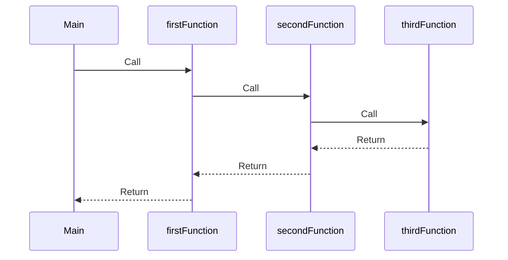
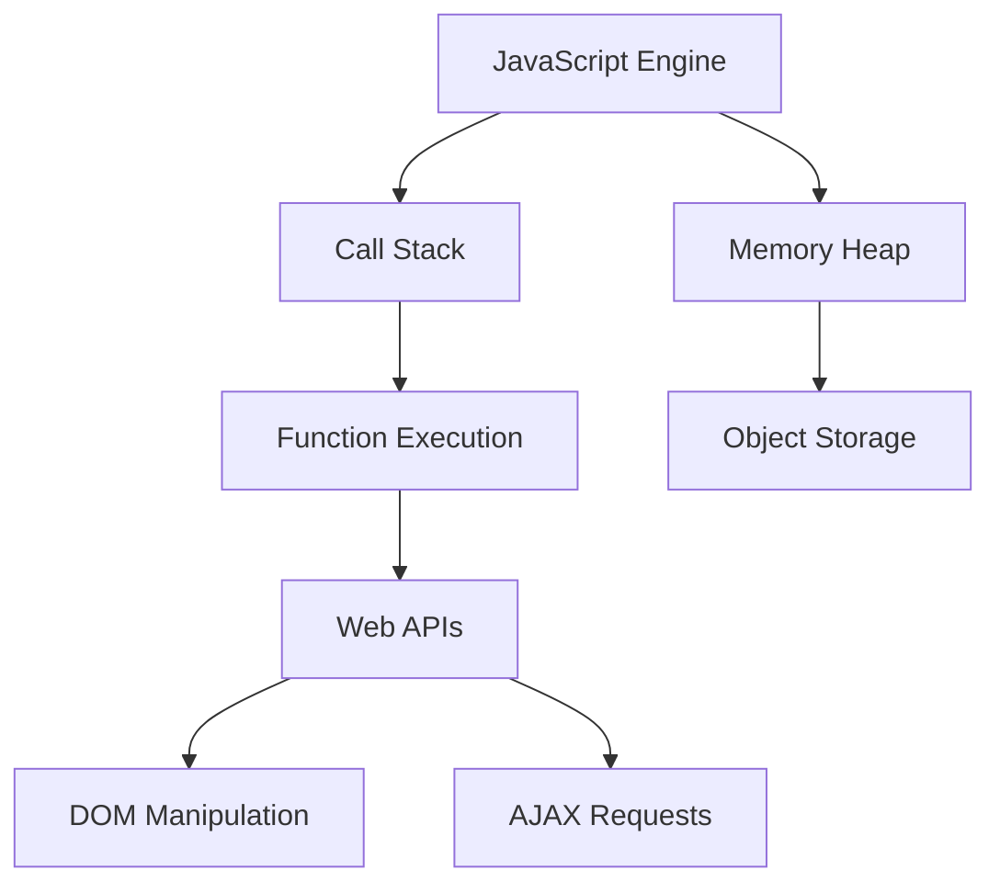

## 10.1. The Call Stack and Memory Heap

As we delve deeper into JavaScript, understanding how it manages execution contexts and memory allocation becomes crucial. Two fundamental components in this process are the call stack and the memory heap. These concepts are essential for grasping how JavaScript executes code, manages memory, and handles errors. Let's explore these components in detail.

### Understanding the Call Stack

The **call stack** is a data structure that keeps track of function calls in a program. It operates on a "last in, first out" (LIFO) principle, meaning the last function called is the first one to be completed. This structure is pivotal in managing the execution order of functions.

#### How the Call Stack Works

1. **Function Invocation**: When a function is called, a new execution context is created and pushed onto the call stack.
2. **Execution**: The function executes, and any functions it calls are added to the stack.
3. **Completion**: Once a function completes, its execution context is popped off the stack.
4. **Return to Previous Context**: Control returns to the previous execution context on the stack.

Here's a simple example to illustrate the call stack in action:

```javascript
function firstFunction() {
    console.log("First function start");
    secondFunction();
    console.log("First function end");
}

function secondFunction() {
    console.log("Second function start");
    thirdFunction();
    console.log("Second function end");
}

function thirdFunction() {
    console.log("Third function");
}

firstFunction();
```

**Output:**
```
First function start
Second function start
Third function
Second function end
First function end
```

**Explanation**: The `firstFunction` is called, pushing its context onto the stack. It calls `secondFunction`, adding another context. `secondFunction` calls `thirdFunction`, adding yet another context. Once `thirdFunction` completes, its context is removed, and control returns to `secondFunction`, which then completes, and finally back to `firstFunction`.

#### Visualizing the Call Stack



**Diagram Explanation**: This sequence diagram illustrates the flow of function calls and returns, showing how the call stack manages execution.

### The Role of the Memory Heap

The **memory heap** is a region in memory where JavaScript stores objects and functions. Unlike the call stack, which is structured, the memory heap is a large, unstructured region of memory. It is used for dynamic memory allocation, where variables and objects are stored.

#### Memory Allocation in the Heap

- **Primitive Values**: Stored directly in the call stack.
- **Objects and Functions**: Stored in the memory heap, with references kept in the stack.

Consider the following example:

```javascript
let number = 42; // Primitive value stored in the stack
let object = { name: "JavaScript" }; // Object stored in the heap
```

**Explanation**: The variable `number` holds a primitive value and is stored directly in the stack. The `object`, however, is stored in the heap, with a reference to it stored in the stack.

### Stack Overflow and Memory Leaks

Understanding the call stack and memory heap is crucial for identifying and resolving errors like stack overflow and memory leaks.

#### Stack Overflow

A **stack overflow** occurs when the call stack exceeds its limit. This typically happens with recursive functions that do not have a proper base case.

```javascript
function recursiveFunction() {
    recursiveFunction();
}

recursiveFunction(); // This will cause a stack overflow
```

**Explanation**: The `recursiveFunction` calls itself indefinitely, adding new contexts to the stack until it overflows.

#### Memory Leaks

A **memory leak** occurs when memory that is no longer needed is not released. This can happen if references to objects are inadvertently retained.

```javascript
let theLeakedArray = [];

function addToArray() {
    theLeakedArray.push(new Array(1000).fill("leak"));
}

setInterval(addToArray, 1000); // This will cause a memory leak
```

**Explanation**: The `addToArray` function continuously adds large arrays to `theLeakedArray`, which is never cleared, leading to a memory leak.

### Debugging with the Call Stack and Memory Heap

Understanding the call stack and memory heap can significantly aid in debugging JavaScript code. Here are some tips:

- **Use Breakpoints**: Set breakpoints in your code to pause execution and inspect the call stack.
- **Monitor Memory Usage**: Use browser developer tools to monitor memory allocation and identify potential leaks.
- **Analyze Stack Traces**: When an error occurs, examine the stack trace to understand the sequence of function calls leading to the error.

### Visualizing JavaScript's Interaction with Web Browsers and Web Pages



**Diagram Explanation**: This diagram illustrates the interaction between the JavaScript engine, call stack, memory heap, and web APIs, showing how JavaScript manages execution and memory.

### Try It Yourself

Experiment with the following code to see how the call stack and memory heap work:

```javascript
function greet(name) {
    console.log("Hello, " + name);
}

function getName() {
    return "JavaScript";
}

greet(getName());
```

**Challenge**: Modify the code to include more function calls and observe how the call stack changes.

### Key Takeaways

- The **call stack** manages the order of function execution using a LIFO structure.
- The **memory heap** stores objects and functions, allowing for dynamic memory allocation.
- Understanding these concepts helps in identifying errors like stack overflow and memory leaks.
- Effective debugging involves analyzing the call stack and monitoring memory usage.

### Embrace the Journey

Remember, this is just the beginning. As you progress, you'll build more complex and interactive web pages. Keep experimenting, stay curious, and enjoy the journey!

### References and Links

- [MDN Web Docs: Memory Management](https://developer.mozilla.org/en-US/docs/Web/JavaScript/Memory_Management)
- [JavaScript.info: The JavaScript Engine](https://javascript.info/engine)
- [W3Schools: JavaScript Functions](https://www.w3schools.com/js/js_functions.asp)

## Quiz Time!



### What is the call stack?

- [x] A data structure that keeps track of function calls
- [ ] A region in memory where objects are stored
- [ ] A tool for debugging JavaScript code
- [ ] A method for optimizing code performance

> **Explanation:** The call stack is a data structure that keeps track of function calls in a program, managing the execution order.

### What principle does the call stack operate on?

- [x] Last in, first out (LIFO)
- [ ] First in, first out (FIFO)
- [ ] Random access
- [ ] Sequential access

> **Explanation:** The call stack operates on a "last in, first out" (LIFO) principle, meaning the last function called is the first one to be completed.

### Where are objects stored in JavaScript?

- [ ] Call stack
- [x] Memory heap
- [ ] Execution context
- [ ] Function scope

> **Explanation:** Objects and functions are stored in the memory heap, with references kept in the stack.

### What can cause a stack overflow?

- [x] Recursive functions without a proper base case
- [ ] Large objects in the memory heap
- [ ] Excessive use of global variables
- [ ] Incorrect variable declarations

> **Explanation:** A stack overflow typically occurs with recursive functions that do not have a proper base case, causing the stack to exceed its limit.

### What is a memory leak?

- [x] Memory that is no longer needed is not released
- [ ] A function that uses too much memory
- [ ] An error in the call stack
- [ ] A bug in the JavaScript engine

> **Explanation:** A memory leak occurs when memory that is no longer needed is not released, often due to retained references to objects.

### How can you monitor memory usage in JavaScript?

- [x] Use browser developer tools
- [ ] Use console.log statements
- [ ] Use the call stack
- [ ] Use the execution context

> **Explanation:** Browser developer tools can be used to monitor memory allocation and identify potential leaks.

### What is the role of the call stack in debugging?

- [x] Analyzing stack traces to understand the sequence of function calls
- [ ] Storing objects and functions
- [ ] Managing memory allocation
- [ ] Optimizing code performance

> **Explanation:** The call stack helps in debugging by allowing developers to analyze stack traces and understand the sequence of function calls leading to an error.

### What happens when a function completes execution?

- [x] Its execution context is popped off the stack
- [ ] Its memory is moved to the heap
- [ ] It is stored in the global scope
- [ ] It is added to the call stack

> **Explanation:** Once a function completes execution, its execution context is popped off the stack, and control returns to the previous context.

### What is stored in the call stack?

- [x] Execution contexts of functions
- [ ] Objects and functions
- [ ] Global variables
- [ ] Memory allocations

> **Explanation:** The call stack stores execution contexts of functions, managing the order of function execution.

### True or False: The memory heap is a structured region of memory.

- [ ] True
- [x] False

> **Explanation:** The memory heap is an unstructured region of memory used for dynamic memory allocation, unlike the structured call stack.


