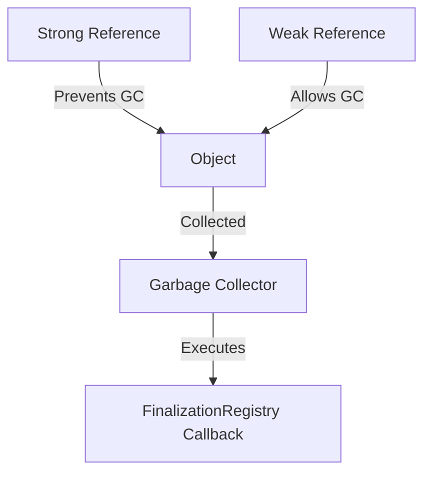

## 10.10. Exploring Weak References

In the realm of JavaScript, memory management is a crucial aspect that can significantly impact the performance and efficiency of your applications. As we delve deeper into advanced topics, understanding weak references becomes essential. Weak references provide a way to hold references to objects without preventing them from being garbage collected. This section will guide you through the concept of weak references, how they differ from strong references, and their practical applications using `WeakRef` and `FinalizationRegistry`.

### Understanding Weak References

#### What are Weak References?

In JavaScript, a reference to an object is typically strong, meaning that as long as there is a reference to an object, it will not be garbage collected. However, weak references allow you to hold a reference to an object without preventing it from being collected. This means that if there are no strong references to an object, it can be garbage collected even if there are weak references pointing to it.

#### Strong vs. Weak References

- **Strong References**: These are the default references in JavaScript. An object with strong references will remain in memory as long as there is at least one strong reference pointing to it.
  
- **Weak References**: These allow the garbage collector to reclaim the object if there are no strong references. Weak references are useful for caching or mapping objects without affecting their lifecycle.

### Introducing `WeakRef` and `FinalizationRegistry`

#### `WeakRef`

The `WeakRef` object in JavaScript provides a way to create weak references to objects. It allows you to hold a reference to an object without preventing its garbage collection. Here's how you can create a weak reference using `WeakRef`:

```javascript
// Creating a weak reference to an object
let obj = { name: "JavaScript" };
let weakRef = new WeakRef(obj);

// Accessing the object through the weak reference
let derefObj = weakRef.deref();
console.log(derefObj ? derefObj.name : "Object has been garbage collected");
```

In this example, `weakRef` holds a weak reference to `obj`. The `deref` method is used to access the object. If the object has been garbage collected, `deref` returns `undefined`.

#### `FinalizationRegistry`

The `FinalizationRegistry` is a powerful tool that allows you to register a callback to be executed after an object is garbage collected. This can be useful for cleanup tasks or resource management.

```javascript
// Creating a finalization registry
let registry = new FinalizationRegistry((heldValue) => {
  console.log(`Object with value ${heldValue} has been garbage collected`);
});

// Registering an object with the registry
let obj = { name: "JavaScript" };
registry.register(obj, "JavaScript Object");

// Removing the strong reference
obj = null;

// The callback will be executed once the object is garbage collected
```

In this code, we register an object with the `FinalizationRegistry`. Once the object is no longer reachable and is garbage collected, the callback is executed.

### Garbage Collection Behavior with Weak References

Garbage collection in JavaScript is an automatic process that reclaims memory occupied by objects that are no longer in use. Weak references do not prevent objects from being garbage collected, which is a key distinction from strong references.

#### How Garbage Collection Works with Weak References

- **Non-blocking**: Weak references do not block garbage collection. If an object is only weakly referenced, it can be collected.
- **Unpredictable Timing**: The timing of garbage collection is unpredictable. Therefore, weak references should not be used for critical logic that depends on the presence of an object.
- **No Guarantees**: Weak references do not guarantee that the object will be available when accessed through `deref`.

### Appropriate Scenarios for Using Weak References

Weak references are not suitable for every situation. Here are some scenarios where they can be beneficial:

- **Caching**: Use weak references for caching objects that can be recreated if needed. This allows the cache to release objects when memory is needed elsewhere.
- **Event Listeners**: Manage event listeners in a way that does not prevent objects from being garbage collected.
- **Resource Management**: Use `FinalizationRegistry` for cleanup tasks, such as closing file handles or network connections.

### Code Examples

Let's explore some practical examples to solidify our understanding of weak references.

#### Example 1: Caching with Weak References

```javascript
class Cache {
  constructor() {
    this.cache = new Map();
  }

  add(key, value) {
    this.cache.set(key, new WeakRef(value));
  }

  get(key) {
    let weakRef = this.cache.get(key);
    return weakRef ? weakRef.deref() : undefined;
  }
}

let cache = new Cache();
let obj = { data: "Important Data" };
cache.add("dataKey", obj);

// Accessing the cached object
console.log(cache.get("dataKey")); // { data: "Important Data" }

// Removing strong reference
obj = null;

// Object may be garbage collected
console.log(cache.get("dataKey")); // undefined (if garbage collected)
```

In this example, we create a simple cache using weak references. The cache does not prevent objects from being garbage collected, allowing memory to be freed when needed.

#### Example 2: Cleanup with `FinalizationRegistry`

```javascript
class Resource {
  constructor(name) {
    this.name = name;
    this.registry = new FinalizationRegistry((heldValue) => {
      console.log(`Cleaning up resource: ${heldValue}`);
    });
    this.registry.register(this, name);
  }
}

let resource = new Resource("File Handle");

// Removing strong reference
resource = null;

// The cleanup callback will be executed once the resource is garbage collected
```

This example demonstrates using `FinalizationRegistry` to manage resource cleanup. When the `Resource` object is no longer reachable, the registry executes the cleanup callback.

### Visualizing Weak References

To better understand how weak references interact with garbage collection, let's visualize the process using a diagram.



**Diagram Description**: This diagram illustrates the relationship between strong and weak references. Strong references prevent garbage collection, while weak references allow it. Once the object is collected, the `FinalizationRegistry` callback is executed.

### References and Links

For further reading on weak references and memory management in JavaScript, consider exploring the following resources:

- [MDN Web Docs: WeakRef](https://developer.mozilla.org/en-US/docs/Web/JavaScript/Reference/Global_Objects/WeakRef)
- [MDN Web Docs: FinalizationRegistry](https://developer.mozilla.org/en-US/docs/Web/JavaScript/Reference/Global_Objects/FinalizationRegistry)
- [JavaScript.info: Garbage Collection](https://javascript.info/garbage-collection)

### Knowledge Check

Let's reinforce what we've learned with some questions and exercises.

- **Question**: What is the primary difference between strong and weak references?
- **Exercise**: Modify the caching example to handle multiple objects and test the behavior when objects are garbage collected.

### Embrace the Journey

Remember, mastering weak references is just one step in your JavaScript journey. As you continue to explore and experiment, you'll gain a deeper understanding of how to manage memory efficiently in your applications. Keep experimenting, stay curious, and enjoy the journey!

## Quiz Time!



### What is a weak reference in JavaScript?

- [x] A reference that does not prevent an object from being garbage collected.
- [ ] A reference that prevents an object from being garbage collected.
- [ ] A reference that is stronger than a strong reference.
- [ ] A reference that is used only in strict mode.

> **Explanation:** A weak reference allows an object to be garbage collected if there are no strong references to it.

### How do you create a weak reference in JavaScript?

- [x] Using the `WeakRef` constructor.
- [ ] Using the `WeakMap` constructor.
- [ ] Using the `WeakSet` constructor.
- [ ] Using the `WeakReference` constructor.

> **Explanation:** The `WeakRef` constructor is used to create a weak reference to an object.

### What does the `deref` method do in a `WeakRef` object?

- [x] It returns the referenced object if it hasn't been garbage collected.
- [ ] It deletes the weak reference.
- [ ] It prevents the object from being garbage collected.
- [ ] It creates a strong reference to the object.

> **Explanation:** The `deref` method returns the referenced object or `undefined` if the object has been garbage collected.

### What is the purpose of `FinalizationRegistry`?

- [x] To execute a callback after an object is garbage collected.
- [ ] To prevent an object from being garbage collected.
- [ ] To create strong references to objects.
- [ ] To manage event listeners.

> **Explanation:** `FinalizationRegistry` allows you to register a callback to be executed after an object is garbage collected.

### When should you use weak references?

- [x] For caching objects that can be recreated if needed.
- [ ] For storing critical application data.
- [x] For managing event listeners.
- [ ] For ensuring objects are never garbage collected.

> **Explanation:** Weak references are useful for caching and managing event listeners without preventing garbage collection.

### What happens if you try to access an object through a weak reference after it has been garbage collected?

- [x] The `deref` method returns `undefined`.
- [ ] The `deref` method throws an error.
- [ ] The object is recreated automatically.
- [ ] The weak reference becomes a strong reference.

> **Explanation:** If the object has been garbage collected, `deref` returns `undefined`.

### Can weak references be used for critical application logic?

- [ ] Yes, they are reliable for critical logic.
- [x] No, because their timing and availability are unpredictable.
- [ ] Yes, but only in strict mode.
- [ ] No, because they are not supported in all browsers.

> **Explanation:** Weak references should not be used for critical logic due to their unpredictable nature.

### What is the main advantage of using weak references?

- [x] They allow objects to be garbage collected when no longer needed.
- [ ] They prevent all objects from being garbage collected.
- [ ] They make objects immutable.
- [ ] They increase the performance of JavaScript code.

> **Explanation:** Weak references allow objects to be garbage collected, freeing up memory.

### Which method is used to register an object with a `FinalizationRegistry`?

- [x] `register`
- [ ] `deref`
- [ ] `add`
- [ ] `finalize`

> **Explanation:** The `register` method is used to register an object with a `FinalizationRegistry`.

### True or False: Weak references guarantee that the referenced object will be available when accessed.

- [ ] True
- [x] False

> **Explanation:** Weak references do not guarantee the availability of the referenced object, as it may have been garbage collected.


