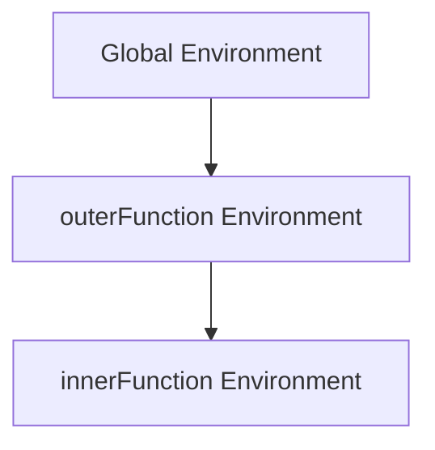
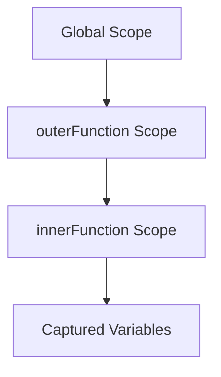

## 10.2. Closures and Lexical Environment

In this section, we will delve into the fascinating world of closures and lexical environments in JavaScript. These concepts are pivotal in understanding how JavaScript functions interact with variables and how they can be used to create powerful programming patterns. Let's embark on this journey to deepen our understanding of closures and lexical environments.

### What are Closures?

Closures are a fundamental concept in JavaScript that allow functions to capture and remember their surrounding environment, even after they have finished executing. In simpler terms, a closure gives you access to an outer function's scope from an inner function. This is achieved by the inner function "closing over" the variables of the outer function.

#### Example of a Closure

Let's start with a basic example to illustrate how closures work:

```javascript
function outerFunction(outerVariable) {
    return function innerFunction(innerVariable) {
        console.log('Outer Variable: ' + outerVariable);
        console.log('Inner Variable: ' + innerVariable);
    };
}

const newFunction = outerFunction('outside');
newFunction('inside');
```

**Explanation:**

- `outerFunction` takes a parameter `outerVariable` and returns `innerFunction`.
- `innerFunction` is a closure that captures `outerVariable` from its lexical environment.
- When `newFunction` is called, it logs both `outerVariable` and `innerVariable`.

### Lexical Environment

To understand closures, we need to grasp the concept of a lexical environment. A lexical environment is a structure that holds identifier-variable mapping. In simpler terms, it is a place where variable names are mapped to their values.

#### How Lexical Environment Works

Every time a function is invoked, a new lexical environment is created. This environment consists of:

1. **Environment Record**: A record of all the variables and functions defined in the current execution context.
2. **Reference to the Outer Lexical Environment**: A reference to the lexical environment of the parent execution context.

Let's visualize this concept:



**Description:** The diagram shows the hierarchical relationship between the global environment, the `outerFunction` environment, and the `innerFunction` environment.

### Practical Applications of Closures

Closures are not just theoretical concepts; they have practical applications that make JavaScript a powerful language. Here are a few:

#### Data Encapsulation

Closures can be used to encapsulate data, providing a way to create private variables that cannot be accessed from outside the function.

```javascript
function createCounter() {
    let count = 0;
    return function() {
        count += 1;
        return count;
    };
}

const counter = createCounter();
console.log(counter()); // 1
console.log(counter()); // 2
```

**Explanation:**

- `createCounter` returns a function that increments and returns `count`.
- `count` is encapsulated within the closure and cannot be accessed directly from outside.

#### Function Factories

Closures allow us to create function factories, which are functions that return other functions. This pattern is useful for creating functions with pre-configured settings.

```javascript
function createMultiplier(multiplier) {
    return function(value) {
        return value * multiplier;
    };
}

const double = createMultiplier(2);
console.log(double(5)); // 10
```

**Explanation:**

- `createMultiplier` returns a function that multiplies a given value by `multiplier`.
- `double` is a function that doubles any given number.

### Potential Pitfalls and Memory Considerations

While closures are powerful, they can also lead to potential pitfalls, especially in terms of memory usage and unexpected behavior.

#### Memory Leaks

Closures can cause memory leaks if not used carefully. This happens when a closure retains references to variables that are no longer needed, preventing them from being garbage collected.

**Avoiding Memory Leaks:**

- Be mindful of closures that capture large objects or DOM elements.
- Ensure that closures are not unnecessarily retained after their purpose is served.

#### Unexpected Behavior

Closures can sometimes lead to unexpected behavior, especially in loops. Consider the following example:

```javascript
for (var i = 0; i < 3; i++) {
    setTimeout(function() {
        console.log(i);
    }, 1000);
}
```

**Explanation:**

- The above code logs `3` three times because the closure captures the reference to `i`, not its value.
- By the time the `setTimeout` callbacks execute, the loop has completed, and `i` is `3`.

**Solution:**

Use `let` to create a new lexical environment for each iteration:

```javascript
for (let i = 0; i < 3; i++) {
    setTimeout(function() {
        console.log(i);
    }, 1000);
}
```

### Visualizing Closures and Lexical Environment

Let's use a diagram to visualize how closures capture their lexical environment:



**Description:** This diagram illustrates how the `innerFunction` captures variables from its parent scope, forming a closure.

### Try It Yourself

To solidify your understanding of closures, try modifying the examples above:

- Change the `outerVariable` in the closure example and observe the output.
- Create a new function factory that adds a fixed number to its input.
- Experiment with closures in loops using both `var` and `let`.

### Key Takeaways

- **Closures** allow functions to capture and remember their surrounding environment.
- **Lexical Environment** is the context in which variables are defined and accessed.
- Closures enable **data encapsulation** and **function factories**.
- Be cautious of **memory leaks** and **unexpected behavior** when using closures.

### References and Further Reading

- [MDN Web Docs: Closures](https://developer.mozilla.org/en-US/docs/Web/JavaScript/Closures)
- [JavaScript.info: Closures](https://javascript.info/closure)
- [W3Schools: JavaScript Closures](https://www.w3schools.com/js/js_function_closures.asp)

### Embrace the Journey

Remember, mastering closures and lexical environments is a significant step in your JavaScript journey. As you continue to explore these concepts, you'll unlock new possibilities in your programming endeavors. Keep experimenting, stay curious, and enjoy the journey!

## Quiz Time!



### What is a closure in JavaScript?

- [x] A function that remembers its lexical environment
- [ ] A function that does not have access to its outer scope
- [ ] A function that is executed immediately
- [ ] A function that does not return anything

> **Explanation:** A closure is a function that captures and remembers its lexical environment, allowing it to access variables from its parent scope even after the parent function has finished executing.

### What is a lexical environment?

- [x] A structure that holds identifier-variable mapping
- [ ] A list of all functions in a program
- [ ] A collection of all global variables
- [ ] A special type of closure

> **Explanation:** A lexical environment is a structure that holds the mapping between variable names and their values within a specific execution context.

### How can closures be used for data encapsulation?

- [x] By creating private variables that cannot be accessed from outside
- [ ] By making all variables global
- [ ] By using `var` instead of `let`
- [ ] By creating multiple closures

> **Explanation:** Closures can encapsulate data by creating private variables within a function, which cannot be accessed directly from outside the function.

### What is a function factory?

- [x] A function that returns other functions
- [ ] A function that only executes once
- [ ] A function that does not take any parameters
- [ ] A function that is defined inside a loop

> **Explanation:** A function factory is a function that returns other functions, often with pre-configured settings or behavior.

### How can memory leaks occur with closures?

- [x] By retaining references to variables that are no longer needed
- [ ] By using `let` instead of `var`
- [ ] By creating too many closures
- [ ] By using closures inside loops

> **Explanation:** Memory leaks can occur when closures retain references to variables that are no longer needed, preventing them from being garbage collected.

### What is the solution to avoid unexpected behavior in loops with closures?

- [x] Use `let` to create a new lexical environment for each iteration
- [ ] Use `var` to declare loop variables
- [ ] Avoid using closures in loops
- [ ] Use `const` for loop variables

> **Explanation:** Using `let` in loops creates a new lexical environment for each iteration, preventing closures from capturing the same variable reference.

### Which of the following is NOT a practical application of closures?

- [ ] Data encapsulation
- [ ] Function factories
- [x] Global variable creation
- [ ] Event handlers

> **Explanation:** Closures are not used for creating global variables; they are used for encapsulating data and creating functions with specific behavior.

### What happens when a closure captures a variable?

- [x] It remembers the variable's value and reference
- [ ] It creates a new global variable
- [ ] It deletes the variable from the parent scope
- [ ] It prevents the variable from being used in the parent scope

> **Explanation:** When a closure captures a variable, it remembers the variable's value and reference, allowing it to access and modify the variable even after the parent function has finished executing.

### Can closures be used to create private methods in JavaScript?

- [x] True
- [ ] False

> **Explanation:** Closures can be used to create private methods by encapsulating functions within a closure, making them inaccessible from outside the closure.

### What is the main advantage of using closures?

- [x] They allow functions to access variables from their parent scope
- [ ] They make all variables global
- [ ] They prevent functions from being reused
- [ ] They make code run faster

> **Explanation:** The main advantage of using closures is that they allow functions to access and remember variables from their parent scope, enabling powerful programming patterns like data encapsulation and function factories.


