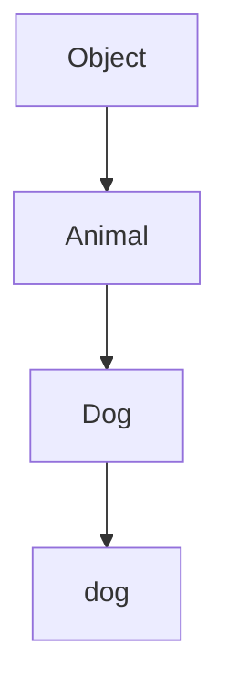

## 10.3. Prototypes and Inheritance

In JavaScript, understanding prototypes and inheritance is crucial for mastering object-oriented programming. This section will guide you through the concepts of prototypes, the prototype chain, and how inheritance works in JavaScript. We'll explore these concepts using both the traditional constructor function approach and the modern `class` syntax introduced in ES6.

### What are Prototypes?

In JavaScript, every object has a prototype. A prototype is a mechanism by which JavaScript objects inherit features from one another. When you create an object, it automatically receives a prototype, which is another object from which it can inherit properties and methods.

#### The Prototype Chain

The prototype chain is a series of links between objects. Each object has a reference to its prototype, and this chain continues until it reaches an object with a `null` prototype, known as the base object. This chain allows objects to inherit properties and methods from their prototypes.

```javascript
// Example of a prototype chain
function Animal(name) {
    this.name = name;
}

Animal.prototype.speak = function() {
    console.log(`${this.name} makes a noise.`);
};

const dog = new Animal('Dog');
dog.speak(); // Dog makes a noise.
```

In the example above, the `dog` object inherits the `speak` method from the `Animal` prototype.

### How Inheritance Works in JavaScript

Inheritance in JavaScript is achieved through the prototype chain. When you try to access a property or method on an object, JavaScript first looks at the object itself. If it doesn't find the property or method, it looks at the object's prototype, and so on, up the prototype chain.

#### Constructor Functions and Prototypes

Constructor functions are a traditional way to create objects in JavaScript. When you use a constructor function, the `new` keyword creates a new object and sets its prototype to the constructor's `prototype` property.

```javascript
function Person(firstName, lastName) {
    this.firstName = firstName;
    this.lastName = lastName;
}

Person.prototype.getFullName = function() {
    return `${this.firstName} ${this.lastName}`;
};

const john = new Person('John', 'Doe');
console.log(john.getFullName()); // John Doe
```

In this example, `john` is an instance of `Person`, and it inherits the `getFullName` method from `Person.prototype`.

#### ES6 Classes and Inheritance

With ES6, JavaScript introduced the `class` syntax, which provides a more straightforward way to implement inheritance. Although the `class` syntax is syntactic sugar over the existing prototype-based inheritance, it makes the code more readable and easier to understand.

```javascript
class Animal {
    constructor(name) {
        this.name = name;
    }

    speak() {
        console.log(`${this.name} makes a noise.`);
    }
}

class Dog extends Animal {
    speak() {
        console.log(`${this.name} barks.`);
    }
}

const dog = new Dog('Rex');
dog.speak(); // Rex barks.
```

In this example, `Dog` is a subclass of `Animal`. It inherits the `speak` method from `Animal`, but it overrides it to provide its own implementation.

### Impact on Variables and Method Overrides

When you override a method in a subclass, the method in the superclass is still accessible through the prototype chain. You can call the superclass method using the `super` keyword in ES6 classes.

```javascript
class Animal {
    constructor(name) {
        this.name = name;
    }

    speak() {
        console.log(`${this.name} makes a noise.`);
    }
}

class Dog extends Animal {
    speak() {
        super.speak(); // Call the superclass method
        console.log(`${this.name} barks.`);
    }
}

const dog = new Dog('Rex');
dog.speak();
// Output:
// Rex makes a noise.
// Rex barks.
```

In this example, `super.speak()` calls the `speak` method from the `Animal` class, allowing the `Dog` class to extend its functionality.

### Best Practices for Implementing Inheritance

1. **Use Classes for Readability**: With ES6, prefer using `class` syntax for implementing inheritance. It makes your code more readable and aligns with other object-oriented languages.

2. **Avoid Deep Inheritance Chains**: Keep inheritance chains shallow to avoid complexity and improve maintainability.

3. **Use Composition Over Inheritance**: In some cases, using composition (combining objects) is more flexible and easier to manage than inheritance.

4. **Override Methods Carefully**: When overriding methods, ensure that the new implementation is consistent with the superclass's behavior.

5. **Document Inherited Methods**: Clearly document which methods are inherited and which are overridden to help others understand your code.

### Visualizing the Prototype Chain

To better understand the prototype chain, let's visualize it using a diagram. The following diagram illustrates how objects are linked through their prototypes:



In this diagram, `dog` is an instance of `Dog`, which inherits from `Animal`, and `Animal` inherits from the base `Object`.

### Try It Yourself

To reinforce your understanding, try modifying the code examples above. For instance, create a new subclass of `Animal`, such as `Cat`, and implement its own `speak` method. Experiment with calling the superclass method using `super`.

### References and Links

- [MDN Web Docs: Inheritance and the prototype chain](https://developer.mozilla.org/en-US/docs/Web/JavaScript/Inheritance_and_the_prototype_chain)
- [MDN Web Docs: Classes](https://developer.mozilla.org/en-US/docs/Web/JavaScript/Reference/Classes)
- [W3Schools: JavaScript Prototypes](https://www.w3schools.com/js/js_object_prototypes.asp)

### Knowledge Check

- What is a prototype in JavaScript?
- How does the prototype chain work?
- How do you implement inheritance using constructor functions?
- How do ES6 classes simplify inheritance?
- What are some best practices for using inheritance in JavaScript?

### Embrace the Journey

Remember, understanding prototypes and inheritance is a significant step in mastering JavaScript. As you continue to learn, you'll be able to create more complex and efficient code. Keep experimenting, stay curious, and enjoy the journey!

## Quiz Time!



### What is a prototype in JavaScript?

- [x] An object from which other objects inherit properties and methods.
- [ ] A function that creates new objects.
- [ ] A variable that holds object properties.
- [ ] A method that defines object behavior.

> **Explanation:** A prototype is an object from which other objects inherit properties and methods.

### How does the prototype chain work?

- [x] It links objects through their prototypes, allowing inheritance of properties and methods.
- [ ] It creates new objects from existing ones.
- [ ] It defines the scope of variables within functions.
- [ ] It manages memory allocation for objects.

> **Explanation:** The prototype chain links objects through their prototypes, allowing inheritance of properties and methods.

### How do you implement inheritance using constructor functions?

- [x] By setting the constructor's prototype property to an object with shared methods.
- [ ] By using the `extends` keyword.
- [ ] By creating a new object with `Object.create()`.
- [ ] By defining methods directly on the object.

> **Explanation:** Inheritance using constructor functions is implemented by setting the constructor's prototype property to an object with shared methods.

### How do ES6 classes simplify inheritance?

- [x] They provide a more readable syntax for defining classes and inheritance.
- [ ] They eliminate the need for prototypes.
- [ ] They automatically create new objects.
- [ ] They remove the need for the `new` keyword.

> **Explanation:** ES6 classes provide a more readable syntax for defining classes and inheritance, making the code easier to understand.

### What is the `super` keyword used for in ES6 classes?

- [x] To call methods from the superclass.
- [ ] To create new objects.
- [ ] To define private methods.
- [ ] To access global variables.

> **Explanation:** The `super` keyword is used to call methods from the superclass in ES6 classes.

### What is a best practice when using inheritance in JavaScript?

- [x] Use composition over inheritance when possible.
- [ ] Always use deep inheritance chains.
- [ ] Avoid using the `class` syntax.
- [ ] Override methods without considering the superclass behavior.

> **Explanation:** Using composition over inheritance is a best practice as it provides more flexibility and easier management.

### What does the `extends` keyword do in ES6 classes?

- [x] It creates a subclass that inherits from a superclass.
- [ ] It defines a new method on an object.
- [ ] It initializes a new object.
- [ ] It sets a variable's scope.

> **Explanation:** The `extends` keyword is used to create a subclass that inherits from a superclass in ES6 classes.

### What is the impact of overriding methods in a subclass?

- [x] The subclass can provide its own implementation while still accessing the superclass method.
- [ ] The superclass method is deleted.
- [ ] The method cannot be called from the subclass.
- [ ] The method becomes private.

> **Explanation:** Overriding methods in a subclass allows the subclass to provide its own implementation while still accessing the superclass method using `super`.

### How can you visualize the prototype chain?

- [x] By using a diagram that shows the links between objects and their prototypes.
- [ ] By listing all variables in a function.
- [ ] By creating a new object for each method.
- [ ] By defining all methods in a single object.

> **Explanation:** The prototype chain can be visualized using a diagram that shows the links between objects and their prototypes.

### True or False: Inheritance in JavaScript is achieved through the prototype chain.

- [x] True
- [ ] False

> **Explanation:** True. Inheritance in JavaScript is achieved through the prototype chain.


