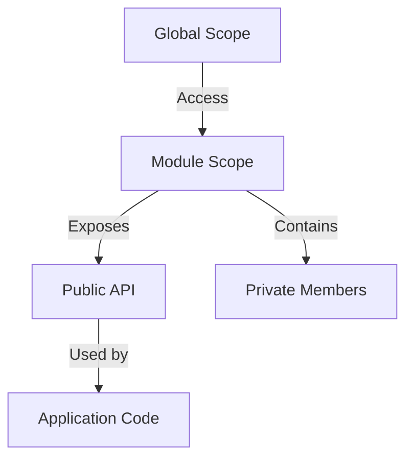

## 10.4. The Module Pattern

In the world of JavaScript, managing variables and their scopes is crucial for writing clean, maintainable, and efficient code. One of the most effective ways to achieve this is through the use of the **Module Pattern**. This pattern allows us to encapsulate variables and create private scopes, leading to better-organized code and fewer conflicts. In this section, we'll explore the module pattern in detail, understand its benefits, and learn how to implement it using both Immediately Invoked Function Expressions (IIFEs) and ES6 modules.

### Introduction to the Module Pattern

The module pattern is a design pattern used to create modules in JavaScript. A module is a self-contained piece of code that can be reused throughout your application. Modules help in organizing code into separate, logical units, making it easier to manage and maintain. They also allow us to encapsulate variables and functions, preventing them from polluting the global scope.

#### Benefits of the Module Pattern

1. **Encapsulation**: Modules allow us to encapsulate variables and functions, keeping them private and only exposing what is necessary. This prevents accidental interference with other parts of the code.

2. **Namespace Management**: By using modules, we can avoid naming conflicts in the global scope, as each module can have its own namespace.

3. **Code Reusability**: Modules can be reused across different parts of an application or even in different projects, promoting code reuse.

4. **Maintainability**: By organizing code into modules, we make it easier to understand and maintain, as each module has a clear responsibility.

5. **Dependency Management**: Modules help manage dependencies between different parts of the code, making it easier to track and update them.

### Implementing Modules with IIFEs

Before the introduction of ES6 modules, JavaScript developers commonly used Immediately Invoked Function Expressions (IIFEs) to create modules. An IIFE is a function that is executed immediately after it is defined. It provides a way to create a private scope for variables and functions.

#### Creating a Module with IIFE

Let's create a simple module using an IIFE:

```javascript
const myModule = (function() {
  // Private variables and functions
  let privateVariable = 'I am private';

  function privateFunction() {
    console.log(privateVariable);
  }

  // Public API
  return {
    publicMethod: function() {
      privateFunction();
    }
  };
})();

// Usage
myModule.publicMethod(); // Output: I am private
```

**Explanation**: In the code above, we define a module using an IIFE. Inside the IIFE, we declare a private variable and a private function. These are not accessible from outside the module. We then return an object that exposes a public method, `publicMethod`, which internally calls the private function.

#### Advantages of Using IIFE

- **Privacy**: Variables and functions defined inside the IIFE are not accessible from outside, ensuring privacy.
- **Immediate Execution**: The function is executed immediately, setting up the module and its private state.

### Implementing Modules with ES6 Modules

With the introduction of ES6, JavaScript now has built-in support for modules. ES6 modules provide a more standardized and powerful way to create modules compared to IIFEs.

#### Creating a Module with ES6

To create a module using ES6, we use the `export` and `import` keywords. Here's an example:

**mathModule.js** (Module File)

```javascript
// Private variables and functions
const pi = 3.14159;

function calculateCircumference(radius) {
  return 2 * pi * radius;
}

// Public API
export function getCircumference(radius) {
  return calculateCircumference(radius);
}
```

**app.js** (Using the Module)

```javascript
import { getCircumference } from './mathModule.js';

console.log(getCircumference(5)); // Output: 31.4159
```

**Explanation**: In the `mathModule.js` file, we define a private variable `pi` and a private function `calculateCircumference`. We then export a public function `getCircumference` that uses the private function. In `app.js`, we import the `getCircumference` function and use it.

#### Advantages of ES6 Modules

- **Standardization**: ES6 modules are part of the JavaScript standard, ensuring consistency across different environments.
- **Static Analysis**: Tools can analyze ES6 modules statically, providing better support for features like tree shaking.
- **Improved Dependency Management**: ES6 modules provide a clear syntax for importing and exporting dependencies, making it easier to manage them.

### Private and Public Members in Modules

One of the key features of the module pattern is the ability to define private and public members. Private members are not accessible from outside the module, while public members are exposed as part of the module's API.

#### Defining Private Members

Private members are defined within the module's scope and are not returned in the module's public API. They can only be accessed by other functions within the same module.

#### Defining Public Members

Public members are returned as part of the module's public API. They can be accessed from outside the module and are typically used to interact with the module's functionality.

### Organizing Code into Modules

Organizing code into modules is a best practice that leads to cleaner and more maintainable code. Here are some tips for organizing code into modules:

1. **Single Responsibility**: Each module should have a single responsibility or purpose. This makes it easier to understand and maintain.

2. **Clear API**: Define a clear and concise public API for each module. Only expose what is necessary and keep the rest private.

3. **Consistent Naming**: Use consistent naming conventions for modules and their members to improve readability.

4. **Logical Grouping**: Group related functions and variables into the same module. This helps in managing dependencies and understanding the code structure.

### Managing Variable Scope and Dependencies with Modules

Modules play a crucial role in managing variable scope and dependencies. By encapsulating variables within modules, we prevent them from polluting the global scope. This reduces the risk of naming conflicts and makes the code more predictable.

#### Managing Variable Scope

Modules create a private scope for variables, ensuring that they do not interfere with other parts of the code. This is particularly important in large applications where multiple developers may be working on the same codebase.

#### Managing Dependencies

Modules allow us to define dependencies explicitly using `import` and `export` statements. This makes it easier to track and update dependencies, as well as to understand how different parts of the code interact with each other.

### Visualizing the Module Pattern

To better understand how the module pattern works, let's visualize it using a diagram.



**Description**: The diagram above illustrates the relationship between the global scope, module scope, and application code. The module scope contains both private members and a public API. The public API is exposed to the global scope and can be used by the application code, while private members remain encapsulated within the module.

### Try It Yourself

Now that we've covered the basics of the module pattern, it's time to try it yourself. Here's a simple exercise to get you started:

1. **Create a Module**: Write a module that manages a list of tasks. The module should have private methods to add and remove tasks, and a public method to get the list of tasks.

2. **Use IIFE**: Implement the module using an IIFE and test it in your browser's console.

3. **Convert to ES6 Module**: Convert the IIFE module to an ES6 module and test it using a module bundler like Webpack or a modern browser that supports ES6 modules.

### References and Links

- [MDN Web Docs: Modules](https://developer.mozilla.org/en-US/docs/Web/JavaScript/Guide/Modules)
- [JavaScript.info: Modules](https://javascript.info/modules)
- [W3Schools: JavaScript Modules](https://www.w3schools.com/js/js_modules.asp)

### Knowledge Check

Let's reinforce what we've learned with a few questions and exercises:

- What are the main benefits of using the module pattern in JavaScript?
- How do IIFEs help in creating private scopes?
- What are the differences between IIFE-based modules and ES6 modules?
- Try creating a module that manages a simple counter with increment and decrement methods.

### Embrace the Journey

Remember, mastering the module pattern is just one step in your JavaScript journey. As you continue to learn and experiment, you'll discover more patterns and techniques that will help you write better code. Keep exploring, stay curious, and enjoy the process!

## Quiz Time!



### What is the primary purpose of the module pattern in JavaScript?

- [x] Encapsulating variables and creating private scopes
- [ ] Improving the performance of JavaScript code
- [ ] Simplifying the syntax of JavaScript functions
- [ ] Automatically optimizing code for different browsers

> **Explanation:** The module pattern is primarily used to encapsulate variables and create private scopes, preventing them from polluting the global namespace.

### Which of the following is a key benefit of using modules?

- [x] Code reusability
- [ ] Faster execution speed
- [ ] Reduced memory usage
- [ ] Automatic error handling

> **Explanation:** Modules promote code reusability by allowing developers to encapsulate and reuse code across different parts of an application.

### How are private members defined in an IIFE-based module?

- [x] By declaring them inside the IIFE and not returning them in the public API
- [ ] By using the `private` keyword
- [ ] By prefixing their names with an underscore
- [ ] By declaring them outside the IIFE

> **Explanation:** Private members in an IIFE-based module are defined inside the IIFE and are not returned in the module's public API.

### What keyword is used to export functions in an ES6 module?

- [x] export
- [ ] import
- [ ] module
- [ ] function

> **Explanation:** The `export` keyword is used to export functions, variables, or objects from an ES6 module.

### What is an IIFE?

- [x] A function that is executed immediately after it is defined
- [ ] A function that is defined but not executed
- [ ] A function that is executed only when called explicitly
- [ ] A function that is executed at the end of a script

> **Explanation:** An IIFE (Immediately Invoked Function Expression) is a function that is executed immediately after it is defined.

### How do ES6 modules improve dependency management?

- [x] By providing a clear syntax for importing and exporting dependencies
- [ ] By automatically resolving all dependencies
- [ ] By reducing the number of dependencies needed
- [ ] By eliminating the need for dependencies

> **Explanation:** ES6 modules provide a clear syntax for importing and exporting dependencies, making it easier to manage them.

### What is the role of the `import` keyword in ES6 modules?

- [x] To bring in functions, objects, or variables from other modules
- [ ] To declare new variables within a module
- [ ] To execute a module's code
- [ ] To define private members within a module

> **Explanation:** The `import` keyword is used to bring in functions, objects, or variables from other modules into the current module.

### Which of the following is a characteristic of a well-organized module?

- [x] It has a single responsibility
- [ ] It contains as many functions as possible
- [ ] It exposes all its variables and functions
- [ ] It is dependent on global variables

> **Explanation:** A well-organized module should have a single responsibility, making it easier to understand and maintain.

### What is the main difference between IIFE-based modules and ES6 modules?

- [x] IIFE-based modules use functions to create private scopes, while ES6 modules use `import` and `export` syntax
- [ ] IIFE-based modules are faster than ES6 modules
- [ ] ES6 modules are only used in Node.js
- [ ] IIFE-based modules require a module bundler

> **Explanation:** IIFE-based modules use functions to create private scopes, while ES6 modules use `import` and `export` syntax for defining and using modules.

### True or False: ES6 modules are part of the JavaScript standard.

- [x] True
- [ ] False

> **Explanation:** True. ES6 modules are part of the JavaScript standard, providing a standardized way to create and use modules.


