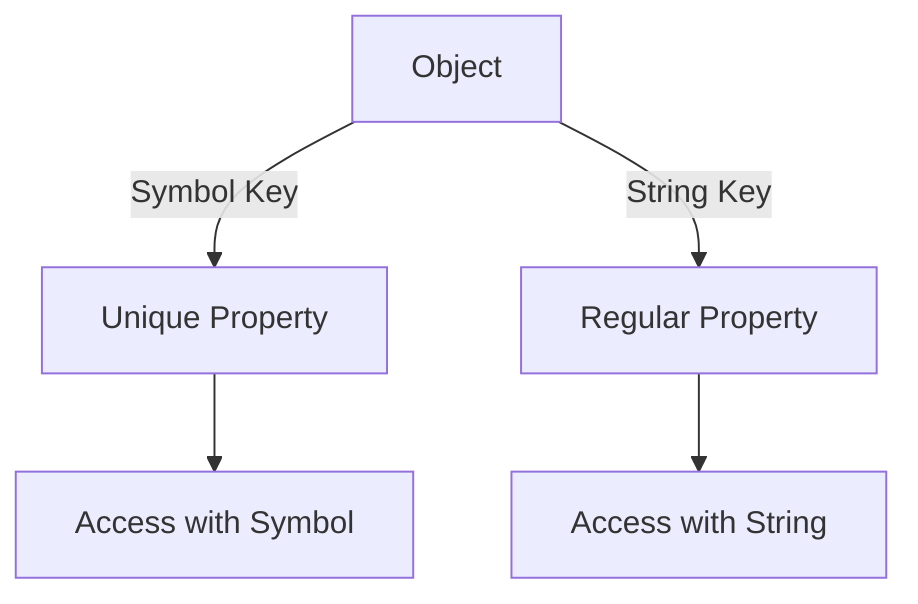

## 10.5. Symbols as Unique Object Keys

In the world of JavaScript, symbols offer a fascinating way to create unique object keys, providing a solution to potential naming collisions and enhancing the robustness of your code. This section will guide you through understanding symbols, their creation, and their use as unique keys in objects. We'll also explore their applications in API design and meta-programming, while discussing their limitations and comparing them with string keys.

### Understanding Symbols

Symbols are a primitive data type introduced in ECMAScript 2015 (ES6). They are unique and immutable, meaning each symbol is distinct from every other symbol, even if they have the same description. This uniqueness makes them ideal for use as object property keys, where you want to avoid accidental name collisions.

#### Creating Symbols

To create a symbol, you use the `Symbol()` function. You can optionally provide a description, which is useful for debugging purposes.

```javascript
// Creating a symbol without a description
const uniqueId = Symbol();

// Creating a symbol with a description
const userId = Symbol('userId');

console.log(uniqueId); // Symbol()
console.log(userId);   // Symbol(userId)
```

In the examples above, `uniqueId` and `userId` are both symbols, but they are unique and not equal to each other.

### Using Symbols as Object Keys

Symbols can be used as keys in objects, allowing you to define properties that won't conflict with other properties, even if they have the same name.

#### Adding Symbol-Keyed Properties

To add a symbol-keyed property to an object, you use the symbol as the key in the object literal or with bracket notation.

```javascript
const user = {
  name: 'Alice',
  age: 30
};

// Using a symbol as a key
const id = Symbol('id');
user[id] = 12345;

console.log(user); // { name: 'Alice', age: 30, [Symbol(id)]: 12345 }
```

In this example, the `id` symbol is used as a key for the `user` object, ensuring that this property is unique and won't conflict with other properties.

#### Accessing Symbol-Keyed Properties

To access a symbol-keyed property, you must use the symbol itself, as it is not accessible through dot notation.

```javascript
// Accessing a symbol-keyed property
console.log(user[id]); // 12345
```

### Use Cases for Symbols

Symbols are particularly useful in scenarios where you need to ensure the uniqueness of property keys, such as in API design and meta-programming.

#### API Design

In API design, symbols can be used to define private or semi-private properties, ensuring that they don't interfere with other properties or methods.

```javascript
const api = (() => {
  const internalId = Symbol('internalId');

  return {
    setId(obj, id) {
      obj[internalId] = id;
    },
    getId(obj) {
      return obj[internalId];
    }
  };
})();

const user = {};
api.setId(user, 101);
console.log(api.getId(user)); // 101
```

In this example, `internalId` is a symbol used to store a private identifier within an object, accessible only through the API's methods.

#### Meta-Programming

Symbols are also valuable in meta-programming, where they can be used to define well-known symbols that alter the behavior of objects.

```javascript
class Collection {
  constructor() {
    this.items = [];
  }

  [Symbol.iterator]() {
    let index = 0;
    const items = this.items;

    return {
      next() {
        if (index < items.length) {
          return { value: items[index++], done: false };
        } else {
          return { done: true };
        }
      }
    };
  }
}

const collection = new Collection();
collection.items.push(1, 2, 3);

for (const item of collection) {
  console.log(item); // 1, 2, 3
}
```

In this example, the `Symbol.iterator` is used to make the `Collection` class iterable, allowing it to be used in a `for...of` loop.

### Limitations of Symbols

While symbols provide unique keys, they come with certain limitations, particularly in enumeration and serialization.

#### Enumeration

Symbol-keyed properties are not included in `for...in` loops or `Object.keys()` output, which means they are not enumerable by default.

```javascript
const obj = {
  [Symbol('hidden')]: 'secret',
  visible: 'public'
};

for (const key in obj) {
  console.log(key); // visible
}

console.log(Object.keys(obj)); // ['visible']
```

#### Serialization

Symbol-keyed properties are also ignored by `JSON.stringify()`, which means they won't be included in JSON serialization.

```javascript
const obj = {
  [Symbol('hidden')]: 'secret',
  visible: 'public'
};

console.log(JSON.stringify(obj)); // {"visible":"public"}
```

### Comparing Symbols and String Keys

Symbols offer several advantages over string keys, particularly in terms of uniqueness and avoiding naming collisions.

#### Uniqueness

Unlike strings, symbols are guaranteed to be unique, even if they have the same description.

```javascript
const sym1 = Symbol('key');
const sym2 = Symbol('key');

console.log(sym1 === sym2); // false
```

#### Avoiding Collisions

Symbols prevent accidental collisions with other properties, making them ideal for defining private or internal properties.

```javascript
const sym = Symbol('private');
const obj = {
  [sym]: 'secret',
  private: 'not so secret'
};

console.log(obj[sym]); // secret
console.log(obj.private); // not so secret
```

### Visualizing Symbols in JavaScript

To better understand how symbols work in JavaScript, let's visualize their interaction with objects using a diagram.



This diagram illustrates how an object can have both symbol-keyed and string-keyed properties, with different methods of access.

### Try It Yourself

Experiment with symbols by modifying the examples above. Try creating multiple symbols with the same description and observe their uniqueness. Add symbol-keyed properties to objects and see how they behave in loops and JSON serialization.

### Key Takeaways

- **Symbols** provide unique keys for object properties, avoiding naming collisions.
- **Symbol-keyed properties** are not enumerable and are ignored by JSON serialization.
- **Symbols** are useful in API design and meta-programming for defining private or internal properties.
- **Symbols** offer advantages over string keys in terms of uniqueness and preventing accidental collisions.

### References and Further Reading

- [MDN Web Docs: Symbol](https://developer.mozilla.org/en-US/docs/Web/JavaScript/Reference/Global_Objects/Symbol)
- [JavaScript.info: Symbols](https://javascript.info/symbol)
- [W3Schools: JavaScript Symbols](https://www.w3schools.com/js/js_symbols.asp)

## Quiz Time!



### What is a symbol in JavaScript?

- [x] A unique and immutable primitive data type
- [ ] A mutable object type
- [ ] A string representation of a number
- [ ] A data type used for arithmetic operations

> **Explanation:** Symbols are a unique and immutable primitive data type introduced in ECMAScript 2015 (ES6).

### How do you create a symbol in JavaScript?

- [x] Using the `Symbol()` function
- [ ] Using the `new Symbol()` constructor
- [ ] Using the `symbol` keyword
- [ ] Using the `Symbol.create()` method

> **Explanation:** Symbols are created using the `Symbol()` function, optionally with a description.

### Can symbols be used as object property keys?

- [x] Yes, they can be used as unique keys
- [ ] No, they can only be used as values
- [ ] Yes, but only in arrays
- [ ] No, they are not compatible with objects

> **Explanation:** Symbols can be used as unique keys in objects, preventing naming collisions.

### What happens to symbol-keyed properties in JSON serialization?

- [x] They are ignored
- [ ] They are included as regular properties
- [ ] They cause an error
- [ ] They are converted to strings

> **Explanation:** Symbol-keyed properties are ignored by `JSON.stringify()`.

### How do you access a symbol-keyed property in an object?

- [x] Using bracket notation with the symbol
- [ ] Using dot notation
- [ ] Using the `getSymbol()` method
- [ ] Using the `Symbol.access()` function

> **Explanation:** Symbol-keyed properties are accessed using bracket notation with the symbol.

### What is a common use case for symbols in API design?

- [x] Defining private or internal properties
- [ ] Creating public methods
- [ ] Storing user data
- [ ] Performing arithmetic operations

> **Explanation:** Symbols are often used to define private or internal properties in API design.

### Are symbol-keyed properties included in `for...in` loops?

- [x] No, they are not enumerable
- [ ] Yes, they are always included
- [ ] Yes, but only if explicitly specified
- [ ] No, they cause an error in loops

> **Explanation:** Symbol-keyed properties are not included in `for...in` loops as they are not enumerable.

### Can two symbols with the same description be equal?

- [x] No, each symbol is unique
- [ ] Yes, if they have the same description
- [ ] Yes, if they are created in the same scope
- [ ] No, unless they are explicitly linked

> **Explanation:** Each symbol is unique, even if they have the same description.

### What is a limitation of symbols compared to string keys?

- [x] They are not enumerable
- [ ] They are mutable
- [ ] They can be accidentally overwritten
- [ ] They are slower to access

> **Explanation:** Symbols are not enumerable, which is a limitation compared to string keys.

### True or False: Symbols can be used to prevent naming collisions in objects.

- [x] True
- [ ] False

> **Explanation:** Symbols provide unique keys, preventing naming collisions in objects.



Remember, this is just the beginning. As you progress, you'll build more complex and interactive web pages. Keep experimenting, stay curious, and enjoy the journey!
