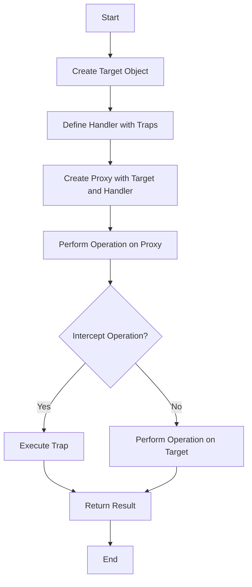

## 10.6. Proxy Objects and Metaprogramming

In the world of JavaScript, the ability to intercept and customize operations on objects opens up a realm of possibilities for developers. This is where **Proxy objects** come into play. Proxies allow us to define custom behavior for fundamental operations (e.g., property lookup, assignment, enumeration, function invocation, etc.). This chapter will guide you through the basics of Proxy objects, how to create them, and their applications in metaprogramming.

### Introduction to Proxy Objects

A **Proxy** in JavaScript is an object that wraps another object (known as the target) and intercepts operations performed on it. This interception is achieved through a set of traps, which are methods that provide property access, assignment, and other operations.

#### Purpose of Proxy Objects

The primary purpose of Proxy objects is to allow developers to define custom behavior for operations on objects. This can be useful for:

- **Logging**: Track operations on objects for debugging or auditing.
- **Validation**: Ensure that only valid data is assigned to object properties.
- **Access Control**: Restrict access to certain properties or methods.
- **Virtualization**: Create objects that behave like real objects but are actually simulations.

### Creating a Proxy

To create a Proxy, you need two components:

1. **Target**: The object that the proxy will wrap.
2. **Handler**: An object containing traps, which are methods that define custom behavior for operations on the target.

Here's a basic example of creating a Proxy:

```javascript
// Define the target object
const target = {
  message: "Hello, world!"
};

// Define the handler with traps
const handler = {
  get: function(target, property) {
    console.log(`Property '${property}' has been accessed.`);
    return target[property];
  }
};

// Create the proxy
const proxy = new Proxy(target, handler);

// Accessing a property
console.log(proxy.message); // Logs: Property 'message' has been accessed. Hello, world!
```

In this example, the `get` trap intercepts property access on the target object and logs a message before returning the property value.

### Defining Handlers (Traps)

Handlers in a Proxy object are defined as traps. Each trap corresponds to a specific operation on the target object. Here are some common traps:

- **get(target, property, receiver)**: Intercepts property access.
- **set(target, property, value, receiver)**: Intercepts property assignment.
- **has(target, property)**: Intercepts the `in` operator.
- **deleteProperty(target, property)**: Intercepts property deletion.
- **apply(target, thisArg, argumentsList)**: Intercepts function calls.
- **construct(target, argumentsList, newTarget)**: Intercepts the `new` operator.

#### Example: Logging with Proxies

Let's create a Proxy that logs every operation performed on an object:

```javascript
const targetObject = {
  name: "JavaScript",
  version: "ES6"
};

const loggingHandler = {
  get(target, property) {
    console.log(`Getting property '${property}'`);
    return target[property];
  },
  set(target, property, value) {
    console.log(`Setting property '${property}' to '${value}'`);
    target[property] = value;
    return true; // Indicate success
  }
};

const loggingProxy = new Proxy(targetObject, loggingHandler);

// Access and modify properties
console.log(loggingProxy.name); // Logs: Getting property 'name'
loggingProxy.version = "ES2021"; // Logs: Setting property 'version' to 'ES2021'
```

In this example, the `get` and `set` traps log messages whenever properties are accessed or modified.

### Validation and Access Control

Proxies can also be used to enforce validation rules or restrict access to certain properties.

#### Example: Validation with Proxies

Suppose we want to ensure that only non-empty strings are assigned to a property:

```javascript
const user = {
  name: "Alice"
};

const validationHandler = {
  set(target, property, value) {
    if (typeof value === "string" && value.trim() !== "") {
      target[property] = value;
      return true;
    } else {
      throw new Error(`Invalid value for property '${property}': ${value}`);
    }
  }
};

const userProxy = new Proxy(user, validationHandler);

try {
  userProxy.name = ""; // Throws an error
} catch (error) {
  console.error(error.message);
}

userProxy.name = "Bob"; // Works fine
```

In this example, the `set` trap ensures that only valid strings are assigned to the `name` property.

#### Example: Access Control with Proxies

We can restrict access to certain properties by using the `get` trap:

```javascript
const sensitiveData = {
  password: "secret"
};

const accessControlHandler = {
  get(target, property) {
    if (property === "password") {
      throw new Error("Access to 'password' is restricted");
    }
    return target[property];
  }
};

const secureProxy = new Proxy(sensitiveData, accessControlHandler);

try {
  console.log(secureProxy.password); // Throws an error
} catch (error) {
  console.error(error.message);
}

console.log(secureProxy.password); // Works fine
```

In this example, accessing the `password` property throws an error, effectively restricting access to it.

### Implications for Variable Access and Assignment

Using Proxies can have significant implications for how variables are accessed and assigned in your code. By intercepting operations, Proxies can:

- **Control and monitor variable access**: Useful for debugging or auditing.
- **Enforce constraints**: Ensure that variables meet certain criteria before assignment.
- **Simulate complex behaviors**: Create objects that behave differently based on context or state.

### Advanced Metaprogramming Possibilities

Metaprogramming refers to the practice of writing code that manipulates code. In JavaScript, Proxies are a powerful tool for metaprogramming, enabling developers to:

- **Create virtual objects**: Objects that behave like real objects but are actually simulations.
- **Implement custom data structures**: Define how data is stored, accessed, and manipulated.
- **Enhance existing objects**: Add new functionality or modify behavior without altering the original object.

#### Example: Virtual Properties with Proxies

Let's create a Proxy that adds virtual properties to an object:

```javascript
const data = {
  firstName: "John",
  lastName: "Doe"
};

const virtualPropertyHandler = {
  get(target, property) {
    if (property === "fullName") {
      return `${target.firstName} ${target.lastName}`;
    }
    return target[property];
  }
};

const virtualProxy = new Proxy(data, virtualPropertyHandler);

console.log(virtualProxy.fullName); // Outputs: John Doe
```

In this example, the `get` trap creates a virtual `fullName` property by combining `firstName` and `lastName`.

### Visualizing Proxy Operations

To better understand how Proxies work, let's visualize the process of intercepting operations using a flowchart.



**Description**: This flowchart illustrates the process of creating a Proxy, defining traps, and intercepting operations. When an operation is performed on the Proxy, it checks if a trap is defined. If so, the trap is executed; otherwise, the operation is performed directly on the target object.

### Try It Yourself

Experiment with the examples provided by modifying the traps or adding new ones. For instance, try creating a Proxy that logs the time of each operation or one that restricts access based on user roles.

### References and Links

For further reading on Proxy objects and metaprogramming, consider exploring the following resources:

- [MDN Web Docs: Proxy](https://developer.mozilla.org/en-US/docs/Web/JavaScript/Reference/Global_Objects/Proxy)
- [JavaScript.info: Proxies](https://javascript.info/proxy)
- [W3Schools: JavaScript Proxy](https://www.w3schools.com/js/js_proxy.asp)

### Knowledge Check

Let's reinforce what we've learned with some questions and exercises.

## Quiz Time!



### What is the primary purpose of a Proxy object in JavaScript?

- [x] To intercept and customize operations on objects
- [ ] To create new types of objects
- [ ] To improve performance of JavaScript code
- [ ] To simplify object creation

> **Explanation:** Proxies are used to intercept and customize operations on objects, allowing for custom behavior.

### Which of the following is a common trap used in Proxy objects?

- [x] get
- [ ] setPrototypeOf
- [ ] defineProperty
- [ ] ownKeys

> **Explanation:** The `get` trap is commonly used to intercept property access on the target object.

### What happens if a trap is not defined for an operation on a Proxy?

- [x] The operation is performed directly on the target object
- [ ] An error is thrown
- [ ] The operation is ignored
- [ ] The Proxy object is deleted

> **Explanation:** If a trap is not defined, the operation is performed directly on the target object.

### How can Proxies be used for validation?

- [x] By defining a `set` trap that checks values before assignment
- [ ] By using the `get` trap to prevent access
- [ ] By creating a new Proxy for each validation rule
- [ ] By intercepting the `apply` trap

> **Explanation:** The `set` trap can be used to validate values before they are assigned to properties.

### Which trap would you use to intercept function calls on a Proxy?

- [x] apply
- [ ] construct
- [ ] get
- [ ] set

> **Explanation:** The `apply` trap is used to intercept function calls.

### What is the result of accessing a virtual property defined in a Proxy?

- [x] The result is computed based on the trap logic
- [ ] An error is thrown
- [ ] The property is added to the target object
- [ ] The Proxy object is modified

> **Explanation:** Virtual properties are computed based on the logic defined in the trap.

### Can Proxies be used to restrict access to certain properties?

- [x] Yes, by using the `get` trap to throw errors for restricted properties
- [ ] No, Proxies cannot restrict access
- [ ] Yes, by using the `set` trap to prevent assignment
- [ ] No, Proxies only log operations

> **Explanation:** The `get` trap can be used to restrict access by throwing errors for certain properties.

### What is a potential use case for Proxies in metaprogramming?

- [x] Creating virtual objects that simulate real objects
- [ ] Improving the speed of JavaScript execution
- [ ] Simplifying the syntax of JavaScript code
- [ ] Automatically generating documentation

> **Explanation:** Proxies can create virtual objects that simulate real objects, which is useful in metaprogramming.

### Which trap would you use to intercept the `new` operator?

- [x] construct
- [ ] apply
- [ ] get
- [ ] set

> **Explanation:** The `construct` trap is used to intercept the `new` operator.

### True or False: Proxies can only be used with objects.

- [x] True
- [ ] False

> **Explanation:** Proxies are designed to work with objects, as they intercept operations on object properties and methods.



Remember, this is just the beginning. As you progress, you'll build more complex and interactive web pages. Keep experimenting, stay curious, and enjoy the journey!
