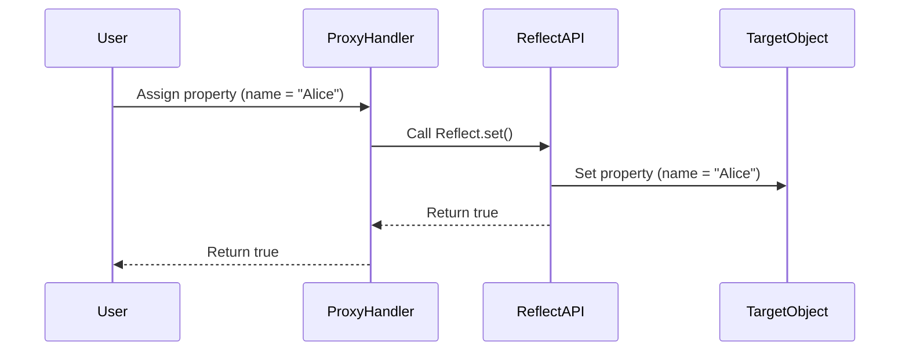

## 10.7. Reflect API

In this section, we will delve into the Reflect API, a powerful feature introduced in ECMAScript 2015 (ES6) that provides a set of static methods for performing operations on JavaScript objects. The Reflect API is designed to complement the Proxy API, allowing developers to perform object manipulation tasks in a more consistent and reliable manner. By the end of this section, you'll understand how to use the Reflect API to enhance your JavaScript code with cleaner and more predictable object operations.

### What is the Reflect API?

The Reflect API is a built-in object that provides methods for interceptable JavaScript operations. It is similar to the Math object in that it is not a constructor and cannot be instantiated. The Reflect API is designed to perform the same operations as those that can be performed on objects directly, but with a more functional approach. It includes methods for property manipulation, function invocation, and prototype management.

#### Key Characteristics of the Reflect API

- **Functional Approach**: Reflect methods are static and can be called directly on the Reflect object.
- **Consistency**: Reflect methods provide consistent return values, typically returning `true` or `false` to indicate success or failure.
- **Error Handling**: Unlike direct operations, Reflect methods do not throw exceptions when operations fail. Instead, they return `false`, allowing for more predictable error handling.

### Common Operations with the Reflect API

Let's explore some of the common operations you can perform using the Reflect API. We'll cover property assignment, deletion, and retrieval, and compare these operations with their direct counterparts.

#### Property Assignment

Assigning properties to objects is a fundamental operation in JavaScript. With the Reflect API, you can use the `Reflect.set()` method to assign properties in a consistent manner.

```javascript
// Direct property assignment
const obj = {};
obj.name = "John";

// Using Reflect.set()
const result = Reflect.set(obj, "name", "John");
console.log(result); // true
console.log(obj.name); // "John"
```

In the example above, both direct assignment and `Reflect.set()` achieve the same result. However, `Reflect.set()` returns a boolean indicating whether the operation was successful, providing a more predictable outcome.

#### Property Deletion

Deleting properties from objects can be done using the `delete` operator or the `Reflect.deleteProperty()` method.

```javascript
// Direct property deletion
delete obj.name;

// Using Reflect.deleteProperty()
const deleteResult = Reflect.deleteProperty(obj, "name");
console.log(deleteResult); // true
console.log(obj.name); // undefined
```

The `Reflect.deleteProperty()` method returns `true` if the property was successfully deleted, offering a consistent way to handle deletion operations.

#### Property Retrieval

Retrieving properties from objects is straightforward with the `Reflect.get()` method.

```javascript
// Direct property retrieval
const name = obj.name;

// Using Reflect.get()
const reflectName = Reflect.get(obj, "name");
console.log(reflectName); // "John"
```

Both direct retrieval and `Reflect.get()` provide the same result, but `Reflect.get()` can be useful when working with proxies or when you need a more functional approach.

### Reflect API and Proxies

The Reflect API is often used in conjunction with the Proxy API to create more powerful and flexible object manipulation patterns. Proxies allow you to intercept and redefine fundamental operations for objects, and the Reflect API provides a way to perform these operations within proxy handlers.

#### Example: Using Reflect with Proxies

Let's see how the Reflect API can be used with proxies to intercept and log property assignments.

```javascript
const handler = {
  set(target, property, value) {
    console.log(`Setting property ${property} to ${value}`);
    return Reflect.set(target, property, value);
  }
};

const proxy = new Proxy({}, handler);
proxy.name = "Alice"; // Logs: Setting property name to Alice
console.log(proxy.name); // "Alice"
```

In this example, the `set` handler intercepts property assignments, logs the operation, and then uses `Reflect.set()` to perform the actual assignment. This pattern allows you to add custom behavior to object operations while maintaining the original functionality.

### Benefits of Using the Reflect API

The Reflect API offers several benefits that can enhance your JavaScript code:

- **Cleaner Code**: Reflect methods provide a more readable and consistent syntax for object operations.
- **Predictable Behavior**: By returning boolean values instead of throwing exceptions, Reflect methods offer more predictable error handling.
- **Enhanced Proxies**: When used with proxies, the Reflect API allows you to maintain default behavior while adding custom logic.

### Comparing Reflect Methods with Direct Operations

To better understand the advantages of the Reflect API, let's compare some common operations using both direct methods and Reflect methods.

#### Example: Comparing Property Assignment

```javascript
// Direct assignment
const directObj = {};
directObj.age = 30;

// Reflect assignment
const reflectObj = {};
const reflectResult = Reflect.set(reflectObj, "age", 30);

console.log(directObj.age); // 30
console.log(reflectObj.age); // 30
console.log(reflectResult); // true
```

In this comparison, both methods achieve the same result, but `Reflect.set()` provides a boolean return value, indicating the success of the operation.

#### Example: Comparing Property Deletion

```javascript
// Direct deletion
delete directObj.age;

// Reflect deletion
const reflectDeleteResult = Reflect.deleteProperty(reflectObj, "age");

console.log(directObj.age); // undefined
console.log(reflectObj.age); // undefined
console.log(reflectDeleteResult); // true
```

Again, both methods successfully delete the property, but `Reflect.deleteProperty()` offers a consistent return value.

### Try It Yourself

To solidify your understanding of the Reflect API, try modifying the code examples above. Experiment with different property names and values, and observe how the Reflect methods behave. You can also try creating your own proxy handlers and using the Reflect API to manage object operations.

### Visualizing Reflect API Operations

To help visualize how the Reflect API interacts with objects and proxies, let's use a Mermaid.js diagram to illustrate the flow of a property assignment operation with a proxy.



This diagram shows the sequence of operations when a property is assigned using a proxy with the Reflect API. The user initiates the assignment, which is intercepted by the proxy handler. The handler then calls `Reflect.set()` to perform the assignment on the target object, and the result is returned to the user.

### References and Links

For further reading on the Reflect API and its applications, consider exploring the following resources:

- [MDN Web Docs: Reflect](https://developer.mozilla.org/en-US/docs/Web/JavaScript/Reference/Global_Objects/Reflect)
- [JavaScript.info: Reflect](https://javascript.info/reflect)
- [ECMAScript 2015 Specification](https://www.ecma-international.org/ecma-262/6.0/)

### Knowledge Check

To reinforce your understanding of the Reflect API, try answering the following questions and challenges:

1. What is the primary purpose of the Reflect API in JavaScript?
2. How does the Reflect API enhance error handling compared to direct operations?
3. Create a proxy that logs property deletions using the Reflect API.
4. Compare the use of `Reflect.get()` and direct property retrieval in a code example.
5. Why might you choose to use the Reflect API when working with proxies?

### Embrace the Journey

Remember, mastering the Reflect API is just one step in your JavaScript journey. As you continue to explore and experiment with these concepts, you'll gain a deeper understanding of how JavaScript works under the hood. Keep experimenting, stay curious, and enjoy the journey!

## Quiz Time!



### What is the Reflect API primarily used for in JavaScript?

- [x] Performing object operations with consistent return values
- [ ] Creating new objects
- [ ] Managing asynchronous operations
- [ ] Handling exceptions

> **Explanation:** The Reflect API is used for performing object operations with consistent return values, providing a functional approach to object manipulation.

### How does Reflect.set() differ from direct property assignment?

- [x] Reflect.set() returns a boolean indicating success
- [ ] Reflect.set() throws an exception on failure
- [ ] Reflect.set() is slower than direct assignment
- [ ] Reflect.set() only works with proxies

> **Explanation:** Reflect.set() returns a boolean indicating whether the property assignment was successful, unlike direct assignment which does not provide this feedback.

### Which Reflect method is used to delete a property from an object?

- [x] Reflect.deleteProperty()
- [ ] Reflect.remove()
- [ ] Reflect.erase()
- [ ] Reflect.clear()

> **Explanation:** Reflect.deleteProperty() is the method used to delete a property from an object, providing a consistent return value.

### What is a key benefit of using the Reflect API with proxies?

- [x] It allows maintaining default behavior while adding custom logic
- [ ] It automatically optimizes performance
- [ ] It simplifies asynchronous code
- [ ] It eliminates the need for error handling

> **Explanation:** The Reflect API allows you to maintain default behavior while adding custom logic when used with proxies, enhancing flexibility and control.

### What does Reflect.get() do?

- [x] Retrieves a property value from an object
- [ ] Sets a property value on an object
- [ ] Deletes a property from an object
- [ ] Creates a new object

> **Explanation:** Reflect.get() retrieves a property value from an object, similar to direct property access.

### How does the Reflect API handle errors compared to direct operations?

- [x] It returns false instead of throwing exceptions
- [ ] It logs errors to the console
- [ ] It ignores errors
- [ ] It throws exceptions

> **Explanation:** The Reflect API returns false when an operation fails, providing a more predictable way to handle errors compared to direct operations which may throw exceptions.

### Which of the following is NOT a method provided by the Reflect API?

- [ ] Reflect.set()
- [ ] Reflect.get()
- [ ] Reflect.deleteProperty()
- [x] Reflect.invoke()

> **Explanation:** Reflect.invoke() is not a method provided by the Reflect API. The API includes methods like Reflect.set(), Reflect.get(), and Reflect.deleteProperty().

### What is the result of using Reflect.set() to assign a property that already exists?

- [x] The property value is updated, and true is returned
- [ ] An error is thrown
- [ ] The property is ignored
- [ ] The operation fails silently

> **Explanation:** Reflect.set() updates the property value and returns true, indicating the operation was successful.

### Can the Reflect API be used to intercept operations on objects?

- [ ] Yes, it directly intercepts operations
- [x] No, it is used alongside proxies for interception
- [ ] Yes, but only for certain operations
- [ ] No, it cannot be used with proxies

> **Explanation:** The Reflect API itself does not intercept operations but is used alongside proxies to perform operations within proxy handlers.

### True or False: The Reflect API can be instantiated to create new objects.

- [ ] True
- [x] False

> **Explanation:** False. The Reflect API is not a constructor and cannot be instantiated. It provides static methods for object operations.




