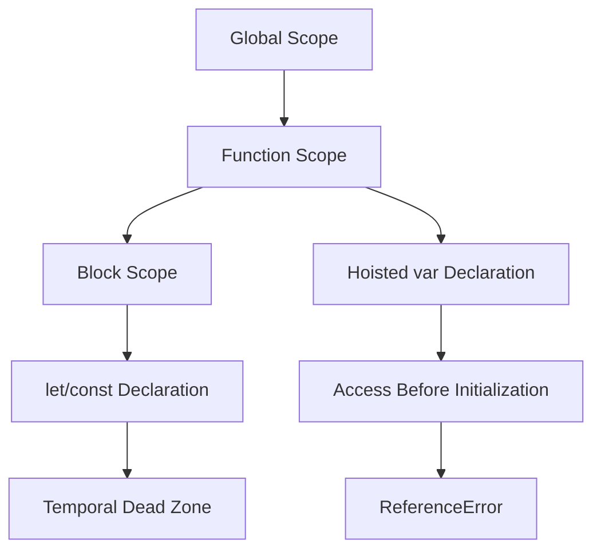

## 11.1. Understanding `ReferenceError`

In the journey of learning JavaScript, encountering errors is an inevitable part of the process. One common error that beginners often face is the `ReferenceError`. Understanding what a `ReferenceError` is, why it occurs, and how to fix it is crucial for debugging and writing robust JavaScript code. In this section, we'll dive deep into the world of `ReferenceError`, explore its causes, and provide practical solutions to resolve it.

### What is a `ReferenceError`?

A `ReferenceError` in JavaScript occurs when you try to access a variable that hasn't been declared or is out of scope. This error is a runtime error, which means it occurs when the code is executed, not when it is compiled. The JavaScript engine throws a `ReferenceError` when it cannot find the variable you are trying to use.

#### Common Causes of `ReferenceError`

1. **Accessing Undeclared Variables**: Trying to use a variable that hasn't been declared anywhere in your code.
2. **Misspelled Variable Names**: A simple typo in the variable name can lead to a `ReferenceError`.
3. **Scope Issues**: Accessing variables outside their defined scope.
4. **Hoisting Confusion**: Misunderstanding how JavaScript hoists variables can lead to accessing them before they are declared.
5. **Using Variables Before Initialization**: Especially with `let` and `const`, accessing variables before they are initialized can cause errors.

### Code Examples Triggering `ReferenceError`

Let's look at some examples to understand how `ReferenceError` can be triggered:

#### Example 1: Accessing an Undeclared Variable

```javascript
console.log(myVariable); // ReferenceError: myVariable is not defined
```

In this example, `myVariable` is not declared anywhere in the code, leading to a `ReferenceError`.

#### Example 2: Misspelled Variable Name

```javascript
let userName = "Alice";
console.log(usernme); // ReferenceError: usernme is not defined
```

Here, `userName` is declared, but due to a typo (`usernme`), JavaScript throws a `ReferenceError`.

#### Example 3: Scope Issues

```javascript
function greet() {
  let greeting = "Hello, World!";
}
console.log(greeting); // ReferenceError: greeting is not defined
```

The variable `greeting` is declared inside the `greet` function and is not accessible outside its scope.

#### Example 4: Hoisting Confusion

```javascript
console.log(message); // ReferenceError: Cannot access 'message' before initialization
let message = "Hello!";
```

Although `message` is declared with `let`, it is accessed before initialization, causing a `ReferenceError`.

### How Scope and Hoisting Relate to `ReferenceError`

Understanding scope and hoisting is key to avoiding `ReferenceError`. Let's explore these concepts briefly:

#### Scope

Scope determines the accessibility of variables. JavaScript has three types of scope:

1. **Global Scope**: Variables declared outside any function or block are in the global scope and accessible anywhere in the code.
2. **Function Scope**: Variables declared within a function are only accessible inside that function.
3. **Block Scope**: Variables declared with `let` or `const` within a block (e.g., inside `{}`) are only accessible within that block.

#### Hoisting

Hoisting is JavaScript's behavior of moving declarations to the top of their containing scope during the compile phase. However, only the declarations are hoisted, not the initializations. This means that variables declared with `var` are hoisted to the top of their function or global scope, while `let` and `const` are hoisted to the top of their block scope but remain uninitialized until their declaration is encountered.

### Troubleshooting and Fixing `ReferenceError`

When you encounter a `ReferenceError`, follow these steps to troubleshoot and fix it:

1. **Check for Typos**: Carefully check your variable names for any typos or misspellings.
2. **Ensure Declaration**: Make sure the variable is declared before you try to access it.
3. **Verify Scope**: Ensure the variable is within the accessible scope when you try to use it.
4. **Understand Hoisting**: Be aware of how hoisting affects your variables, especially with `let` and `const`.
5. **Use Debugging Tools**: Utilize browser developer tools to set breakpoints and inspect variable states.

### Tips to Avoid `ReferenceError`

1. **Declare Variables at the Top**: Declare all variables at the beginning of their scope to avoid hoisting issues.
2. **Use `let` and `const`**: Prefer `let` and `const` over `var` to avoid scope-related errors.
3. **Consistent Naming**: Use consistent and meaningful variable names to reduce the risk of typos.
4. **Use Strict Mode**: Enable strict mode by adding `"use strict";` at the top of your script to catch undeclared variables.
5. **Code Reviews**: Regularly review your code or pair program to catch potential errors early.

### Visualizing Scope and Hoisting

Let's visualize how scope and hoisting can lead to `ReferenceError` using a diagram:



**Diagram Description**: This diagram illustrates how variables move through different scopes and how hoisting affects them. The `Temporal Dead Zone` is a period where `let` and `const` variables are hoisted but not initialized, leading to potential `ReferenceError` if accessed.

### Try It Yourself

Experiment with the following code to see how `ReferenceError` can be triggered and resolved:

```javascript
// Try accessing a variable before it's declared
try {
  console.log(undeclaredVar); // ReferenceError
} catch (error) {
  console.error(error.message);
}

// Correct the error by declaring the variable
let undeclaredVar = "Now I'm declared!";
console.log(undeclaredVar); // No error

// Experiment with scope
function testScope() {
  let scopedVar = "I'm inside the function!";
  console.log(scopedVar); // Accessible here
}
testScope();
// console.log(scopedVar); // Uncommenting this line will cause a ReferenceError
```

### Knowledge Check

Before we conclude, let's reinforce what we've learned:

- What is a `ReferenceError`?
- How does scope affect variable accessibility?
- What is hoisting, and how does it relate to `ReferenceError`?
- How can you avoid `ReferenceError` in your code?

### Embrace the Journey

Remember, encountering errors is a natural part of learning to code. Each error is an opportunity to deepen your understanding of JavaScript. Keep experimenting, stay curious, and enjoy the journey!

## Quiz Time!



### What is a `ReferenceError`?

- [x] An error that occurs when trying to access a variable that hasn't been declared.
- [ ] An error related to syntax issues in the code.
- [ ] An error that occurs when a function is called incorrectly.
- [ ] An error related to type mismatches.

> **Explanation:** A `ReferenceError` is specifically related to accessing undeclared or out-of-scope variables.

### Which of the following can cause a `ReferenceError`?

- [x] Accessing a variable before it is declared.
- [x] Misspelling a variable name.
- [ ] Declaring a variable with `var`.
- [ ] Using a variable within its declared scope.

> **Explanation:** Accessing undeclared variables and typos in variable names are common causes of `ReferenceError`.

### How does hoisting affect `ReferenceError`?

- [x] Variables declared with `var` are hoisted but initialized to `undefined`.
- [ ] Variables declared with `let` and `const` are initialized during hoisting.
- [ ] Hoisting only affects function declarations, not variables.
- [ ] Hoisting prevents all `ReferenceError` issues.

> **Explanation:** `var` declarations are hoisted and initialized to `undefined`, while `let` and `const` are hoisted but remain uninitialized, leading to potential `ReferenceError`.

### What is the Temporal Dead Zone?

- [x] A period when `let` and `const` variables are hoisted but not initialized.
- [ ] A time when all variables are inaccessible.
- [ ] A phase when functions are hoisted.
- [ ] A state where variables are declared but not used.

> **Explanation:** The Temporal Dead Zone is the period between hoisting and initialization for `let` and `const`, where accessing the variable leads to a `ReferenceError`.

### How can you avoid `ReferenceError`?

- [x] Declare variables before using them.
- [x] Use consistent variable naming.
- [ ] Avoid using `let` and `const`.
- [ ] Ignore variable scope.

> **Explanation:** Proper declaration and consistent naming help avoid `ReferenceError`, while understanding and respecting scope is crucial.

### What does strict mode do in relation to `ReferenceError`?

- [x] It throws errors for undeclared variables.
- [ ] It prevents all runtime errors.
- [ ] It allows variables to be used without declaration.
- [ ] It disables variable hoisting.

> **Explanation:** Strict mode enforces stricter parsing and error handling, including throwing errors for undeclared variables.

### Which of the following is true about scope?

- [x] Variables declared inside a function are not accessible outside.
- [ ] Variables declared globally are only accessible within functions.
- [ ] Block scope is the same as function scope.
- [ ] All variables are accessible everywhere in the code.

> **Explanation:** Function scope limits variable accessibility to within the function, while global variables are accessible everywhere.

### What happens if you try to access a variable declared with `let` before its declaration?

- [x] A `ReferenceError` is thrown.
- [ ] The variable is automatically initialized to `undefined`.
- [ ] The code runs without errors.
- [ ] The variable is initialized to `null`.

> **Explanation:** Accessing a `let` variable before its declaration results in a `ReferenceError` due to the Temporal Dead Zone.

### How can you troubleshoot a `ReferenceError`?

- [x] Check for typos in variable names.
- [x] Ensure variables are declared before use.
- [ ] Ignore the error and continue coding.
- [ ] Use `var` instead of `let` or `const`.

> **Explanation:** Checking for typos and ensuring proper declaration are effective troubleshooting steps for `ReferenceError`.

### True or False: Hoisting applies to both variable and function declarations.

- [x] True
- [ ] False

> **Explanation:** Both variable and function declarations are hoisted in JavaScript, although their initialization and behavior differ.


