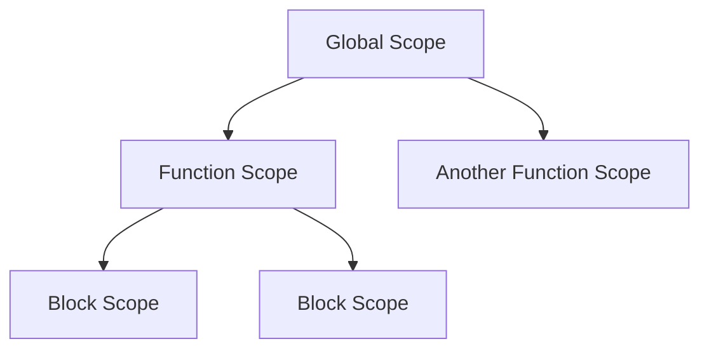

## 11.10. Frequently Asked Questions

Welcome to the Frequently Asked Questions section of our guide on understanding variables and data types in JavaScript. Here, we address some of the most common queries and misconceptions that beginners often encounter. Our aim is to provide clear, concise answers that reinforce key concepts from the guide. Let's dive in!

### 1. What is the difference between `var`, `let`, and `const`?

JavaScript provides three ways to declare variables: `var`, `let`, and `const`. Understanding their differences is crucial for writing effective code.

- **`var`**: This keyword is function-scoped, meaning it is accessible throughout the function in which it is declared. Variables declared with `var` are hoisted to the top of their scope, which can lead to unexpected behavior.

  ```javascript
  function example() {
      console.log(x); // undefined, due to hoisting
      var x = 10;
      console.log(x); // 10
  }
  example();
  ```

- **`let`**: Introduced in ES6, `let` is block-scoped, meaning it is only accessible within the block in which it is declared. This helps prevent errors related to variable scope.

  ```javascript
  if (true) {
      let y = 20;
      console.log(y); // 20
  }
  console.log(y); // ReferenceError: y is not defined
  ```

- **`const`**: Also block-scoped, `const` is used to declare variables that should not be reassigned. However, it does not make the value immutable if the value is an object.

  ```javascript
  const z = 30;
  // z = 40; // TypeError: Assignment to constant variable.

  const obj = { key: 'value' };
  obj.key = 'newValue'; // This is allowed
  ```

### 2. How does JavaScript handle data types dynamically?

JavaScript is a dynamically typed language, meaning variables do not have a fixed data type. Instead, the type is determined at runtime based on the value assigned to the variable. This flexibility allows for easy type changes but can also lead to unexpected behavior if not managed carefully.

```javascript
let variable = 42; // number
console.log(typeof variable); // "number"

variable = "Hello, World!"; // string
console.log(typeof variable); // "string"
```

### 3. What are primitive data types in JavaScript?

JavaScript has several primitive data types, which are immutable and represent simple values:

- **Number**: Represents both integer and floating-point numbers.
- **String**: Represents a sequence of characters.
- **Boolean**: Represents true or false values.
- **Undefined**: Represents a variable that has been declared but not assigned a value.
- **Null**: Represents the intentional absence of any object value.
- **Symbol**: Represents a unique and immutable value, often used as object keys.
- **BigInt**: Represents integers with arbitrary precision, introduced in ES2020.

### 4. What is hoisting in JavaScript?

Hoisting is a JavaScript mechanism where variable and function declarations are moved to the top of their containing scope during the compile phase. This means you can use variables and functions before they are declared in the code.

```javascript
console.log(a); // undefined
var a = 5;

function hoistedFunction() {
    console.log('This function is hoisted!');
}
hoistedFunction(); // This function is hoisted!
```

However, `let` and `const` are hoisted differently and are not initialized until their definition is evaluated, leading to the Temporal Dead Zone (TDZ).

### 5. What is the Temporal Dead Zone (TDZ)?

The Temporal Dead Zone refers to the period between the start of a block and the point where a variable declared with `let` or `const` is initialized. Accessing the variable in this zone results in a ReferenceError.

```javascript
{
    // TDZ starts
    // console.log(b); // ReferenceError
    let b = 10; // TDZ ends
    console.log(b); // 10
}
```

### 6. How do I check the type of a variable?

You can use the `typeof` operator to check the type of a variable. It returns a string indicating the type of the operand.

```javascript
let num = 42;
console.log(typeof num); // "number"

let str = "Hello";
console.log(typeof str); // "string"

let isTrue = true;
console.log(typeof isTrue); // "boolean"
```

### 7. What is the difference between `==` and `===`?

- **`==` (loose equality)**: Compares two values for equality, converting them to a common type if necessary. This can lead to unexpected results due to type coercion.

  ```javascript
  console.log(5 == '5'); // true
  console.log(null == undefined); // true
  ```

- **`===` (strict equality)**: Compares both value and type, without performing type conversion. This is generally preferred for more predictable comparisons.

  ```javascript
  console.log(5 === '5'); // false
  console.log(null === undefined); // false
  ```

### 8. How do I convert a string to a number?

JavaScript provides several methods to convert strings to numbers:

- **`parseInt()`**: Parses a string and returns an integer.

  ```javascript
  let intVal = parseInt('42');
  console.log(intVal); // 42
  ```

- **`parseFloat()`**: Parses a string and returns a floating-point number.

  ```javascript
  let floatVal = parseFloat('3.14');
  console.log(floatVal); // 3.14
  ```

- **`Number()`**: Converts a string to a number, returning `NaN` if the conversion fails.

  ```javascript
  let numVal = Number('123');
  console.log(numVal); // 123
  ```

### 9. What are truthy and falsy values?

In JavaScript, a truthy value is a value that is considered true when evaluated in a Boolean context, while a falsy value is considered false. Falsy values include:

- `false`
- `0`
- `""` (empty string)
- `null`
- `undefined`
- `NaN`

All other values are considered truthy.

```javascript
if ('Hello') {
    console.log('This is truthy!');
}

if (0) {
    console.log('This will not run, 0 is falsy.');
}
```

### 10. What is variable shadowing?

Variable shadowing occurs when a variable declared within a certain scope (e.g., a function or block) has the same name as a variable declared in an outer scope. The inner variable shadows the outer one within its scope.

```javascript
let x = 10;

function shadowExample() {
    let x = 20; // shadows the outer x
    console.log(x); // 20
}

shadowExample();
console.log(x); // 10
```

### 11. How do I create immutable objects in JavaScript?

While `const` prevents reassignment of a variable, it does not make objects immutable. To create immutable objects, you can use `Object.freeze()`.

```javascript
const obj = Object.freeze({ key: 'value' });
obj.key = 'newValue'; // This will not change the object
console.log(obj.key); // "value"
```

### 12. What are the best practices for naming variables?

- Use descriptive names that convey the purpose of the variable.
- Follow camelCase convention for variable names.
- Avoid using reserved keywords.
- Use meaningful names even for loop counters, e.g., `index` instead of `i`.

```javascript
let userName = 'Alice';
let userAge = 30;
```

### 13. How can I avoid global namespace pollution?

Global namespace pollution occurs when too many variables are declared in the global scope, which can lead to conflicts and bugs. To avoid this:

- Use `let` and `const` for block-scoped variables.
- Encapsulate code within functions or modules.
- Use Immediately Invoked Function Expressions (IIFE) to create private scopes.

```javascript
(function() {
    let privateVar = 'I am private';
    console.log(privateVar);
})();
```

### 14. What is the difference between `undefined` and `null`?

- **`undefined`**: Indicates that a variable has been declared but not assigned a value. It is the default value for uninitialized variables.

- **`null`**: Represents the intentional absence of any object value. It is an assignment value that can be set to a variable.

```javascript
let uninitialized;
console.log(uninitialized); // undefined

let emptyValue = null;
console.log(emptyValue); // null
```

### 15. How do I handle `NaN` values?

`NaN` stands for "Not-a-Number" and is the result of invalid or undefined mathematical operations. You can check for `NaN` using the `isNaN()` function.

```javascript
let result = 0 / 0;
console.log(isNaN(result)); // true
```

### 16. How do I use template literals?

Template literals, introduced in ES6, allow for easier string interpolation and multi-line strings. They are enclosed by backticks (`` ` ``) instead of quotes.

```javascript
let name = 'Alice';
let greeting = `Hello, ${name}!`;
console.log(greeting); // "Hello, Alice!"

let multiLine = `This is
a multi-line
string.`;
console.log(multiLine);
```

### 17. What are closures in JavaScript?

A closure is a function that retains access to its lexical scope, even when the function is executed outside that scope. Closures are useful for data encapsulation and creating private variables.

```javascript
function outerFunction() {
    let outerVariable = 'I am outside!';
    
    function innerFunction() {
        console.log(outerVariable); // Accesses outerVariable
    }
    
    return innerFunction;
}

const closure = outerFunction();
closure(); // "I am outside!"
```

### 18. How do I use destructuring in JavaScript?

Destructuring allows you to unpack values from arrays or properties from objects into distinct variables.

- **Array Destructuring**:

  ```javascript
  let [a, b] = [1, 2];
  console.log(a); // 1
  console.log(b); // 2
  ```

- **Object Destructuring**:

  ```javascript
  let { name, age } = { name: 'Alice', age: 30 };
  console.log(name); // "Alice"
  console.log(age); // 30
  ```

### 19. What is the spread operator?

The spread operator (`...`) allows an iterable (like an array) to be expanded in places where zero or more arguments or elements are expected.

```javascript
let arr1 = [1, 2, 3];
let arr2 = [...arr1, 4, 5];
console.log(arr2); // [1, 2, 3, 4, 5]

let obj1 = { a: 1, b: 2 };
let obj2 = { ...obj1, c: 3 };
console.log(obj2); // { a: 1, b: 2, c: 3 }
```

### 20. How do I manage memory in JavaScript?

JavaScript automatically manages memory allocation and garbage collection. However, you can optimize memory usage by:

- Avoiding unnecessary global variables.
- Using local variables within functions.
- Clearing references to large objects when they are no longer needed.

```javascript
function processData() {
    let data = new Array(1000).fill('data');
    // Use data
    data = null; // Clear reference
}
```

### Visualizing JavaScript's Interaction with Variables

To better understand how variables and scopes interact in JavaScript, let's visualize the scope chain using a diagram.



In this diagram, the global scope contains a function scope, which in turn contains block scopes. Each scope has access to its own variables and those of its parent scopes, forming a chain.

### Knowledge Check

Before we conclude, let's reinforce what we've learned with a few questions:

- Can you explain the difference between `var`, `let`, and `const`?
- How does JavaScript handle data types dynamically?
- What is the Temporal Dead Zone, and how does it affect variable declarations?
- How do you check the type of a variable in JavaScript?
- What are truthy and falsy values, and why are they important?

### Embrace the Journey

Remember, this is just the beginning of your journey with JavaScript. As you continue to explore and experiment, you'll gain a deeper understanding of how variables and data types work. Stay curious, keep practicing, and enjoy the process!

## Quiz Time!



### What is the main difference between `var`, `let`, and `const`?

- [x] `var` is function-scoped, `let` and `const` are block-scoped
- [ ] `var` is block-scoped, `let` and `const` are function-scoped
- [ ] `var` and `let` are block-scoped, `const` is function-scoped
- [ ] `var` and `const` are block-scoped, `let` is function-scoped

> **Explanation:** `var` is function-scoped, while `let` and `const` are block-scoped, which means they are only accessible within the block they are declared in.

### How does JavaScript handle data types?

- [x] Dynamically, determining types at runtime
- [ ] Statically, determining types at compile time
- [ ] With strict typing, requiring explicit type declarations
- [ ] With weak typing, allowing any type to be used anywhere

> **Explanation:** JavaScript is dynamically typed, meaning it determines the type of a variable at runtime based on the value assigned to it.

### What is hoisting?

- [x] The process of moving variable and function declarations to the top of their scope
- [ ] The process of moving variable and function declarations to the bottom of their scope
- [ ] The process of removing unused variables and functions
- [ ] The process of optimizing code for performance

> **Explanation:** Hoisting is a JavaScript mechanism where variable and function declarations are moved to the top of their containing scope during the compile phase.

### What is the Temporal Dead Zone?

- [x] The period between the start of a block and the point where a variable declared with `let` or `const` is initialized
- [ ] The period after a variable is initialized and before it is used
- [ ] The period during which a variable is not accessible due to scope restrictions
- [ ] The period after a variable is used and before it is garbage collected

> **Explanation:** The Temporal Dead Zone is the period between the start of a block and the point where a variable declared with `let` or `const` is initialized, during which accessing the variable results in a ReferenceError.

### What are truthy values?

- [x] Values that are considered true when evaluated in a Boolean context
- [ ] Values that are considered false when evaluated in a Boolean context
- [ ] Values that are always true regardless of context
- [ ] Values that are always false regardless of context

> **Explanation:** In JavaScript, truthy values are those that are considered true when evaluated in a Boolean context, such as non-zero numbers, non-empty strings, and objects.

### How can you check the type of a variable?

- [x] Using the `typeof` operator
- [ ] Using the `instanceof` operator
- [ ] Using the `isType` function
- [ ] Using the `checkType` method

> **Explanation:** The `typeof` operator is used to check the type of a variable in JavaScript, returning a string indicating the type.

### What is variable shadowing?

- [x] When a variable declared within a certain scope has the same name as a variable declared in an outer scope
- [ ] When a variable is declared but not initialized
- [ ] When a variable is used before it is declared
- [ ] When a variable is declared with a different type than its value

> **Explanation:** Variable shadowing occurs when a variable declared within a certain scope has the same name as a variable declared in an outer scope, causing the inner variable to "shadow" the outer one.

### How do you create immutable objects?

- [x] Using `Object.freeze()`
- [ ] Using `Object.seal()`
- [ ] Using `const` keyword
- [ ] Using `Object.lock()`

> **Explanation:** `Object.freeze()` is used to create immutable objects in JavaScript, preventing any changes to the object's properties.

### What is the spread operator used for?

- [x] Expanding an iterable into individual elements
- [ ] Combining multiple iterables into one
- [ ] Converting an iterable into a string
- [ ] Converting a string into an iterable

> **Explanation:** The spread operator (`...`) is used to expand an iterable (like an array) into individual elements, allowing for easy copying and concatenation.

### JavaScript automatically manages memory allocation and garbage collection.

- [x] True
- [ ] False

> **Explanation:** JavaScript automatically manages memory allocation and garbage collection, freeing developers from manually managing memory, although they can optimize usage through best practices.


