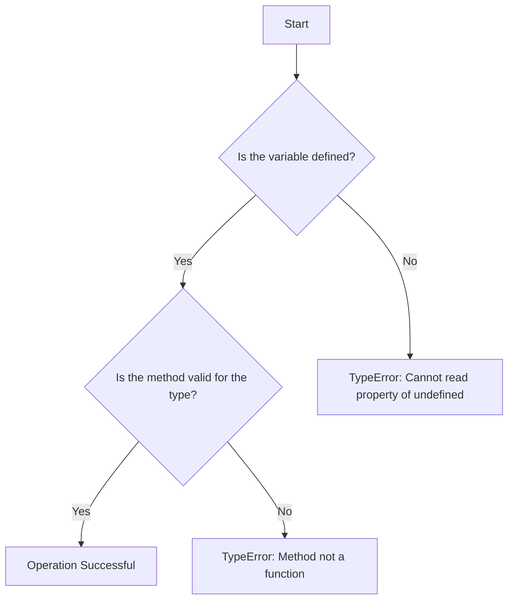

## 11.2. Handling `TypeError`

In the world of JavaScript programming, encountering errors is a common part of the development process. One such error that developers frequently face is the `TypeError`. Understanding what a `TypeError` is, why it occurs, and how to handle it effectively is crucial for writing robust and error-free code. In this section, we will explore the concept of `TypeError`, provide examples to illustrate common scenarios, and discuss strategies for debugging and prevention.

### What is a `TypeError`?

A `TypeError` in JavaScript is an exception that is thrown when an operation is performed on a value of an inappropriate type. This error typically arises when you attempt to perform an operation that is not allowed on the given data type. For instance, trying to call a method on `undefined` or attempting to use a non-callable object as a function can result in a `TypeError`.

### When Does a `TypeError` Occur?

`TypeError` can occur in various situations, including but not limited to:

1. **Accessing Properties on Undefined or Null**: Attempting to access a property or method on `undefined` or `null` values.
2. **Invalid Method Calls**: Trying to call a method that does not exist on a particular data type.
3. **Incorrect Type Usage**: Using a value in a way that is not compatible with its type, such as treating a number as a function.
4. **Assignment to Read-Only Properties**: Attempting to modify a read-only property of an object.

Let's delve into these scenarios with examples to better understand how `TypeError` manifests in JavaScript.

### Example 1: Accessing Properties on Undefined or Null

One of the most common causes of `TypeError` is attempting to access properties or methods on `undefined` or `null` values. Consider the following example:

```javascript
let person = null;

try {
    console.log(person.name); // Attempting to access a property on null
} catch (error) {
    console.error("Error:", error.message); // Logs "Error: Cannot read property 'name' of null"
}
```

In this example, we try to access the `name` property of a `null` object, which results in a `TypeError` because `null` does not have any properties.

### Example 2: Invalid Method Calls

Another common scenario is calling a method that does not exist on a particular data type. Let's look at an example:

```javascript
let number = 42;

try {
    number.toUpperCase(); // Attempting to call a string method on a number
} catch (error) {
    console.error("Error:", error.message); // Logs "Error: number.toUpperCase is not a function"
}
```

Here, we mistakenly attempt to call the `toUpperCase` method on a number, which leads to a `TypeError` because `toUpperCase` is a method of strings, not numbers.

### Example 3: Incorrect Type Usage

Using a value in a way that is incompatible with its type can also trigger a `TypeError`. Consider the following example:

```javascript
let func = 10;

try {
    func(); // Attempting to call a number as a function
} catch (error) {
    console.error("Error:", error.message); // Logs "Error: func is not a function"
}
```

In this case, we try to invoke a number as if it were a function, resulting in a `TypeError`.

### Example 4: Assignment to Read-Only Properties

Attempting to modify a read-only property of an object can also cause a `TypeError`. Here's an example:

```javascript
const obj = Object.freeze({ name: "Alice" });

try {
    obj.name = "Bob"; // Attempting to modify a read-only property
} catch (error) {
    console.error("Error:", error.message); // Logs "Error: Cannot assign to read only property 'name' of object"
}
```

In this example, the `Object.freeze` method makes the `name` property read-only, and any attempt to modify it results in a `TypeError`.

### How Data Types Impact `TypeError`

Understanding how data types impact the occurrence of `TypeError` is essential for preventing these errors. JavaScript is a dynamically typed language, meaning that variables can hold values of any type without explicit type declarations. While this provides flexibility, it also increases the risk of type-related errors.

To minimize the occurrence of `TypeError`, it's important to:

- **Be aware of the data types** of your variables and how they are used in your code.
- **Use type checking** to ensure that operations are performed on compatible types.
- **Validate input data** to prevent invalid operations.

### Debugging Strategies for `TypeError`

When you encounter a `TypeError`, it's important to have a systematic approach to debugging. Here are some strategies to help you pinpoint the source of the error:

1. **Read the Error Message**: The error message provides valuable information about what went wrong and where the error occurred. Pay close attention to the message and the stack trace.

2. **Use `console.log` for Debugging**: Insert `console.log` statements in your code to inspect the values of variables and understand their types at runtime.

3. **Check for Undefined or Null Values**: Ensure that variables are properly initialized and not `undefined` or `null` before accessing their properties or methods.

4. **Verify Method Existence**: Before calling a method on an object, check if the method exists using `typeof` or `instanceof`.

5. **Use Debugger Tools**: Utilize browser developer tools to set breakpoints and step through your code to identify the source of the error.

6. **Review Recent Changes**: If the error appeared after a recent code change, review the changes to identify any potential causes.

### Importance of Input Validation and Type Checking

To prevent `TypeError` and other runtime errors, it's crucial to incorporate input validation and type checking into your code. Here are some best practices:

- **Validate User Input**: Always validate user input to ensure it meets the expected format and type before processing it.
- **Use Type Checking**: Use JavaScript's `typeof` operator to check the type of variables before performing operations on them.
- **Leverage TypeScript**: Consider using TypeScript, a superset of JavaScript, which provides static type checking and can help catch type-related errors during development.

### Try It Yourself

To reinforce your understanding of `TypeError`, try modifying the code examples provided above. Experiment with different data types and operations to see how they affect the occurrence of `TypeError`. For instance, try accessing properties on an undefined variable or calling a non-existent method on a string.

### Visualizing `TypeError` Scenarios

To better understand how `TypeError` occurs, let's visualize the process using a flowchart. This flowchart illustrates the decision-making process that leads to a `TypeError`.



**Diagram Description**: This flowchart represents the decision-making process when performing operations on variables. It shows that a `TypeError` occurs if a variable is undefined or if a method is invalid for the given data type.

### References and Links

For further reading on `TypeError` and error handling in JavaScript, consider the following resources:

- [MDN Web Docs: TypeError](https://developer.mozilla.org/en-US/docs/Web/JavaScript/Reference/Global_Objects/TypeError)
- [W3Schools: JavaScript Errors](https://www.w3schools.com/js/js_errors.asp)
- [JavaScript.info: Error Handling](https://javascript.info/error-handling)

### Knowledge Check

Before we conclude, let's summarize the key takeaways from this section:

- A `TypeError` occurs when an operation is performed on a value of an inappropriate type.
- Common causes include accessing properties on undefined or null, invalid method calls, incorrect type usage, and assignment to read-only properties.
- Debugging strategies include reading error messages, using `console.log`, checking for undefined or null values, verifying method existence, and using debugger tools.
- Input validation and type checking are essential for preventing `TypeError`.

### Embrace the Journey

Remember, encountering errors is a natural part of the learning process. Each error provides an opportunity to deepen your understanding of JavaScript and improve your problem-solving skills. As you continue your journey, keep experimenting, stay curious, and enjoy the process of becoming a proficient JavaScript developer!

## Quiz Time!



### What is a `TypeError` in JavaScript?

- [x] An error thrown when an operation is performed on a value of an inappropriate type.
- [ ] An error that occurs when a variable is not declared.
- [ ] An error related to syntax mistakes in the code.
- [ ] An error that occurs during network requests.

> **Explanation:** A `TypeError` is thrown when an operation is performed on a value of an inappropriate type, such as calling a method on `undefined`.

### Which of the following scenarios can cause a `TypeError`?

- [x] Accessing a property on `null`.
- [x] Calling a non-existent method on a number.
- [ ] Declaring a variable without initialization.
- [ ] Using a `for` loop incorrectly.

> **Explanation:** Accessing properties on `null` and calling non-existent methods on a number can cause `TypeError`.

### How can you prevent `TypeError` when accessing object properties?

- [x] Check if the object is not `null` or `undefined` before accessing properties.
- [ ] Use a `try-catch` block for all operations.
- [ ] Declare all variables with `var`.
- [ ] Avoid using objects altogether.

> **Explanation:** Checking if the object is not `null` or `undefined` before accessing properties helps prevent `TypeError`.

### What is a common debugging strategy for `TypeError`?

- [x] Use `console.log` to inspect variable values and types.
- [ ] Rewrite the entire codebase.
- [ ] Use only `let` for variable declarations.
- [ ] Avoid using functions.

> **Explanation:** Using `console.log` to inspect variable values and types is a common debugging strategy for `TypeError`.

### What is the purpose of input validation in preventing `TypeError`?

- [x] Ensuring input data meets expected format and type before processing.
- [ ] Making the code run faster.
- [ ] Reducing the number of variables in the code.
- [ ] Automatically fixing all errors in the code.

> **Explanation:** Input validation ensures that input data meets the expected format and type, preventing `TypeError`.

### Which operator can be used for type checking in JavaScript?

- [x] `typeof`
- [ ] `instanceof`
- [ ] `==`
- [ ] `===`

> **Explanation:** The `typeof` operator is used for type checking in JavaScript.

### What is a potential cause of `TypeError` in the following code?

```javascript
let obj = null;
console.log(obj.name);
```

- [x] Accessing a property on `null`.
- [ ] Using `let` instead of `var`.
- [ ] Missing semicolon.
- [ ] Incorrect variable name.

> **Explanation:** Accessing a property on `null` causes a `TypeError`.

### How does TypeScript help in preventing `TypeError`?

- [x] Provides static type checking during development.
- [ ] Automatically fixes all runtime errors.
- [ ] Eliminates the need for variable declarations.
- [ ] Prevents syntax errors.

> **Explanation:** TypeScript provides static type checking, which helps prevent `TypeError` during development.

### Which of the following is a read-only property assignment that can cause a `TypeError`?

- [x] Modifying a property of a frozen object.
- [ ] Declaring a constant variable.
- [ ] Using `let` for variable declaration.
- [ ] Assigning a value to a variable.

> **Explanation:** Modifying a property of a frozen object can cause a `TypeError`.

### True or False: A `TypeError` can occur when trying to call a number as a function.

- [x] True
- [ ] False

> **Explanation:** A `TypeError` occurs when trying to call a number as a function, as numbers are not callable.




