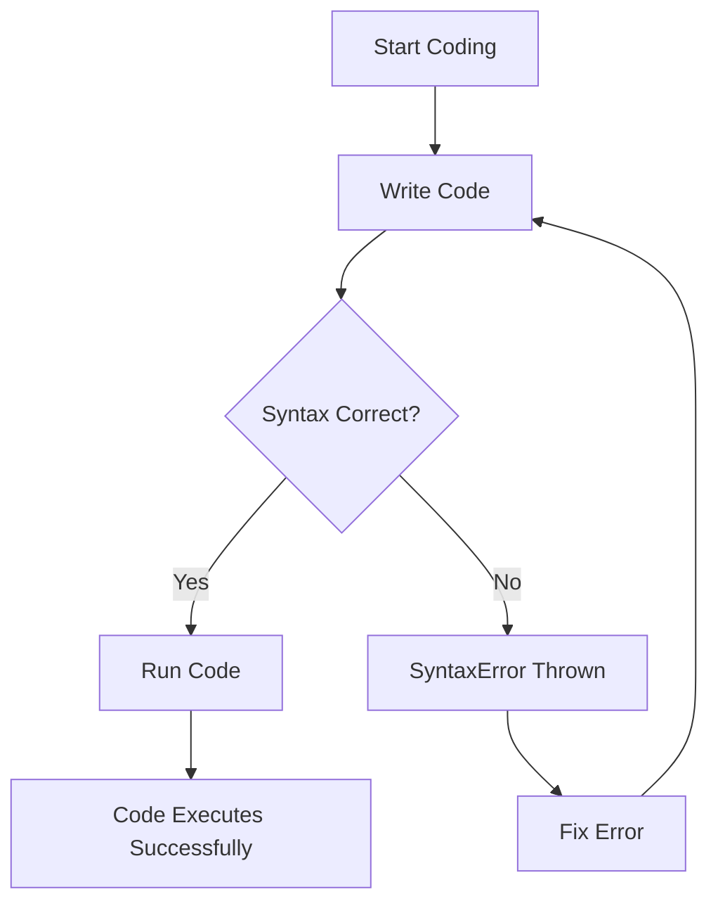

## 11.3. Dealing with `SyntaxError`

In the world of programming, errors are inevitable, especially when you're just starting out. One of the most common errors you'll encounter in JavaScript is the `SyntaxError`. In this section, we'll explore what a `SyntaxError` is, identify common causes, and learn how to fix them. We'll also introduce tools and techniques that can help you write clean and error-free code.

### What is a `SyntaxError`?

A `SyntaxError` occurs when the JavaScript engine encounters code that it cannot parse. This is akin to a grammatical error in a sentence that makes it difficult to understand. When the syntax of your code doesn't conform to the rules of the JavaScript language, the interpreter throws a `SyntaxError`.

#### Example of a `SyntaxError`

```javascript
// Incorrect syntax: missing closing parenthesis
console.log("Hello, World!";
```

In the example above, the missing closing parenthesis after the string causes a `SyntaxError`. The JavaScript engine expects a complete statement, and the absence of the closing parenthesis breaks the syntax rules.

### Common Causes of `SyntaxError`

Let's delve into some typical mistakes that lead to `SyntaxError` in JavaScript. Understanding these will help you avoid them in your coding journey.

#### 1. Missing or Mismatched Brackets

Brackets are used in JavaScript to group expressions, define function bodies, and more. Missing or mismatched brackets are a frequent source of `SyntaxError`.

**Example:**

```javascript
// Incorrect: Missing closing curly brace
function greet(name) {
    console.log("Hello, " + name);
```

**Corrected:**

```javascript
// Correct: Added closing curly brace
function greet(name) {
    console.log("Hello, " + name);
}
```

#### 2. Unmatched Parentheses

Parentheses are used to group expressions and pass arguments to functions. Forgetting to close a parenthesis can lead to a `SyntaxError`.

**Example:**

```javascript
// Incorrect: Missing closing parenthesis
if (x > 10 {
    console.log("x is greater than 10");
}
```

**Corrected:**

```javascript
// Correct: Added closing parenthesis
if (x > 10) {
    console.log("x is greater than 10");
}
```

#### 3. Missing Semicolons

While JavaScript is lenient with semicolons, their absence can sometimes lead to unexpected `SyntaxError`, especially in complex expressions.

**Example:**

```javascript
// Incorrect: Missing semicolon
let x = 5
let y = 10
console.log(x + y);
```

**Corrected:**

```javascript
// Correct: Added semicolons
let x = 5;
let y = 10;
console.log(x + y);
```

#### 4. Incorrect Use of Quotes

Strings in JavaScript can be enclosed in single, double, or backticks. Mixing these can result in a `SyntaxError`.

**Example:**

```javascript
// Incorrect: Mixed quotes
let message = "Hello, World!';
```

**Corrected:**

```javascript
// Correct: Consistent quotes
let message = "Hello, World!";
```

#### 5. Typos in Keywords

JavaScript has reserved keywords that must be spelled correctly. A typo in these keywords can cause a `SyntaxError`.

**Example:**

```javascript
// Incorrect: Typo in keyword 'function'
functon add(a, b) {
    return a + b;
}
```

**Corrected:**

```javascript
// Correct: Corrected keyword 'function'
function add(a, b) {
    return a + b;
}
```

### Tools and Techniques for Avoiding `SyntaxError`

To minimize the occurrence of `SyntaxError`, you can leverage various tools and techniques that assist in writing clean and syntactically correct code.

#### 1. Code Editors with Syntax Highlighting

Modern code editors like Visual Studio Code, Sublime Text, and Atom provide syntax highlighting, which visually distinguishes different parts of your code. This feature helps you quickly spot syntax errors.

#### 2. Linters

Linters are tools that analyze your code for potential errors and enforce coding standards. ESLint is a popular linter for JavaScript that can catch syntax errors before you run your code.

**Example ESLint Configuration:**

```json
{
    "env": {
        "browser": true,
        "es2021": true
    },
    "extends": "eslint:recommended",
    "parserOptions": {
        "ecmaVersion": 12,
        "sourceType": "module"
    },
    "rules": {
        "semi": ["error", "always"],
        "quotes": ["error", "double"]
    }
}
```

#### 3. Integrated Development Environments (IDEs)

IDEs like WebStorm and Eclipse offer advanced features such as real-time error detection, code completion, and refactoring tools that help prevent `SyntaxError`.

#### 4. Online Validators

Online tools like JSHint and JSFiddle allow you to paste your code and check for syntax errors. These are handy for quick checks without setting up a local environment.

### Writing Clean and Properly Formatted Code

Writing clean code is not just about avoiding errors; it's about making your code readable and maintainable. Here are some best practices:

#### 1. Consistent Indentation

Use consistent indentation to make your code more readable. Most editors allow you to set preferences for spaces or tabs.

#### 2. Descriptive Variable Names

Use meaningful variable names that describe the data they hold. This practice helps others (and your future self) understand your code.

#### 3. Commenting

Include comments to explain complex logic or important sections of your code. This is especially useful when revisiting code after some time.

#### 4. Modular Code

Break your code into smaller, reusable functions. This not only reduces complexity but also makes it easier to test and debug.

#### 5. Regular Code Reviews

Engage in code reviews with peers to catch errors you might have missed and to learn from others' coding styles.

### Visualizing Common Syntax Errors

To better understand how syntax errors can disrupt the flow of your JavaScript code, let's visualize the process using a flowchart. This will help you see where errors typically occur and how they affect code execution.



**Description:** This flowchart illustrates the typical process of writing and executing JavaScript code. If a `SyntaxError` is encountered, the code must be corrected before it can run successfully.

### Try It Yourself

Now that we've covered the basics, it's time to put your knowledge into practice. Try modifying the following code snippets to introduce and then correct syntax errors. This exercise will help reinforce your understanding.

**Exercise 1:**

```javascript
// Introduce a syntax error by removing a bracket
function sayHello(name) {
    console.log("Hello, " + name);
```

**Exercise 2:**

```javascript
// Introduce a syntax error by changing a keyword
let number = 10;
consol.log(number);
```

**Exercise 3:**

```javascript
// Introduce a syntax error by mixing quotes
let greeting = "Welcome to JavaScript!';
console.log(greeting);
```

### Knowledge Check

Before we wrap up, let's review some key takeaways:

- A `SyntaxError` occurs when the JavaScript engine cannot parse your code due to incorrect syntax.
- Common causes include missing brackets, unmatched parentheses, incorrect use of quotes, and typos in keywords.
- Tools like linters and IDEs can help detect and prevent syntax errors.
- Writing clean and properly formatted code improves readability and maintainability.

### Embrace the Journey

Remember, encountering errors is a natural part of learning to code. Each `SyntaxError` is an opportunity to improve your understanding of JavaScript. As you continue to practice, you'll become more adept at identifying and fixing these errors quickly. Keep experimenting, stay curious, and enjoy the journey!

## Quiz Time!



### What is a `SyntaxError` in JavaScript?

- [x] An error caused by incorrect syntax that prevents code from being parsed.
- [ ] An error that occurs when a variable is undefined.
- [ ] An error related to network connectivity.
- [ ] An error that occurs when a function is called incorrectly.

> **Explanation:** A `SyntaxError` is specifically related to incorrect syntax that the JavaScript engine cannot parse.

### Which of the following is a common cause of `SyntaxError`?

- [x] Missing brackets
- [ ] Using `let` instead of `var`
- [ ] Declaring variables
- [ ] Using functions

> **Explanation:** Missing brackets are a common cause of `SyntaxError` as they disrupt the structure of the code.

### How can you prevent `SyntaxError` in your code?

- [x] Use a code editor with syntax highlighting
- [x] Employ a linter like ESLint
- [ ] Avoid using functions
- [ ] Use only global variables

> **Explanation:** Code editors with syntax highlighting and linters like ESLint help catch syntax errors before running the code.

### What is the role of semicolons in JavaScript?

- [x] They terminate statements and can prevent syntax errors.
- [ ] They are used to declare variables.
- [ ] They are used to create loops.
- [ ] They are used to define functions.

> **Explanation:** Semicolons terminate statements and can help avoid syntax errors, especially in complex expressions.

### Which tool can help you check for syntax errors online?

- [x] JSHint
- [ ] GitHub
- [ ] Google Docs
- [ ] Stack Overflow

> **Explanation:** JSHint is an online tool that can analyze your code for syntax errors.

### What is a best practice for writing clean code?

- [x] Use consistent indentation
- [ ] Use as few comments as possible
- [ ] Avoid using functions
- [ ] Use single-letter variable names

> **Explanation:** Consistent indentation improves code readability and is a best practice for writing clean code.

### How does a linter help in coding?

- [x] It analyzes code for potential errors and enforces coding standards.
- [ ] It compiles the code into machine language.
- [ ] It runs the code on a server.
- [ ] It translates code into different programming languages.

> **Explanation:** A linter analyzes code for errors and enforces coding standards, helping to prevent syntax errors.

### What should you do if you encounter a `SyntaxError`?

- [x] Review the code for missing or mismatched brackets, parentheses, or quotes.
- [ ] Immediately delete the code and start over.
- [ ] Ignore it and continue coding.
- [ ] Change the programming language.

> **Explanation:** Reviewing the code for common syntax issues is the first step in resolving a `SyntaxError`.

### Which of the following is a feature of modern code editors?

- [x] Syntax highlighting
- [ ] Automatic code deployment
- [ ] Real-time translation
- [ ] Hardware diagnostics

> **Explanation:** Syntax highlighting is a feature of modern code editors that helps identify syntax errors.

### True or False: A `SyntaxError` will allow the code to run but with warnings.

- [ ] True
- [x] False

> **Explanation:** False. A `SyntaxError` prevents the code from running until the error is corrected.


