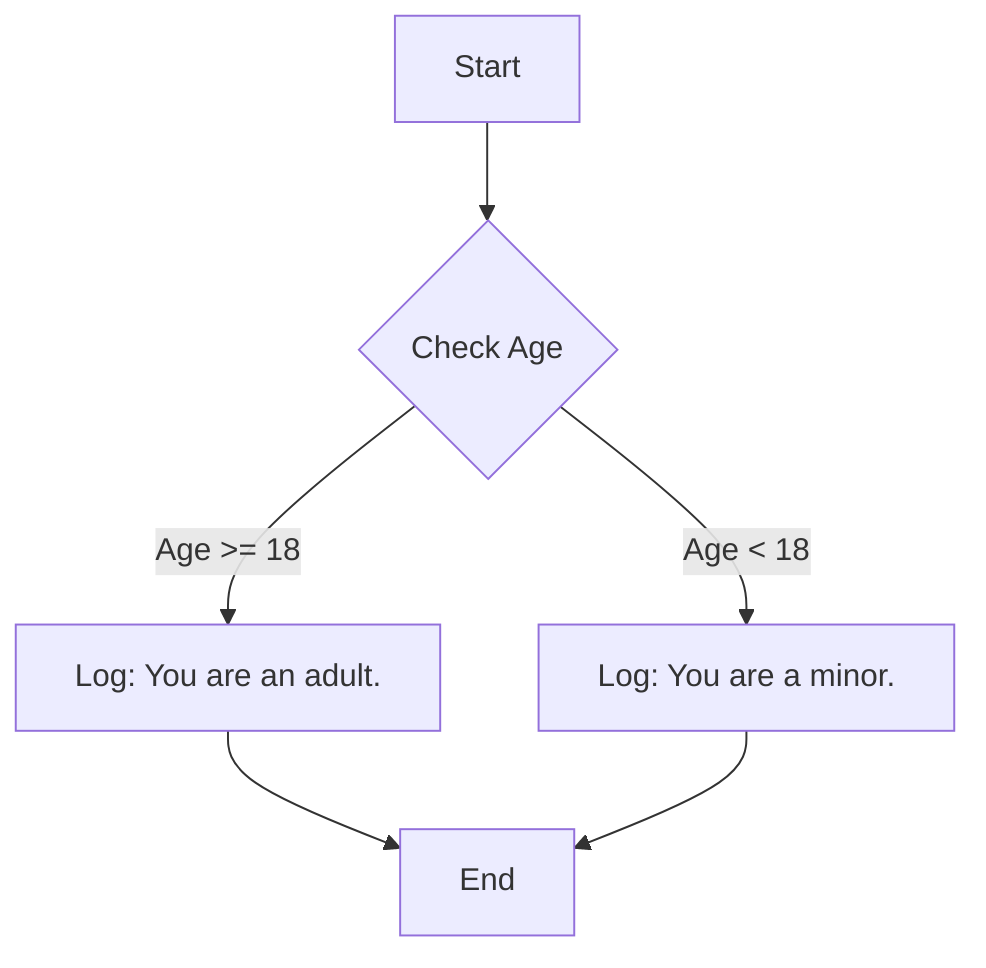

## 11.4. Debugging with `console.log()`

Debugging is an essential skill for any programmer. It involves identifying and fixing errors or bugs in your code. One of the simplest yet powerful tools for debugging in JavaScript is the `console.log()` function. This section will guide you through the process of using `console.log()` to monitor variable values and program flow, provide tips for effective logging, discuss its limitations, and introduce best practices for debugging.

### Understanding `console.log()`

The `console.log()` function is a built-in JavaScript method that outputs messages to the web console. This console is part of the browser's developer tools and is invaluable for developers to track the execution of their code.

#### How to Use `console.log()`

To use `console.log()`, simply insert it into your code where you want to check the value of a variable or understand the flow of execution. Here’s a basic example:

```javascript
let greeting = "Hello, World!";
console.log(greeting); // Outputs: Hello, World!
```

In this example, `console.log(greeting);` prints the value of the `greeting` variable to the console. This helps you verify that the variable contains the expected value.

### Monitoring Variable Values

One of the primary uses of `console.log()` is to check the values of variables at different points in your code. This can help you understand how data is being manipulated and identify where things might be going wrong.

#### Example: Tracking Variable Changes

Consider the following code snippet:

```javascript
let count = 0;
console.log("Initial count:", count);

count += 1;
console.log("After increment:", count);

count *= 2;
console.log("After doubling:", count);
```

**Explanation:**

- **Initial count:** Logs the initial value of `count`.
- **After increment:** Logs the value after incrementing by 1.
- **After doubling:** Logs the value after multiplying by 2.

This step-by-step logging allows you to see how the value of `count` changes over time, making it easier to spot any unexpected behavior.

### Understanding Program Flow

`console.log()` can also be used to understand the flow of your program, especially in complex logic involving loops and conditional statements.

#### Example: Debugging Conditional Logic

```javascript
let age = 18;

if (age >= 18) {
    console.log("You are an adult.");
} else {
    console.log("You are a minor.");
}
```

**Explanation:**

- The console will log "You are an adult." if `age` is 18 or more, otherwise it will log "You are a minor."
- By logging messages inside conditional statements, you can verify which path your code is taking.

### Tips for Effective Logging

To make the most out of `console.log()`, consider the following tips:

1. **Be Descriptive:** Include descriptive messages with your logs to make them more informative. Instead of just logging a variable, add context:

   ```javascript
   console.log("User's age is:", userAge);
   ```

2. **Log Multiple Values:** You can log multiple values at once, which is useful for comparing related variables:

   ```javascript
   console.log("Width:", width, "Height:", height);
   ```

3. **Use String Interpolation:** Use template literals for cleaner and more readable logs:

   ```javascript
   console.log(`The user's name is ${userName} and they are ${userAge} years old.`);
   ```

4. **Log Object Properties:** When logging objects, you can display specific properties:

   ```javascript
   console.log("User details:", user.name, user.email);
   ```

5. **Use Conditional Logging:** Log messages conditionally to avoid cluttering the console:

   ```javascript
   if (debugMode) {
       console.log("Debug mode is enabled.");
   }
   ```

### Limitations of `console.log()`

While `console.log()` is a powerful tool, it has its limitations:

- **Performance Impact:** Excessive logging can slow down your application, especially if logging is done in performance-critical sections like loops.
- **Cluttered Output:** Too many logs can make it difficult to find the information you need.
- **Not Suitable for Production:** Leaving `console.log()` statements in production code can expose sensitive information and affect performance.

### Advanced Debugging Tools

For more complex debugging tasks, consider using advanced tools like:

- **Browser Developer Tools:** Most modern browsers offer developer tools with features like breakpoints, call stack inspection, and variable watches.
- **Debuggers:** Use the `debugger` keyword in your code to pause execution and inspect variables.
- **Logging Libraries:** Consider using libraries like `winston` or `log4js` for more sophisticated logging capabilities.

### Best Practices

1. **Remove Debug Logs:** Always remove or disable debug logs before deploying your code to production.
2. **Use Logging Levels:** Implement logging levels (e.g., info, warn, error) to control the verbosity of logs.
3. **Document Your Logs:** Keep your logs organized and document their purpose to make them useful for future debugging.

### Try It Yourself

To get hands-on experience, try modifying the following code:

```javascript
let score = 0;

function updateScore(points) {
    score += points;
    console.log("Score updated:", score);
}

updateScore(5);
updateScore(10);
```

**Challenge:** Add a condition to reset the score if it exceeds 10, and log a message when this happens.

### Visualizing Program Flow

To better understand how `console.log()` helps in debugging, let's visualize a simple flowchart of a program with conditional logic.



**Description:** This flowchart represents a program that checks a user's age and logs a message based on whether they are an adult or a minor.

### References and Links

- [MDN Web Docs: Console](https://developer.mozilla.org/en-US/docs/Web/API/Console)
- [W3Schools: JavaScript Console](https://www.w3schools.com/js/js_console.asp)

### Knowledge Check

Before we conclude, let's reinforce what we've learned with a few questions.

## Quiz Time!



### What is the primary use of `console.log()` in JavaScript?

- [x] To output messages to the web console for debugging purposes.
- [ ] To create new variables in JavaScript.
- [ ] To execute JavaScript code on the server.
- [ ] To style HTML elements.

> **Explanation:** `console.log()` is mainly used for printing messages to the console to help developers debug their code.

### How can you log multiple values using `console.log()`?

- [x] By separating values with commas.
- [ ] By using a plus sign between values.
- [ ] By using a semicolon between values.
- [ ] By using a colon between values.

> **Explanation:** You can log multiple values by separating them with commas in the `console.log()` function.

### What is a limitation of using `console.log()`?

- [x] It can clutter the console with too many messages.
- [ ] It can only log numbers.
- [ ] It cannot be used in web browsers.
- [ ] It automatically deletes logs after a few seconds.

> **Explanation:** Excessive use of `console.log()` can clutter the console, making it hard to find relevant information.

### Why should you remove `console.log()` statements from production code?

- [x] They can expose sensitive information and affect performance.
- [ ] They are required for the code to run.
- [ ] They automatically fix bugs in the code.
- [ ] They are necessary for user interaction.

> **Explanation:** `console.log()` statements can expose sensitive data and impact performance, so they should be removed from production code.

### What can you use for more advanced debugging instead of `console.log()`?

- [x] Browser Developer Tools
- [ ] HTML tags
- [ ] CSS styles
- [ ] SQL queries

> **Explanation:** Browser Developer Tools offer advanced debugging features like breakpoints and variable inspection.

### How can you make your `console.log()` statements more informative?

- [x] By including descriptive messages.
- [ ] By using only numbers.
- [ ] By logging only once.
- [ ] By using random messages.

> **Explanation:** Including descriptive messages with your logs makes them more informative and easier to understand.

### What is a best practice when using `console.log()` in development?

- [x] Remove or disable them before deploying to production.
- [ ] Use them to replace all comments.
- [ ] Leave them in the code for future developers.
- [ ] Use them to store data permanently.

> **Explanation:** It's best to remove or disable `console.log()` statements before deploying to production to avoid exposing information and affecting performance.

### How can you conditionally log messages in JavaScript?

- [x] By using an `if` statement.
- [ ] By using a `for` loop.
- [ ] By using a `switch` statement.
- [ ] By using a `try-catch` block.

> **Explanation:** You can use an `if` statement to conditionally log messages based on certain conditions.

### What is the effect of excessive logging on application performance?

- [x] It can slow down the application.
- [ ] It speeds up the application.
- [ ] It has no effect.
- [ ] It automatically optimizes the code.

> **Explanation:** Excessive logging can slow down an application, especially in performance-critical sections.

### True or False: `console.log()` can be used to execute JavaScript code.

- [ ] True
- [x] False

> **Explanation:** `console.log()` is used to print messages to the console, not to execute JavaScript code.



### Embrace the Journey

Remember, debugging is a skill that improves with practice. As you continue to write and debug code, you'll become more adept at identifying and fixing issues. Keep experimenting, stay curious, and enjoy the journey of learning JavaScript!
