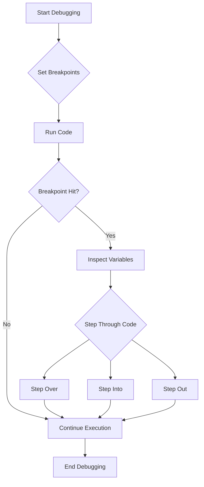

## 11.5. Using Breakpoints and Debuggers

Debugging is a crucial skill for any developer, especially when working with JavaScript, where dynamic typing and asynchronous execution can lead to unexpected behaviors. In this section, we'll explore how to use breakpoints and debuggers to inspect variables and understand the flow of your code. We'll focus on tools like Chrome DevTools and Visual Studio Code, which provide powerful debugging capabilities beyond simple `console.log()` statements.

### Introduction to Debuggers

A debugger is a tool that allows you to execute your code step by step, inspect variables, and understand the program's flow in real-time. Most modern web browsers and Integrated Development Environments (IDEs) come with built-in debuggers that can be used to set breakpoints, step through code, and inspect the state of your application.

#### Built-in Debuggers in Browsers

Web browsers like Google Chrome, Firefox, and Safari have built-in developer tools that include powerful debuggers. These tools allow you to pause the execution of your JavaScript code at any point, inspect variables, and evaluate expressions.

- **Chrome DevTools**: A comprehensive set of tools for debugging, profiling, and optimizing web applications.
- **Firefox Developer Tools**: Similar to Chrome DevTools, offering features for debugging, inspecting, and analyzing web pages.
- **Safari Web Inspector**: Provides a suite of tools for debugging and optimizing web content.

#### Debuggers in IDEs

IDEs such as Visual Studio Code, WebStorm, and Atom also offer integrated debugging tools. These tools allow you to debug your JavaScript code directly within the editor, providing a seamless development experience.

- **Visual Studio Code**: A popular open-source code editor with extensive debugging capabilities for JavaScript and other languages.
- **WebStorm**: A powerful IDE for JavaScript development with advanced debugging features.

### Setting Breakpoints

Breakpoints are markers that you can set in your code to pause execution at specific lines. This allows you to inspect the current state of your application and understand how variables are being modified.

#### How to Set Breakpoints

Let's explore how to set breakpoints using Chrome DevTools and Visual Studio Code.

##### Chrome DevTools

1. **Open DevTools**: Right-click on your web page and select "Inspect" or press `Ctrl+Shift+I` (Windows/Linux) or `Cmd+Option+I` (Mac).
2. **Navigate to the Sources Panel**: Click on the "Sources" tab to access the debugger.
3. **Locate Your Script**: Find the JavaScript file you want to debug in the file navigator.
4. **Set a Breakpoint**: Click on the line number where you want to pause execution. A blue marker will appear, indicating a breakpoint.

##### Visual Studio Code

1. **Open Your Project**: Launch Visual Studio Code and open your JavaScript project.
2. **Open the Debug Panel**: Click on the "Run and Debug" icon in the Activity Bar.
3. **Set a Breakpoint**: Open the JavaScript file you want to debug and click on the margin next to the line number to set a breakpoint.

#### Types of Breakpoints

- **Line Breakpoints**: Pause execution at a specific line of code.
- **Conditional Breakpoints**: Pause execution only when a specified condition is true.
- **Logpoints**: Instead of pausing, log a message to the console without stopping execution.

### Stepping Through Code

Once a breakpoint is hit, you can step through your code to observe its execution. This allows you to see how variables change over time and understand the flow of your program.

#### Stepping Options

- **Step Over**: Execute the current line of code and move to the next line.
- **Step Into**: Dive into a function call to see its execution.
- **Step Out**: Complete the current function and return to the calling function.
- **Continue**: Resume execution until the next breakpoint is hit.

### Inspecting Variables and Call Stacks

When your code is paused at a breakpoint, you can inspect the current state of variables and the call stack to understand the execution context.

#### Inspecting Variables

- **Scope Pane**: In Chrome DevTools, the "Scope" pane shows all variables in the current scope, including local, closure, and global variables.
- **Watch Expressions**: Add expressions to the "Watch" panel to monitor their values as you step through the code.

#### Call Stack

The call stack shows the sequence of function calls that led to the current point in execution. This helps you trace the path your code took to reach the breakpoint.

### Debugging with Chrome DevTools

Let's walk through a practical example using Chrome DevTools to debug a simple JavaScript application.

```javascript
// Example JavaScript Code
function calculateSum(a, b) {
    return a + b;
}

function displayResult() {
    const result = calculateSum(5, 10);
    console.log("The result is:", result);
}

displayResult();
```

#### Step-by-Step Debugging

1. **Set a Breakpoint**: Open the `Sources` panel and set a breakpoint on the line `const result = calculateSum(5, 10);`.
2. **Run the Code**: Reload the page to hit the breakpoint.
3. **Inspect Variables**: Check the value of `a` and `b` in the "Scope" pane.
4. **Step Into**: Use "Step Into" to dive into the `calculateSum` function.
5. **Continue Execution**: Use "Continue" to complete the execution and see the logged result.

### Debugging with Visual Studio Code

Visual Studio Code provides a robust debugging environment with features similar to Chrome DevTools.

#### Setting Up Debugging

1. **Launch Configuration**: Create a `launch.json` file in the `.vscode` folder to configure your debugging environment.
2. **Set Breakpoints**: Open your JavaScript file and set breakpoints as needed.
3. **Start Debugging**: Click the green "Play" button in the Debug panel to start debugging.

#### Example `launch.json` Configuration

```json
{
    "version": "0.2.0",
    "configurations": [
        {
            "type": "node",
            "request": "launch",
            "name": "Launch Program",
            "program": "${workspaceFolder}/app.js"
        }
    ]
}
```

### Advantages of Using Breakpoints and Debuggers

Using breakpoints and debuggers offers several advantages over traditional console logging:

- **Precision**: Pause execution at precise points in your code to inspect variables and understand the flow.
- **Efficiency**: Quickly identify and fix bugs without cluttering your code with `console.log()` statements.
- **Context**: Access the call stack and scope information to understand the execution context.
- **Flexibility**: Use conditional breakpoints and logpoints to tailor the debugging process to your needs.

### Try It Yourself

Experiment with the following code example by setting breakpoints and stepping through the code:

```javascript
// Try It Yourself Example
function multiply(a, b) {
    return a * b;
}

function calculateArea(width, height) {
    return multiply(width, height);
}

console.log("Area:", calculateArea(5, 10));
```

- **Set Breakpoints**: Set breakpoints in the `multiply` and `calculateArea` functions.
- **Step Through**: Use "Step Into" and "Step Over" to observe how the functions are executed.
- **Inspect Variables**: Check the values of `width`, `height`, `a`, and `b` during execution.

### Visualizing Debugging Workflow

To better understand the debugging workflow, let's visualize the process using a flowchart.



### References and Further Reading

- [MDN Web Docs: Debugging JavaScript](https://developer.mozilla.org/en-US/docs/Learn/JavaScript/Asynchronous/Debugging)
- [Google Chrome DevTools](https://developer.chrome.com/docs/devtools/)
- [Visual Studio Code Debugging](https://code.visualstudio.com/docs/editor/debugging)

### Knowledge Check

- **What is a breakpoint, and how is it used in debugging?**
- **How can you inspect the value of a variable when a breakpoint is hit?**
- **What are the advantages of using a debugger over `console.log()`?**

### Embrace the Journey

Remember, debugging is an essential skill that takes time to master. As you practice using breakpoints and debuggers, you'll become more proficient at identifying and fixing issues in your code. Keep experimenting, stay curious, and enjoy the journey!

## Quiz Time!



### What is the primary purpose of a breakpoint in debugging?

- [x] To pause code execution at a specific line
- [ ] To log messages to the console
- [ ] To automatically fix errors
- [ ] To compile the code

> **Explanation:** Breakpoints are used to pause code execution at specific lines, allowing developers to inspect variables and understand the program's flow.

### Which tool is NOT mentioned as a debugger in this section?

- [ ] Chrome DevTools
- [ ] Visual Studio Code
- [x] Microsoft Word
- [ ] Firefox Developer Tools

> **Explanation:** Microsoft Word is not a tool for debugging JavaScript code.

### What does the "Step Over" action do in a debugger?

- [x] Executes the current line and moves to the next line
- [ ] Dives into a function call
- [ ] Completes the current function and returns
- [ ] Resumes execution until the next breakpoint

> **Explanation:** "Step Over" executes the current line and moves to the next line without diving into function calls.

### What is the benefit of using conditional breakpoints?

- [x] They pause execution only when a specified condition is true
- [ ] They log messages without stopping execution
- [ ] They automatically fix bugs
- [ ] They compile code faster

> **Explanation:** Conditional breakpoints pause execution only when a specified condition is true, allowing for more targeted debugging.

### Which panel in Chrome DevTools shows all variables in the current scope?

- [x] Scope Pane
- [ ] Console Pane
- [ ] Network Pane
- [ ] Elements Pane

> **Explanation:** The Scope Pane in Chrome DevTools shows all variables in the current scope, including local, closure, and global variables.

### What is a call stack used for in debugging?

- [x] To trace the sequence of function calls leading to the current point
- [ ] To log messages to the console
- [ ] To automatically fix errors
- [ ] To compile the code

> **Explanation:** The call stack is used to trace the sequence of function calls that led to the current point in execution.

### How can you start debugging in Visual Studio Code?

- [x] By clicking the green "Play" button in the Debug panel
- [ ] By pressing `Ctrl+S`
- [ ] By opening the Terminal
- [ ] By closing the editor

> **Explanation:** You can start debugging in Visual Studio Code by clicking the green "Play" button in the Debug panel.

### What is the advantage of using logpoints over traditional breakpoints?

- [x] They log messages without stopping execution
- [ ] They automatically fix bugs
- [ ] They compile code faster
- [ ] They pause execution at specific lines

> **Explanation:** Logpoints log messages to the console without stopping execution, allowing for non-intrusive debugging.

### Which of the following is NOT a stepping option in a debugger?

- [ ] Step Over
- [ ] Step Into
- [ ] Step Out
- [x] Step Around

> **Explanation:** "Step Around" is not a recognized stepping option in debuggers.

### True or False: Debuggers can only be used in web browsers.

- [ ] True
- [x] False

> **Explanation:** Debuggers are available in both web browsers and Integrated Development Environments (IDEs) like Visual Studio Code.


