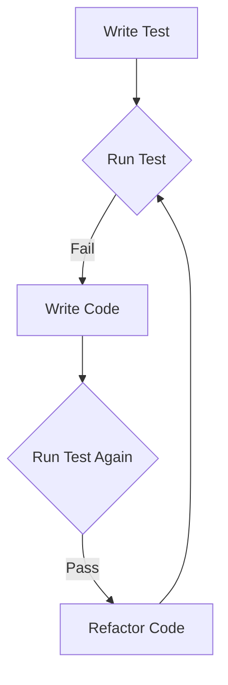

## 11.6. Testing Variable States

In the world of software development, ensuring that your code behaves as expected is crucial. One of the most effective ways to achieve this is through testing. In this section, we'll explore how to test variable states in JavaScript, ensuring that variables hold the expected values throughout code execution. We'll discuss the role of unit tests, introduce popular testing frameworks like Jest and Mocha, and provide examples of writing test cases. Additionally, we'll delve into assertions and how they help validate variable outputs, encouraging test-driven development (TDD) practices.

### The Role of Unit Tests in Verifying Variable States

Unit tests are automated tests written and run by developers to ensure that a specific section of an application (usually a function or a module) behaves as intended. They are the first line of defense against bugs and help verify that your code is working correctly. When it comes to variables, unit tests can:

- **Verify Initialization**: Ensure variables are initialized with the correct values.
- **Check State Changes**: Confirm that variables change state as expected during execution.
- **Validate Outputs**: Ensure that functions return the correct values based on their inputs.

By writing unit tests, you can catch errors early in the development process, making it easier to fix them before they become larger issues.

### Introducing Testing Frameworks: Jest and Mocha

Testing frameworks provide the tools and structure needed to write and run tests efficiently. Two popular testing frameworks in the JavaScript ecosystem are Jest and Mocha.

#### Jest

Jest is a delightful JavaScript testing framework with a focus on simplicity. It works seamlessly with projects using Babel, TypeScript, Node.js, React, Angular, Vue.js, and more. Jest is known for its ease of use and powerful features, such as:

- **Zero Configuration**: Works out of the box for most JavaScript projects.
- **Snapshot Testing**: Captures the output of a function and compares it to a stored snapshot.
- **Mocking**: Easily mock functions and modules to isolate the code being tested.

#### Mocha

Mocha is a flexible testing framework for Node.js and the browser. It provides a rich set of features for asynchronous testing, making it a popular choice for developers who need more control over their testing environment. Mocha is often used in combination with other libraries like Chai for assertions and Sinon for mocking.

### Writing Test Cases for Functions and Modules

Let's dive into writing test cases using Jest and Mocha. We'll start with a simple function and write tests to verify its behavior.

#### Example Function: Calculate Sum

```javascript
// sum.js
function calculateSum(a, b) {
  return a + b;
}

module.exports = calculateSum;
```

#### Writing Tests with Jest

First, let's write a test case for the `calculateSum` function using Jest.

```javascript
// sum.test.js
const calculateSum = require('./sum');

test('adds 1 + 2 to equal 3', () => {
  expect(calculateSum(1, 2)).toBe(3);
});

test('adds -1 + -1 to equal -2', () => {
  expect(calculateSum(-1, -1)).toBe(-2);
});
```

In this example, we use Jest's `test` function to define a test case. The `expect` function is used to create an assertion, checking that `calculateSum(1, 2)` returns `3`.

#### Writing Tests with Mocha and Chai

Now, let's write the same test using Mocha and Chai.

```javascript
// sum.test.js
const calculateSum = require('./sum');
const { expect } = require('chai');

describe('calculateSum', () => {
  it('should return 3 when adding 1 and 2', () => {
    expect(calculateSum(1, 2)).to.equal(3);
  });

  it('should return -2 when adding -1 and -1', () => {
    expect(calculateSum(-1, -1)).to.equal(-2);
  });
});
```

In this example, we use Mocha's `describe` and `it` functions to define the test suite and test cases. Chai's `expect` function is used for assertions.

### Understanding Assertions and Validating Variable Outputs

Assertions are statements that check if a condition is true. They are the backbone of testing, allowing you to verify that your code behaves as expected. In the context of testing variable states, assertions can:

- **Check Equality**: Ensure a variable equals a specific value.
- **Verify Type**: Confirm a variable is of a certain type.
- **Check for Null or Undefined**: Ensure a variable is not null or undefined.

#### Common Assertion Methods

- **toBe**: Checks for strict equality (Jest).
- **toEqual**: Checks for deep equality (Jest).
- **toBeNull**: Checks if a value is null (Jest).
- **toBeUndefined**: Checks if a value is undefined (Jest).
- **to.be.a**: Checks the type of a value (Chai).
- **to.equal**: Checks for strict equality (Chai).
- **to.be.null**: Checks if a value is null (Chai).
- **to.be.undefined**: Checks if a value is undefined (Chai).

### Encouraging Test-Driven Development Practices

Test-driven development (TDD) is a software development approach where tests are written before the code that needs to be tested. This practice encourages developers to think about the desired behavior of their code before implementing it, leading to more robust and reliable software.

#### TDD Workflow

1. **Write a Test**: Start by writing a test for the desired functionality.
2. **Run the Test**: Run the test and watch it fail, as the functionality hasn't been implemented yet.
3. **Write Code**: Write the minimal amount of code needed to pass the test.
4. **Run the Test Again**: Run the test again and watch it pass.
5. **Refactor**: Refactor the code to improve its structure while ensuring the test still passes.

By following this cycle, you can ensure that your code is thoroughly tested and meets the requirements.

### Try It Yourself: Experiment with Testing

Now that we've covered the basics of testing variable states, it's time to put your knowledge into practice. Try writing tests for the following scenarios:

1. **Function with Conditional Logic**: Write a function that returns "even" or "odd" based on an input number. Write tests to verify its behavior.
2. **Array Manipulation**: Write a function that removes duplicates from an array. Write tests to ensure it works correctly for various inputs.
3. **Object Property Validation**: Write a function that checks if an object has a specific property. Write tests to verify its accuracy.

### Visualizing the Testing Process

To help you understand the testing process, let's visualize the flow of a typical test using a flowchart.



**Figure 1: Test-Driven Development Workflow**

This flowchart illustrates the TDD workflow, showing how tests guide the development process.

### References and Links

For further reading on testing in JavaScript, consider exploring the following resources:

- [Jest Documentation](https://jestjs.io/docs/en/getting-started)
- [Mocha Documentation](https://mochajs.org/)
- [Chai Documentation](https://www.chaijs.com/)

### Knowledge Check

Before we wrap up, let's reinforce what we've learned with a few questions:

- What is the primary purpose of unit tests?
- How do Jest and Mocha differ in their approach to testing?
- What is an assertion, and why is it important in testing?
- Describe the TDD workflow in your own words.

### Embrace the Journey

Remember, testing is an integral part of the development process. By writing tests, you can ensure that your code is reliable and maintainable. Keep experimenting with different testing scenarios, stay curious, and enjoy the journey of becoming a proficient JavaScript developer!

## Quiz Time!



### What is the primary purpose of unit tests?

- [x] To verify that individual sections of code behave as expected
- [ ] To optimize the performance of the code
- [ ] To document the codebase
- [ ] To replace manual testing

> **Explanation:** Unit tests are designed to verify that individual sections of code, such as functions or modules, behave as expected. They help catch errors early in the development process.

### Which testing framework is known for its zero configuration setup?

- [x] Jest
- [ ] Mocha
- [ ] Chai
- [ ] Sinon

> **Explanation:** Jest is known for its zero configuration setup, making it easy to integrate into most JavaScript projects without additional setup.

### What is an assertion in the context of testing?

- [x] A statement that checks if a condition is true
- [ ] A function that logs errors
- [ ] A method for optimizing code
- [ ] A tool for debugging

> **Explanation:** An assertion is a statement that checks if a condition is true. It is used in testing to verify that code behaves as expected.

### What does TDD stand for?

- [x] Test-Driven Development
- [ ] Test-Driven Design
- [ ] Test-Driven Debugging
- [ ] Test-Driven Documentation

> **Explanation:** TDD stands for Test-Driven Development, a software development approach where tests are written before the code that needs to be tested.

### In TDD, what is the first step in the workflow?

- [x] Write a Test
- [ ] Write Code
- [ ] Run the Test
- [ ] Refactor

> **Explanation:** In TDD, the first step is to write a test for the desired functionality. This helps guide the development process.

### Which of the following is a common assertion method in Jest?

- [x] toBe
- [ ] to.equal
- [ ] to.be.a
- [ ] to.be.null

> **Explanation:** `toBe` is a common assertion method in Jest, used to check for strict equality.

### What is the purpose of refactoring in the TDD workflow?

- [x] To improve the structure of the code while ensuring tests still pass
- [ ] To add new features to the code
- [ ] To remove unnecessary tests
- [ ] To document the code

> **Explanation:** Refactoring in the TDD workflow involves improving the structure of the code while ensuring that the tests still pass.

### Which library is often used with Mocha for assertions?

- [x] Chai
- [ ] Jest
- [ ] Sinon
- [ ] Jasmine

> **Explanation:** Chai is often used with Mocha for assertions, providing a rich set of assertion methods.

### What is the benefit of using snapshot testing in Jest?

- [x] It captures the output of a function and compares it to a stored snapshot
- [ ] It optimizes the performance of the code
- [ ] It provides detailed error logs
- [ ] It replaces manual testing

> **Explanation:** Snapshot testing in Jest captures the output of a function and compares it to a stored snapshot, making it easy to detect changes in the output.

### True or False: Mocha is primarily used for testing React applications.

- [ ] True
- [x] False

> **Explanation:** False. While Mocha can be used for testing React applications, it is not primarily designed for that purpose. Jest is more commonly used for testing React applications due to its integration with the React ecosystem.




