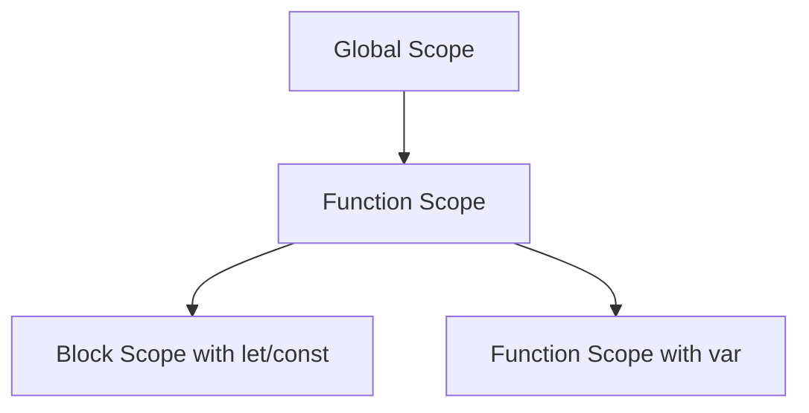

## 11.7. Avoiding Common Pitfalls

In the journey of mastering JavaScript, understanding and avoiding common pitfalls is crucial. These pitfalls often arise from misunderstandings about how JavaScript handles variables and data types. In this section, we will explore frequent errors, understand why they occur, and provide practical advice on how to avoid them. Let's dive in!

### Understanding Common Pitfalls

JavaScript, with its dynamic nature, offers flexibility but also opens doors to potential errors. Here, we will discuss some of the most common pitfalls:

1. **Scope Issues**
2. **Type Coercion Surprises**
3. **Hoisting Confusion**
4. **Misusing `this` Keyword**
5. **Incorrect Use of `==` and `===`**
6. **Variable Re-declaration and Re-assignment**
7. **Handling `null` and `undefined`**
8. **Mismanagement of Asynchronous Code**
9. **Global Namespace Pollution**
10. **Ignoring Strict Mode**

Let's examine each of these pitfalls in detail.

### 1. Scope Issues

**Explanation:** One of the most common pitfalls in JavaScript is misunderstanding variable scope. JavaScript has function scope and block scope, which can lead to unexpected behavior if not handled correctly.

**Example:**

```javascript
function exampleFunction() {
    if (true) {
        var functionScoped = 'I am function scoped';
        let blockScoped = 'I am block scoped';
    }
    console.log(functionScoped); // Outputs: I am function scoped
    console.log(blockScoped);    // ReferenceError: blockScoped is not defined
}
```

**Why It Occurs:** The `var` keyword declares a variable that is function-scoped, meaning it is accessible throughout the function. In contrast, `let` and `const` are block-scoped, meaning they are only accessible within the block they are defined.

**How to Avoid:** Use `let` and `const` instead of `var` to avoid scope-related issues. Always be mindful of where your variables are declared and ensure they are accessible only where needed.

**Visualizing Scope:**



### 2. Type Coercion Surprises

**Explanation:** JavaScript's type coercion can lead to unexpected results, especially when using equality operators.

**Example:**

```javascript
console.log(1 == '1');  // true
console.log(1 === '1'); // false
```

**Why It Occurs:** The `==` operator performs type coercion, converting operands to the same type before comparing. The `===` operator, however, checks both value and type.

**How to Avoid:** Always use `===` and `!==` to avoid unintended type coercion. Be explicit about type conversions when necessary.

### 3. Hoisting Confusion

**Explanation:** Hoisting is a JavaScript mechanism where variable and function declarations are moved to the top of their containing scope during compilation.

**Example:**

```javascript
console.log(hoistedVar); // undefined
var hoistedVar = 'I am hoisted';
```

**Why It Occurs:** Variables declared with `var` are hoisted to the top, but their assignments are not. This can lead to accessing variables before they are initialized.

**How to Avoid:** Use `let` and `const`, which are not hoisted in the same way, and always declare variables at the top of their scope.

### 4. Misusing `this` Keyword

**Explanation:** The `this` keyword in JavaScript can be tricky as it behaves differently depending on the context in which it is used.

**Example:**

```javascript
const obj = {
    name: 'JavaScript',
    getName: function() {
        return this.name;
    }
};

const getName = obj.getName;
console.log(getName()); // undefined
```

**Why It Occurs:** In the example above, `this` refers to the global object when `getName` is called outside of `obj`.

**How to Avoid:** Use arrow functions, which do not have their own `this`, or use `bind`, `call`, or `apply` to explicitly set `this`.

### 5. Incorrect Use of `==` and `===`

**Explanation:** As mentioned earlier, using `==` can lead to unexpected type coercion.

**Example:**

```javascript
console.log(false == 0);  // true
console.log(false === 0); // false
```

**Why It Occurs:** `==` converts both operands to the same type before comparison, which can lead to unintended results.

**How to Avoid:** Prefer `===` over `==` to ensure both value and type are checked.

### 6. Variable Re-declaration and Re-assignment

**Explanation:** Re-declaring variables using `var` can lead to bugs and confusion.

**Example:**

```javascript
var name = 'JavaScript';
var name = 'ECMAScript';
console.log(name); // ECMAScript
```

**Why It Occurs:** `var` allows re-declaration, which can overwrite variables unintentionally.

**How to Avoid:** Use `let` and `const` to prevent re-declaration. `const` should be used for variables that should not be reassigned.

### 7. Handling `null` and `undefined`

**Explanation:** Confusion often arises when dealing with `null` and `undefined`, leading to runtime errors.

**Example:**

```javascript
let value;
console.log(value === undefined); // true
console.log(value === null);      // false
```

**Why It Occurs:** `undefined` is a variable that has been declared but not assigned a value, while `null` is an assignment value that represents no value.

**How to Avoid:** Always initialize variables and use strict equality checks to differentiate between `null` and `undefined`.

### 8. Mismanagement of Asynchronous Code

**Explanation:** JavaScript's asynchronous nature can lead to unexpected behavior if not managed properly.

**Example:**

```javascript
setTimeout(() => {
    console.log('This runs last');
}, 0);
console.log('This runs first');
```

**Why It Occurs:** JavaScript executes synchronous code before asynchronous code, even if the asynchronous code has a timeout of 0.

**How to Avoid:** Use promises or async/await to handle asynchronous code more predictably.

### 9. Global Namespace Pollution

**Explanation:** Declaring too many global variables can lead to conflicts and bugs.

**Example:**

```javascript
var globalVar = 'I am global';
function example() {
    console.log(globalVar);
}
```

**Why It Occurs:** Global variables are accessible from anywhere in the code, which can lead to conflicts if multiple scripts use the same variable names.

**How to Avoid:** Minimize the use of global variables and use modules or closures to encapsulate code.

### 10. Ignoring Strict Mode

**Explanation:** Strict mode is a way to opt into a restricted variant of JavaScript, which can help catch common errors.

**Example:**

```javascript
'use strict';
undeclaredVar = 'This will throw an error';
```

**Why It Occurs:** Without strict mode, JavaScript allows certain "bad syntax" to pass silently.

**How to Avoid:** Always start your scripts with `'use strict';` to enforce stricter parsing and error handling.

### Practical Advice for Avoiding Pitfalls

1. **Code Reviews and Pair Programming:** Regularly review code with peers to catch errors early. Pair programming can provide immediate feedback and alternative solutions.

2. **Continuous Learning:** Stay updated with JavaScript best practices and new features. Engage with the community through forums and online courses.

3. **Use Linters and Static Analysis Tools:** Tools like ESLint can help identify potential issues in your code before they become bugs.

4. **Write Tests:** Implement unit tests to ensure your code behaves as expected. Testing helps catch errors early and ensures code reliability.

5. **Embrace Debugging Tools:** Use browser developer tools to debug and inspect code. Breakpoints and watch expressions can help track down issues.

### Try It Yourself

Let's experiment with some of these concepts. Modify the following code to see how different scopes and hoisting behaviors affect the output:

```javascript
function scopeExperiment() {
    console.log(hoistedVar); // What will this output?
    var hoistedVar = 'I am hoisted';

    if (true) {
        let blockVar = 'I am block scoped';
        console.log(blockVar); // What will this output?
    }

    console.log(blockVar); // What will this output?
}

scopeExperiment();
```

Try changing `var` to `let` or `const` and observe the differences. Experiment with strict mode by adding `'use strict';` at the top of your script.

### Knowledge Check

Before we wrap up, let's summarize the key takeaways:

- **Scope Awareness:** Understand the difference between function and block scope.
- **Type Coercion:** Use strict equality to avoid unintended type conversions.
- **Hoisting:** Be mindful of variable declarations and their hoisting behavior.
- **`this` Context:** Know how `this` behaves in different contexts.
- **Global Variables:** Minimize their use to avoid conflicts.
- **Strict Mode:** Use it to catch common errors early.

Remember, this is just the beginning. As you progress, you'll build more complex and interactive web pages. Keep experimenting, stay curious, and enjoy the journey!

## Quiz Time!



### What is a common pitfall when using the `var` keyword?

- [x] Variables are function-scoped, leading to unexpected behavior.
- [ ] Variables are block-scoped, causing issues with hoisting.
- [ ] Variables cannot be reassigned, leading to errors.
- [ ] Variables are immutable, causing unexpected results.

> **Explanation:** `var` is function-scoped, which can lead to variables being accessible outside the intended block, causing unexpected behavior.

### How can you avoid type coercion surprises in JavaScript?

- [x] Use `===` instead of `==`.
- [ ] Use `==` instead of `===`.
- [ ] Avoid using any equality operators.
- [ ] Use only numeric values.

> **Explanation:** Using `===` ensures that both value and type are checked, avoiding unintended type coercion.

### What does the `this` keyword refer to in a function called as a method of an object?

- [x] The object the method is called on.
- [ ] The global object.
- [ ] The function itself.
- [ ] The parent object.

> **Explanation:** When a function is called as a method of an object, `this` refers to the object the method is called on.

### What is the effect of using `'use strict';` at the beginning of a script?

- [x] It enforces stricter parsing and error handling.
- [ ] It makes all variables global.
- [ ] It disables all type coercion.
- [ ] It prevents the use of `this`.

> **Explanation:** `'use strict';` enforces stricter parsing and error handling, helping catch common errors early.

### Which of the following is a benefit of using `let` and `const` over `var`?

- [x] They provide block-level scoping.
- [ ] They allow re-declaration of variables.
- [x] They prevent hoisting issues.
- [ ] They are automatically global.

> **Explanation:** `let` and `const` provide block-level scoping and prevent certain hoisting issues, unlike `var`.

### What is a common mistake when handling `null` and `undefined`?

- [x] Confusing them as interchangeable.
- [ ] Using them as object keys.
- [ ] Assigning them to variables.
- [ ] Comparing them with `===`.

> **Explanation:** `null` and `undefined` are not interchangeable; they represent different concepts and should be handled accordingly.

### How can you prevent global namespace pollution?

- [x] Use modules or closures to encapsulate code.
- [ ] Declare all variables globally.
- [x] Minimize the use of global variables.
- [ ] Use only `var` for declarations.

> **Explanation:** Using modules or closures and minimizing global variables helps prevent global namespace pollution.

### What is a common pitfall when dealing with asynchronous code?

- [x] Assuming asynchronous code runs immediately.
- [ ] Using `let` instead of `var`.
- [ ] Using `===` instead of `==`.
- [ ] Declaring variables inside a loop.

> **Explanation:** Asynchronous code does not run immediately; it runs after the current execution stack is cleared, which can lead to unexpected behavior if not managed properly.

### How can you avoid hoisting issues?

- [x] Declare variables at the top of their scope.
- [ ] Use only `var` for declarations.
- [ ] Avoid using functions.
- [ ] Use `==` for comparisons.

> **Explanation:** Declaring variables at the top of their scope helps avoid hoisting issues, ensuring they are initialized before use.

### True or False: Code reviews and pair programming can help catch errors early.

- [x] True
- [ ] False

> **Explanation:** Code reviews and pair programming provide opportunities for immediate feedback and alternative solutions, helping catch errors early.


