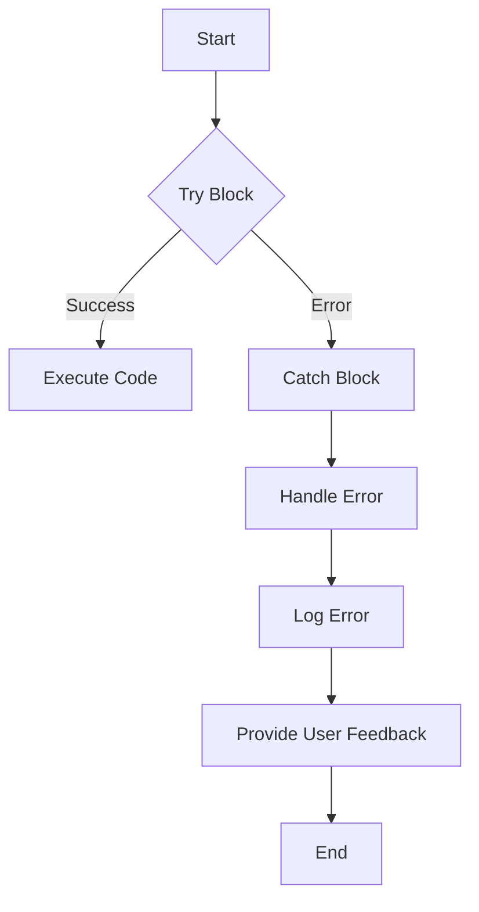

## 11.8. Error Handling Best Practices

In the world of programming, errors are inevitable. They can arise from unexpected user inputs, network issues, or even bugs in the code. As a JavaScript developer, understanding how to effectively handle these errors is crucial to building robust applications. In this section, we'll explore error handling best practices using `try...catch` statements, creating custom error types, and implementing logging and monitoring for effective error tracking.

### Understanding `try...catch` Statements

The `try...catch` statement is a fundamental construct in JavaScript for handling exceptions. It allows you to execute code that might throw an error and handle that error gracefully without crashing your application.

#### Basic Structure of `try...catch`

Here's a simple example to illustrate the basic structure of a `try...catch` statement:

```javascript
try {
    // Code that may throw an error
    let result = riskyOperation();
    console.log(result);
} catch (error) {
    // Code to handle the error
    console.error('An error occurred:', error.message);
}
```

- **`try` block**: Contains code that might throw an error.
- **`catch` block**: Executed if an error occurs in the `try` block. The error object is passed to this block, allowing you to access details about the error.

#### Example: Handling a Division by Zero Error

Let's consider a scenario where you want to divide two numbers. Division by zero is a common error that can occur in such situations:

```javascript
function divideNumbers(a, b) {
    try {
        if (b === 0) {
            throw new Error('Division by zero is not allowed.');
        }
        return a / b;
    } catch (error) {
        console.error('Error:', error.message);
        return null; // Return a default value or handle the error gracefully
    }
}

console.log(divideNumbers(10, 2)); // Outputs: 5
console.log(divideNumbers(10, 0)); // Outputs: Error: Division by zero is not allowed.
```

In this example, we use the `throw` statement to create a custom error message when a division by zero is attempted. The `catch` block then handles this error by logging it and returning a default value.

### Creating and Throwing Custom Error Types

While JavaScript provides built-in error types like `Error`, `TypeError`, and `ReferenceError`, creating custom error types can make your code more readable and maintainable.

#### Defining Custom Error Types

You can define a custom error type by extending the built-in `Error` class:

```javascript
class ValidationError extends Error {
    constructor(message) {
        super(message);
        this.name = 'ValidationError';
    }
}

function validateUserInput(input) {
    if (input === '') {
        throw new ValidationError('Input cannot be empty.');
    }
    // Additional validation logic
}

try {
    validateUserInput('');
} catch (error) {
    if (error instanceof ValidationError) {
        console.error('Validation Error:', error.message);
    } else {
        console.error('Unknown Error:', error.message);
    }
}
```

In this example, we create a `ValidationError` class that extends the `Error` class. This allows us to throw and catch validation-specific errors, making our error handling more precise.

### Graceful Error Handling and User Feedback

Handling errors gracefully means providing users with meaningful feedback without exposing technical details or crashing the application. Here are some strategies for achieving this:

#### Providing User-Friendly Messages

Instead of displaying raw error messages, provide users with clear and concise feedback:

```javascript
try {
    // Code that may throw an error
} catch (error) {
    alert('Something went wrong. Please try again later.');
    console.error('Detailed error:', error); // Log the error for debugging purposes
}
```

#### Fallback Mechanisms

Implement fallback mechanisms to ensure your application continues to function even when an error occurs:

```javascript
function fetchData() {
    try {
        // Simulate a network request
        throw new Error('Network error');
    } catch (error) {
        console.warn('Failed to fetch data. Using cached data instead.');
        return getCachedData(); // Use cached data as a fallback
    }
}
```

### Balancing Error Handling and Suppression

While it's important to handle errors, it's equally important not to suppress them entirely. Suppressing errors can make debugging difficult and hide potential issues in your code.

#### Avoiding Silent Failures

Ensure that errors are logged or reported, even if they are handled gracefully:

```javascript
try {
    // Code that may throw an error
} catch (error) {
    console.error('An error occurred:', error.message);
    // Additional error handling logic
}
```

#### Rethrowing Errors

In some cases, you may want to catch an error, perform some actions, and then rethrow it to be handled by another part of your application:

```javascript
function processData(data) {
    try {
        // Code that may throw an error
    } catch (error) {
        console.warn('Error processing data:', error.message);
        throw error; // Rethrow the error for further handling
    }
}

try {
    processData(null);
} catch (error) {
    console.error('Failed to process data:', error.message);
}
```

### Logging and Monitoring for Error Tracking

Logging and monitoring are essential components of a robust error handling strategy. They help you track errors, understand their frequency, and identify patterns that may indicate underlying issues.

#### Implementing Logging

Use logging to record error details for later analysis:

```javascript
function logError(error) {
    console.log(`[${new Date().toISOString()}] Error: ${error.message}`);
}

try {
    // Code that may throw an error
} catch (error) {
    logError(error);
}
```

#### Monitoring Tools

Consider using monitoring tools to track errors in real-time and receive alerts when issues arise. Popular tools include:

- **Sentry**: [Sentry](https://sentry.io/) provides real-time error tracking and performance monitoring.
- **LogRocket**: [LogRocket](https://logrocket.com/) offers session replay and error tracking for web applications.
- **New Relic**: [New Relic](https://newrelic.com/) provides comprehensive monitoring and analytics for applications.

### Visualizing Error Handling Flow

To better understand the flow of error handling in JavaScript, let's visualize it using a flowchart:



This flowchart illustrates the typical flow of error handling using `try...catch` statements. The code in the `try` block is executed first. If an error occurs, the `catch` block handles it, logs the error, and provides user feedback.

### Knowledge Check

Before we wrap up, let's reinforce what we've learned with a few questions:

- What is the purpose of a `try...catch` statement in JavaScript?
- How can you create a custom error type in JavaScript?
- Why is it important to provide user-friendly error messages?
- What are some strategies for logging and monitoring errors?

### Conclusion

Effective error handling is a critical skill for any JavaScript developer. By using `try...catch` statements, creating custom error types, and implementing logging and monitoring, you can build robust applications that handle errors gracefully and provide a better user experience.

Remember, this is just the beginning. As you continue to develop your skills, you'll encounter more complex error handling scenarios. Keep experimenting, stay curious, and enjoy the journey!

## Quiz Time!



### What is the primary purpose of a `try...catch` statement in JavaScript?

- [x] To handle exceptions and prevent application crashes
- [ ] To execute asynchronous code
- [ ] To optimize code performance
- [ ] To declare variables

> **Explanation:** The `try...catch` statement is used to handle exceptions and prevent application crashes by catching errors and executing alternative code.

### How can you create a custom error type in JavaScript?

- [x] By extending the built-in `Error` class
- [ ] By using the `throw` statement
- [ ] By defining a function
- [ ] By using a `switch` statement

> **Explanation:** You can create a custom error type by extending the built-in `Error` class and adding custom properties or methods.

### Why is it important to provide user-friendly error messages?

- [x] To improve user experience and avoid exposing technical details
- [ ] To increase code performance
- [ ] To reduce code complexity
- [ ] To enhance security

> **Explanation:** Providing user-friendly error messages improves user experience by avoiding technical jargon and offering clear guidance.

### What is a common strategy for handling errors gracefully?

- [x] Implementing fallback mechanisms
- [ ] Ignoring errors
- [ ] Using global variables
- [ ] Writing complex code

> **Explanation:** Implementing fallback mechanisms ensures that applications continue to function even when errors occur, enhancing reliability.

### What is the benefit of logging errors?

- [x] To track error details for later analysis
- [ ] To increase code execution speed
- [ ] To reduce memory usage
- [ ] To simplify code

> **Explanation:** Logging errors helps track error details, allowing developers to analyze and address issues effectively.

### Which tool is commonly used for real-time error tracking?

- [x] Sentry
- [ ] GitHub
- [ ] Visual Studio Code
- [ ] Node.js

> **Explanation:** Sentry is a popular tool for real-time error tracking and performance monitoring in applications.

### What should you avoid when handling errors?

- [x] Suppressing errors entirely
- [ ] Logging errors
- [ ] Providing user feedback
- [ ] Using `try...catch` statements

> **Explanation:** Suppressing errors entirely can make debugging difficult and hide potential issues, so it's important to log and address them.

### What is a fallback mechanism in error handling?

- [x] An alternative solution when an error occurs
- [ ] A function that throws errors
- [ ] A method for optimizing code
- [ ] A way to declare variables

> **Explanation:** A fallback mechanism provides an alternative solution when an error occurs, ensuring that applications continue to function.

### How can you rethrow an error in JavaScript?

- [x] By using the `throw` statement inside a `catch` block
- [ ] By using a `return` statement
- [ ] By declaring a new variable
- [ ] By using a `for` loop

> **Explanation:** You can rethrow an error by using the `throw` statement inside a `catch` block, allowing it to be handled by another part of the application.

### True or False: Logging errors is unnecessary if you handle them gracefully.

- [ ] True
- [x] False

> **Explanation:** False. Logging errors is important even if you handle them gracefully, as it helps track issues and improve application reliability.


