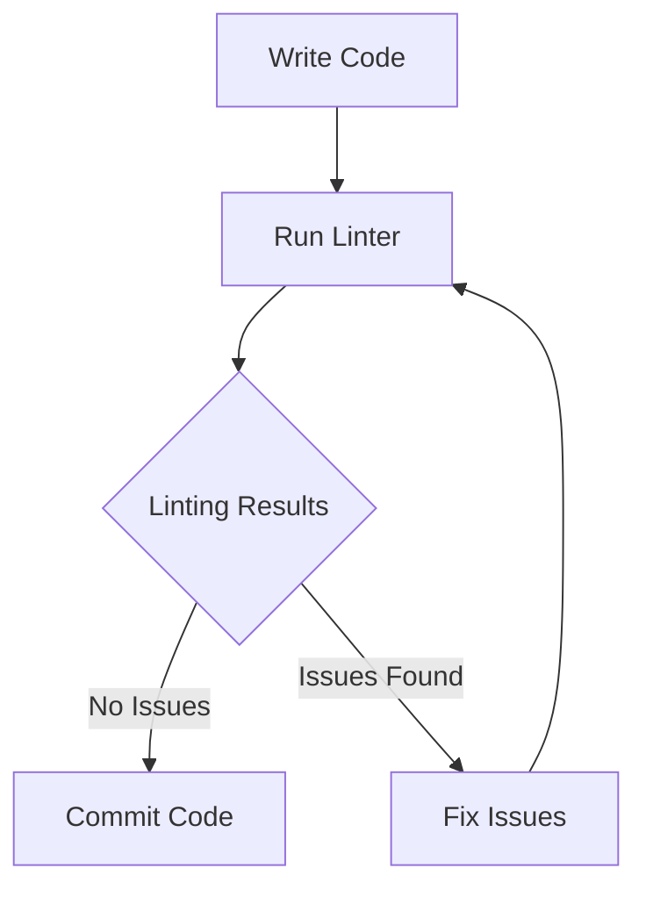

## 11.9. Tools for Static Analysis

In the world of software development, ensuring that your code is error-free and adheres to best practices is crucial. Static analysis tools play a significant role in this process by examining your code for potential issues without executing it. In this section, we will explore two popular static analysis tools for JavaScript: ESLint and JSHint. We will discuss how these tools can help you find potential issues in your code, integrate them into your development workflow, configure rules and styles to enforce code quality, and highlight the benefits of early error detection and consistent code.

### Understanding Static Analysis

Before diving into specific tools, let's first understand what static analysis is. Static analysis involves examining the source code of a program without executing it. This analysis can identify potential errors, enforce coding standards, and ensure code quality. Static analysis tools can detect a wide range of issues, from syntax errors to more complex problems like unused variables or inconsistent naming conventions.

### Introducing ESLint

ESLint is one of the most popular static analysis tools for JavaScript. It is highly configurable and can be tailored to meet the specific needs of your project. ESLint can analyze your code for potential errors, enforce coding standards, and even automatically fix certain issues.

#### Key Features of ESLint

- **Customizable Rules**: ESLint allows you to define your own rules or use predefined ones to enforce coding standards.
- **Pluggable Architecture**: You can extend ESLint's functionality with plugins that add new rules or modify existing ones.
- **Integration with Editors**: ESLint can be integrated with popular code editors like Visual Studio Code, Atom, and Sublime Text, providing real-time feedback as you write code.
- **Automatic Fixes**: ESLint can automatically fix certain issues, saving you time and effort.

#### Installing ESLint

To start using ESLint, you need to install it in your project. You can do this using npm, the Node.js package manager. Open your terminal and run the following command:

```bash
npm install eslint --save-dev
```

This command installs ESLint as a development dependency in your project.

#### Setting Up ESLint

Once ESLint is installed, you need to configure it for your project. You can do this by creating an ESLint configuration file. Run the following command to create a basic configuration file:

```bash
npx eslint --init
```

This command will prompt you with a series of questions to help set up your configuration file. You can choose to use a popular style guide, such as Airbnb or Google, or create your own custom configuration.

#### Running ESLint

After setting up ESLint, you can run it on your codebase to analyze your files. Use the following command to lint your JavaScript files:

```bash
npx eslint yourfile.js
```

Replace `yourfile.js` with the path to the file or directory you want to analyze. ESLint will output a list of issues found in your code, along with suggestions for fixing them.

### Introducing JSHint

JSHint is another popular static analysis tool for JavaScript. It is similar to ESLint but focuses more on identifying potential errors and enforcing coding standards.

#### Key Features of JSHint

- **Configurable Options**: JSHint allows you to customize its behavior by enabling or disabling specific options.
- **Integration with Editors**: Like ESLint, JSHint can be integrated with various code editors to provide real-time feedback.
- **Community Support**: JSHint has a large community of users and contributors, providing a wealth of resources and plugins.

#### Installing JSHint

To use JSHint, you need to install it globally on your system. Run the following command in your terminal:

```bash
npm install -g jshint
```

This command installs JSHint globally, making it available for use in any project.

#### Configuring JSHint

JSHint can be configured using a configuration file named `.jshintrc`. This file allows you to specify options and rules for your project. Here is an example of a basic `.jshintrc` file:

```json
{
  "esversion": 6,
  "curly": true,
  "eqeqeq": true,
  "undef": true,
  "unused": true
}
```

This configuration enforces the use of ES6 syntax, requires curly braces for all control statements, enforces strict equality, and checks for undefined and unused variables.

#### Running JSHint

To analyze your code with JSHint, use the following command:

```bash
jshint yourfile.js
```

Replace `yourfile.js` with the path to the file or directory you want to analyze. JSHint will output a list of issues found in your code, along with suggestions for fixing them.

### Integrating Linters into Your Workflow

Integrating linters like ESLint and JSHint into your development workflow can greatly improve code quality and consistency. Here are some steps to help you get started:

1. **Choose a Linter**: Decide whether to use ESLint, JSHint, or both, depending on your project's needs and preferences.
2. **Configure Your Linter**: Set up a configuration file to define rules and options that align with your project's coding standards.
3. **Integrate with Your Editor**: Install plugins or extensions for your code editor to provide real-time feedback as you write code.
4. **Run Linters Regularly**: Incorporate linting into your build process or use pre-commit hooks to ensure code is linted before being committed to version control.
5. **Review and Fix Issues**: Regularly review linting reports and fix any issues to maintain code quality.

### Configuring Rules and Styles

Both ESLint and JSHint allow you to configure rules and styles to enforce coding standards. This customization ensures that your code adheres to best practices and is consistent across your project.

#### ESLint Rule Configuration

ESLint rules can be configured in your `.eslintrc` file. Here is an example of a configuration file with some common rules:

```json
{
  "env": {
    "browser": true,
    "es6": true
  },
  "extends": "eslint:recommended",
  "rules": {
    "indent": ["error", 2],
    "quotes": ["error", "single"],
    "semi": ["error", "always"],
    "no-console": "warn"
  }
}
```

In this configuration, we specify the environment (browser and ES6), extend the recommended ESLint rules, and define custom rules for indentation, quotes, semicolons, and console usage.

#### JSHint Option Configuration

JSHint options can be configured in your `.jshintrc` file. Here is an example with some common options:

```json
{
  "esversion": 6,
  "curly": true,
  "eqeqeq": true,
  "undef": true,
  "unused": true,
  "globals": {
    "jQuery": true
  }
}
```

In this configuration, we specify the ES6 version, enforce curly braces, strict equality, check for undefined and unused variables, and define `jQuery` as a global variable.

### Benefits of Early Error Detection

Using static analysis tools like ESLint and JSHint provides several benefits, including:

- **Early Error Detection**: Catching errors before runtime helps prevent bugs from reaching production.
- **Consistent Code**: Enforcing coding standards ensures that your code is consistent and easy to read.
- **Improved Code Quality**: Identifying potential issues and enforcing best practices leads to higher-quality code.
- **Time Savings**: Automatic fixes and real-time feedback save time during development and code reviews.

### Visualizing the Linting Process

To better understand how static analysis tools fit into the development workflow, let's visualize the process using a flowchart.



**Figure 1: Visualizing the Linting Process**

In this flowchart, we start by writing code, then run the linter to analyze it. If no issues are found, we can commit the code. If issues are found, we fix them and run the linter again.

### Try It Yourself

To get hands-on experience with static analysis tools, try the following exercises:

1. **Install ESLint**: Set up ESLint in a new or existing JavaScript project and create a basic configuration file.
2. **Run ESLint**: Analyze your code with ESLint and review the issues found. Try fixing some of the issues manually or using ESLint's automatic fix feature.
3. **Install JSHint**: Set up JSHint in a new or existing JavaScript project and create a basic configuration file.
4. **Run JSHint**: Analyze your code with JSHint and review the issues found. Try fixing some of the issues manually.
5. **Customize Rules**: Modify the configuration files for ESLint and JSHint to enforce specific coding standards for your project.

### Knowledge Check

Before we wrap up, let's reinforce what we've learned about static analysis tools.

- **What is static analysis?** Static analysis involves examining the source code of a program without executing it to identify potential errors and enforce coding standards.
- **What are ESLint and JSHint?** ESLint and JSHint are popular static analysis tools for JavaScript that help identify potential issues and enforce coding standards.
- **How can you integrate linters into your workflow?** You can integrate linters by setting up configuration files, installing editor plugins, and incorporating linting into your build process or pre-commit hooks.

### Embrace the Journey

Remember, this is just the beginning. As you progress, you'll become more familiar with static analysis tools and their role in maintaining code quality. Keep experimenting, stay curious, and enjoy the journey!

## Quiz Time!



### What is static analysis?

- [x] Examining the source code without executing it
- [ ] Running the program to find errors
- [ ] Testing the program with different inputs
- [ ] Compiling the code to check for syntax errors

> **Explanation:** Static analysis involves examining the source code of a program without executing it to identify potential errors and enforce coding standards.

### Which tool is known for its pluggable architecture?

- [x] ESLint
- [ ] JSHint
- [ ] Both ESLint and JSHint
- [ ] Neither ESLint nor JSHint

> **Explanation:** ESLint is known for its pluggable architecture, allowing users to extend its functionality with plugins.

### How can you install ESLint in your project?

- [x] `npm install eslint --save-dev`
- [ ] `npm install eslint --global`
- [ ] `npm install eslint --production`
- [ ] `npm install eslint --local`

> **Explanation:** You can install ESLint in your project as a development dependency using the command `npm install eslint --save-dev`.

### What is the purpose of the `.eslintrc` file?

- [x] To configure ESLint rules and options
- [ ] To define global variables
- [ ] To specify the JavaScript version
- [ ] To list all JavaScript files in the project

> **Explanation:** The `.eslintrc` file is used to configure ESLint rules and options for a project.

### Which of the following is a benefit of using static analysis tools?

- [x] Early error detection
- [x] Consistent code
- [ ] Slower development process
- [ ] Increased runtime errors

> **Explanation:** Static analysis tools provide benefits such as early error detection and consistent code, leading to improved code quality.

### How can you run ESLint on a JavaScript file?

- [x] `npx eslint yourfile.js`
- [ ] `eslint yourfile.js`
- [ ] `node eslint yourfile.js`
- [ ] `npm eslint yourfile.js`

> **Explanation:** You can run ESLint on a JavaScript file using the command `npx eslint yourfile.js`.

### What does the `curly` option in JSHint enforce?

- [x] The use of curly braces for all control statements
- [ ] The use of single quotes for strings
- [ ] The use of semicolons at the end of statements
- [ ] The use of strict equality

> **Explanation:** The `curly` option in JSHint enforces the use of curly braces for all control statements.

### Which command installs JSHint globally?

- [x] `npm install -g jshint`
- [ ] `npm install jshint --global`
- [ ] `npm install jshint --save-dev`
- [ ] `npm install jshint --local`

> **Explanation:** You can install JSHint globally using the command `npm install -g jshint`.

### What is the role of editor plugins in static analysis?

- [x] To provide real-time feedback as you write code
- [ ] To compile the code for errors
- [ ] To execute the code and find runtime errors
- [ ] To generate documentation for the code

> **Explanation:** Editor plugins for static analysis tools provide real-time feedback as you write code, helping you identify issues early.

### True or False: ESLint can automatically fix certain issues in your code.

- [x] True
- [ ] False

> **Explanation:** ESLint can automatically fix certain issues in your code, saving you time and effort during development.




