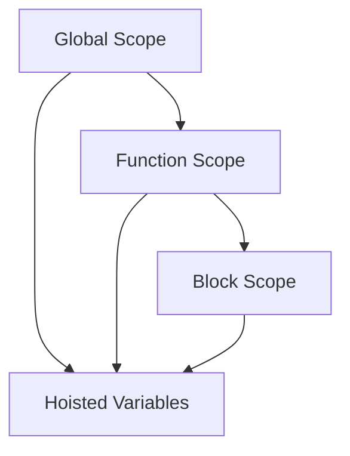

## 12.1. Variable Declaration Practice

Welcome to the exciting world of JavaScript variables! In this section, we will engage in practical exercises to solidify your understanding of variable declarations using `var`, `let`, and `const`. By the end of this chapter, you'll be able to confidently declare and manipulate variables in various scopes and understand the nuances of reassignment and immutability.

### Understanding Variable Declarations

Before diving into the exercises, let's briefly recap the three primary ways to declare variables in JavaScript:

- **`var`**: The traditional way to declare variables. It has function scope and is hoisted to the top of its scope.
- **`let`**: Introduced in ES6, `let` provides block scope, making it more predictable and safer for modern JavaScript development.
- **`const`**: Also introduced in ES6, `const` is used to declare variables that should not be reassigned. It is block-scoped like `let`.

### Exercise 1: Declaring Variables with `var`

**Task**: Declare a variable using `var` and assign it a value. Then, reassign it and log the result.

```javascript
// Declare a variable using var
var greeting = "Hello, World!";

// Reassign the variable
greeting = "Hello, JavaScript!";

// Log the result
console.log(greeting); // Output: Hello, JavaScript!
```

**Explanation**: In this exercise, we declared a variable `greeting` using `var` and assigned it a string value. We then reassigned it to a new string and logged the result. Notice how `var` allows reassignment.

### Exercise 2: Exploring Function Scope with `var`

**Task**: Declare a variable inside a function using `var` and attempt to access it outside the function.

```javascript
function showMessage() {
  var message = "Inside function";
  console.log(message); // Output: Inside function
}

showMessage();

// Try to access message outside the function
console.log(message); // Output: ReferenceError: message is not defined
```

**Explanation**: Variables declared with `var` inside a function are scoped to that function. Attempting to access `message` outside the function results in a `ReferenceError`.

### Exercise 3: Block Scope with `let`

**Task**: Declare a variable using `let` inside a block and observe its scope.

```javascript
if (true) {
  let blockScoped = "I am block scoped!";
  console.log(blockScoped); // Output: I am block scoped!
}

// Try to access blockScoped outside the block
console.log(blockScoped); // Output: ReferenceError: blockScoped is not defined
```

**Explanation**: The `let` keyword provides block scope, meaning the variable `blockScoped` is only accessible within the block it was declared in.

### Exercise 4: Reassignment with `let`

**Task**: Declare a variable using `let`, reassign it, and log the result.

```javascript
let count = 1;
count = 2;
console.log(count); // Output: 2
```

**Explanation**: Similar to `var`, variables declared with `let` can be reassigned. Here, `count` is initially set to `1` and then reassigned to `2`.

### Exercise 5: Constants with `const`

**Task**: Declare a constant using `const` and attempt to reassign it.

```javascript
const pi = 3.14;

// Try to reassign pi
pi = 3.14159; // Output: TypeError: Assignment to constant variable.
```

**Explanation**: Constants declared with `const` cannot be reassigned. Attempting to do so results in a `TypeError`.

### Exercise 6: Block Scope with `const`

**Task**: Declare a constant inside a block and observe its scope.

```javascript
if (true) {
  const blockConstant = "I am block scoped!";
  console.log(blockConstant); // Output: I am block scoped!
}

// Try to access blockConstant outside the block
console.log(blockConstant); // Output: ReferenceError: blockConstant is not defined
```

**Explanation**: Like `let`, `const` is block-scoped. The constant `blockConstant` is only accessible within the block it was declared in.

### Exercise 7: Using `const` with Objects

**Task**: Declare an object with `const` and modify its properties.

```javascript
const car = {
  brand: "Toyota",
  model: "Corolla"
};

// Modify the properties of the object
car.model = "Camry";
console.log(car.model); // Output: Camry
```

**Explanation**: While `const` prevents reassignment of the variable itself, it does not prevent modification of the object's properties.

### Exercise 8: Predicting Outcomes

**Task**: Predict the output of the following code snippet before running it.

```javascript
var x = 10;
let y = 20;
const z = 30;

if (true) {
  var x = 40; // Re-declares and reassigns x
  let y = 50; // New block-scoped y
  const z = 60; // New block-scoped z

  console.log(x); // ?
  console.log(y); // ?
  console.log(z); // ?
}

console.log(x); // ?
console.log(y); // ?
console.log(z); // ?
```

**Explanation**: 
- Inside the block, `x` is reassigned to `40`, affecting the outer `x` due to `var`'s function scope.
- `y` and `z` are block-scoped, so they do not affect the outer `y` and `z`.
- The outputs are:
  - Inside block: `x` is `40`, `y` is `50`, `z` is `60`.
  - Outside block: `x` is `40`, `y` is `20`, `z` is `30`.

### Try It Yourself

Now it's your turn! Modify the code examples above and observe how changes affect the output. Try declaring variables with different scopes and see how reassignment works. Experimentation is key to mastering JavaScript variables!

### Visualizing Scope and Hoisting

To better understand how JavaScript handles variable scope and hoisting, let's visualize it using a diagram.



**Diagram Description**: This diagram illustrates the hierarchy of scopes in JavaScript. Variables declared in the global scope are accessible everywhere, while function-scoped variables are only accessible within the function. Block-scoped variables, declared with `let` and `const`, are confined to the block they are declared in. Hoisting affects variable declarations, moving them to the top of their scope.

### Knowledge Check

Let's reinforce what we've learned with a few questions:

1. What is the main difference between `var` and `let`?
2. Can you reassign a `const` variable?
3. What happens when you declare a variable with `var` inside a function?
4. How does block scope affect variables declared with `let`?
5. What error do you get when trying to reassign a `const` variable?

### Summary

In this section, we've explored the different ways to declare variables in JavaScript using `var`, `let`, and `const`. We've seen how scope affects variable accessibility and how reassignment works with each keyword. Remember, practice makes perfect, so keep experimenting with these concepts in your own code!

### Embrace the Journey

Remember, this is just the beginning. As you progress, you'll build more complex and interactive web pages. Keep experimenting, stay curious, and enjoy the journey!

## Quiz Time!



### What is the main difference between `var` and `let`?

- [x] `var` is function-scoped, while `let` is block-scoped.
- [ ] `var` is block-scoped, while `let` is function-scoped.
- [ ] `var` cannot be reassigned, while `let` can.
- [ ] `var` is used for constants, while `let` is not.

> **Explanation:** `var` is function-scoped, meaning it is accessible throughout the function it is declared in. `let`, on the other hand, is block-scoped, meaning it is only accessible within the block it is declared in.

### Can you reassign a `const` variable?

- [ ] Yes, you can reassign a `const` variable.
- [x] No, you cannot reassign a `const` variable.
- [ ] Yes, but only within a block.
- [ ] No, unless it's an object.

> **Explanation:** `const` is used to declare variables that should not be reassigned. Attempting to reassign a `const` variable results in a `TypeError`.

### What happens when you declare a variable with `var` inside a function?

- [x] The variable is scoped to the function and not accessible outside.
- [ ] The variable is scoped to the block and not accessible outside.
- [ ] The variable is accessible globally.
- [ ] The variable is hoisted to the global scope.

> **Explanation:** Variables declared with `var` inside a function are scoped to that function, meaning they are not accessible outside the function.

### How does block scope affect variables declared with `let`?

- [x] Variables declared with `let` are only accessible within the block they are declared in.
- [ ] Variables declared with `let` are accessible globally.
- [ ] Variables declared with `let` are accessible in the entire function.
- [ ] Variables declared with `let` are hoisted to the top of the function.

> **Explanation:** `let` provides block scope, meaning variables declared with `let` are only accessible within the block they are declared in.

### What error do you get when trying to reassign a `const` variable?

- [x] TypeError
- [ ] ReferenceError
- [ ] SyntaxError
- [ ] RangeError

> **Explanation:** Attempting to reassign a `const` variable results in a `TypeError` because `const` variables cannot be reassigned.

### What is hoisting in JavaScript?

- [x] The process of moving variable and function declarations to the top of their scope.
- [ ] The process of moving variable assignments to the top of their scope.
- [ ] The process of moving variable and function declarations to the bottom of their scope.
- [ ] The process of moving variable assignments to the bottom of their scope.

> **Explanation:** Hoisting is the process by which JavaScript moves variable and function declarations to the top of their scope before code execution.

### What is the output of the following code?

```javascript
console.log(x);
var x = 5;
```

- [x] undefined
- [ ] 5
- [ ] ReferenceError
- [ ] TypeError

> **Explanation:** Due to hoisting, the declaration of `x` is moved to the top, but the assignment happens later. Therefore, `console.log(x)` outputs `undefined`.

### How can you declare a variable that should not be reassigned?

- [x] Use `const`
- [ ] Use `let`
- [ ] Use `var`
- [ ] Use `let` and `const`

> **Explanation:** `const` is used to declare variables that should not be reassigned.

### What happens if you try to access a `let` variable before it is declared?

- [x] ReferenceError
- [ ] TypeError
- [ ] SyntaxError
- [ ] undefined

> **Explanation:** Accessing a `let` variable before it is declared results in a `ReferenceError` due to the Temporal Dead Zone.

### True or False: Variables declared with `var` are block-scoped.

- [ ] True
- [x] False

> **Explanation:** Variables declared with `var` are function-scoped, not block-scoped.


